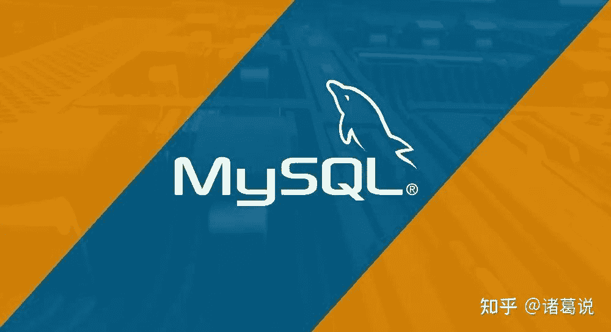

<!--yml
category: 交易
date: 2023-09-17 20:12:48
-->

# backtrader读取本地行情数据库的几种方法—以mysql为例说明 - 知乎

> 来源：[https://zhuanlan.zhihu.com/p/514838999](https://zhuanlan.zhihu.com/p/514838999)

## **本地行情数据库的优点**

如果只是偶尔简单的回测，那直接从tushare、yfinance等数据源获取数据就可以了。但如果每天要进行多次回测且对延迟以及数据处理有很多要求时，建立本地行情数据库就是非常有必要的了。

本地行情数据库的几个优点：

*   网络延迟小
*   只有第一次行情数据需要从远程读取。在多次远程读取行情数据需要多花钱的情况下，可以减少费用支出
*   可以将数据和策略隔离。多个数据源导入到数据库，backtrader只从数据库读取行情数据，不用关心数据是从tushare读取、还是从yfinance读取
*   可方便扩展支持更多指标。除datetime(时间)、open(开盘价)、close(收盘价)、high(最高价)、low(最低价)、volume(成交量)这些常用指标外，其他指标可以很好的扩展
*   方便数据备份恢复。 mysql的生态非常成熟，常见任务比如备份恢复可以很方便完成

本地行情数据库可以是sqlite、mysql、postgresql等sql数据库，也可以是mongodb、leveldb、rocksdb、dolphindb等nosql数据库。本文以mysql为例进行说明，其他数据库请求原理类似，暂不单独说明。

本文介绍几种从本地行情数据库读取数据到backtrader的方法，供参考。示例代码关注微信公众号查看，公众号：诸葛说talk

## **方法1 — pandas read_sql直接读取**

pandas作为数据处理的瑞士军刀，可以直接支持从sql读取数据生成DataFrame，当然需要将数据库连接作为参数。生成DataFrame后将其传给backtrader的`bt.feeds.PandasData()类创建pandas data`对象，策略便能使用了。示例代码关注微信公众号查看，公众号：诸葛说talk

## **方法2 — 读取数据库，再将数据记录转成pandas dataframe**

从数据库读取行情数据后，通过DataFrame()函数手动将list数据转成pandas dataframe数据，然后将其传给backtrader的`bt.feeds.PandasData()类创建pandas data`对象，策略便能使用了。示例代码关注微信公众号查看，公众号：诸葛说talk

## **方法3—自定义DataFeed从数据库读取**

DataFeed 即 backtrader 中的数据源，任何数据进入backtrader策略回测前都要通过DataFeed。方法3就是增加一个基于mysql的DataFeed，示例代码参考官方论坛，如下所示。首先，自定义MySQLData类使其继承自backtrader的数据基类 `DataBase,`如果需要从外部传入所需股票数据的代码和其一定范围内的K线数据，需要提前定义params。在 `cerebro.adddata(data)` 的时候，cerebro会遍历Datafeed的所有数据，此时会调用_load函数，需要在_load()函数里面将数据库中提取的每列数据对应到lines上。示例代码关注微信公众号查看，公众号：诸葛说talk

此外，如果你有除了`datetime(时间)`、`open(开盘价)`、`close(收盘价)`、`high(最高价)`、`low(最低价)`、`volume(成交量)` 之外的指标。需要提前自定义对应的lines，如下新增了turnover lines：

## **结论**

上述三种方法都可以实现目的，不过方法3更加自由一些，特别是需要自定义lines的时候。 我自己用的时候也是基于方法3来实现，但为了更好的兼容其他库，我没有直接使用sqlalchemy来请求mysql，而是使用peewee 来访问mysql。peewee是一个简单好用的orm，支持sqlite, mysql, postgresql 和cockroachdb。

## **交流**

关注微信公众号：诸葛说talk，获取更多内容。同时还能获取邀请加入量化投资研讨微信群， 与众多量化从业者&爱好者交流、切磋，不错过最新行业发展&技术进展。

## **参考**