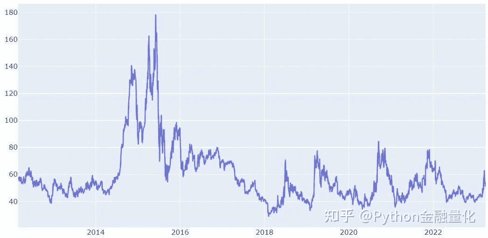
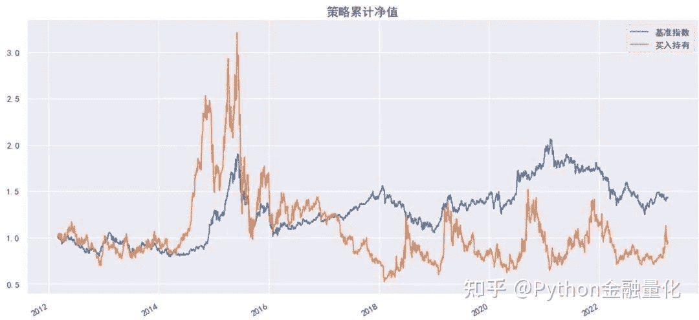
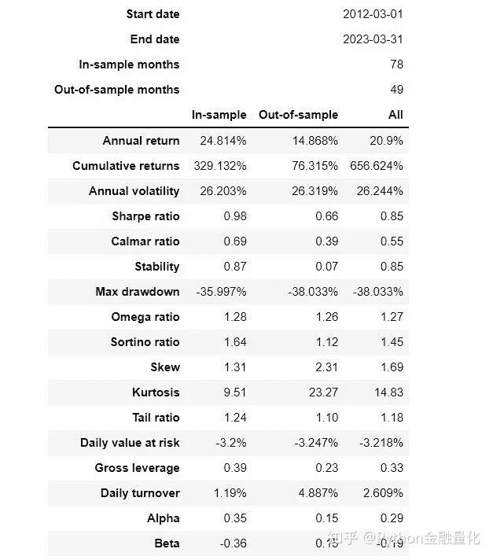
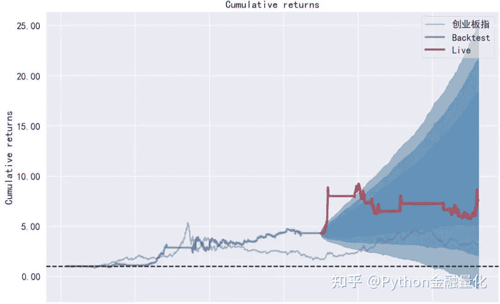
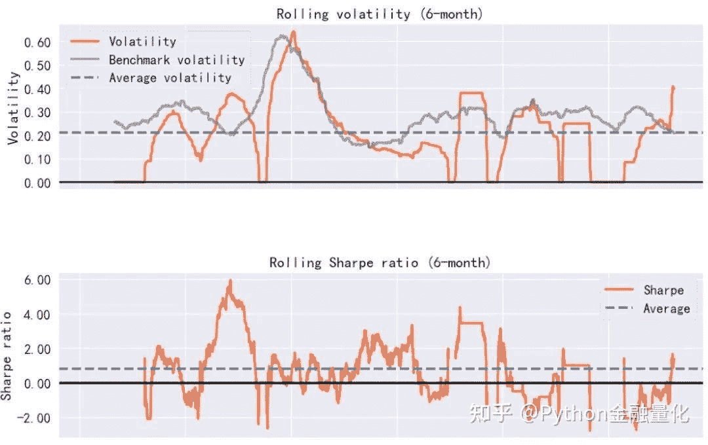
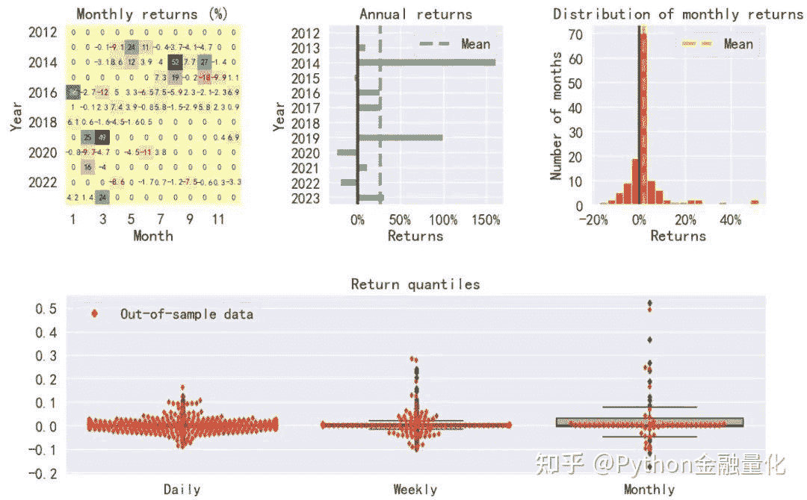

<!--yml
category: 交易
date: 2023-09-17 20:10:04
-->

# backtrader量化回测跟踪止损的均值回归策略 - 知乎

> 来源：[https://zhuanlan.zhihu.com/p/618916750](https://zhuanlan.zhihu.com/p/618916750)

**01 引言**

均值回归交易策略是一种经典的交易策略，可以追溯到很早的交易历史。其基本原理是当价格偏离其长期平均水平时，价格趋向于回归到其平均水平，这是由于市场的反复波动和回归特性所导致的。因此，该策略认为价格的偏离程度越大，回归的力度越大，可以通过采取相反的交易方向（即价格偏低时买入，价格偏高时卖出）来获取收益。

均值回归交易策略的优点在于其**简单易懂、操作便利、风险可控和适用范围广泛**等特点。因此，该策略在金融市场中得到了广泛的应用，例如商品期货市场、外汇市场和股票市场等。在股票市场中，均值回归策略是基于个股价格的历史平均值和标准差来预测个股价格未来的走势。在这个策略中，假设价格会回归到其历史平均值附近，因此在价格偏离平均值时进行买入或卖出。此外，均值回归策略还可以应用于股票对之间的交易进行套利，即通过对两只股票的价格进行对比，来确定它们之间的价差是否偏离了长期均值，从而进行交易。

下面以晓程科技个股为例，采用均值回归交易策略并设置10%的跟踪止损，对该股2012年3月1日至2023年3月31期间进行历史回测，为大家学习backtrader的均值回归策略回测提供参考模板。关于均值回归策略基于向量化回测请参见《[手把手教你用Python搭建自己的量化回测框架【均值回归策略】](https://link.zhihu.com/?target=http%3A//mp.weixin.qq.com/s%3F__biz%3DMzUyMDk1MDY2MQ%3D%3D%26mid%3D2247484580%26idx%3D1%26sn%3Dba6b2a4646f59f45577d12b81d745d01%26chksm%3Df9e3c24ece944b58f3f2ee965c8498492751617eaab0559a1c537ac247b17aad13a8b56f781f%26scene%3D21%23wechat_redirect)》。

**回测框架backtrader专题系列：**

[【手把手教你】入门量化回测最强神器backtrader（一）](https://link.zhihu.com/?target=http%3A//mp.weixin.qq.com/s%3F__biz%3DMzUyMDk1MDY2MQ%3D%3D%26mid%3D2247484803%26idx%3D1%26sn%3D59502204fb39d150c98e9951a1614ec0%26chksm%3Df9e3c369ce944a7f9f8e83a7fc4aa9b1450ec98a41eefffda3158f75f824af88117f85be69ca%26scene%3D21%23wechat_redirect)

[【手把手教你】入门量化回测最强神器backtrader（二）](https://link.zhihu.com/?target=http%3A//mp.weixin.qq.com/s%3F__biz%3DMzUyMDk1MDY2MQ%3D%3D%26mid%3D2247484807%26idx%3D1%26sn%3D6eac4a86ee0e0f2ec06f5dfb4c9192a2%26chksm%3Df9e3c36dce944a7b67986f0b8adef4b0fc02bdcb6d88bdd33662ef9c2e713262dc60477523fe%26scene%3D21%23wechat_redirect)

[【手把手教你】入门量化回测最强神器backtrader（三）](https://link.zhihu.com/?target=http%3A//mp.weixin.qq.com/s%3F__biz%3DMzUyMDk1MDY2MQ%3D%3D%26mid%3D2247484821%26idx%3D1%26sn%3D21df9cef8351529ac9712fc0c61dc5df%26chksm%3Df9e3c37fce944a69b193aac92f21f3c214b7454881a90edf111627637ac5f21942775171b92d%26scene%3D21%23wechat_redirect)

[backtrader如何加载股票因子数据？以换手率、市盈率为例进行回测【附Python代码】](https://link.zhihu.com/?target=http%3A//mp.weixin.qq.com/s%3F__biz%3DMzUyMDk1MDY2MQ%3D%3D%26mid%3D2247484832%26idx%3D1%26sn%3D9d282abb397a4459c7b2a372d635cfb8%26chksm%3Df9e3c34ace944a5c85070e7289812ca8b87c4003f190da336a2f831c74de263b1d65d54c46e5%26scene%3D21%23wechat_redirect)

[如何用backtrader对股票组合进行量化回测？](https://link.zhihu.com/?target=http%3A//mp.weixin.qq.com/s%3F__biz%3DMzUyMDk1MDY2MQ%3D%3D%26mid%3D2247484855%26idx%3D1%26sn%3D1e55ba64b1b6ba5739d31fa91d87ca2e%26chksm%3Df9e3c35dce944a4b3f2653e39266d6896e668249f44d6244d2028b9724b2813a29f4017c7bc7%26scene%3D21%23wechat_redirect)

[【手把手教你】用backtrader量化回测海龟交易策略](https://link.zhihu.com/?target=http%3A//mp.weixin.qq.com/s%3F__biz%3DMzUyMDk1MDY2MQ%3D%3D%26mid%3D2247484953%26idx%3D1%26sn%3D0768af4bf8c011e25e9784feb4503e66%26chksm%3Df9e3c0f3ce9449e5437f534de0ecbeb5309972deee43f96f352ba900d3614b9601838077335f%26scene%3D21%23wechat_redirect)

[backtrader股票技术指标自定义与量化回测](https://link.zhihu.com/?target=http%3A//mp.weixin.qq.com/s%3F__biz%3DMzUyMDk1MDY2MQ%3D%3D%26mid%3D2247485043%26idx%3D1%26sn%3D7be7e7641c524472c1977a474a7109d6%26chksm%3Df9e3c099ce94498fd6a038495e6e373328dae7651e412327cfb53477bde37ae0a6b1c162735d%26scene%3D21%23wechat_redirect)

[【手把手教你】Ichimoku云图指标可视化与交易策略回测](https://link.zhihu.com/?target=http%3A//mp.weixin.qq.com/s%3F__biz%3DMzUyMDk1MDY2MQ%3D%3D%26mid%3D2247486220%26idx%3D1%26sn%3D325565ed3aa01cc1cecfed9cbe1a2ae8%26chksm%3Df9e3cde6ce9444f044c43811a4af95ba779c1b13f1ba619aa2182ba316d9ded04872f5cd3473%26scene%3D21%23wechat_redirect)

[【backtrader回测】隔夜持仓 VS 日内交易](https://link.zhihu.com/?target=http%3A//mp.weixin.qq.com/s%3F__biz%3DMzUyMDk1MDY2MQ%3D%3D%26mid%3D2247486143%26idx%3D1%26sn%3D6c12dcb7baf8c064d9e0ddcd602ede1c%26chksm%3Df9e3cc55ce944543ee96ae7f61056115d1aff8a2710fec1bb17f311f259eb96131c7382caf75%26scene%3D21%23wechat_redirect)

## **02 买入持有基准策略**

在进行均值回归策略回测前，先考察一下该股的价格历史走势和买入持有策略表现。下面采用qstock获取交易数据并进行可视化分析。

```
import pandas as pd
import numpy as np
import backtrader as bt
import qstock as qs

df0=qs.data_feed('晓程科技',start='2012-03-01',end='2023-03-31',index='hs300')
```

下面是基于后复权计算的历史股价，2015年至2016经历了大牛市和股灾，该股也表现出剧烈的波动，2017年至今，该股呈现出周期约为一年（250个交易日）的均值回归波动趋势。



2012.3至2022.3回测期间，对该股采用买入持有策略，总收益率为-0.05%，最大回撤83%，表现非常糟糕。

`qs.start_backtest(df0)`



## **03 均值回归策略回测**

根据上面对价格走势的分析，采用250个交易日作为均值回归周期，以1个标准差为阈值，构建价格偏离的上下限，即在价格跌破历史平均值减去1个标准差时买入，当价格上涨突破历史平均值加上1个标准差时卖出。具体代码如下所示。

```
#默认参数，偏离周期为250个交易日，1一个标准差，
#stop_loss为1时表示默认不进行止损
class MeanReversion(bt.Strategy):
    params = (('period', 250),
              ('devfactor', 1),
              ('stop_loss',1.0),
              )

    def __init__(self):
        # 初始化交易指令、买卖价格和手续费
        self.order = None
        self.buyprice = None
        self.buycomm = None
        #获取交易价格
        self.dataclose = self.datas[0].close
        #计算价格均值
        self.mean = bt.indicators.SimpleMovingAverage(
            self.dataclose, period=self.params.period)
        #计算标准差
        self.std = bt.indicators.StandardDeviation(
            self.dataclose, period=self.params.period)
        #计算上下界
        self.upper = self.mean + self.params.devfactor * self.std
        self.lower = self.mean - self.params.devfactor * self.std
        #计算买卖信号
        self.buy_signal = bt.indicators.CrossUp(self.dataclose, self.lower)
        self.sell_signal = bt.indicators.CrossDown(self.dataclose, self.upper)

    #策略核心，根据条件执行买卖交易指令
    def next(self):
        if self.order: # 检查是否有指令等待执行, 
            return
        # 检查是否持仓   
        if not self.position: # 没有持仓
            #执行买入条件判断：
            if self.buy_signal:
                self.log(f'执行买入,{self.dataclose[0]:.2f}')
                # 获取当前的账户价值
                cash = self.broker.getcash()
                #一手为100股
                lots = int((cash*0.95/ 100) / self.datas[0].close[0]) * 100
                #95%仓买入
                self.order = self.buy(size=lots)  
                #设置跟踪止损10%,如需设置金额止损可用trailamount
                self.order = self.sell(size=lots, exectype=bt.Order.StopTrail, trailpercent=self.p.stop_loss)
        else:
            #执行卖出条件判断：收盘价格跌破15日均线时满仓卖出
            if self.sell_signal:
                self.log(f'执行卖出,{self.dataclose[0]:.2f}')
                #执行卖出
                self.order = self.close()
```

定义回测函数。

```
def bt_result(data,strategy=None,startcash=100000,commission=0.0005,stop_loss=1.0,printlog=False,flag=False):
    # 初始化cerebro回测系统设置                           
    cerebro = bt.Cerebro()  
    # 加载数据
    cerebro.adddata(data) 
    # 将交易策略加载到回测系统中
    cerebro.addstrategy(strategy,stop_loss=stop_loss) 
    cerebro.broker.setcash(startcash) 
    # 设置交易手续费为 0.05%
    cerebro.broker.setcommission(commission=0.0005) 
    cerebro.addanalyzer(bt.analyzers.PyFolio, _name='pyfolio')
    results = cerebro.run()
    strat = results[0]
    pyfoliozer = strat.analyzers.getbyname('pyfolio')
    returns, positions, transactions, gross_lev = pyfoliozer.get_pf_items()

    #获取回测结束后的总资金
    portvalue = cerebro.broker.getvalue()
    pnl = portvalue - startcash
    #打印结果
    print(f'总资金: {round(portvalue,2)}')
    print(f'净收益: {round(pnl,2)}')
    if flag:
        return returns, positions, transactions

from datetime import datetime
#获取数据
def my_data(code='晓程科技',start='2012-03-01',end='2023-03-31'):
    df=qs.get_data(code,start=start,end=end,fqt=2)
    df=df[['open','high','low','close','volume']]
    data = bt.feeds.PandasData(dataname=df,)
    return data
data=my_data()
```

不加入止损时，总资金为34.79万，净收益为24.79万，表现优于买入持有策略。

```
#不止损
bt_result(data,MeanReversion)

总资金: 347948.01
净收益: 247948.01
```

当加入10%的止损策略后，策略获得更高的收益，总资金高达75.66万，净收益为65.66万，远远优于不加止损和买入持有策略。

```
#加入10%的跟踪止损
returns, positions, transactions=bt_result(data,MeanReversion,stop_loss=0.1,flag=True)

总资金: 756624.48
净收益: 656624.48
```

为了更清楚的呈现策略的回测结果，使用pyfolio库进行展示。
`#使用pyfolio展示回测结果`

`import pyfolio as pf`

`#过滤掉警告信息`

`import warnings`

`warnings.filterwarnings('ignore')`

`#加入基准指数做对比`

`benchmark=(qs.get_price('cyb',start='2012-03-01',end='2023-03-31',fqt=2)`

`.pct_change()['创业板指']`

`.fillna(0)`

`.tz_localize('UTC'))`

`#假设2019年开始实盘交易`

`pf.create_full_tear_sheet(returns,`

`positions=positions,`

`transactions=transactions,`

`live_start_date='2019-01-01',`

`benchmark_rets=benchmark,)`



## **04 结语**

本文旨在为大家利用backtrader构建均值回归策略并进行跟踪止损提供参考思路。以晓程科技个股为例，是考虑到该股样本期间价格波动较大，走势具有较明显的均值回归特征，因此采用均值回归交易策略比买入持有策略获得更好的收益。换句话说，本文的回测结果表现较好可能只是个例，不代表均值回归策略对所有个股均有效，有待读者进一步挖掘和探索。

**均值回归交易策略本质是利用价格历史数据的统计规律进行择时**。尽管均值回归交易策略可以带来一定的收益，但由于市场的复杂性和不确定性，该策略仍存在一定的局限性和风险。例如，当市场处于长期趋势或重大事件发生时，均值回归策略的效果可能会降低或失效。此外，**该策略的参数和阈值需要根据市场情况和个人经验进行调整，否则可能导致交易效果不佳**。

总的来说，均值回归交易策略是一种简单易懂、风险可控、适用范围广泛的交易策略，具有一定的实际应用价值。然而，在实际交易中，由于市场的不确定性和复杂性，该策略的效果受到多种因素的影响，需要谨慎评估和控制风险。此外，由于市场的变化和不断演变，均值回归交易策略也需要不断地进行优化和改进，以适应市场的变化。因此，对于交易者来说，**了解均值回归交易策略的基本原理和适用范围，并通过实践不断地优化和调整，才能在实际交易中实现长期稳健的收益**。