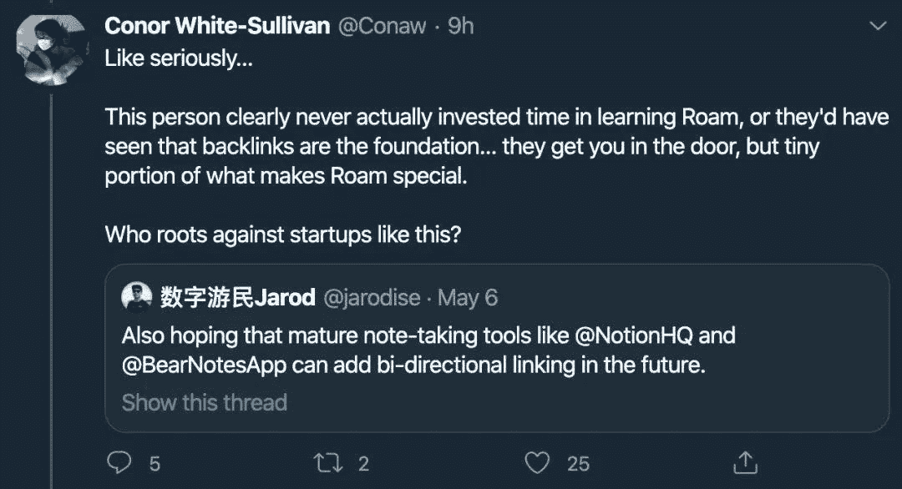
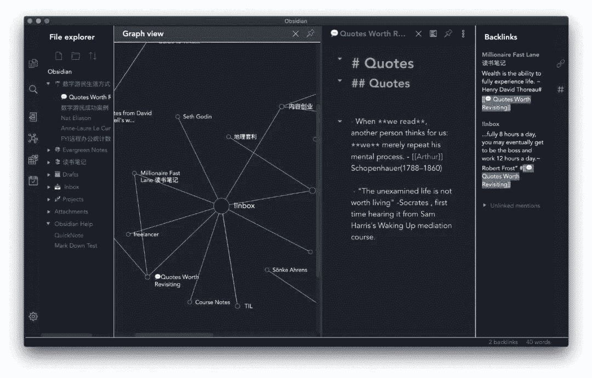

<!--yml
category: 未分类
date: 2022-06-26 00:00:00
-->

# Bye!#Roamcult以及笔记类软件的双向链新浪潮

> 原文：[https://jarodise.com/why-decided-to-stop-using-roam-research-and-start-using-obsidian](https://jarodise.com/why-decided-to-stop-using-roam-research-and-start-using-obsidian)

前不久我曾经撰文给大伙种草了一款新型的笔记软件:[Roam Research](https://jarodise.com/a-beginners-guide-to-roam-research/). 它的bi-directional linking（双向链），可视化网状图功能，给早已略显饱和的笔记软件圈子带来了一股全新的空气，一时间好像你的笔记软件没有双向链功能，你出门都不好意思跟人打招呼了。

话虽然这么说，但是双向链并非Roam Research独创的专利，技术上要实现也不是很困难，如果你是Roam的创始人，你在这种情况下会怎么做呢？要我觉得，努力打磨产品，提高产品的可用性和稳定性，尽快把测试版迭代成稳定正式版才是第一要务，可这位叫做Conor White-Sullivan的CEO可不是这么想的，人家开始琢磨着如何收费赚钱了。

5月5日，Roam Research的官推上发布了一条信息，公布了Roam的未来收费方案，不出意外，就是之前传闻的15刀每个月，没有免费方案。虽说给自家的软件定价是他的权力，但是您看看人家这措辞，是不是有点内味儿了。

我对这条推特的解读就是：**“如果你是穷鬼，那请滚得远一点，Roam不稀罕你。如果你愿意向我们证明你很穷，我们会考虑给你半价“** 。

于是带着些许质疑，我在Redddit上的Roam Research sub上面发了一个帖子，想看看其他用户对于这个定价策略的看法。从回复上来看，非常明显15美元一个月的收费是超出了很多人的承受范围的，特别是对于一个尚未迭代成熟的测试版产品来说。

当然，这个帖子也被Roam的官方账号看到了（我猜这个账号背后也是Conor本人在打理），你猜它怎么回复的？“**我们收费目的很明确，就是想借这个机会赶走50%的（穷鬼）用户，这样他们可以更专注的为剩下的”高价值“用户提供更稳定优质的服务。”**

当然，它说这话背后其实还有另外一个原因，几乎是在同一时间，油管上的生产力网红大咖Thomas Frank发布了一条介绍Roam的视频，说它是“Game Changer”。据说因为这条视频，Roam在短时间内涌入了10万多名新用户，险些把服务器挤爆，很多人开始发现Roam的界面几个小时都加载不进去，还有的人莫名其妙的丢失了保存在Roam服务器上的数据。以至于最后Roam不得不暂时关闭了新用户的注册权限。

创始人的一波猛如虎的PR骚操作，加上产品可靠性出了问题，让很多人萌生了退意（包括我本人在内），下面这位仁兄的推特代表了很多人的心声，他说：“**我离开Roam不是因为价格贵，也不是因为Roam这款产品的问题，而是因为Conor你的人品问题。**”

有人辩解说，这软件现在是免费的，就算有毛病也应该担待着点儿。但是在我看来，既然这软件现在还处在Beta测试阶段，那么所有的用户说白了都在免费为他提供测试找bug，所以它并不真是免费，因为测试一个beta产品也是需要付出时间成本和机会成本的，特别是一款PKM软件。

Roam的创始人一直说它之所以定价这么贵是因为给用户提供的价值高，但**软件的价格从来就不应该是以为用户创造多少价值来计算的，因为这个“价值”是很难具体量化且不均等的**，如果比尔盖茨也用Roam，那么是不是应该收他15万美元一个月更合理呢？

不可否认，Roam的确有很多非常好用的新特性，但是如果真的想要把它当作自己的主力PKM工具来构建第二大脑，我想很多人还是会三思的。不单单是因为它并不友好的订阅制价格，更因为把自己最重要的数据存储在这样一个SaaS上面，将来万一它的服务器被人黑了怎么办，或者被投资人的不合理商业化方案劫持变成一款臃肿且难用的软件怎么办，这些都是需要考虑的问题。毕竟从当前技术层面来看，Roam的Lock-in因子并不低，从Roam导出来的数据导入到其他的软件会丢掉大量的链接信息。这些因素都给Roam的后续发展前景蒙上了阴影。我在之前[一篇介绍Roam的文章](https://jarodise.com/a-beginners-guide-to-roam-research/)里说Roam头上飘着几朵乌云，显然是低估了问题的严重性。

更不用说这软件还有这么一位愣头青且小心眼的创始人，当我在推特上公开质疑他们的定价及公关策略后没过多久，[@RoamResearch](https://hashnode.com/@RoamResearch)（Roam的官推账号）就把我给拉黑了。Conor本人还把我在推特上单独挂出来，说我这种人根本就不真正懂得，也不配用它家的产品，还顺带diss了其他note-taking平台, 说它们是没灵魂的抄袭品。

当然，条条大路通罗马，Roam的大热让很多开发者都意识到双项链功能大有可为，很有可能变成未来知识管理工具的标配功能和新产品开发的突破口，所以不但有很多既有成熟工具都宣布正在考虑添加这个功能（例如Bear，Workflowy），一些新产品也如雨后春笋般冒了出来。

这里面有基于老牌开源维基产品Tiddlywiki魔改的TiddlyRoam，Stroll和Draft。

结合了双向链，大纲笔记功能以及Spaced Repetition功能的RemNote。

尚未成型，但是计划采用和Roam Research一样的Clojure后端技术框架，被寄予厚望的开源克隆品Athens。

以及我本人现在正在积极参与内测，并已经开始轻度使用的新型Markdown编辑器**[Obsidian.md](http://Obsidian.md)**。与Roam截然不同的是，Obsidian并不是一款SaaS，而是是一款纯线下软件，采用标准的Markdown格式进行存储，这意味着你可以拥有自己知识库100%的掌控权，可以方便的进行云端备份，并且随时可以带着这个数据库切换到其他的Markdown编辑器，完全不必担心Lock-in。而且它的定价策略也非常合理，普通版的线下编辑器是完全免费的，这比市面上很多更新迭代并不频繁但是却要按订阅制收费的Markdown编辑器良心很多（说的就是你Ulysses）。

如上图所示，除了拥有跟Roam类似的双向链，可视化视图功能外，Obsidian还在开发一个基于开放API的插件生态系统，在未来1.0正式版发布后，开发者即可利用API参与各种功能插件的开发，丰富各种使用场景。这里借用Obsidian官网的一句话来说就是：**“Note-taking is an incredibly personal thing”**。人们记录笔记和整理知识的方式/方法是千人千面的，Obsidian希望能够提供这样一个多元包容的框架，最终打造出一款可定制性极强的终极平台型PKM工具。

**本文系Jarod Zhang原创，如需转载请联系作者授权。坚持原创不易，你的打赏/转发/在看是我继续创作的最大动力。**

数字游民部落致力于推广目前在全世界日益流行的数字游民（Digital Nomad）生活方式，和Lifestyle Design的方法和理念。

数字游民知识星球是目前华文圈最权威的数字游民（Digital Nomad）生活方式设计主题社群，最大的数字游民/远程办公/环球旅行中文资源库，云集环球旅行，远程办公，自由职业等各路达人大V。长按下方二维码加入数字游民知识星球，开启你的生活方式设计之旅。

数字游民部落官网：[JARODISE.COM](http://JARODISE.COM)

微信公众号：数字游民部落