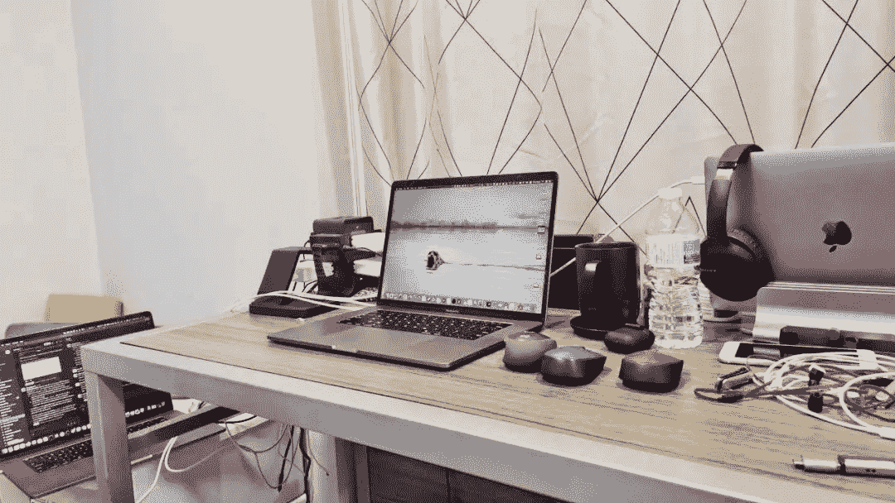

<!--yml
category: 访谈
date: 2022-06-28 10:38:01
-->

# No.20 你好鸭#海外工作者 | 我是薄荷，在加拿大整整九年了。 | 电鸭

> 来源：[https://eleduck.com/posts/v5fyaD](https://eleduck.com/posts/v5fyaD)

**嗨，**

**你好鸭：）**

**我是薄荷。**

### ▌在国外几年了？介绍下你本人的经历及当前所做的事情吧？

* * *

我在加拿大整整九年了。记忆里我是在2012年8月31号从多伦多的Pearson国际机场下飞机，第一次站在加拿大的土地上，然后在滑铁卢大学读了五年本科，毕业了以后又工作了四年。目前是一名软件工程师，在一家初创公司担任做网页应用的全栈。

### ▌什么样的契机，让你有了出国（或移民）的想法？

* * *

读高中的时候，机缘巧合去北京参加了一次HSYLC夏令营。认识了很多有不少海外经历的前辈和全国各地准备出国读书的同学。第一次了解到出国读书这件事情并且产生了想要尝试的想法。所以回来以后我做了一些研究，发现我也可以向他们一样除了高考选择另一条路，就为此付出了行动。

### ▌为此都做了哪些准备？最终是如何实现出国（或移民）的？

* * *

读高中的时候我在高考班备战高考。家人对我要求出国读书这件事情不甚了解，所以要求我必须考上一本才允许我出国。所以我高三在准备高考的同时也自己在准备托福和SAT考试。后来高考结束也顺利考上了一本，所以2011年考高结束以后的暑假就开始准备2012秋季的出国计划，联系了北京的一些DIY申请大学的辅导老师正式开始申请流程。原本是想去美国的，后来因为我想要读精算专业，同时因为滑铁卢大学精算专业不错的声誉，就也申请了加拿大的这所大学。2011年底和2012年初拿到一些录取以后，综合了经济能力，未来发展的可能性，还有日常生活质量的考虑以后决定去滑铁卢大学读书。就这么出国了。

### ▌出国之后，工作和生活都发生了哪些变化？

* * *

出国最大的改变还是发现了更多的选择。我并没有很好的融入加拿大的生活，但同时我也不介意这点。刚开始也经历过一些出国后过于自由的不适应，所以成绩并没有维持的很好。同时我也对出国前向往的精算专业产生了厌倦。所以在和一个学姐经历过一次促膝长谈之后，我决定改变自己的专业，改学计算机。我从小的生活环境基本上没有计算机的存在。因为父母都是事业单位的工人，对计算机唯一的认知就是网瘾和游戏，所以我从一开始对计算机的认知只有QQ和魔兽争霸。所以为了该专业也和爸妈有过不少次争论，并且当时我已经完成部分大三的精算专业课程，所以也经历了一些转专业的阵痛。虽然站在现在的角度来看，转计算机可以说是我成年后作出的最好的一个决定，但是从2015年初转专业到现在成为一名软件工程师也确实是我人生中一个未曾设想的道路吧。

### ▌有人说国内容不下肉身，国外留不住灵魂，你的感受如何？

* * *

我对中国和加拿大的感受一直是矛盾又统一的。

矛盾的地方在于，生活的角度来说，加拿大过于平淡，中国很有趣。但是工作和社会的角度来说，加拿大各项制度很完善，你只需要按部就班的生活，不去沾染邪教和毒品，那你能过的很好。同时，中国的社会制度的上限很高下限又很低，而你永远也不知道围绕你发生的哪个事件得益于高上限，哪个事件就被困在低下限里。所以作为一个不到三十岁的男性，我一直对毫不犹豫的留在加拿大的态度持否定态度。但我又不确定什么时候是离开加拿大回到中国的最好的时间。这是矛盾。

统一的点就很简单了，在中国，作为一个中产，确实生活质量算不上好。但是在加拿大，作为一个中产，也并不会过的多么好。道理很简单，有钱在哪都好，没钱在哪都不好。

在我看来，并不是说在加拿大有房子住有牛肉吃就是好。如果不讨论根本没有机会移民加拿大或者美国的真正穷人，那么所谓的中产从中国到加拿大无非是从一个枷锁进入到另一个枷锁罢了。我就不重复中国的房子和教育矛盾了。但是我在加拿大有过，不知道自己得的是带状疱疹却感到非常疼，所以在医院从晚上9点等到第二天早上6点才见到医生的经历。同时他查不出所以然只能让我继续回家等着，熬到不疼为止。我也知道多伦多随便一个好一点儿的公寓一百多万刀甚至两百万刀，似乎不比中国新一线的房子便宜。我也能想象到即使在加拿大，虎爸虎妈还是会让自己的孩子卷成毛线球只是为了让孩子能当个医生律师。而你在加拿大，终究还是会遇到或多或少的歧视，天花板，融入问题，认同问题。

而中国有它自己的优势，至少不担心新冠。在中国社会生存，你可以心里不想，但是只要你摆摆姿态，善良单纯的中国人民会很直接的接纳你支持你。而在加拿大，因为天然的人种隔阂，虽然你什么都不做大家都会接纳你，但你能感受到，所有人也只是从嘴上接纳你而已。

所以说到底，到底在加拿大还是在中国是一个心里的围城。如果个人心里清楚自己对生活的态度而不是依靠社会来给自己定价的时候，才是无所畏惧的，那么就可以在全世界任何地方生活。

### ▌关于国内和海外在开发语言及技术选型上的的差异，能不能聊聊你的看法？

* * *

我对中国不是很了解。对中国开发的唯一感觉就是所有人都在写Java。我本人没有写过Java代码，所以也不好评价。但是我认为一个合格的开发不应该被语言所束缚。虽然不得不承认计算机语言是存在差异的，但是在冯诺伊曼结构的框架下，算法和设计模式的核心思想不存在特别的差异。作为一个软件工程师，写软件的出发点一定是需求。而算法和设计模式为需求服务，计算机语言又为算法和设计模式服务。没有什么某个语言一定就是好的或者某个设计一定就是对的这样的说法。

### ▌对于那些也想出国的同学，你有什么建议么？

* * *

第一，国外的月亮没那么圆。你在中国会遇到的小人和君子，在国外一个不落也都能遇到。不用因为感觉你在国外是客人，或者说代表了中国的形象就不由自主的展现人性的光辉。遇到欺负你的人，不管是中国人还是外国人，你都应该抽他。

第二，不要去中餐馆打工，也不要去麦当劳，超市打工。如果你有追求的话，就多做对自己的成长有正反馈的工作。如果你是程序员的话，哪怕多去做做开源呢。

第三，不用硬着头皮融入外国人的圈子，但是也不要沉溺于中国人的圈子。做你自己就好，和有价值的人学习交流就好。时至今日，我的很多机遇有白人教授告诉我的，有印度同学提点的，有穆斯林同学帮忙的，也有中国同学照顾的。所以，不要放弃和任何人交流的机会。

第四，不要过多私下处理问题。很多中国人，或者不仅仅是中国人会告诉你，白人都是XX，印度人都是XX，公共服务部门都是XX，保险公司都是XX，dealer都是XX，他们只会坑你，我来帮你，或者我帮你办业务，或者你授权我帮你处理，等等。然而不是，我的九年时间从未通过正规途径处理问题被坑，就算被坑了也有正规途径去解决问题。记着，然而当你不通过正规途径解决问题的时候，你就再也阻止不了一个人坑你了。

### ▌如何联系我？

* * *

你可以通过我在电鸭社区上分享的系列帖子更多的了解我/电我/联系我。

一些个人为美国公司远程工作的经验分享 -- 工作部分

[https://eleduck.com/posts/ea4fOq](https://eleduck.com/posts/ea4fOq)

一些个人为美国公司远程工作的经验分享 -- 面试部分

[https://eleduck.com/posts/POGfvp](https://eleduck.com/posts/POGfvp)

一些个人为美国公司远程工作的经验分享 -- 英语部分

[https://eleduck.com/posts/ez1fgq](https://eleduck.com/posts/ez1fgq)

### ▌加入海外移民交流群

* * *

如你对海外移民有兴趣/有打算，

可以点此加入我们的群来交流。

[https://eleduck.com/groups](https://eleduck.com/groups)

