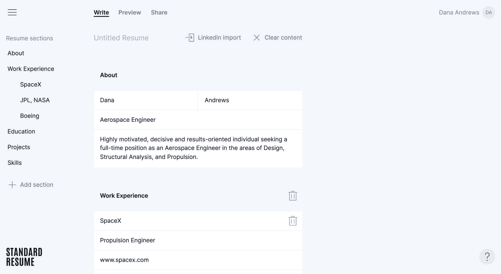
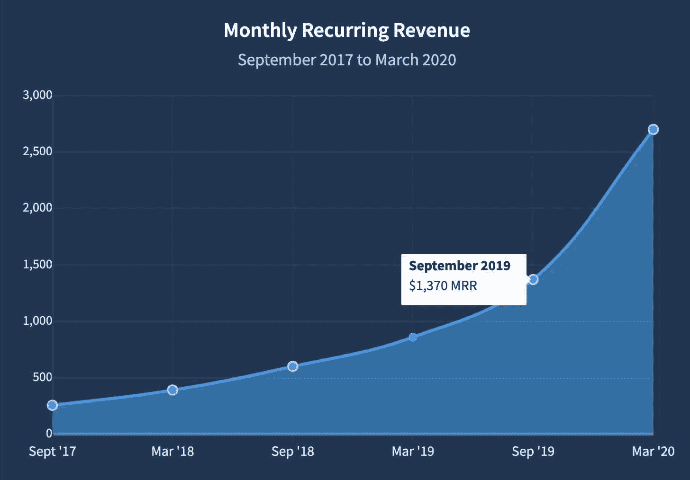

<!--yml
category: 访谈
date: 2022-06-28 10:41:44
-->

# [产品盈利访谈]月入￥2W：Standard Resume，轻松制作出众的简历 | 电鸭

> 来源：[https://eleduck.com/posts/2Lf1KJ](https://eleduck.com/posts/2Lf1KJ)

此篇文章来自于[sideidea.com](https://eleduck.com/posts/%5Bhttps://xiaozhuanlan.com/%5D(https://xiaozhuanlan.com/))的翻译。

**Standard Resume**可以帮助快速制作精美简历，优势是目前市面上唯一一款可以直接导入 Linkedln 资料的简历编辑器。到目前为止该产品还几乎没有做过什么推广，产品增长依靠两次在 Product Hunt 的发布、产品独特性和用户口碑，月收入就已经达到约 3000 美元。Riley Tomasek 认为这是因为 Standard Resume 是大家真正需要的产品。

## 你好，请问你的背景是什么？最近在忙什么呢？

嗨，我是 Riley Tomasek ，[Standard Resume](https://standardresume.co/) 的创始人之一，这是个帮大家创建好看简历的 app 。

在 Standard Resume 全职工作之前，我也是软件工程师和创业者。我是 [Flight](https://flight.app/) 的联合创始人，在像 Dropbox 这样的初创公司做软件工程师。

Standard Resume 是个网页 app ，可以轻松创建 PDF 和 Web 简历。导入那你在 Linkedln 的个人信息然后从招聘模板中选择。轻松把简历做成 PDF 或者响应式网站。

Standard Resume 已经帮助创建超过 100,000 份简历，我们的月收入约 3000 美元。

## 初衷是什么呢？

五年前我在找工作，想要一份好看的简历。我试了一些现有方案，但不喜欢，所以我最后从头做了一些东西。这是个可以打印成 PDF 的静态网站。我的朋友 Sari 和 Sinan，现在也是我的联合创始人，做的设计。

我们决定做一个可以生产简历网站的简单编辑器，然后发布。几周后，2015 年 5 月，我一觉醒来收到通知，Standard Resume 已经发布到 Product Hunt 。Kevin William David 推的，我们已经收到了好几百个支持。

我们最后成了[当日 #1 产品](https://www.producthunt.com/posts/standard-resume)并收获了几千新用户。不久后我开始在 Dropbox 工作，除开支付账单都没有管它。

两年后，2017 年 6 月，我们决定把一些要求最多的功能作为付费订阅加入。我们完成了这些功能，设置了 Sripe 计费，继续把它作为副产品运营。

2020 年 5 月，我决定要做一些盈利的、可持续发展的公司。我已经受购了风险投资创业公司的包袱。Standard Resume 在持续增长，看起来是个绝佳的尝试机会，所以我最近把它过渡成了全职项目！

## 怎么做第一版产品的呢？

如前所述，第一个版本非常简单。它是自用的，没有自定义项，只有一个简历模板。以产品为核心，结合简单的技术栈，可以快速构建。第一个版本花了两个月的周末和晚上。

当我开始全职做 Standard Resume 时，我们决定重建整个 app 。知道我有更多时间和精力花在这个 app 上后，我们决定赋予它更强大的功能。这也意味着构建起来更加复杂。

我已经工作了约两个月了，我们差不多已经准备好全发布了。

## 你的技术栈是什么？

我们的数据库、认证、云功能和应用托管都用 [Firebase](https://firebase.google.com/) 。它让我们能够以极少的开销和维护来起步。

网站运行在 [Next.js](https://nextjs.org/) 和 [Vercel](https://vercel.com/) 上。我们希望我们的营销页面是静态的，但也需要服务器渲染的网络简历。服务器渲染是为了 SEO ，静态页面是为了性能。

App 和网站都用 [React](https://reactjs.org/) 和常用库。传统上由服务器处理的事情，由 JavaScript Firebase 云函数来完成。

我们最大的技术挑战，也是唯一的重大变化，就是 PDF 简历制作。我们最初使用了一项服务来创建 PDF 简历，但与我们的设计无法相匹配。在开发最新版本的 Standard Resume 时，我们建立了一个自定义 PDF 渲染器。工作量很大，但它使我们能够生成比任何竞争对手更好的 PDF 。

## 你怎样吸引用户的呢？

我们有两次 Product Hunt 发布，是我们大部分增长的原因。我们的第一个发布的浏览量为 12,000 次，平均 1,500 次/周。我们的第二次发布有 10,000 个浏览，水平在 4,000 /周左右。

除了 Product Hunt ，我们的发展依靠的是客户满意的口碑和产品独特性。我们是唯一一个可以[导入你的 LinkedIn 资料](https://standardresume.co/linkedin-resume-builder)并将其转化为简历的简历制作工具。

我们最近开始探索几种不同的增长策略，包括内容营销/ SEO 、赞助和广告。到目前为止，我们已经创建了一系列[简历范例](https://standardresume.co/examples)和[简历资源](https://standardresume.co/resources)。

由于时间尚早，我们还没有任何结果可以分享，但请关注我们的产品页面的更新。

## 商业模式是什么？怎么增长利润的？

我们是一款免费增值产品，通过付费订阅来赚钱。在 2017 年 5 月开始收费时，我们的价格是 5 美元/月或 20 美元/年。第一年我们的 MRR（月经常性收入） 缓慢增长到了 440 美元。在 2019 年 5 月继续增长达到 1000 美元，然后在 2020 年 5 月发展到 2700 美元。

从一开始就在用 Stripe 。太棒了，我向所有入门者推荐。Stripe 的设置速度很快，我们在使用它的三年里没有出现过任何问题。能够快速改变价格对提高我们的 MRR 至关重要。

在过去两年中，我们的 MRR 增长大部分来自于价格和产品的变化。通过价格实验，我们能够在不改变产品的情况下提高我们的 MRR 。我们还对我们的免费增值模式做了一些小改动，提高了转化率。

## 未来的目标是什么？

我们目前的重点是增加流量。我们还没有花太多时间在营销上，我们觉得有很多发展机会。

我不要制定与具体结果、日期或数字挂钩的目标。我们不断地重新评估对我们来说什么是重要的，并尽最大努力去实现。Jason Fried 写了[一篇文章](https://m.signalvnoise.com/ive-never-had-a-goal/)，与我们对目标的思考非常吻合。

## 如果重来会有什么不同？

我们的客户流失率很高，因为大多数人每隔好几年才有几个月需要简历。我们从一开始就知道这一点，但事实证明这是一个比我们最初想的更大的问题。

较高的流失率使我们很难提高客户的终身价值，这又意味着我们从每个新客户身上赚不到多少钱。很多营销渠道获取客户的成本比我们从客户身上赚到的钱还要多。

所以如果重来我会花更多心思在减少流失率上。五年后再改业务模型或产品要难得多。

## 有什么特别有帮助的吗？

好的分析能力和收集用户反馈的渠道是我们成功的关键。分析让我们保持诚实，而且让我们很容易衡量每一项改变的影响。用户的反馈帮助我们确定工作的优先级，并且了解到我们的改动什么时候解决了预期的问题。我绝对建议尽早建立像样分析和收集用户反馈的渠道。

我们非常幸运，还没花功夫在客户获取上，就能有今天的成就。我们非常感谢 Product Hunt 社区的早期采用和宝贵的反馈。

## 对于刚刚开始做项目的独立开发者有什么建议吗？

做一些大家真正需要的东西来收费。听起来简单，但是做起来却出奇的难。当你寻求反馈时大部分人都会说他们认为你想听到的，而不是真相。

我们很幸运 Standard Resume 是从解决自己的问题开始的。如果你不是幸运的从解决自己问题开始的，一定要以最快的速度验证一切。最好的方法是要求人们付钱。这是比别人说的任何话，甚至是注册量和使用量等非付费指标都更好的信号。

其他建议，推荐 Naval 的 [How to Get Rich （without getting lucky）](https://twitter.com/naval/status/1002103360646823936)，这本书包含了很多直接适用于创业公司的智慧。