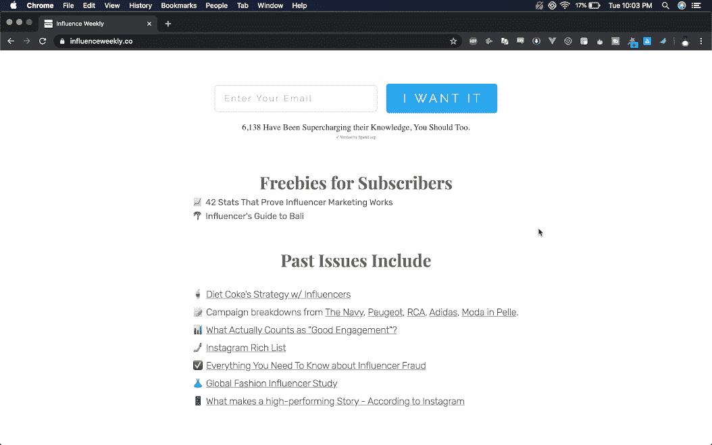

<!--yml
category: 访谈
date: 2022-06-28 10:41:35
-->

# [产品盈利访谈]月入￥5000,Influence Weekly，网红营销资讯订阅服务 | 电鸭

> 来源：[https://eleduck.com/posts/5BfKGr](https://eleduck.com/posts/5BfKGr)

此篇文章来自于[sideidea.com](https://eleduck.com/posts/%5Bhttps://xiaozhuanlan.com/%5D(https://xiaozhuanlan.com/))的翻译。

#### 概要：

Influence Weekly 是关于网红营销的订阅邮件，创始人 Andrew Kamphey 本身是业内人士，把自己的阅读内容和时事资讯整理成周报，做出了这个产品。

产品的推广主要是通过内容营销和推荐码。收入以广告为主，还包括付费订阅和用户打赏。产品本身性质决定了增长几乎是线性的，目前阶段 Andrew 想到的办法是把已发布过的内容用视频形式重新做出来，一方面因为每个人的学习习惯和获得资讯的渠道不一样，新的形式可以吸引不同的用户，另一方面由于是旧的内容，重做的负担不会太大。

#### 你好，请问你的背景是什么？最近在忙什么呢？

我是 Andrew Kamphey ，我创办了一份关于网红营销业的周报 Influence Weekly 。在行业内做了几年后我想提升自己，但不确定去哪里。我列出了一份 70 个优秀资源的清单，并且开始记录每周阅读的内容。

我觉得 Influence Weekly 是每周最有深度和数据价值的网红营销文章。它就像一个行业状况的周报告。我的读者有高管，有想用网红营销的 CMO 和 VP ，有关注行业竞争的网红营销机构，也有网红本身。

我平均每月赚 704 美元。随着我的广告销售上下浮动。根据我最新一次检查，有 6073 个订阅者。

#### 初衷是什么呢？

我本身从事这个行业，做定价和分析，但我想进一步看看其他公司和我们的区别。我想知道我们的工作比行业平均水平好还是差。

我从事难得的好工作。在空闲时间我读书越来越多，我发现自己越来越想发邮件给公司高管。这就是我怎么想到每周编辑一封邮件的。

我还想记录我每周的阅读内容。我可以做个打包或者 Google Sheets 。现在我想我会做个 Notion 或者 Roam research 文档。当时我觉得其他人也会对此感兴趣。

#### 怎么做第一版产品的呢？

花了一个长长的周末才开始。用 [Carrd](https://carrd.co/) 做了个登录页面，我制作了 0 号问题发给 20 个我尊敬的同行，请他们查漏补缺。

六天后，我把第一期发给了大约 50 人。第二期发给了 100 人。从那时起，每周都有增加近 50 个新用户。( 6000 订阅数/127 周=每周 47.8 个订阅)。

当时我利用晚上和周末来发送。每一个周四晚上都非常漫长。几个月后我已经进入了节奏，127 周以来，还没有缺席任何一个星期。

一年后我辞职了，一边做其他产品一边做 Influence Weekly 维持生活。

#### 你的技术栈是什么？

目前是：

[Mailchimp](https://mailchimp.com/) 发邮件和保存列表

[Substack](https://substack.com/) 付费会员

Google Sheets 整理和策划每周信息

[Stripe](https://stripe.com/) 收广告费

[Carrd](https://carrd.co/) 登录页面

[Ghost](https://ghost.org/) 博客（我想以后能用这个接管电子邮件和付费会员的职责。）

[Sparkloop](https://sparkloop.app/) 推荐码

[Pigeon](https://www.indiehackers.com/interview/Trypigeon.co) 邮件CRM

#### 你怎样吸引用户的呢？

我的首要增长策略是内容营销。

1.  [Influence 100](http://influence.directory/100/) ：网红营销最有影响力的 100 人。当时我只有 300 个左右的订阅，两周内订阅数就翻了一倍。这个被分享到了 LinkedIn 上。
2.  [Influence 100 in 2019](https://news.influenceweekly.co/100/) ：这个版本收获了 700 个订阅。

其次的增长策略是推荐码。

我一直知道 CEO 是最有影响力的人，有一次一位 CEO 告诉我他让所有员工都订阅了一份资讯。

到了 2019 年末我才加了推荐码计划。这不是推荐的开始。这是考虑到已经发生了推荐。到目前为止我订阅增长的主要贡献就来于此。我会奖励提供帮助的人！

很多人都会犯这样的错误，盲目地跟从别人的策略。如果没有人分享你的资讯你要找原因。鼓励分享并不会神奇的让人分享。

我创建了一个 [Telegram](https://telegram.org/) 群组奖励分享咨询的人。我们每周都会分享文章，进行辩论，结识同行。进展顺利！

#### 商业模式是什么？怎么增长利润的？

我的广告收入最多。每封周报的顶部有一个广告，中间有两个文字广告。

我也有一些付费用户，可以提前 24 小时收到邮件。他们每周还会收到一封福利邮件，这封邮件内容会深入到特定的报道中去，提供我对行业的看法，也能预览即将发布的内容。

我也有一些打赏来自 [BuyMeACoffee](https://www.buymeacoffee.com/) 链接。除开让人们能随时因为各种缘由打赏外，我还用 coffeelink 来“销售”产品信息。我指的是之后免费发布的信息图表和报告。我在这里用过一个有效的方法（得到一些打赏）是发布一个免费的信息图，只要打赏 3 美元就能提前一星期得到，后面跟一个 coffeelink 。当时是发布的网红营销业的 50 为顶级媒体人名单。一些非常积极的人想早点看到这份名单。不买的人可以等一周。

这些 "打赏 “占我总收入的 5% 。这很好但不是主要的。

每个季度我都会提高广告价格，这些让我现在可以为人们做产品包装了。有些每月买一次广告，有些每月买三次广告。如果我每周只卖一个广告保持每次排满还蛮难的。当广告空间变多反而更容易，因为这让我的资讯看起来很受欢迎。

#### 未来的目标是什么？

我最大的目标是到 2020 年底能有 1 万订阅。我计划通过每两周执行一次用户吸铁石( Lead Magnets )来实现这一目标。我打算创建一个绝妙的可下载 PDF 提供给新用户。我会先把它发送给现有的订户，并宣布它是早期用户获得的福利。

我还在为付费用户做一个新的会员网站。它有一个历史文章的可搜索数据库。它还会有其他地方找不到的关键信息。

#### 遇到过的最大挑战和阻碍是什么呢？

为了增长我什么都愿意做。资讯最难的部分是几乎没有网络效应。增长非常线性。

我希望我能在 Youtube 上做出更好的内容。这可以帮助增长而且不需要我承担太重。YouTube 上的内容也会更有效地接触到更多的人，因为每个人的学习方式都不一样。上一年我很喜欢在 [Substack](https://substack.com/) 上录制音频笔记。而我现在已经跃跃欲试用 [Loom](https://www.loom.com/) 来发布视频和录屏。

不同类型的人对不同的媒介有不同的反应，我可以利用这一点来发挥我的优势。听起来不可思议！我可以把旧的内容以新的方式利用。

#### 有什么特别有帮助的吗？

[Chris at KintuLabs](https://www.indiehackers.com/kintulabs) 对我最有帮助。他多年来的经验和建议让这份资讯成为可能。Chris 写了很多关于创建新闻资讯的深度博客文章。截至目前，他正在编写一门新的课程。我希望其他人可以利用他的建议开始制作新闻资讯。现在开始做资讯永远不会太晚。

[The Dip](https://www.sethgodin.com/#books-courses-and-more) 是最好、最短、最适合创业者的书。知道什么时候退出，100% 退出。再前进。不管是一个项目，一个公司，一个角度，只要是你正做的一些没有用的小事。退出。然后前进。退出并不是坏事，还可以磨砺你做正在做的事。

#### 对于刚刚开始做项目的独立开发者有什么建议吗？

找到你的人。 建立一个部落。

不需要寻找商机，制造商机。

用新的方式重做旧的内容。

要为自己的作品感到骄傲，要让人们知道。

#### 哪里可以了解更多？

我一直在 IndieHackers 上发布更新，尤其是在通讯组里。我也是一个非常开放的人，乐于看到别人成功。更欢迎任何人给我发邮件，邮箱：andrew@kampheyapproved.com。

如果你从事网络创作或者营销，可以在[我的网站](https://influenceweekly.co/)免费订阅。