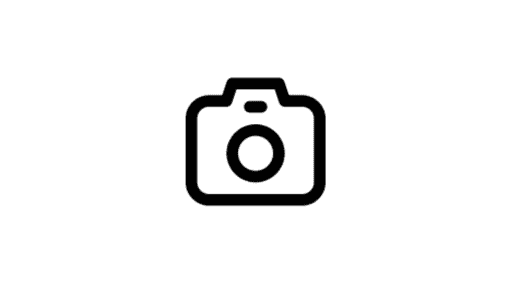
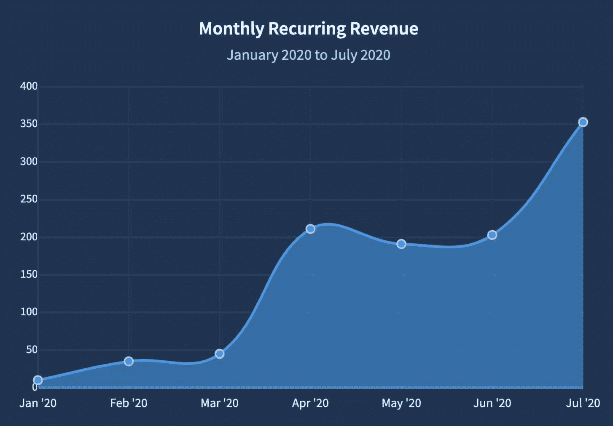

<!--yml
category: 访谈
date: 2022-06-28 10:40:15
-->

# [独立小产品]2020年上线三个月，月收入420美刀，帮助开发者简单通过 API 调用实现网页截图的SaaS产品。 | 电鸭

> 来源：[https://eleduck.com/posts/JpfxrQ](https://eleduck.com/posts/JpfxrQ)

此篇文章来自于[sideidea.com](https://xiaozhuanlan.com/topic/7216850394)的翻译。

[screenshotapi.net](http://screenshotapi.net) 是一款刚刚上线 3 个月的小工具，目前收益是 420 美元每月。功能是帮助开发者简单通过 API 调用实现网页截图。

Dirk 在业余做自己感兴趣的产品时需要这个功能，但是其他产品太贵于是决定自己开发，最后直接做成了一款 SaaS 产品，全部都在谷歌云上运行。因为不懂营销，所以推广运营方面，利用 Ahrefs 查看竞争对手的流量来源，模仿对手有效的手段。最有效的营销来自谷歌广告。但是在尝试涨价后开始销量不佳。

#### 你好，请问你的背景是什么？最近在忙什么呢？

我的名字是 Dirk Hoekstra 。我在阿姆斯特丹做软件开发。

最近几个月，我在闲暇时做了 [screenshotapi.net](https://screenshotapi.net/) 。Screenshotapi 是帮开发者通过简单的 API 调用来进行网页截图的工具。

目前这款工具已经有 20 个活跃的付费用户，大概 400 美元/MRR（经常性月收入）。

#### 初衷是什么呢？

开始是因为我正在做的一个个人爱好的项目。我想创建一个新闻文章目录。在主页上想显示所有新闻文章索引的截图。这意味着我必须搞清楚如何自动在网站上截图。

我在网上搜索偶然发现了 screenshot APIs 。我测试了可以用。但它每个月收费 35 美元。我不想每个月为一个基于兴趣做的项目花这么多钱，所以我打算自己做截图系统。当我做这个的时候，我想我也可以把这个系统做成一个完整的截图 SaaS 应用。

#### 怎么做第一版产品的呢？

创建这款产品相当艰难因为我有全职工作。我记得我下班回家后，强迫自己花一两个小时来编程。但是几个月后，[screenshotapi.net](https://screenshotapi.net/) 就可以运行了。

原始 MVP（最小可行性产品）功能比现在少很多。但是我想在开发功能前看看用户是不是真的会用我的 API 。

#### 你的技术栈是什么？

我是 Laravel 的粉丝，所以也总是用 Laravel 来创建个人产品。在前端我使用 plain Javascript 和 Vue 的组合。

我想如果做一个 SaaS 应用那么它应该是可拓展的。所以我决定全部在谷歌云上运行。

截屏是通过 Chrome 浏览器（使用 [Selenium](https://www.selenium.dev/)）来创建的，渲染得就和正常电脑上的一样。

最近我写了一篇[深度剖析的文章](https://medium.com/@dirk_hoekstra/building-a-website-screenshot-api-3aeb3f21b465)来介绍截屏的具体办法。

#### 你怎样吸引用户的呢？

我遇到的问题和许多开发者一样，开发了产品，但是不知道如何吸引用户。

我做的第一件事就是看竞争对手在做了什么。我使用 [Ahrefs](https://ahrefs.com/) 工具查看他们如何产生流量，以及他们的反向链接来源。

然后我只做似乎对他们有效果的事情。包括将 API 提交到目录列表，在知名的技术博客上写文章，等等。

虽然大部分的反向链接没有产生任何流量，尤其是目录列表网站。但我认为它们确实对 SEO 有一定的价值。

对我真正有效果的是谷歌广告。我目前在谷歌的 "screenshot API”关键词的花费是 100 美元/月。而到目前为止，20个付费用户中，有13个来自于谷歌的那个付费广告。

如果看谷歌分析报告，你就能看到当我开始在谷歌广告上做广告时用户数量激增。

我还在慢慢琢磨这些。但我的策略仍然是看竞争对手在做什么，然后进行试验，看看是否对我也有效。

#### 商业模式是什么？怎么增长利润的？

ScreenshotAPI 采用的是 SaaS 商业模式。有一个免费版，每月提供100张截图，还有一些付费版本，每月大概 9 美元到 175 美元不等。

我最近提高了价格。最开始我最低收费是 5 美元，但我觉得如果你收的太便宜，人们就不会那么认真地对你。不过涨价只是针对新客户，因为我觉得我的早期支持者应该有一些额外的关照。那是几周前的事，之后就没有增加新的付费用户了，所以我得看看这是不是一个好的决定。

平均每个月都有两个付费客户注册，流失率真的很低。所以收入一直在缓慢增长，但非常稳定。

目前，每月收入约 415 美元。

#### 未来的目标是什么？

如果你看上面的用户图就会发现，大部分用户来自于付费广告和推荐链接。

我觉得我的 SEO 有很大提升空间，我的目标是通过这个吸引更多的用户。这是说我正在刷新我的写作技巧，并接触很多知名的博客。我不想盲目滥用反向链接，所以我的目标是提供高价值的文章，并将其反向链接到 [screenshotapi.net](https://screenshotapi.net/) 。

我还计划建立更多简单的 SaaS 应用。我相信，做好一件小事比尝试解决五件大事更有价值。

但目前我最大的障碍是时间，因为我也在全职工作。如果 ScreenshotAPI 达到 1000 美元的 MRR （经常性月收入），那么我会转到这个全职。但在这之前，它仍然是一个副业。

#### 如果重来会有什么不同？

营销我没有什么头绪。如果重来我会一开始就更认真做好。

比如说，我根本不了解 Product Hunt 是个什么东西。当我在那里提交产品时惨遭失败。所以如果我有机会再来一次，我会在 Product Hunt 上投入更多的精力。

#### 有什么特别有帮助的吗？

我把这整个冒险看作是一个大实验。我的座右铭是，”好吧，我不知道我在做什么，但这不会阻止我。我只是要找出什么有效，什么无效！”

我相信在自己创业的时候，这是一种健康的心态。因为每当一些事情失败的时候（比如我的 Product Hunt 发布），这种心态都能帮助我把它更多地看作是一种学习的经历，而不是失败。

#### 哪里可以了解更多？

如果对我有兴趣可以关注我的 [Twitter](https://twitter.com/Dirk1345) 或者我的 [blog](https://coffeecoding.dev/) 。