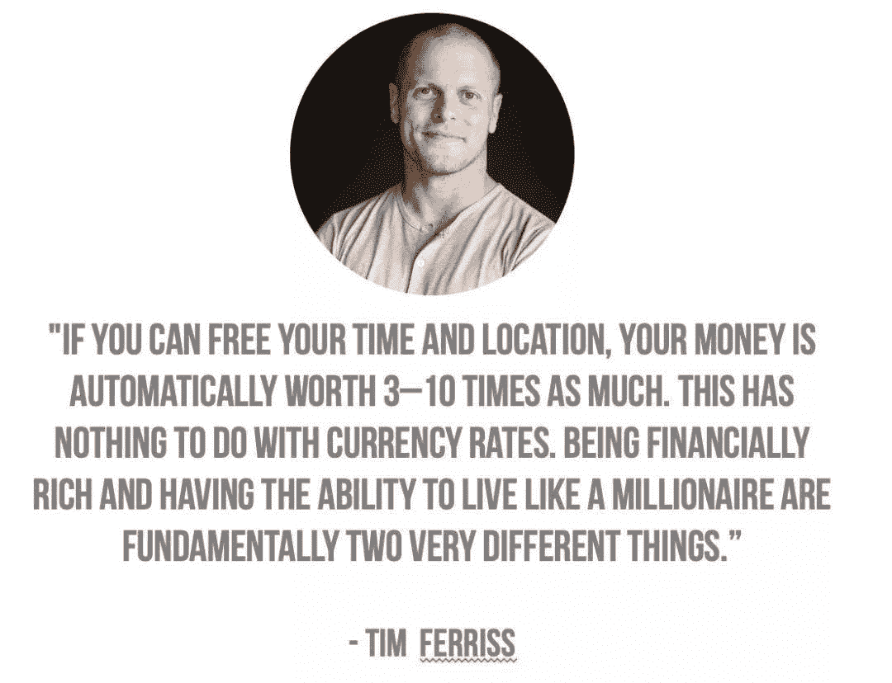

<!--yml
category: 未分类
date: 2022-06-26 00:00:00
-->

# 什么是数字游民? - Dn终极扫盲贴(2019万字迭代版）

> 原文：[https://jarodise.com/the-ultimate-guide-to-digital-nomad-lifestyle-design-2019](https://jarodise.com/the-ultimate-guide-to-digital-nomad-lifestyle-design-2019)

从2015年创建数字游民部落这个内容品牌开始到现在，已接近四年。在这四年中我完成了从一名石油工程师到内容创业者的蜕变，也见证了“数字游民”这个群体在中国的成长及生活方式设计概念的逐渐普及。

越来越多的人开始明白什么是数字游民，并开始为打造这样一种新的生活方式付诸行动。于此同时，还有更多的人是头一次听说这个概念，当它们搜索“数字游民”这个关键字的时候，绝大多数情况下，搜索引擎都会不约而同地指向我的网站[jarodise.com](http://jarodise.com)(或者微信公众号：数字游民部落）。

蜘蛛侠的Uncle Ben说过：能力越大，责任越大。作为华语圈最为活跃的数字游民生活方式布道者之一，我希望能够结合时代发展赋予数字游民的更新含义，以及我自己在生活方式设计过程中实践与体会，持续地把“数字游民”扫盲工作做好。于是，就有了你们现在看到的这第三版的“扫盲贴”。

## 定义数字游民

首先，我们必须承认一件事实：给“数字游民”这四个字下定义其实并不是一件容易的事情。

很多朋友对于数字游民的第一印象是：这是一种能边赚钱边旅游的职业。包括我本人在第一版扫盲贴中也未能免俗。有如权威媒体BBC所说：

> “Digital nomads are a growing demographic of location-independent professionals who can work remotely from anywhere on Earth and customize their travel to where they feel the most inspired." (译：一个正在成长中的，依靠远程办公来实现自己特定旅行梦想的专业人群。）

相比之下，维基百科的定义则更为朴实一些：

> “Digital nomads are individuals who use telecommunications technologies to earn a living and, more generally, conduct their life in a nomadic manner. ” (译：数字游民指那些依靠电讯技术来赚钱糊口且过着游牧式生活的人群。)

经过多年对数字游民生活方式的亲身实践，我觉得上面的两种定义方式都有可取之处，但是都不全面。

在我看来，数字游民的终极目标既不是为了旅游,也不是为了赚钱糊口，而是一种对于生活品质和自由度的追求。

生活方式设计教父Tim Ferriss在他的成名作《The 4-Hour Workweek》写下过这么一段话:

 译：如果你能解放你的时间和地理位置（可以理解为不需要在固定地点和固定时间上班），你的物质财富将会自动增值3到10倍。这和货币汇率没有关系。**单纯物质层面的富有并不意味着你就能活得像个百万富翁一样，本质上这是完全不同的两回事情。**

这句话完美地解释了一个曾经被人们热议的哲学问题**“月入五万的西二旗人为什么活得像月薪五千”**。因为，很多传统意义上的高收入人群并没有实现时间和地理位置这两个维度的自由，**如果时间也是一种衡量财富的标准的话，那么这些人其实并没有我想象中那么富有。**

仔细想想不难发现，我们说的朝九晚五，996，这些词其实都是基于时间的定义。为什么996这么遭人厌恶？因为**它背后的隐含的代价是一个人需要把自己生命中最宝贵的，精力最旺盛的几十年中接近一半的时间，奉献给一份自己可能并不是特别热爱的工作。**

996本身已经非常糟糕，更糟糕的是，由于大部分传统职位的工作地点是确定的，人们还需要在这个基础上加上2-3个小时的痛苦通勤过程。很多人每年的通勤时间加起来比自己的年假还要长，而通勤带来的焦虑已经被权威医学研究证明是会让人减寿的。所以，**固定地点固定时间的高强度工作，加上居住在超大型城市几乎难以避免的通勤，不但在消耗你当前宝贵的时间，同时也在减少你未来的可支配时间（寿命）**。可谓是实实在在的“double kill”了。

回到对“数字游民”这个词的定义，我认为，**数字游民（Digital Nomad）代表了一种被新时代赋予可能性的全新生活方式，它特指那些完全依靠互联网创造收入，并借此打破工作与工作地点间的强关系，达成不受地域限制（location independent，以下简称LI），全球移动生活的人群。**它也是一种真正能够帮助现代人解放时间和地理位置，让他们在没有退休前就过上自己梦想中退休后生活的优雅解决方案。

成为一名数字游民，意味着你将彻底与浪费生命的通勤告别，意味着你可以实现自己想走就走的终极旅行梦想，用更慢地脚步丈量整个地球；意味着你可以轻松实现地理套利，让自己赚到的钱更值钱，逃离拥挤昂贵的一线城市，去那些风景优美，气候宜人，性价比更高的城市居住；意味着你可以有更多时间陪伴家人和朋友，做自己真正感兴趣的事情。

## 数字游民的财富现金流象限

由上面的定义我们可以看出，成为数字游民的关键一步是要通过互联网创造收入。互联网技术的诞生，不但极大地改变了每个人的生活方式，同时也在潜移默化地改变财富的分配与创造。人们可以轻松地以互联网媒介，提供并售卖自己产品和服务，并获得相应的收入，这种商业模式本质上与最原始的物物交换并没有本质区别，但是它成功地将“location”这个元素从商业模式里面剥离了出来，这也是数字游民能够实现LI的核心基础。

很多年以前有一本叫做《富爸爸穷爸爸》的书畅销全球，帮助很多人开启了所谓的“财商”。作者罗伯特清崎之后又趁热打铁，写了好几本续作，其中一本给我留下了极为深刻的印象，它叫做《富爸爸财务自由之路：神奇的现金流象限》，在这本书中，作者根据收入现金流的不同将人群划分为了四个不同的象限，分别是Employee(职员），Self-Employed(个体业主）,Business-Owner(公司老板），Investor（投资人）。

职员打一天的工赚一天的工钱，什么时候被炒了或者自己辞职不干了，收入来源也就断掉了，典型的用时间换钱。个体户,例如菜市场买菜的，小型理发店的理发师，同样是做一天的买卖赚一天的钱，相比职员好处在于没有人能炒他们的鱿鱼，但是坏处依然是典型的用时间来换钱，只要生意一天不开张，收入也就会断掉一天。公司老板的工作主要由下面的员工来做，因此他们是不需要拿自己的时间来换钱的，只要公司运转良好，老板完全可以远程操控，花大半年的时间打高尔夫球度假。最后一个象限是投资人，投资人与公司老板最大的区别在于，他们的“员工”不再是活生生的人，而是钱，用钱来赚钱，而不是用时间来换钱，无疑，这是拥有最大自由度的一个象限。

这本书首次出版于1998年，那时候互联网还远没有现如今这么发达，绝大多数人也不知道什么是数字游民生活方式设计。在那个年代，如果你不想用时间来换钱，那么出路只有两条，要么开一家像机器一样运转的公司，要么拥有很多的原始资金做一名用钱生钱的投资人，而富爸爸在它的书中也是在旨在帮助读者们成为后者。

受到富爸爸的现金流象限图的启发，我绘制了下面这张更符合互联网时代的数字游民现金流象限图：

 下面，我们就以这四个象限为基础，来详细分类讨论一下当前通过互联网赚钱的一些主流方式：

## 1.自由职业（F）

很多朋友习惯于把数字游民的职业选择范围等同于自由职业，其实这样的理解并不准确。在我看来，自由职业只是由传统工作到数字游民生活方式门槛最低的转型切入点之一。换句话说，只要你拥有的一技之长或者掌握一定量的信息不对等，能够在网络上为其他人提供有偿的服务，那么你就已经具备了成为网络自由职业者的初始条件。

举例来说，文案，设计，翻译，编程这些技能，都很适合做线上自由职业。而签证，法务，保险，理财等业务，只要你掌握一定的线下资源或则信息不对等，也非常容易转化为线上付费服务。

当然和找普通的工作一样，大多数情况下，你依然需要通过简历和面试这样的环节来向雇主来展示你的过人之处。在网络自由职业的招聘过程中，因为缺少了面对面的面试这个环节，因此你的“online presense”，即互联网个人品牌和portfolio（作品集）就显得尤为重要。特别是对于一些，同质化很严重，竞争激烈的技能工种，拥有一个出色的作品集会让你占到很大的先机。

同理，互联网上的自由职业也是有其特殊的职业发展轨迹的，很多人一开始在网上找工作四处碰壁其实是再正常不过的事情，这时候完全没有必要灰心气馁，因为绝大多数互联网自由职业者都会经历这么一个过程。你完全可以把这个过程当做一个学习和积累的过程，而不要在一开始就把赚钱放在第一位。你甚至可以在初期尝试为别人提供免费的服务，只为获取最初的用户基础和创建作品集。当你的履历丰富，并获得一定数量的用户口碑后，话语权自然会增强，同时你的薪酬水平和收入稳定性也会得到很大的改善。

很多朋友对于自由职业的另外一个误区是：自由职业不稳定。但是相信经历过行业波动和经济危机的朋友也许会理解，**现代社会除了那些体制内的工作之外，几乎没有任何所谓稳定的职业。**在我看来，自由职业并不等同于三天打鱼两天晒网的零花钱，也不一定代表青黄不接的不稳定收入状态，只要善于自我营销，并在垂直领域有所建树，建立长期客户群，其稳定性并不会比朝九晚五的传统职业更差。

随着数字游民运动的兴起，目前网上已经有很多针对互联网自由职业的工作平台和职位搜索引擎，比较大的譬如Upwork，Guru，Freelancer等等。令人遗憾的是，目前在中国还没有非常成熟的权威性自由职业平台。根据我的观察，万能的淘宝和微信朋友圈其实正在逐渐成为很多国内自由职业者发布自己技能最为靠谱的平台。希望不久的将来会有一个真正权威性和保障性的，面向中国自由职业者的工单聚合平台出现。

## 2.远程工作（R）

我们知道当前国内职场人士最大的困扰之一就是：高薪工作机会大多聚集在北上广深等一线城市，大量人口的涌入和其它一些经济学因素导致一线城市房价高启，这些工作在一线城市的人们为了能够在一线城市过上更稳定的生活不得不背上大笔的房贷买房，而正是因为有了房贷，让他们不得不留在一线城市才能赚到足够的薪水来还房贷，最后形成了这样一个死循环。

那么这个死结有没有解？有，那就是远程工作。

实施远程工作制度最著名的公司案例大概要数美国的Automattic公司，它是著名的CMS平台WordPress的母公司。这个公司可以说从创立之初就带有远程办公的基因，形成了自己一套非常有特色的协作办公文化。在Automattic，员工们不需要通勤，没有KPI，没有dress code，没有等级分明的管理架构，也没有永远看不完的email和开不完的会。取而代之的是结果为导向的灵活考核机制，Slack，Zoom这样的先进远程协作软件平台，以及每年一次为期一周的可能发生在全世界任何地方的有趣年会。这个公司的近800名员工分布在全世界60+个国家，所有的工作和会议都在线上完成。公司会给每个远程办公的员工发放“远程补助”，让他们去全世界任意的联合办公空间工作，如果员工选择在星巴克或者其它咖啡厅工作，那么饮品由公司买单。

放眼国内，知名协作软件团队Tower从2013年就开始了全员远程办公的尝试，并且取得了非常不错的效果。他们的成功案例表明，这种远程分布式的管理模式在中国的土壤照样可以生根发芽，特别是对于目前国内发展迅猛的互联网行业，很多产品团队其实完全可以完全或者部分做到“逃离”北上广。

从当前情况来看，国内远程工作推进的阻力依然很大，我认为这种阻力的主观因素要大于客观因素，企业管理者惯性地认为远程工作会导致怠工或者沟通不畅，但是，很多人很有可能已经是事实上的远程办公实践者。

拿一些小的初创公司举例，他们通常不可能有自己独立的法务，会计和人力资源部门，他们能做的只能是把这些业务外包给一些专业的公司代为处理，其实仔细想想，这难道不就是事实上的远程协作办公吗？

而对于大公司，特别是那些在跨国公司工作的“白领”们而言，他们每天工作的绝大部分时间都是在电脑前，发邮件，发即时信息，人们在交流工作进度的时候会因为trackability而首选电子邮件这种方式，即便对方就坐在自己两米开外的地方。跨国公司的跨时区电话会议和视频会议更是家常便饭。这也是事实上的远程办公。

此外，现在也有不少人把自己在办公室做不完的工作带回家中加班加点完成，很多公司考虑到外网不安全的因素甚至给员工们配备了外网专用的VPN来访问内网资源。这其实也属于远程办公。

以上种种迹象都说明，当代社会有很大一部分公司的很多人都已经是事实上的远程工作者了，不管他们是否愿意承认。

在我看来，远程工作所有实现数字游民生活方式途径中最稳妥的一条，因为它既没有自由职业初期几乎无法避免的单打独斗，朝不保夕的不安全感，也没有创业所产生的各种不确定性与风险，在拥有稳定收入的同时又能享受地域不受限的自由。如果非要找一个缺点，那就是远程工作尚未实现收入的被动化，本质上依然是用时间来换钱。但是，比起在一线城市通勤加班996，这样的工作方式的确可以带来生活品质飞跃般的提升。

如果你想通过远程工作打造数字游民生活方式，那么你可以有两种选择，1\. 找一份新的允许远程办公的工作；2\. 说服你现在的老板允许你远程工作。

对于第一种选择，我们看到目前越来越多的公司开始招聘远程职位，一些远程工作搜索引擎和聚集平台也应运而生，比较有名的有RemoteOK, Remotive, RemoteHub等。此外，在国内的一早一晚，V2EX, 远程.Work等社区也常常能够看到面向国内人才的远程工作招聘信息。

如果你是一名创业公司老板，我想对你说：时代正在改变，互联网和云计算，VR，AR等技术的普及，正在让地理位置成为工作中最不重要的因素。员工并不是非要在自己眼皮底子下才会好好干活，及时拥抱远程分布式办公的先进管理模式，才能在变革的潮流中立于不败之地。

如果我上面的这些文字依然无法说服你，不妨读读由Basecamp创始人Jason Fried写的《Remote：Office Not Required》这本书。相信它会彻底改变你对远程办公的看法。

## 3.创业(E）

首先要声明一点，我们这里说的创业并不是“双创”时期出现的那些靠PPT忽悠风投资金，依靠资本寻求盲目扩张的创业形式。而是指实打实地通过创造价值，并依靠价值守恒定律带来的物质回报最终实现创收的朴素创业形式。**这是四个数字游民现金流象限中门槛最高的一个，也是我本人最为推崇的一个打造数字游民生活方式的赛道，因为它不但具有无限的scalability, 而且通过创造价值带来的成就感也是其它赛道无法比拟的。**

互联网的出现极大地拉低了草根创业的资金门槛，不夸张地说，只要你拥有一部能上网的智能手机，就已经具备了互联网草根创业的启动资本，如果你想更奢侈一点，买一个服务器加一个属于自己的网站域名也只需要人民币200-500元/年左右的成本，这要比传统意义上的开店做买卖，甚至摆地摊的资金门槛都低多了。

硅谷著名投资人Naval Ravikant在2018年底曾经发布了一条名为"How to get Rich(without being lucky)”的长推特。在这条长推特中他说道：

“**资本和劳动力是旧时代撬动财富的杠杆，而在互联网时代，撬动财富的杠杆变成了代码和内容。人工智能技术让你可以不花一分钱就能拥有一支永远不会偷懒的机器人“团队“，它们分布在全球各地的数据中心里，随时待命。如果你不会写代码，你至少可以写书，写博客，录视频和播客节目。**”

我们看到，上个世纪，世界上最大最有影响力的公司还都是一些汽车公司和石油公司，到这个世纪，科技和信息产业变成了引领时代潮流的中坚力量。而移动互联网和人工智能技术的发展，让一个人单枪匹马，四两拨千斤式的创业模式成为可能，我们看到越来越多的“Comppany of One”不断地涌现出来，而且它们中的绝大部分（if not all）都是基于软件服务业或者自媒体。而且，我们也看到，绝大多数的数字游民也是通过写代码或者创作内容来获得LI的。学习编程的门槛正在变得越来越低，而由于谷歌，FB，微信，抖音这些内容分发平台的出现，让任何一个人都可以拥有轻松比肩传统媒体（报社/电视台）的内容分发能力和影响力。

**历史上没有任何一个时代比现在更适合创业，而且互联网时代的创业，特别是基于那些虚拟资产（软件，内容）的创业形式，让创造被动收入成为可能，从而让数字游民们拥有了时间和地理位置两个维度的自由，也让财富自由变成了一个不那么虚无缥缈的概念。**

有关数字游民创业，有两本书值得推荐：Taylor Pearson的《The End of Jobs》，和Paul Jarvis的《Company of One》。推荐所有想要通过创业实现数字游民方式的朋友仔细研读。

## 投资(I)

对于数字游民们而言，学习如何在网上赚钱固然很重要。但是假如你手头本身就有一笔来自之前工作的积蓄，或者来自互联网的收入已经完全能够承担自己日常开销，并且略有结余的时候，就是时候考虑如何把钱投资出去，让钱来帮自己赚钱了。

由于ETF这样的金融产品的存在，可以让所有人以非常低的门槛和费用成本投资全世界几乎所有资产。这样的投资方式对于数字游民来讲无疑是极为合适的，因为它操作不但完全基于互联网，而且所需时间成本也非常低。

我本人对于投资的认知大多来自于对FIRE的研究，它是“Financial Independence, Retire Early”这四个单词首字母的缩写，即“财务独立，提前退休”，和数字游民一样，也是最近几年日渐流行的一种新生活方式运动。

FIRE的目标是储蓄足够的资产，使得资产产生的被动收益永远高于日常开销。你可能会认为FIRE一族通常都有特殊的理财技巧，其实如果关注一些FIRE博主或者看一些相关的书你就会发现，大多数FIRE族群的投资方式都非常简单，即购买指数基金组合并在特定的时间段再平衡。

举例来讲，他们会把手头的钱分成两份，一份买宽基股票基金（例如沪深300，标普500），另外一份买成债券基金，这两本钱的比例是固定的，基于个人对风险的偏好可以是四六，三七，五五，二八，总而言之股票比例越高，其风险就越大。一定时间后（半年或一年），基于市场的波动，股票和债券的比例也会发生变化，他们所需要做到事情就是把这个比例重新恢复到初始的比例，就是这么简单。事实证明，这样长期持有这样的组合并坚持再平衡策略，可以让投资轻松跑赢通胀，甚至在大多数年份跑赢股市大盘。

有关用钱赚钱和FIRE，大家可以关注一个叫做“**也谈钱**”的公众号，里面干货不少。

## 如何克服孤独

“数字游民如何克服孤独？”这是我这些年在运营数字游民部落过程中被问到的最多的一个问题。

的确，这是这种以移动为主题的生活方式不得不面对的一个客观问题。毕竟，人类作为一种社会属性动物，本身就是有社交的刚需的。互联网的出现，让人们把越来越多的时间花在了线上社交上，但是线下社交依然是一个正常人日常生活中不可缺少的元素。我们欣喜地看到，面对数字游民这样一个日益壮大的社会群体，一些创业公司正在推出各种业态去迎合和满足他们的社交需求。我把它们归为5个“C”：Coworking，Coliving，Coworkation，Conference和Company Retreat。

### 1.)Coworking

从2005年全世界第一家Coworking Space诞生之日起，短短的十几年，全世界已经有将近3万家Coworking Space程井喷之势涌现。Coworking虽然是以办公为核心，但是我们也观察到，绝大多数数字游民们在选择Coworking时候，除了网速，办公设施外，越发会看中一些软性指标。一个优秀的Coworking Space对于数字游民而言绝不仅仅是一个办公的地方，它还是一个社交，学习新技能，寻找新业务的绝佳场所，同时能够满足这些要求的Coworking Space，才能真正获得数字游民们的青睐。

我们看到，目前世界上的很多数字游民的热点目的地，正是由于一些优秀的Coworking Space的存在，才得以成为热点目的地。例如位于巴厘岛乌布的Hubud和长谷的DojoBali，位于泰国清迈的PunSpace，以及位于泰国甲米Koh Lanta的Kohub等，都是构建当地数字游民社群生态的核心元素。

### 2.)Coliving

Coliving，从字面意思也不难理解，就是联合生活。它可以被理解为Coworking的带住宿升级版，人们不但在一个空间一起工作，还要一起生活，一起娱乐，以求产生、协作，甚至是友谊和爱情。目前一些IT业的初创公司也非常喜欢将一整个团队带到像巴厘岛这样的度假胜地，租一整套别墅或者度假村，让团队成员在旅行和工作两种模式下自由切换，以求获得更大的生产力和创造力，因此，这种商业模式也被称作Startup Retreat。

为了迎合这一市场，一些专门服务于有Coliving需要的业态逐渐被催生出来。这其中比较有名的有Roam，目前已经在迈阿密，伦敦和巴厘岛，旧金山和东京开设了五家各具特色的高端联合生活空间。Selina，主要布局于中南美洲，以“冲浪+Coliving”为主打买点。

### 3.)Coworkation

Coworkation是Coworking和vacation的结合体。它的核心理念是组织一群数字游民，自由职业者，远程办公人员，在一个风景优美的度假胜地进行联合办公。与之前提到的两种业态相比，大多数的Coworkation项目是没有固定实体物业的。项目组织人员一般会提前统筹，在特定目的地灵活安排合适的住宿地点，办公地点，并根据特定的人群组织各种集体活动或者workshop，讲座等等。

随着互联网自由职业者群体的兴起以及数字游民数量的逐年增加，这类Coworkation项目也在如雨后春笋之势一个个地涌现出来出来，一些比较有名的，诸如Remote Year，每期75个人，在一年12个月的时间走遍世界上12个不同的城市（每个月换一次地方）；Hacker Paradise，主要针对程序员和设计师群体，项目实行弹性时长，2周到3个月不等，项目地点主要集中在东南亚和南美；Unsettled，项目时长通常为一个月，目前在全球热点数字游民城市均有布局。

### 4.)Conference

数字游民生活方式作为一种亚文化，近些年也逐渐培养了一批颇具影响力的KOL。于此同时，也催生了诸多旨在聚集这些KOL和他们追随者的峰会。对于数字游民们而言，这样的峰会不仅仅是与自己的偶像近距离交流的绝好机会，同时也能借助这样的活动拓展自己的人脉圈，认识其它地来自世界各地的游民们。

目前在全世界范围内比较有影响力的数字游民峰会主要有如下几个：

*   DNX Global，第一个进入主流媒体视野的数字游民峰会，目前已经在葡萄牙里斯本和德国柏林成功举办过四届，与会者有很多数字游民们耳熟能详的大咖，例如Pat Flynn，Mark Manson，Pieter Levels等。2019年的入场券已经售罄。
*   Nomad City，去年刚刚启动且势头很强的一个数字游民大会，举办地点位于西班牙的离岛城市Las Palmas，这个城市因为有山有海，四季如夏，物价适中，成为了很多欧洲乃至全世界数字游民的首选目的地。
*   Nomad Summit，由美国数字游民KOL Johnny FD发起，举办地点在泰国清迈，目前已经成功举办三届，且人气一次比一次更旺。Johnny FD目前也在尝试在泰国以外的城市举行分会场，例如拉斯维加斯和墨西哥坎昆。
*   Nomad Cruise，把数字游民峰会从陆地带到了海洋。从2015年开始，组织者每年两次包下整艘游轮，邀请上百名数字游民一起度过一段难忘的旅程。游轮相对封闭的环境反而成了促进数字游民们社交的催化剂。迄今为止，Nomad Cruise已经成功起航8次，参会者也从一开始的一百人出头到现在接近500人。

### 5.)Company Retreat

我们上面曾经提到，越来越多的初创公司正在拥抱100% Distributed的远程团队协作办公模式。管理这样的团队其实对于CEO们是一个很大的考验，尤其在这种模式下如何保持一个团队的凝聚力。一个比较成功的解决方法就是，每年号召所有员工聚集到一个特定的地点，大家一起共渡一段美好时光，这种模式被称作Company Retreat。我们可以把它想象成远程分布团队一年一度的年会，只是这样的年会更像是一个网友见面大会，可以让团队成员有机会看到屏幕背后同事们真正的面对面的交流。

## 结语

正如Naval Ravikant在他的推特风暴中所言 “The Internet has massively broadened the possible space of careers. Most people haven’t figured this out yet."(译：互联网极大地拓宽了职业选择的可能，只是绝大多数人还没有意识到这一点）希望这篇扫盲贴能够让你对“Digital Nomad"这种全新生活方式有一个比较全面且客观的认识，并成为你走上生活方式设计之路，追求人生终极自由的新起点。

**本文系Jarod Zhang原创，如需转载请联系作者授权。坚持原创不易，你的打赏和转发是我继续创作的最大动力。**

数字游民部落致力于推广目前在全世界日益流行的数字游民（Digital Nomad）生活方式，和Lifestyle Design的方法和理念。

数字游民知识星球是目前华文圈最权威的数字游民（Digital Nomad）生活方式设计主题社群，最大的数字游民/远程办公/环球旅行中文资源库，云集环球旅行，远程办公，自由职业等各路达人大V。 长按下方二维码加入数字游民知识星球，开启你的生活方式设计之旅。

数字游民部落官网：[JARODISE.COM](http://JARODISE.COM)

微信公众号：数字游民部落

> 原文始发于微信公众号（数字游民部落）：[什么是数字游民? - DN终极扫盲贴(2019万字迭代版）](http://mp.weixin.qq.com/s?__biz=MzIyMjAwNzAzNg==&mid=2650207755&idx=1&sn=2fc60aa69b13ae1b4d55fefbba72da75&chksm=f0364d98c741c48eff59cebdd9fcb1e416bea1369ca32191356413daf647e3ef39a0d8bcc670&token=286812691&lang=zh_CN#rd)