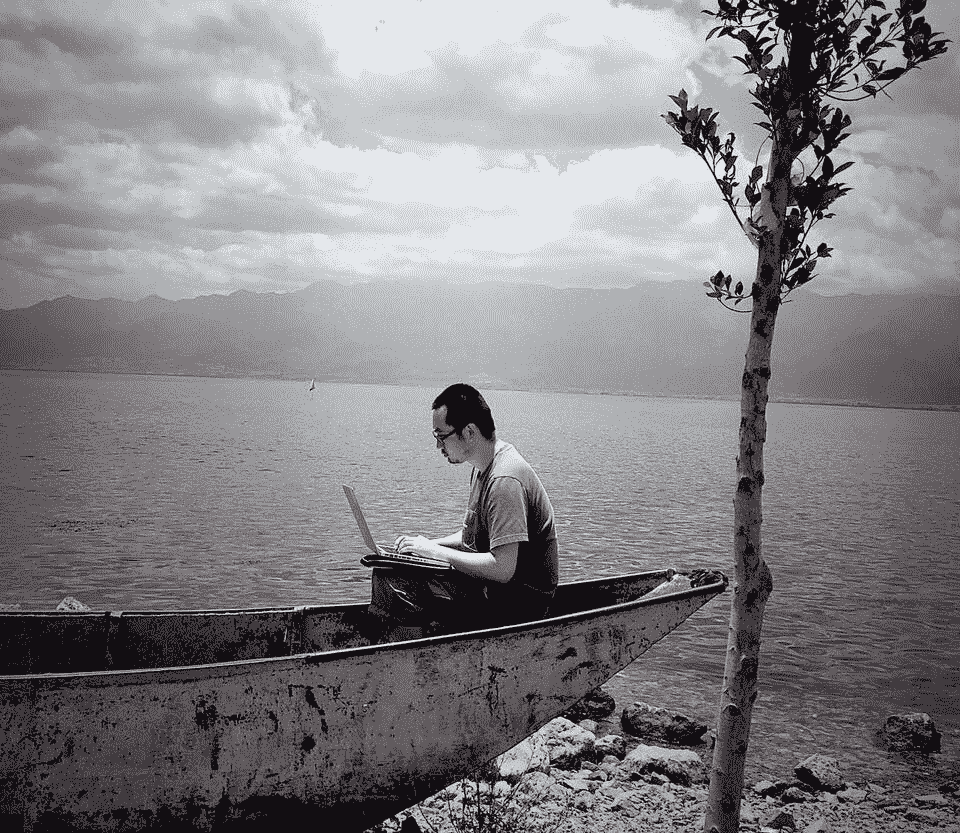

<!--yml
category: 访谈
date: 2022-06-28 10:41:41
-->

# 你好鸭 #02 《Contra | 远程的仅仅是肉体》 | 电鸭

> 来源：[https://eleduck.com/posts/eVvfom](https://eleduck.com/posts/eVvfom)

<figure class="image"></figure>

此访谈写于2015年，仅供参考。我们后续将邀请这些老朋友做最新的分享。

### **介绍下你本人/团队现在的状态吧？**

我是 Contra，在“Miss Mama”做CTO。“Miss Mama”（[missmama.cn](http://missmama.cn/)）是一个母婴亲子服务共享平台，为妈妈和宝宝提供一站式孕产育综合服务。

团队按 O2O 业务特色，由集中在北京的线下业务团队，与分散各地的线上技术团队组成。

目前主要是技术团队在实行远程工作。

### **团队成员都分布在那些地方？怎么认识的？**

线上技术团队分散在北京、廊坊、苏州、杭州、上海等地，目前规模不大，以老朋友、老同事为主。

### **你们有线下的聚会或交流吗？**

没有固定的线下聚会，团队大部分是兼职形式。所以大家各自出差时，会有小范围饭局。

### **相比集中办公，你认为远程工作最大的好处是？**

对 O2O 项目，实体业务与研发业务往往来自两个世界。分开办公可以让开发人员不受办公室的干扰，保持专注。

同时降低办公室成本。

### **最大的坏处呢？**

也不能算是“坏处”，称作“限制条件”可能更合适。

比如对团队成员的资历、自控力、项目经验等，是有一定的门槛要求。TA 必须能独当一面，能自我约束，对常用协作工具有使用经验等。

沟通效率方面，我觉得还好。以前在坐办公室工作时，也是要和国外团队配合的，所以大家都习惯 Email ，即使在同一间屋内。当然紧急的事情，还是会直接打电话（目前更多是微信语音通话）。

### **团队经常用到的工具都有哪些？**

我们几乎试过了所有常见的协作工具，国外 Trello/Slack、国内 Tower/Teambition/Worktile 等，现在沉淀下来的是：Email + Phabricator。

Email 在手机上也是秒收，跟 IM 差不多。而且兼职的同事有时候不方便用其他系统。再就是线下传统业务团队主要工具也还是微信+Email。

技术团队跑敏捷开发，以前在办公室时，我们是在玻璃墙上贴便签条，现在远程后用了一阵 Trello 和 Teambition。为了减少工具种类最终还是把任务 kanban 功能、文档、Github log、Bug 追踪等全集中在  Phabricator 里了。

定期会用 Zoom 来开视频会议，有些时候还是要看脸的。

我个人在使用 Evernote 和 Dropbox ，实时保存最重要内容。

### **你认为什么样的公司和人更适合远程工作呢？**

应该跟以前自由职业者的答案差不多吧，摄影师、设计师、作家等工作内容相对独立的职业，或者像软件工程师这种能用互联网+工具解决协作问题的职业。

ok，接下来问点轻松的，

### **常驻／旅居在哪个城市？**

平时常住苏州。在北上江浙云南西北都小住工作过。

我媳妇儿也是远程工作者，她是设计师，我俩一起可以搞定大多项目的设计、原型、初版本开发，所以我们正在尝试 Digital Nomad（数字游牧）的工作生活方式。夫妻店这个前提条件真的很重要，否则怎么可能一个人到处跑 XD

### **平时都在哪办公？当地有无特别适合远程办公的地方推荐？**

如果在苏州，办公大部分还是在家里，因为有大显示器人体工学椅等设备。

有时也去咖啡馆，“山月咖啡”不错，在金鸡湖月光码头附近。

苏州开设了很多创客空间/孵化器，这些地方的桌椅比较适合长时间办公。有家新加坡国立大学苏州研究院的NUSRI 创业空间不错，并且苏州 GDG（google开发者社区）也驻扎在这里，方便交流。

### **远程工作的一天是怎么分配的？**

我的固定工作时间跟坐班基本上一致，朝九晚六，为了跟线下坐班团队配合交流。

晚上一般是跑步、写代码、充电、看电视等交替。

### **给我们推荐点什么吧，网站／应用／书／音乐，anything**

Trip-Hiphop 和 Jazz-Hiphop 风格的电子乐，强调慢节奏和旋律，极适合做开发。

另外既然你说了 anything，那再推一下我和媳妇儿的公众号吧…微信公众号 diginomad，数字游牧生活记录。