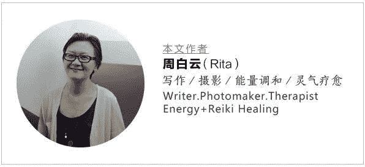

<!--yml
category: 访谈
date: 2022-06-28 10:39:34
-->

# 你好鸭 #03 | 自由工作十多年，自我时间管理与时间意识。 | 电鸭

> 来源：[https://eleduck.com/posts/eVvfAa](https://eleduck.com/posts/eVvfAa)

**嗨**

**你好鸭**

**我是Rita**

## ▌介绍下你本人的经历及当前所做的事情吧？

我是Rita，文艺术领域的自由工作者，有一个自己的工作室，主要进行写作、艺术、创造力方面的整合性在线课程设计和教学。

## ▌工作时间和生活时间是如何分配或平衡的？

​
在开始自由工作的头几年，我不分昼夜地工作，那时的自己眼睛里只有工作成效，没有对健康和生活品质的全局考虑。就这样进行了几年之后觉得非常累，身体变得很差，最后对工作产生了强烈的厌倦症，不得不暂停工作一年。

暂停的这段时间，我开始反思自己的生活状态，意识到作为一枚很可能是终身的自由工作者，其实需要对时间管理进行深刻的思考。

现在的我非常重视休息，我觉得那与工作同等重要，一周我工作五天，周末一定规定自己休息。不懂休息的人也不会懂工作，不会有可持续的发展力。我觉得作为自由工作者，特别重要的就是找到规律的工作与休息节奏，不能想工作时就猛工几天几夜，不想工作时就猛睡几天几夜，这样身体会变差，也很难取得工作成果、找到在工作中的存在感。

想想大自然，一年四季，多么有规律，如果突然一连好几个夏季，或者春季突然迟迟不来，大家都会很混乱。人其实是一种非常依赖节奏感的动物，稳定的节奏可以稳定住我们的身心，所以如何分配工作时间和生活时间，我的回答就是：找到自己的节奏，规律工作，规律生活。

## ▌相对于上班来说，自由工作者的工作时间和生活时间常常界限模糊，甚至会面临更频繁的工作/生活中的随时响应，一般应如何有效的处理？

这个问题有多个不同的角度，我能提供的角度是，作为自由工作者的管理者如何管理由自由工作者组成的团队。未来的自由工作者会越来越多，其中有些自由工作者不仅要管理自己，还面临着管理一支自由工作者的团队，这意味着作为管理者的自由工作者要为团队作出合理有效的管理安排。

工作时间和生活时间，在管理上就要明确作出安排。就像我的工作室，我规定我们周一到周五上班，周末休息两天。看起来和一般的上班一样，但其中的区别是，我们不是以坐班时间来计算工作效率，而是以工作成果来作为衡量工作是否有效的标准。我们觉得，如果没有工作成果，上再多时间的班又有什么意义呢？

我们有时候会早晨六点就上班，如果那天的工作成果要求我们这么做的话。我们也会晚上十一点还在加班工作，如果那天的工作成果这么要求的话。当然作为管理者，我会尽量避免这种突然地加班，因为我希望我们能生活得更规律、更健康，这也是之所以成为自由工作者的一个重要意义。所以当工作节奏因为一些重大变动而发生紊乱时，我总会与伙伴及时沟通，我们需要应对紊乱，同时明白这种状况是暂时的，我们会重新回归规律。

很多人会以为自由工作者是“独行侠”、不喜欢被人管，其实不是这样的，我们只是讨厌一般公司的繁文缛节，因为那让工作效率低下。但我们喜欢有人格魅力的“头”，那种真正关心你、在能力上和人品上都让你信赖的“头”。虽然我们自由工作着，但我们并不觉得孤单，其实在一支精益微型的团队里，我们的交流要更紧密、更深入。

这样的团队，会提供一种精神支持体系，成员是相互信任的关系。工作总会出现紧急情况，那没什么可说的，把它搞定。那种总要花很多时间来“解释”和“劝说”的团队是没法一起工作的，就我自己的经验来说，与我所挑选的自由工作者一起工作最美妙的地方就是：不需要“解释”和“劝说”，只要我们在一起工作，我们就很明确该做什么，既不会在紧急情况时叫苦连天、推卸责任，也不会没有必要地加班。

因为我们的管理制度非常明确：出成果。在这样的价值观下，事情其实很难混乱。当然这样的管理制度也就要求它的成员要很有责任心、使命感，以及一般程度上的自律。自律是可以被培养的，但责任心和使命感却是一种很内在的东西，也是我个人对自由工作者除了专业能力之外最看重的两样东西。

## ▌自由工作状态下，如何提高实际工作中的「有效时长」？

只要记住“出成果”。工作本身并没有什么了不起，成果才是。作为个体的自由工作者与作为组织的公司相比，最大的优势就是它没有那么多流程上的东西，它可以随时停止错误的流程，开启正确的。而这一切指向的就是成果。如果你坐了两个小时，啥成果也没有，那不如你站起来出去走走，也许在晃荡的过程中就有了灵光一现。

所谓“有效时长”，我的理解，就是“那些能够产生成果的时间”。作为自由工作者，要时时觉察自己的状态，让自己处于一种被激活的状态。如果你觉得头脑昏聩，那就睡一会儿或者出去逛逛，这不是在浪费时间，恰恰是在有意识地增加你的“有效时长”。但这一切都建立在有效的自我觉察上，自由工作，就是你总是“记得你自己”，不再浑浑噩噩，明白自己的时间都花向了哪里。

## ▌当实际的工作进度与我们预先制定的工作计划不吻合的时候，应该做怎样的调整？

我个人一直对“计划”感到难以适应。我觉得“计划”带来的更多是烦恼，而不是工作成效。如果没有“工作计划”，就没有“不吻合”，也就没有自我谴责等的压力。

但是，人们为什么要做计划呢？我想其中的一个好处是：做计划可以让我们不沉溺于细节而看到全局。我也喜欢看到全局，并且认为这非常重要，所以我没有计划，但我会在一天开始之前列一列“今天要做的事”，并不是为了全部完成它们，而是为了保持一个全局视野。

关于“调整”，我的想法也许和大多数人相反。我觉得所谓“调整”，不是让自己的实际工作量去吻合计划的工作量，因为那通常会做不到，很痛苦。所谓“调整”，是调整自己能投入地工作。先投入地做好手中的这件事，再考虑其他事。毕竟事情是一件一件做的，你想做100件事，也只能从把第一件做好开始。

我觉得“计划”只是头脑给我们的一个幻影，应该以自己实际完成了什么为标准，因为那可能是你的生命能量实际所匹配的工作量。你可以慢慢增加这个匹配量，这样比较实际。

当然有时候我们也用订计划来督促自己上进，我也这么干过，有时候这么做也挺好玩的，像回到小时候，又看到那个努力向上的自己。但长大后的我们应该比小时候更有智慧，和“计划”玩可以，不要被“计划”控制。

如果一定要订计划，我个人的建议是订最简单易行的计划，例如：每天早上专心工作两小时。你只规定你付出的时间，然后让事物自己来决定它生长的速度，这样不是更美妙吗？

## ▌在个人时间管理方面都用到哪些工具？分别用于什么场景？

我的工具就是我的心和一本工作笔记本。我不用任何时间管理工具。因为使用它们本身就花费时间，就像有句话说的，“你把时间都浪费在管理时间上了”，我不想犯这种错误。如果你的心非常清明，你只需要一本简单的本子，简单地记下几笔，就知道接下来两个小时你要做些什么。

说到外在的工具，如果一定要找，那我觉得最有用的工具就是我的手表，不是智能手表，只是一只简单的swatch石英表，简单但清晰地显示了时间、日期、星期几。我的书桌上还有一张很小的日历表，两者配合在一起使用，使我建立了极强的“时间意识”。我清楚地感知到每一天、每一月都过得飞快，所以才会从内心里升起紧迫感而去珍惜时间、管理时间。

如果你没有建立时间意识、感觉不到时间的飞逝，那“管理时间”只能是你强加的欲求，而不是发自你内心真实的需要。随意要管理时间，首先就是要建立起“时间意识”，这种意识是自由工作者非常重要的一种意识维度。想一想有哪些简单的工具可以帮助你建立“时间意识”，那要比去学习某个具体的时间管理工具对人的影响更深远。

## ▌最后，广告时间（征婚/征友/合作等，说任何你想说的：）

我常年在公号上分享自己的工作心得、生活感悟，拥有大约十年的自由工作经验。感兴趣可以关注交流。

**叙事精灵**

叙事精灵 整全治疗师周白云（Rita）的原创个人公号，内容涵盖「叙事疗愈/能量调和/表达性艺术疗愈」，专注身心觉察和内在成长，提供身心整合疗愈课程和个案服务。