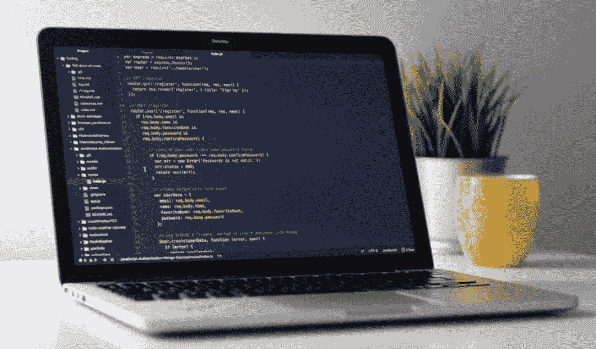
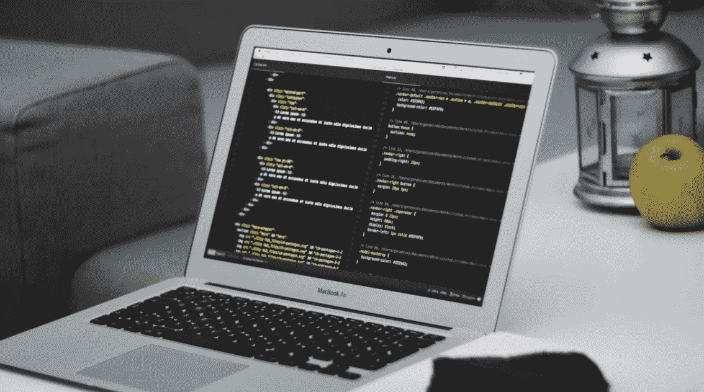

<!--yml
category: 访谈
date: 2022-06-28 10:41:54
-->

# 你好鸭 #05《BadJohnny | 一个自由工作者的时间管理》 | 电鸭

> 来源：[https://eleduck.com/posts/ez1fZ0](https://eleduck.com/posts/ez1fZ0)

**嗨**

**你好鸭**

**我是BadJohnny**

## ▌介绍下你本人的经历及当前所做的事情吧？

我从 2007 年到 2011 年期间曾在上海两家创业公司工作，后来为了可以更自由地支配自己的时间来接触更多感兴趣的事情，决定辞职开始自由职业生涯。目前是 Envato Market 的 WordPress 主题作者，主要在国外的设计市场混迹。

## ▌工作时间和生活时间是如何分配或平衡的？

从有了小孩之后，有一段时间比较手忙脚乱。尽管我不是全职奶爸，但因为我们完全是自己带孩子，所以我不得不分出一部分时间去分担家务，比如成为厨子，掌管一日三餐。这段时间，我通常是下午就近找个安静的咖啡厅工作到5点，然后晚饭过后，继续工作到不知道几点，因为我家的乖孩子能从晚上八九点开始，一直睡到早上八九点，这段时间比较安静。

但后来发现，这样熬夜对身体影响很大，而且白天几乎没有时间陪小孩，如果白天家里有什么事情，可能下午工作的计划就泡汤了。所以最近计划还是早睡早起，将凌晨4点－中午11点的这7个小时作为工作时间，白天其余时间全部为生活时间，这样几乎互不耽误，而且凌晨到早上8点这四个小时，其实干扰很少，精力能集中起来。（当然，我只是这么说说，不知道能不能做到。

总之，我觉得要跟着每个人具体的生活规律来灵活安排时间，有时很难有固定模式的时间安排。

## ▌相对于上班来说，自由工作者的工作时间和生活时间常常界限模糊，甚至会面临更频繁的工作/生活中的随时响应，一般应如何有效的处理？

关于随时响应生活中的事情，这个是自由职业者最普遍要遇到的问题。因为在人们的观念里，自由职业者的时间看起来很多，但其实我们既要自给自足、养家糊口，又要保持自由，那时间就是我们最大的成本。比起上班族来说，自由职业者只是多了分配时间的自由度而已。所以我觉得要避免过于频繁的随时响应，首先应该尽量让自己的家人朋友理解这些。

另一方面，我倾向于通过提前安排好工作进度，留出余地，尽量减小生活干扰带来的影响。幸运的是，我不是接客户项目，所以没有客户这边给的时间压力，控制自己任务进度的余地很大，一般会把每项任务的最后时间往后延长2天的余地，有的任务可能比预计完成的要快，所以多出来的时间就会补到其他任务中。我最多只做一周的安排，因为时间跨度越小，安排的就越紧凑，就可以安排的越灵活。

## ▌自由工作状态下，如何提高实际工作中的「有效时长」？

像前面说的，根据生活规律，找到干扰相对少的时间段去工作。白天必然干扰很多，晚上有时出去吃顿饭，见个朋友一晚上就过去了，所以现在还是深深的感觉凌晨时间最好，但每个人的情况不同。

另一个感受就是工作环境的影响，在家工作久了就逐渐不喜欢这地方了，特别是有小孩之后。如果白天时间允许的话，找个适合工作的咖啡厅比较好。

工作安排上，可以在纸上画个十字，用四象限法根据优先级将任务分别自左向右罗列出来。先解决关键问题，避免优先级混乱，思绪越多，越不知道该先做什么，到最后什么都没做好。

最后，我每天花在刷微博、朋友圈上的时间很少，只是睡前看看，如果在工作时间管不住自己去看的话，很明显有效时长就缩短了。

## ▌当实际的工作进度与我们预先制定的工作计划不吻合的时候，应该做怎样的调整？

像前面说的，我没有客户的压力，所以调整空间很大，我可以适度往后推。如果计划已经被拖延了，我还是宁可减少休息时间来主攻关键任务，也不愿意一拖再拖。因为拖得越多，状态就越差，压力也越大。而且为了保证完成质量，有时我会把一些非必需的功能点，放到下个版本，宁可做半个可用的作品，也不能因为赶进度做个半吊子作品。

以前我也做过客户项目，大多时候是从一开始就把时间余地留的比较足。这种事情最好是提前避免，因为之后不管是和客户迂回，还是从生活中借时间出来，都是亡羊补牢的做法，但也只能这样。

## ▌在个人时间管理方面都用到哪些工具？分别用于什么场景？

我没花太多时间去琢磨过哪个工具更好，[使用过的Doit.im](http://xn--Doit-9s6fu80rv8bfu5f.im)，Wonderlist等等都不错。

最终我还是习惯了用Wonderlist，接触的更早。主要做笼统的时间安排，把这段时间工作和生活上要做的事情都列出来，设置好开始结束的时间段。特别是用来时间紧的时候管理生活计划，比如某天的几点到几点要去见朋友或者给小孩打疫苗之类的，这样大致能预计出生活上需要花费的时间，对留给工作的时间就比较心里有数了，一切安排尽量提前准备。

工作上，主要用Basecamp和Tower做项目管理和具体任务的时间安排。无奈的是，我的用户都是国外的，可实惠的Tower还没有英文版界面，所以我不得不有时花钱在Basecamp上开个项目，跟个别参与性很强的用户或者临时的合作者交流项目的时间计划和具体的功能点。

其实有时我觉得最直接的办法就是写在纸上，我有好几个Moleskine本子都用来做时间计划（像前面提到的四象限法）、知识管理和项目构思了。我个人体会好处是，在这个很少提笔的时代，有时在台灯下，埋头亲笔写下一些东西，倒是挺容易从心理上给自己营造了一种认真的态度，容易更有状态，以后也可以回顾当初一步一步怎么走过来的，挺有质感，别忘了找个好点的本子，一块钱一本的notebook很少能让我有提笔的兴趣。