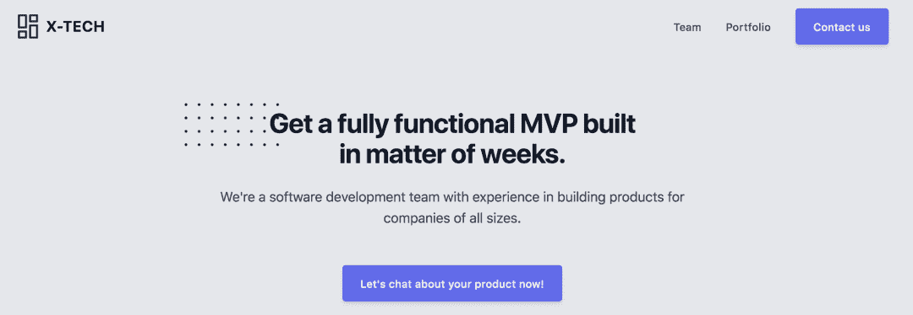
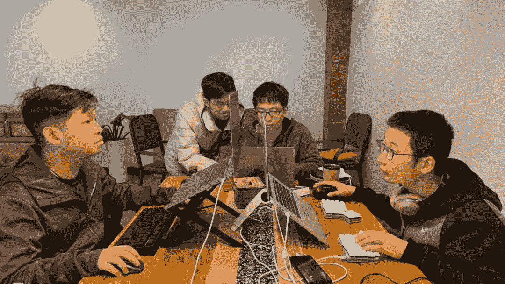

<!--yml
category: 访谈
date: 2022-06-28 10:42:00
-->

# 你好鸭 #08 | 从美国到中国，从远程到旅居，From 0 to Top Rated on Upwork！ | 电鸭

> 来源：[https://eleduck.com/posts/3Efrab](https://eleduck.com/posts/3Efrab)

**嗨，你好鸭，我是Simon**

## ▌介绍下你本人的经历及当前所做的事情吧？

我是Simon，2013年从本科毕业就在美国亚马逊担任全栈工程师，做的是站内衣服箱包品类的购物体验，做了一些有意思的项目。2016年决定回国，回北京创业。

## ▌你是如何走上远程之路的？

我的初次创业不算很顺利，2017年就结束了。后面在家休息充电的时候和国外的朋友聊天的时候发现，是不是可以用自己的技术能力，在国内给国外的公司做一些软件开发，所以就尝试注册了Upwork和Toptal。当时刚好在Upwork接到一个小活尝试，后面偶然接到一个比较大的单子，发现一个人做不过来，就开始在微信群里面和一些认识的朋友合作完成，后面越做越稳定，团队也获得了Upwork的Top Rated Plus。

▲ 我们的官网。

## ▌远程之后，工作和生活都发生了哪些变化？

一开始最主要的变化是，所有的时间都有自己控制，什么时候工作，什么时候休息，所以生活一开始其实没有什么规律。因为我在国内外都有客户，所以很多时候我的工作时间就变成了10-12小时一天，还是比较苦的。不过我女朋友在2019年也辞掉了工作，我们一起开始了旅居的生活，在巴厘岛和国外的同事一起生活和工作了两个月，体验了真正的数字游民的生活。2020年由于疫情原因，我们只能在国内，不过我们也旅居了大理、上海等城市，能够边工作边旅行，是非常不错的体验。

▲ 和女朋友一起在梅里雪山下工作

## ▌给我们说说你的团队吧，构成/模式/经验/规划？

我在真正有一个团队的时候其实是2017年底，和两个在广州读书的土耳其哥们一起做一个网站项目。第一个全职合作的师傅在芜湖，现在是我们团队的运维DevOps担当。现在我女朋友也加入了团队做设计，我们一共有9位同事（设计，前后端开发，运维）。

我们中间有一段时间是和不少国内（大厂）的工程师兼职合作的，最高记录是15个人，同时做7-8个大小项目吧。

▲ 和国外的同事一起通宵完成项目。

## ▌团队都用到哪些好用的软件/工具呢？

我们迭代了好多工具，但是最终留下来的是这几个：

Slack - 我们大小的沟通和记录都在Slack里面，不经过微信。客户一般都有Slack，所以会用shared channel把客户的slack和我们的slack打通。另外我们有一个自研的翻译插件，可以自动把中文翻译成英文，英文翻译成中文。所以大家就算英文不熟也是可以直接用翻译插件做到无障碍沟通。

计时器 - 我们用时薪结算，所以我们会在电脑上安装一个带截屏的计时器，这个方便我们结算和给客户复查我们的工作记录和时长，让双方都安心。我们一直用TopTracker，但是最近由于TopTracker有bug，导致结算的时候非常麻烦，所以刚改用了Clockify。

Zoom / 腾讯会议 / GSuite - 我们因为是全远程的公司，所以平时不见面，一般如果是项目需要快速同步沟通，或者是结对编程的时候，都会开一个视频会议，共享屏幕。腾讯会议有一个海外版voovmeeting也推荐使用，比zoom流畅。

GitLab - 我们团队其实做项目不用github，[而是主要用GitLab.com](http://xn--GitLab-2y7i984nxf2ar0w78w.com)，因为gitLab一开始就是对团队是免费的，然后也有非常全的功能，比如说CI等。同步到客户的github也有办法设置自动推送。综合下来我觉得做内部项目用gitlab是比用github要舒服的。

Notion / Coda - 我们在任务管理上试过不少工具，从Trello开始用，用到Trello开始有免费限制之后，我们在2020年开始使用Notion来做公司的知识库和项目管理。最终效果还是不错的。最近在开始用Coda来记录每个人的工资，做成一个工资单，自动化功能会强一些。所以会考虑深挖一下Coda的一些项目管理模板。另外国外的同事也在测试jira等产品。总之是老大难题了。因为已经付了slack，所以项目管理软件如果是能便宜一点就更好了。

▲ 和国内的同事一起在大理面对面工作。

## ▌你个人or团队有无尝试做自己的产品？

我们平时做项目有时候会想办法做一些开源，放到github上（都和客户沟通过，确认对开源ok，不暴露业务细节的前提下）。另外我们每年团建的时候会想hack一些东西出来玩玩。

最近比较大的就属于我们的翻译插件了。因为的确帮助了我们工作交流的促进。我们已经做了一个可以使用的SaaS版本，给我们其中一个客户使用了。希望可以上架Slack上的marketplace，让更多团队可以用到。

## ▌对于哪些想要加入远程的团队同学，你有哪些经验或者建议可以给到他们的？

我先谈远程工作再谈freelance，因为其实两者有一些区别。

远程工作主要需要自律，因为其实远程工作环境里面，周围是没有人约束自己，需要什么时候把工作完成。所以足够自律的人，能够完全掌控自己的时间的时候，能够更享受远程工作，有一个更健康的生活方式。另外我觉得沟通方式的改变也很重要，因为面对面沟通少了，所以很多时候需要更主动地把手头上的事情多在IM上和同事进行及时的同步非常重要，很多信息点比如时间节点等，如果能够及时在文字频道上沟通好，会省掉很多来来回回甚至是不必要的视频或语音会议。

▲ 在泰国做技术交流。

freelance和远程工作不一样的是，freelance需要做自我营销，把自己的技能的价值展现给潜在的客户，让他们买账。我一开始也比较担心，毕竟我是单枪匹马进入平台上挂出自己的档案，也很有可能需要在平台和其他国家的人抢单。后面发现其实和客户沟通的时候，需要多从客户的出发点去考虑问题，给他们提出更多建议，让他们认可你。还有另外一个很重要的区别，就是freelance的收入，不是固定的。有的时候项目比较好比较多，💰就多一些。像现在这两个月，我们在平台上的单子也不多，基本上可以说是空窗期。

做freelancer收入虽然不是固定的，但是也可以很稳定。我去年的个人收入（不算公司盈利），基本上可以和当时在美国做工程师持平，同时我电脑上的RescueTime显示我平均每周也只在电脑面前工作38小时，可以说是比较舒服了。

然后，如果有同学也对做Upwork有兴趣，可以看下我在Medium上的一篇经验分享[《From 0 to Top Rated on Upwork》](https://eleduck.com/posts/gYfdzb)。

▲ 国内外的朋友们一起在上海相聚。

## ▌最后，广告时间（征婚/交友/宣传/招人/带货等随意：）

如果有有意思的项目，想我们团队帮忙出MVP的话，随时欢迎！

邮箱：hi@x-tech.io （注明项目需求）

我们的网站：[https://x-tech.io](https://x-tech.io/)

我们的Upwork：[https://www.upwork.com/agencies/~01eb51da1eac1b7032](https://www.upwork.com/agencies/~01eb51da1eac1b7032)

我们的github：[https://github.com/xanthous-tech](https://github.com/xanthous-tech)

我们最近希望多和chatbot领域的专家（不限于对话文案设计、NLP专家或工程师）合作，如果感兴趣的话也给我们发邮件（注明chatbot）。

最后就是我们最近做的Slack翻译插件 - [https://x-late.x-tech.io](https://x-late.x-tech.io/)