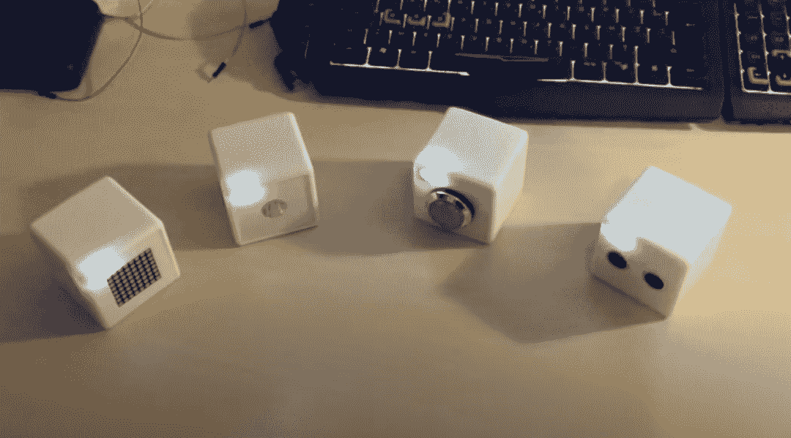
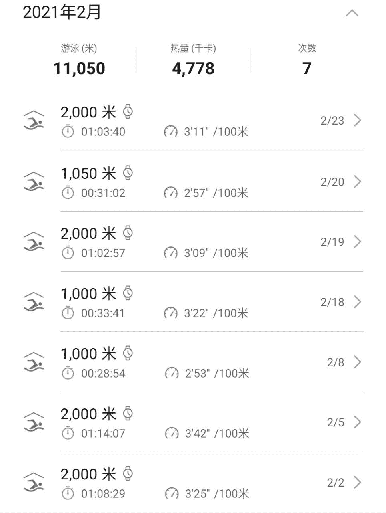
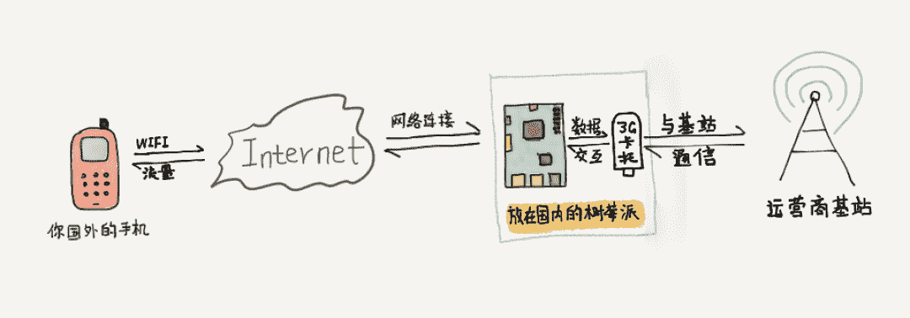

<!--yml
category: 访谈
date: 2022-06-28 10:41:49
-->

# 你好鸭 #09 | 远程之所以觉得孤独，那其实是你还不够忙。 | 电鸭

> 来源：[https://eleduck.com/posts/dDfzDA](https://eleduck.com/posts/dDfzDA)

**嗨，你好鸭，我是ET。**

## ▌介绍下你本人的经历及当前所做的事情吧？

大家好，我是ET。大学四年级开始的时候，去到帝都，在计算所实习。毕业之后，在计算所又待了两年多。后来在豆果工作了几个月，就去跟朋友搞硬件创业了。

折腾了一年多，没有拿到投资，宣告失败，就撤回老家远程工作了。现在定居在老家淄博，目前是波场的远程员工，负责 [steemit.com](http://steemit.com) 的研发工作。

业余时间喜欢写一些小工具，目前能拿的出手的工具，也就是Chrome扩展——温故知新了。

## ▌什么样的契机，让你有了远程的想法？是如何获得第一份远程机会的？

说实话，我是从一接触电脑的时候，就想着远程控制点什么东西。

比如中学的时候，倒腾入侵，想着怎么远程控制别人的电脑。

大学的时候，在社团里的电脑上部署穿透软件，方便回宿舍后继续未完成的工作（其实是拿社团电脑当服务器用了）。

第一份工作，在计算所从事的项目也是属于半远程的性质（大部分时间在远程开发，一年有不定期的两个月去现场驻场开发）。

真正的第一份远程工作，是当时创业的时候，到后期一直拿不到融资，快要断粮的时候，忘记从哪个平台（是一早一晚还是V2EX没印象了）找到的远程工作机会，即参与了程序员客栈早期的一些开发工作。

▲ 最近过年在爸妈家住，就放一张很久之前的工作台照片吧（那个小屏幕的位置，现在是个竖置的显示屏了）。

## ▌远程之后，工作和生活都发生了哪些变化？

真正对生活产生影响，还是从帝都回到老家后的远程工作。2015年那会，国内三四线小城市，哪有什么人知道远程工作的概念。好在家里人还是比较理解，不过找对象还是有难度，你得让姑娘家相信你不是个骗子。

除此之外，最大的感受就是工作和生活的界限更模糊了。我之前在帝都工作的时候，由于单身加上领导开绿灯，那个时候其实就是工作和生活界线比较模糊。在所里的办公室，专门有个地铺，工作累了，一回头就是地铺，一星期也就回一两次宿舍（晚上睡觉，都有野猫不定期来访我们办公室的玻璃屋顶）。

回老家真正开始远程工作后，界限就更模糊了。尤其是我的爱好也是写程序，以至于自己的爱好和工作的界限也是模糊的。

最开始两年，还想着去尽量隔离。

后来觉得，只要工作能保质保量完成，剩下的随心所欲就好。远程工作本来就是图个自由，图个能随时做自己想做的事情，图个能随时陪陪家人，硬要再给自己加条条框框就太累了。

不过这个也是因人而异。每个人的性格不同，生活追求不同，对于生活和工作的安排也是不同的。对于远程工作的新人来说，前两年就是需要自己来调整自己节奏的时间。

## ▌你每天的工作的时间和效率是怎么规划和保证的？

就像上面说的，我数十年的模糊的工作生活习惯，现在也没有什么非常固定的作息了。工作累了就忙会儿自己的兴趣项目。家人需要我去忙点什么，就挤点时间去处理一下。再有时间就去游个泳，跑跑步。

说到锻炼身体，对于远程工作的人来说，体重控制还是比较重要的，我就是忽略了这个问题，从150斤到了现在的200斤。每周保持一定量的锻炼，有助于提高自己的精神和工作效率。

## ▌平时都用到哪些软件/工具来提升效率或者帮助工作呢？

VNC，VS Code（Remote-SSH插件），这两个工具是我目前使用频次最高的了。

之前我在我的订阅号里说到过，我从2019年开始，逐步从苹果系设备迁移到Linux系设备。并且家里配置了台式机。所有的工作资料都在台式机上，平时不出门，台式机即为工作机。如果出门，则是通过 Remote-SSH 插件，使用笔记本连回家里的台式机。

这样我不需要在笔记本上搭建环境。最关键的是，对于笔记本的性能也没有多大的要求，甚至使用 Chromebook 也是完全可以胜任开发工作。偶尔遇到一些需要桌面的操作，使用VNC连回家里的台式机进行操作，也是美滋滋。之前用过Teamviewer，也买过向日葵的个人版，最后体验下来都不如VNC香。

Notion，GoodNotes，是我整理自己零碎知识的工具。对于偶尔需要出的一些流程图也会使用 53Paper 来画图。比如下面这幅文章插图就是用53Paper画的。

Todoist，是我来安排TODO的工具。之前用的是番茄土豆，后来朋友推荐了 Todoist，感觉使用体验还是不错，不过这个工具没有番茄，只有土豆，这一点有点让人失望。

## ▌很多人说远程易孤独，你是如何排解的？

工作、自己的兴趣项目、陪家人、游泳这些事情已经榨干了我的时间，每天连睡觉时间都不够4小时，哪有时间去孤独。

如果硬要说孤独，可能就是之前在公司的时候，可以午餐晚餐时间听同事的八卦信息渠道没有了。

如果觉得孤独，那一定是你还不够忙，只有闲下来的人才会想东想西。

## ▌对于那些也想开始远程工作的同学，你有什么建议么？

远程是一种不同于以往的生活体验，找到一份靠谱、合适的远程工作也需要缘分。你所需要做的就是提升自己的业务能力。因为对于远程工作岗位来说，大部分还是要求尽可能做到全栈。

然后就是保持耐心，并且坚信没有越不过去的坎。

## ▌最后，广告时间（征婚/交友/宣传/招人/带货等随意：）

前年开始重新写订阅号了，一直不知道给订阅号定什么主题。去年摸索了一年，现在定下来了订阅号的主题，就是写写自己的生活，写写自己买的东西的翻车经历，这些比较有意思，也算是自己比较喜欢写的东西。欢迎订阅。

## ▌如何联系我？

如果你想和我认识并聊点什么，欢迎来社区找我：）
[https://eleduck.com/users/BXwh1l](https://eleduck.com/users/BXwh1l)