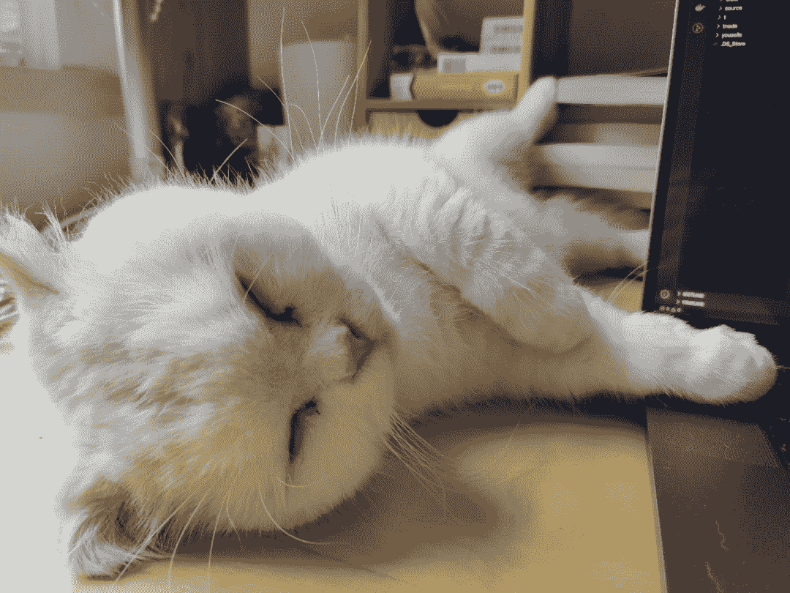

<!--yml
category: 访谈
date: 2022-06-28 10:39:57
-->

# 你好鸭 #10 | 疫情使我真正行动，4个月拿到远程工作。 | 电鸭

> 来源：[https://eleduck.com/posts/rdfVDl](https://eleduck.com/posts/rdfVDl)

**嗨，你好鸭，我是林晨。**

## ▌介绍下你本人的经历及当前所做的事情吧？**

大家好，我是林晨，做了 8 年程序员，之前一直在做前端开发，目前在一家做区块链和去中心化应用开发的公司 ArcBlock 做 Nodejs 全栈开发。

## ▌什么样的契机，让你有了远程的想法？是如何获得第一份远程机会的？

我大概是在2018年开始产生了远程工作的念头。主要原因有两个：

1.  坐班工作时，我的家庭（天津）和工作地（北京）在两个城市，如果在退休之前一直这样，会失去很多家庭生活。

2.  我认为远程工作是一个趋势，在信息时代我们不需要坐班，“不坐班”是“打工人”提升工作体验和幸福感的基础。

疫情使我真正做出了行动，因为去年疫情开始后，无法每周往返北京天津了😂。当时算是裸辞，之后一段时间一边做兼职一边找远程工作。在这个过程中，我明确了我的目标：我需要的不是自由职业，不是兼职，是一份可以完全远程或者工作地点弹性极大的全职工作。经过大概4个月的时间的尝试、寻找和探索后，我加入了现在的公司。

## ▌远程之后，工作和生活都发生了哪些变化？

工作上：我虽然还是一个“全职的打工人”，但是工作体验有很多变化。

1.  工作时间，工作地点，工作环境的自主权完全掌握在自己手里，非常自由！

2.  因为非常自由，所以主动工作也成为了绝对义务。

3.  “全职打工”和“主动工作”之间客观上存在天然的矛盾，因为主动工作成为了绝对义务，所以我需要花更多的精力来克服自己在工作中划水🤣，努力做到自己的产出和团队的预期一致。

生活上：

1.  和家人相处的时间更多了，和朋友相处的时间也更多了。

2.  工作环境发生了明显的改善，不用整日在嘈杂的办公楼中，不用整日在简陋的工位上，所以心情也平静和愉悦了许多。

3.  去年和家人去旅游，在海边工作了几天，晚上下班后看看大海，很舒服。

## ▌你每天的工作的时间和效率是这么规划和保证的？

主要通过两种方法来保证工作时间和效率。

1.  做好时间管理和精力管理，主动设计自己的工作和休息时间。尽可能提高工作时间的工作效率，Get Things Done。

2.  任务驱动和 deadline 驱动 😁

其实，这两种方法在坐班工作时也是需要的，只不过在远程工作时变得更加重要。

## ▌平时都用到哪些软件/工具来提升效率或者帮助工作呢？

工作设备：MacBook Pro

推荐一个 masOS 的分屏软件（收费）：Magent

视频会议：Zoom

文字沟通：Slack

通知和提醒：Slack 的机器人

写代码：VsCode

项目协作：Github

## ▌很多人说远程易孤独，你是如果排解的？

我的家庭生活目前比较和谐，可以缓解一部分孤独~

工作上我们是一个创业团队，并且我比较认同公司在做的事情，所以有一些期待也寄托在工作团队中。

另外，就是多参加线上的社区/社群，比如电鸭~

## ▌对于那些也想开始远程工作的同学，你有什么建议么？

1.  要趁早行动起来，Just do it。

2.  远程工作的风险确实较大（市场上没有那么多雇主🤣），要做好财务上的风险控制。

3.  远程工作不是天翻地覆的变化，对于我来说，远程工作仍然是一份全职的劳动合同。

## ▌最后，广告时间（征婚/交友/宣传/招人/带货等随意：）

刚好公司在和电鸭合作招聘，来一个招聘广告吧~ [https://eleduck.com/posts/oQfQav](https://eleduck.com/posts/oQfQav)

## ▌如何联系我？

如果你想和我认识并聊点什么，欢迎来社区找我：）

[https://eleduck.com/users/aKXh7d](https://eleduck.com/users/aKXh7d)