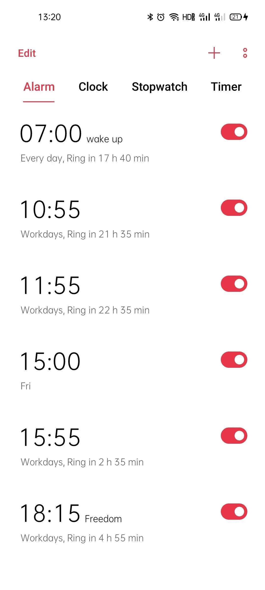
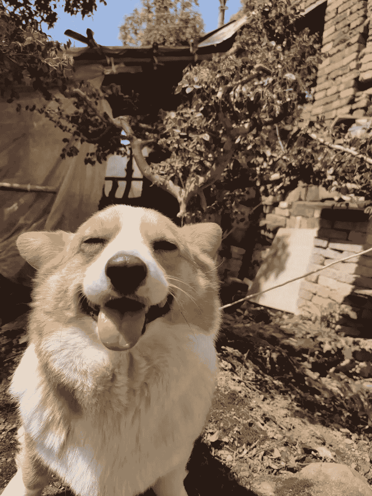
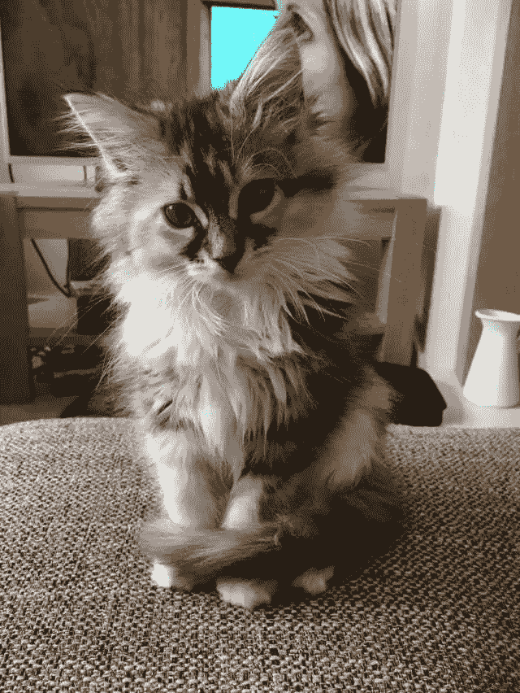

<!--yml
category: 访谈
date: 2022-06-28 10:39:43
-->

# 你好鸭 #14 | 工作之外想干啥干啥，这是远程最有价值的福利。 | 电鸭

> 来源：[https://eleduck.com/posts/gYfd9k](https://eleduck.com/posts/gYfd9k)

**嗨，**

**你好鸭，**

**我是Lucious。**

## ▌介绍下你本人的经历及当前所做的事情吧？

我是 lucious，是一名后端开发工程师，目前服务于一家新加坡企业，主要做在线酒店管理相关的开发工作。

而在此之前，我也有过各种不同的工作经历。我做过后端，也做过前端。我写 ruby，也写过 java php。我进过外包公司，也有互联网公司的经验。

而真正开始全职远程工作，只有当前这次。

▲ 正在朋友家看游戏比赛。

## ▌什么样的契机，让你有了远程的想法？是如何获得第一份远程机会的？

这份远程工作，是通过电鸭获得的，非常感谢。而我有远程工作的想法，在我工作第一年的时候就有了。

大学毕业后，和大多数人一样，其实没有太多想法，就随便找了个工作。做了一年。这份工作是以外包身份维护某银行内部系统。因为是第一份工作，所以当时不遗余力的学习技术，java 的基本用法，jsp 页面的制作，操作数据库，和各种乱七八糟的东西。可怜好景不长，随着越来越熟悉，反而越觉得这个系统存在很多问题，最大的问题就是啰嗦，导致需要做很多浪费时间的不必要工作。而屋漏偏逢连夜雨，突然有一天银行领导有一个新需求，必须一个月内完成，而因为我们系统的内部问题，只能通过高强度加班应对。一个月后，以头发的代价，我明白了以后绝不可能再以这种状态生活。

然后我就开始寻找一种高效的开发语言和框架，我找到了 ruby 和 rails。而通过 rails，我又了解到了 DHH 和他的团队，也读了 DHH 的一些著作，其中的很多观点与我不谋而合，也给我带来了更多的新思想，从此我的目标就确定了——远程工作！

▲ 前些天去苏州旅行，对着窗外的街景办公。

## ▌远程之后，工作和生活都发生了哪些变化？

“每天九点或者十点起床，吃点早餐，累了随时躺一会，或者出去走走，偶尔不想做了就打会游戏，然后再躺一会。”

然而并不是这样的：我规定自己九点开始工作，下午六点结束，每工作四十分钟休息五分钟。之所以这么严格规定工作时间，是因为工作之外的时间，都是我的：

*   我可以七点起床，用原本应该浪费在地铁上的时间看看书，或者跑跑步，或者煎个蛋吃。

*   我可以五点出去看十分钟夕阳，思考一下人生，或者去超市买罐酒喝。

*   我可以晚上九点看一部电影，不用再想我的钉钉会不会响。

*   我还可以周末跑去另一个城市，然后开启一两个月的新的人生。

工作做完，工作之外想干啥干啥，这是远程工作最有价值的福利。

### 

▲ 秋天的夕阳。

## ▌你每天的工作的时间和效率是这么规划和保证的？给我们拍照看看你的工作台吧

远程工作之后，一个很奇妙的变化是你再也不需要摸鱼划水。因为你知道工作完成后的时间就是你自己的，所以面对工作也会更加认真。

你希望工作可以早点完成，你不希望提交的工作还会出岔子从而再来侵占你的时间。所以自然而然就会形成高效率高自律的习惯。

除了内部的自律，避免外部干扰也很重要，我会在工作区视线内排除任何可以让我分心的东西，尤其是手机。

▲ 一人、一桌、一凳、一电脑而已。

## ▌平时都用到哪些软件/工具来提升效率或者帮助工作呢？

我以前看书学习到一个概念叫“机心”，就是投机取巧之心。程序员是个很特殊的群体，我们这类人是最懂的怎么利用工具的人。然而工具太多也可能会成为一种负担，偶尔需要“去机心”。

所以我做自我管理只使用最简单的工具，手机自带的日历，自带闹钟，和自带记事本。分别做长期规划，当天规划，和琐碎信息备忘。

▲ 合适的时间，做合适的事。

## ▌很多人说远程易孤独，你是如何排解的？

我会每隔一段时间拜访一下朋友，或者回老家和父母过几天，或者找朋友一起拼高达，或者看英雄联盟比赛。

其他时间偶尔会看看书，看书其实也是一种跨越时空的交流。或者你还可以养猫，养狗。认识对待它们的话，你会发现它们也是很好的朋友。

以前认识的人虽然多，但没有几个是真正的朋友，反而在我看来那才是真正的孤独。

▲ 在朋友家玩高达。

▲ 它叫“没头脑”

▲ 它叫“不高兴”

## ▌对于那些也想开始远程工作的同学，你有什么建议？

英语很重要，既然是远程，都是跨国工作居多，英语不行的话首先就不合格了。

然后时间规划要做好，可以先用闹钟锻炼一下，或者按你自己喜欢的方式来也可以。

还有一个很重要的建议就是大胆一点，喜欢的远程工作遇到了，投个简历试试看再说。

## ▌如何联系我？

如果你想和我认识并聊点什么，欢迎来社区找我：）

[https://eleduck.com/users/R4hd9m](https://eleduck.com/users/R4hd9m)

* * *

《你好鸭》每周一期，希望能通过这种方式，

让社区内外的同学能彼此发生有价值的交集。