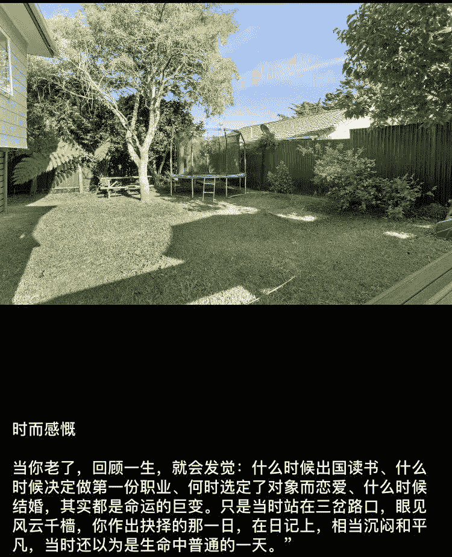

<!--yml
category: 访谈
date: 2022-06-28 10:39:49
-->

# 你好鸭 #15 | 在国外拿了绿卡买了房，最终却选择回到国内老家远程的男人 | 电鸭

> 来源：[https://eleduck.com/posts/W9faqy](https://eleduck.com/posts/W9faqy)

**嗨**

**你好鸭**

**我是Alex**

## ▌介绍下你本人的经历及当前所做的事情吧？

我是Alex，是一名DevOps工程师，主要专注于云计算架构设计以及安全，目前从事区块链行业，我们公司主要提供DevSecOps 以及smart contract auditing服务给一些中小型得startup

本人属于比较能折腾类型得，本科毕业再北京工作了几年，之后出国读研，国外又呆了四五年，拿了绿卡买了房，但感觉好山好水好寂寞，于是又回到了国内。各类行业都从事过，从互联网相关，医疗以及retail再到blockchain。

目前状态：远程工作大概两年左右了。

▲ 我的微信签名，背景图是新西兰鸟岛。

## ▌什么样的契机，让你有了远程的想法？是如何获得第一份远程机会的？

从在国外工作开始吧，因为国外工作大家都可以偶尔WFH(working from home)，一两天每周，一直在想是否可以全职远程。所以从打算回国开始，一直在计划不想去北上广深得高压环境。毕竟习惯了摸鱼偷懒. LOL。

按计划开始找国内的远程工作，基本跟HR的复核问题就是——我要全职远程！同意就往下，不同意就拉倒，不耽误时间。 在这样的节奏下，拿到过好几个远程offer。ps：有点后悔当初没接另外一家区块链公司的offer，发的币要是能放到现在。。悔恨阿。。哈哈哈哈哈哈。

所以我是找到了远程工作之后，才直接回国的。现在工作的同事主要是在欧洲跟北美。

## ▌远程之后，工作和生活都发生了哪些变化？

以前习惯了在国外早起，远程之后其实也没太大变化。

在国外时候一般早上八点起来，吃个饭洗漱一下，开个standup 然后去家附近得咖啡厅坐一上午。 中午约个朋友吃饭，下午会在我得健身房呆一下午，可以健身完顺便在cafe工作一下。

回国之后比较苦恼网络问题，因为国内cafe得网络太差了，但总体节奏主要是离家人更近了，现在一直在家乡呆着，也在这里遇到了心爱得人，上半年订婚了，可能会快要结婚了：）

▲ 喜欢射击，激光眼懂得都懂，哈哈哈

## ▌你每天的工作的时间和效率是这么规划和保证的？给我们拍照看看你的工作台吧

之前在公司我是一个自律性比较差得人，但远程之后为了金钱低头，毕竟要result driven 所以我基本不摸鱼了，每天一般工作3-5个小时。

很多人说不适应远程，这个需要一个过程。找到一个balance在你预期完成的工作量跟公司的plan之间找到一个balance。 我现在还在准备考一些证书，因为这两年做安全更多一些。

有一个单独得区域来办公去隔绝外部干扰是很有必要的。但我个人还是个社交型生物，所以一般是上午在家，下午都在cafe或者书吧。
|

▲ 我的工作台。

## ▌平时都用到哪些软件/工具来提升效率或者帮助工作呢？

这个感觉现在工具链大同小异，其实重在自我规划：工作+休息+社交。

## ▌很多人说远程易孤独，你是如何排解的？

mental health是远程社区最为关注得一个问题，但我因为在家乡，朋友亲人比较多，没什么感觉孤独得。主要是跟互联网圈离得比较远，所以我经常会出去旅游+参加一些大型得技术峰会之类。也会经常跟一线圈子的同事朋友沟通最新得行业动态,etc。

另外有一门兴趣爱好也是比较重要的。远程带来得就是时间上得便利。我最近重新捡起了射箭，女朋友送了航拍，经常会去练习一下。 我同事有在考直升机驾照的，有喜欢太极的，也有喜欢健身的。总之需要一些东西来填充你得时间。就好像中年人士都或多或少有点爱好，炒股炒币也算。

## ▌听起来，你的同事有在欧洲还有北美的，你base在国内，工作上的时差问题你们团队是如何解决的？

不可避免的要牺牲一些晚上时间了。一般standup就是自己直接在slack里更新了，async standup.  会有weekly team meeting一般都是晚上十点十一点，这个没办法。

其他日常任务就是每周plan好，有需要也会在早上或者晚上及时跟同事沟通确认。

## ▌国内开发者面对海外的远程机会，纷纷卡在了英文这里，关于此，你能分享一些经验或者建议吗？

因为我是在国外读书呆了好几年才锻炼了一个working professional的英文水平。建议大家不要去背单词或者学雅思日常什么，为了工作就专门复习工作相关的英文用语，如简历上每个技能项目用英文怎么说，听英文的技术峰会等。

## ▌对于那些也想开始远程工作的同学，你有什么建议？

不太建议刚开始工作得同学立刻远程，能进入一个大得平台修炼一下还是必须得。然后就是想清楚生活得需要以及培养自律，不然远程是个噩梦。

▲ 远程的选择也是。

## ▌最后，广告时间（征婚/征友/合作等，说任何你想说的：）

希望国内的远程社区越来越庞大，像北美一样成百上千万的远程工作者在美东小城买大house享受生活。

## ▌如何联系我？

如果你想和我认识并聊点什么，欢迎来社区找我：）

[https://eleduck.com/users/EPhg9Q](https://eleduck.com/users/EPhg9Q)

* * *