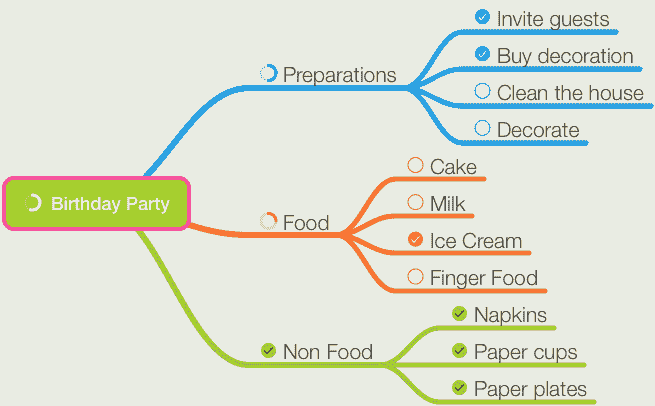
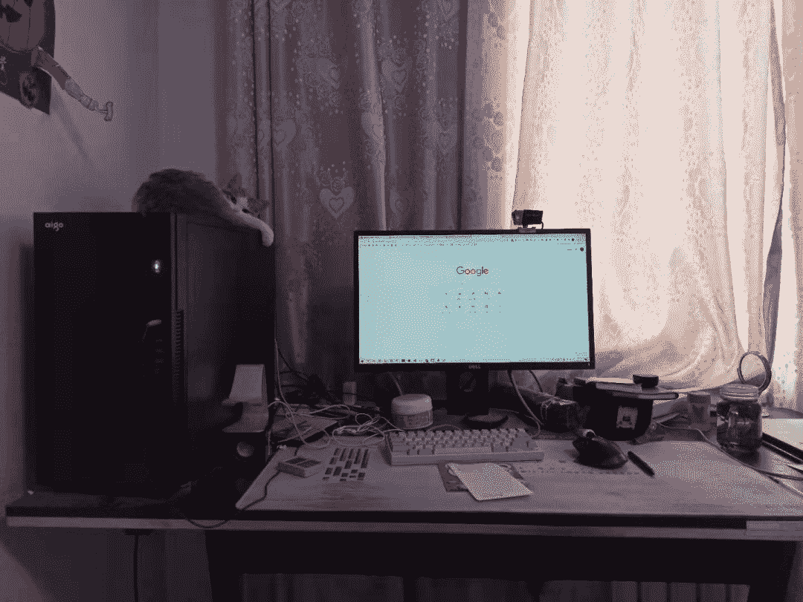
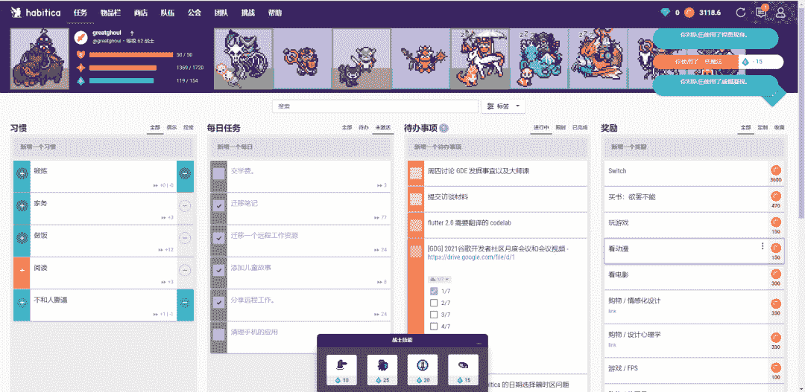
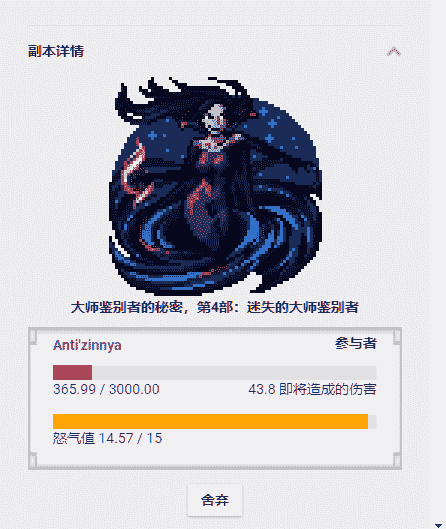

<!--yml
category: 访谈
date: 2022-06-28 10:38:20
-->

# 你好鸭 #16 | 我是邱建，电鸭最早的核心共建者，远程八年，体验如下： | 电鸭

> 来源：[https://eleduck.com/posts/ARfnBO](https://eleduck.com/posts/ARfnBO)

**嗨**

**你好鸭**

**我是邱建**

## ▌介绍下你本人的经历及当前所做的事情吧？

我是一个在西安这个节奏很慢的城市远程工作的 ruby 程序员，喜欢双马尾，动漫和游戏的肥宅。

自我毕业后一直从事软件开发的工作，待过面向企业开发的公司，外包公司，也待过很酷的创业公司。随着年龄的增长，对开发的热情却从未停歇，虽然所学很杂，到也不是那种不思考的类型，时常学习，给自己充电。

目前我为一家新加坡酒店行业的公司远程工作，从事后端开发，以及打一些杂。此外，业余时间。我还是电鸭社区的核心共建者，以及 GDG 西安社区的组织者。

## ▌什么样的契机，让你有了远程的想法？是如何获得第一份远程机会的？

在我远程之前，我每天从我家到西安软件园，来回需要通勤 40 多公里，浪费在路上的时间，差不多 4 个小时。早上 6 点多就出门，晚上 8 点才回家。但我一直也没想着做什么改变，直到在一次技术聚会上，看到一位讲师分享的他远程工作的经验，那一刻，我被击中了。竟然会有这种工作方式，我也要按这种方式工作，这是我当时最强烈的愿望。

这明显是一条少有人走的路，坐在那里干等是没有用的，于是积极与这位讲师联系，慢慢成为朋友。同时也在 Github上建立了一个收集远程工作相关信息的 [Awesome List](https://github.com/greatghoul/remote-working). 时不时以远程工作为关键字，在 Google 上进行搜索，遇到新的文章就读一读并收集起来。遇到有招聘远程工作的，就看一看招聘要求，和自己最进行对比，提升薄弱的部分，同时提升英语能力。因为在当时，国内的远程工作机会太过罕见，要匹配更多的机会，英语能力是不可或缺的。

我最初的远程工作，是和当时活动上分享远程经验的朋友业余时间的项目，当时我老婆怀孕，但因为我每天回家比较晚，她每天等我到八点多才吃饭，我觉得这样不是办法。就逼自己了一把，果断辞职，和这个朋友做一些小项目。虽然合作时间不长，但是和他远程协作的流畅感觉更加坚定了一直远程下去的想法。

这段合作结束后，我就在 Ruby China 上面找了一个台湾的团队远程。因为远程后有更多时间，我可以投入更多时间学习并提升自己。这样不断成长之后，后面的路就顺畅很多，逐渐找到收入更高，也更有趣的团队。

一次偶然的机会，在一早一晚社区发现了DeepDevelop（以下简称DD）这个很酷的团队。和创始人老周聊的很愉快，便辞掉了台湾的那份工作，正式成为 DD 的一员，主要做外包产品的开发。DD的氛围是很赞的，每隔一段时间，团队就飞往一个不同的城市，一起集中办公一周，顺便吃喝玩乐，以提高团队的默契，增进感情。

其他业余的时间，我就和大灰一起维护当时的一早一晚社区，这应该是当时国内最早的远程工作社区了，也在上面也认识了很多有趣的伙伴。现在想起来，在DD的这段日子，无疑是很快乐的。

离开 DD 之后，我开始了自由职业，在 Upwork 遇到了我的第一个也是唯一一个雇主，他在 Upwork 发布了一个为现有项目补充测试的工作，这是一个酒店 SaaS 服务，因为缺乏测试，在更新支付和订单同步的逻辑时，总是提心吊胆，生怕哪里坏掉，从而引发客户问题。雇主很 Nice, 我们合作了大半年，就脱离 Upwork 平台私奔了，有了默契和足够的信任，双方都可以省下 Upwork 的服务费。我从测试切入，慢慢的开始参与公司产品功能的研发和维护，基本是全职在做了。这一段合作，是时薪制的，也因为这种计费方式，团队感觉缺少一些欢乐气息，一切都是以工作为主，一方面，老板在为时间付费，作为雇员，不太好去扯淡水时间。因此，也缺少那么一些归属感。

后来 DD 的一位前同事创业，缺少一个合适的后端开发，于是我就被拉了过去，当然也是远程的。这家公司叫[谜底科技](http://www.miidii.tech/)，以 iOS 应用为主，我加入时，公司最火的产品叫 Price Tag。

因为是作为全职员工参与的，在公司除了工作外，也有很多工作之外的事情可以一起交流。做什么事情都很有参与感，可以说是很欢乐的一段时光了。不过公司后来改变策略，以开发无服务端的应用为主。作为一个后端，我没有办法继续给公司带来价值，所以大家就好聚好散了。

离开谜底后，我在家休息了几个月，因为同在西安，期间和大灰面了几次基，便一起倒腾着搭建起来了电鸭社区。等电鸭社区差不多成形后，我开始准备回到自由职业的状态，毕竟还要赚钱养家。在整理一些服务账号时，发现之前的雇主忘记把我从项目移除，与雇主沟通这件事的时候，被告知正好他缺少人手，希望我回来，于是我开始以正式的全职员工的身份，重新加入这家公司，因为不再以时薪的方式计费，工作起来更加随心一些，也多了些归属感觉，虽然公司依然在使用一个计时工具统计工作时间，但并不与薪资挂钩。这种相对更“随意”的感觉，让我更自由的去改进流程，提升效率，给自己和公司都带来成长，而不是仅仅根据自己的时薪，做好本分。

我应该算是这家公司第一个全职的中国员工，之前中国这边只有几个时薪制的员工，因为时薪的关系，也很少交流工作之外的事情。后来招随着业务的增长，我又帮公司招聘到了一些不错的全职同事，从前端，到后端，设计，QA 以及 PM，现在已经达到 20 人左右，这其中也借助了电鸭社区不少的便利。现在团队几乎都是全职，大家交流就活跃多了。虽然与一个真正默契的团队还有一些距离，但是合作起来，已经很舒服了，和优秀的人在一起工作，总是不错的。我们还是一个年轻的团队，还有很多成长的空间。

## ▌远程之后，工作和生活都发生了哪些变化？

远程工作之后，最明显的变化就是我突然多出了很多的时间，有了更多的时间陪伴孩子老婆。比如接送 上下班，以及做饭。相比之前一天花费差不多4小时通勤，可以有更多富余，家庭幸福感激增。老婆怀孕期间，我可以准时的带她去做各种孕期检查，而不需要凑日子或者请假。因为白天这些事情占用的时间，我可以晚上或者周末补足。这都得益于远程异步沟通的形式。

坐班工作的时候，整天各种会议和打断，拍脑袋想出的方案或者计划，都折腾的人精疲力尽，远程后，这些都大大减少了。因为更多依赖文字异步沟通，可以更加从容的思考，整理，设计以及表达。会倾向于输出更高质量的设计和结论，以减少来来回回的沟通成本。

此外时间更加自由和离散，可以在很大程度上决定自己在什么时候工作，在哪里工作。而不是固定的办公室时间。因为这种模式，我可以在不辞职的情况下，照顾年迈不能自理的奶奶，照顾年幼的孩子。幼儿园放学的时候，冲在一帮老头老太太前面第一个接到孩子，还是很有成就感的。

最初，我觉得远程后，我可以有更多时间锻炼身体，减轻体重，不过现实是残酷的，胖子之所以是胖子，并不是因为没有时间锻炼，而是懒。

## ▌你每天的工作的时间和效率是这么规划和保证的？给我们拍照看看你的工作台吧

我的工作时间，其实主要是跟着孩子走的。

孩子还小的时候，经常会打断我，因为需要人陪她玩。这个阶段，我的工作非常零散，我会把工作细分到十分钟到二十分钟这样的粒度，这样即使被打断，损失也不会那么大。工作十来分钟，陪孩子玩一会儿，然后等她沉醉到自己的事情上时，再回到工作。如此反复。

在这个阶段，思维导图和番茄时钟都是我的利器。推荐 MindNode 的任务模式，非常方便。这种零散的工作模式，对于效率肯定是有损失的， 但是只要规划和执行得当，成果也不至于不能看，总比辞职好。

孩子大一些。上幼儿园了，我就有更长的时间专注了。这段时间，就与坐班时比较类似了，这里就不展开了。不过孩子暑假寒假的时候，又会回到零散时间的模式。庆幸的是，这个年龄的孩子，已经不需要你频繁的陪伴了。她会有更多时间做自己事情，玩玩具，弹琴，画画，看书什么的。最多突然跑到你身 边，问你哪个字怎么读，或者让你吃她做的"饭"。这个阶段，零散时间块的粒度就更大，效率损失也就更低了。

我的工作台嘛，最关键的就是桌子大，我懒得收拾桌面，所以只要桌子够大，就完全不影响我随意折腾，可以在上面堆放很多杂乱的东西而不显得拥挤，很久才整理一回，省心，最早的时候，我也追求过双显示器之类的配置，不过后来受到朋友的影响，习惯了单显示器，对显示器的尺寸也没有太高的要求，因为基本桌面上基本只最大化一个窗口，这样更容易保持专注。

## ▌平时都用到哪些软件/工具来提升效率或者帮助工作呢？

我使用过很多效率工具，不过使用的时间最长的，当属 HabitRPG 了。

它是一个游戏化的任务管理工具。支持建立习惯，循环任务，以及普通任务。可以通过完成待办事项，获得金币，更强力的装备，宠物和坐骑。装备和等级的提升，可以让你更容易击败副本 Boss。而金币是这个游戏的一种虚拟货币，你可以自己用它“奖励”自己，比如要半小时游戏，就主动扣掉 100 金币，或者攒够 3000 金币，就给自己买个新手机。这些金币都是你努力工作得来的，这样你奖励自己，也就更加心安理得，更加愿意努力工作，你不知不觉间，就变成更好的自己。

比较特色的就是你可以和朋友建立一个小队，大家一起通过完成自己的 Todo 来对 Boss 造成伤害，如果有队员没有完成自己的每日任务，那么 Boss 会对大家都造成伤害。死亡后金币会清零，为了不被大家记恨，你不得不逼着自己努力完成每日任务。比如我买 Switch 的预算，就是被对友害死几次，一直没有攒够。

提高效率有一个很重要的事情，就是减少重复，这里我再推荐一个日常使用的 Snippet 管理工具 Beeftext，我把日常的一些重复用语，都做成了可以快速输出的片段。这是 Windows 上的软件，之前使用 macOS 时，类似的软件是 Dash Doc，不过这个应用作者吃相略有些难看，新的大版本上面更新一 堆垃圾功能，所以后面的版本，我都没有续费升级了。

此外，计时工具也对我有很大的帮助，买过很多计时器，不过现在越来越偏向于实体计时器，启动快，干扰少，感兴趣的可以自行淘宝。

## ▌很多人说远程易孤独，你是如何排解的？

作为一个老婆孩子热炕头的男人，我很少有孤独的时候。而且我有很多感兴趣的事情要做时，更是感觉不到孤独的。

我一直认为，远程会使人孤独是一个伪命题，因为作为一个喜欢社交的人来说，远程后你省下了很多的通勤时间，你就可以更多的去与人交流，无论是网上还是现实中，你有更多的机会去接触更多有意思的人，如果你本身就是个不愿意社交的人，即使你坐在喧闹的办公室中，能交流的依然是自己，办公室社交，也只是一种程度的自欺欺人罢了。

而且远程也不意味着与世隔绝，你需要和客户打交道，和同事打交道，只是更多的是一种异步的状态。和同事和客户的交流也都是以工作为主。至于工作以外的交流，我更喜欢参与到各种有趣的社群之中。比如作为电鸭社区的共建者，和伙伴们一起讨论和维护社区网站以及微信群。再比如作为 GDG 西安的组织者，经常去组织一下线下或者线上的活动。这些活动都能让我认识更多的朋友。孤独感也就无从谈起。

最后，对于我而言，游戏也是放松的不二法宝，我放松时特别喜欢玩模拟类的游戏，比如欧卡，农场模拟，我的世界一类。这类游戏也通常很杀时间，需要注意尺度。

## ▌远程工作对沟通依赖度很高，你和你的团队是有怎样的经验来提高沟通的效率及质量的？

*   远程协作，沟通的确是重中之重，沟通能力弱的话，的确在这种工作模式中会很吃亏。所以这里我也分享一些自己的经验，希望能够帮到大家。

*   主动沟通：远程需要有主动性，所以主动沟通很重要，有阻碍的问题，及时的找相关人员来推进，而不是等待别人来做这件事。自己完成的工作，需要适时的告诉自己的主管或者同事，让大家知道你在做什么，做到什么程度了。

*   明确语义：远程因为大多是异步沟通，所以如果一件事情，描述的不清楚，那么很有可能来来回回浪费掉很多时间，所以你需要尽量简单明确的提出自己的问题或者表达观点。比如一次问完所有的疑问，并且以 1,2,3 标序号，方便别人引用回复；如果别人提出了一个含糊不清的问题，你不确定是哪个意思，相比于问你说的“xxxx”是什么意思，更好的表达是，你说的是 1\. xxx 还是 2\. yyy，这样对方就可以很方便的回复你；对于一个问题的解法，必要的话，给出不同的解法，1\. 方法1xxx, pros, cons, 2\. 方法2，pros, cons，想同事之所想，减少沟通次数。

*   多线程：虽然一次做一件事比较高效，但是远程工作中，你市场需要同时做数件事情以弥补沟通带来的效率损失。在任务a需要找同事沟通而阻塞时，你要做的是切换到任务b继续，而不是干等对方回复。

*   会议有时候是必要的，虽然我们推行异步沟通，但是针对一些需要频繁交流的场景，也需要改为会议沟通，快速敲定解决结论，避免来来回回等回复浪费时间。不过你需要明确把结论附加到任务的上下文中，不然别的同事看到这个沟通断层，会很懵逼。

## ▌很多人担心远程工作后，职场进阶的通道及职业生涯的持续性问题，对此，你怎么看？

很多人都觉得，远程工作机会很少，很难持续，但是根据我观察和参与远程团队招聘的经验来看，真的敢于尝试远程的人，也很少，看似僧多粥少，其实是僧少粥少，差不多也够吃，甚至僧太少，粥还要剩下。

这其实也不难理解，无论何时，优秀的人才总是稀缺资源，远程不但要求人才技术优秀，还要额外的沟通能力，自制力，英语能力（国外远程机会基本都需要），这样一筛选，符合的人就更少了。即使远程工作已经在中国实践了成十年，敢于冒险的人，依然很少。

但事实上，一旦你开始尝试，你会发现，这条路其实也没那么难走，近年来越来越多的公司开始支持远程办公了，拿我在维护 [Telegram Channel](https://t.me/s/remote_cn/) 举例，从17年10月到现在，我分享过远程工作机会已经八百多条了。

## ▌作为一个父亲，给我们讲讲远程之于孩子，及其教育的影响或者意义吧

最主要还是陪伴吧，无论远程也好，坐班也好，我们或多或少都有时间去陪伴孩子，但是远程的话，这个时间就更加灵活，越小的孩子，越不喜欢自己一个人，幼儿园前，陪伴孩子过家家，幼儿园时，陪伴上下学，放学和等妈妈回家的时间，陪伴玩耍。假期，一起去公园或者在家玩我的世界联机。

我并不是特别注重监督式的教育，应为自己不喜欢，所以也不想强加到孩子身上。小孩子专注力的锻炼真的很难，但是这事情也急不来，我追求的教育目标是，学习时好好学，玩耍时好好玩。

目前学习部分其实孩子做的蛮好，只是有些强迫症，以及写字慢，管教式的教育似乎没什么收效，所以我决定更偏重与言传身教。因为我有大把的时间陪伴孩子成长，我相信会慢慢有所改善。

我自己是远程，我也想培养孩子独立思考和学习的能力，将来也能自由的工作，不受时间和地点的束缚，追求自我学习，做自己喜欢的事，学习是为了成长本身，而不是名声这种外在的东西。

## ▌对于那些也想开始远程工作的同学，你有什么建议？

尽管我远程比较果断，但是还是建议想要尝试的朋友，谨慎考虑，能够以过度的形式体验一下最好。比如说服老板每周远程工作一天，或者找一份远程兼职(比如电鸭共建者)，这样你可以在实践中感知到自己是不是适合这种工作方式。

在远程之前，你也需要考虑好社保之类的问题，除非你想加入的团队支持缴纳，否则这些事情你需要自己搞定。

最后，如果你想过数字游民的生活。那趁着还没有结婚生子，早点启程吧，既然远程工作可以让你不受地点和时间的束缚，那就趁还有机会，好好去看看这个世界吧。等成家生子之后，你会有很多牵绊，从而无法迈开脚步。

## ▌最后，广告时间（征婚/征友/合作等，说任何你想说的：）

我最近把[远程工作资源](https://github.com/greatghoul/remote-working)的列表搬迁到了语雀云，欢迎关注

[https://www.yuque.com/greatghoul/remote](https://www.yuque.com/greatghoul/remote)

## ▌如何联系我？

如果你想和我认识并聊点什么，欢迎来社区找我：）

[https://eleduck.com/users/B9YhJB](https://eleduck.com/users/B9YhJB)