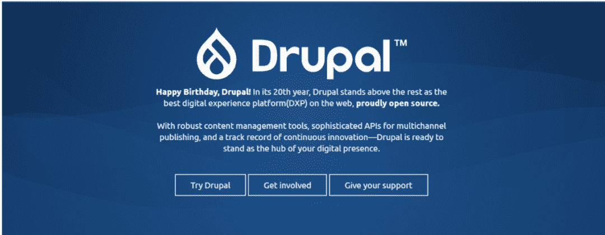

<!--yml
category: 访谈
date: 2022-06-28 10:37:58
-->

# 你好鸭 #28 | 我的八年远程生活源于Drupal。 | 电鸭

> 来源：[https://eleduck.com/posts/Ygf05q](https://eleduck.com/posts/Ygf05q)

**嗨：）**

**你好鸭，**

**我是子强。**

### ▌介绍下你本人的经历及当前所做的事情吧？

电鸭社区的同学们，大家好，我是子强，一名拥有8年远程工作经历的Drupal开发者，目前生活在甘肃兰州。我在目前的公司 [上海戴文科技](http://www.davyin.com/) 已工作6年有余，公司工作氛围轻松，业务稳定，公司目前主要的产品/解决方案有：

我作为主要的后端开发者及基础架构设计者参与其中，跟随着项目和公司一步步成长。

▲ 兰州-黄河穿城而过

### ▌什么样的契机，让你有了远程的想法？最近的一份远程工作是如何获得的？

说起我的远程工作，不得不提Drupal，因为是Drupal带给了我远程工作的机会，尤其是在偏远的西北地区，远程工作更是鲜为人知，Drupal从8年前改变了我的生活，让我从刚开始的焦虑到后来的乐在其中。

我11年毕业于沈阳一所普通二本学校的计算机专业，当时只会点java的三大框架SSH，没有名校的加持加上进入社会后的生活压力，当时还有待还的助学贷款，匆忙在三好街找到个开发工作，收入微薄，我现在依然清晰的记得，当时这第一份工作工资2100转正后2600。当时谈了多年的女朋友也毕业跟随我来到了沈阳，准备在沈阳发展。

但沈阳的IT环境和工资水平让我们一点也看不到希望，于是在工作半年后我就准备去北上广看看，但女朋友觉得北上广虽然IT行业欣欣向荣，工作机会较多，但是靠我俩白手起家后期成家会非常困难，所以在她的反对下，最终我们选择了回老家甘肃的省会兰州。在工作半年后，12年初，我顺利的通过电话面试拿到了一份兰州的开发工作，工资也翻倍，这让当时的我们都非常高兴，毕竟离家近了工资也涨了。离开生活了四年多的城市，我在兰州上班3个月后，女朋友也辞职来到了兰州找到了新工作。

兰州的这份新工作是在运营商现场维护加少量开发，这让我有了大把的时间去干其他事情；首要的事情当然是攒钱买婚房了，就想着接点私活增加收入，在摸索了一段时间后，我发现java并不适合我接活，php更适合，还有大量的现成框架，在多方对比后我选择了使用 drupal，并开始投入时间去学习，尝试用她做了几个简单的网站。但学习Drupal确实是有点门槛的，就像之前在Drupal圈广泛流传的一张图（CMS学习曲线对比），虽然有点夸大的成分，但我确实是感同身受：

我被Drupal的学习难度劝退了，放弃了有小半年的时间，但幸运的是Drupal的设计独一无二，灵活强大，加上她活跃庞大的开源社区，让我重新捡了对她的信心，硬着头皮啃英文文档，终于顺利入门了。

这时是13年，靠着一年多对Drupal的学习了解，我在社区里找到了一份稳定的兼职，并在几个月后辞去了正式工作，开始远程全职做Drupal，正式开始了我的远程生活，工资再次翻倍。但第一份远程工作并不是很顺利，公司是初创公司，无任何盈利渠道，我自己的技术能力也有限，靠着几个股东的投资撑了一年半后，最终宣布解散；在这种情况下我的远程工作状态也是非常焦虑，再加上买房结婚各种事情，有时候也在怀疑是不是选择远程工作有点太匆忙，以后找不到合适的工作怎么办；但我对Drupal的执着已经无法改变，即使回去坐班，也不会回去做Java了；这份工作后期时我通过电话面试接到了戴文的兼职岗位，靠着在兼职期间的了解和磨合，上份工作完全结束后，我顺利的以远程全职身份加入了国内顶尖的Drupal公司上海戴文科技；这时已是15年中，加入戴文让我非常兴奋，一扫之前的焦虑情绪，全身心的投入工作中，我高效率的工作也得到了同事和领导的认可，很快就完全融入到了公司中。

转眼6年了，这六年时间虽然我的工作稳定，但公司的发展也并非一帆风顺，有过艰难，也会勾起一点之前的焦虑感，但我有信心，对公司有信心，对同事有信心，对Drupal的发展更有信心！靠着各位同事跟老板的坚持和Drupal的硬核优势，公司走过了艰难，迎来了稳定的增长；同时我也收获了家庭的幸福，换了房子，二宝也将在国庆节出生，感谢公司，感谢Drupal。

### ▌远程之后，工作和生活都发生了哪些变化？

远程工作节省了通勤时间，每天上完班有更多自由的时间，能更好的兼顾工作跟生活，幸福感很强。

### ▌你每天的工作的时间和效率是怎么规划和保证的？

我每天的工作时间都坚持按公司上班时间走，由于少了通勤时间，很多时候早上会提前开始工作。

好的身体才能有好的工作状态，坚持一项体育运动必不可少，之前我喜欢踢足球，但足球运动局限性太大，没法每天坚持，还容易受伤；后来坚持游泳，从一只旱鸭子到可以轻松自由泳1KM，四季在泳池里畅游，一扫工作生活的疲惫；现在又开始打篮球，学习运球、学习投篮，每天清晨打会球让我精神饱满迎接新的一天，所以，运动就是我保持工作效率的秘密武器。

现在简单的工作台（明年新房交房就有自己的工作室啦，期待ing）：

### ▌能平时都用到哪些软件/工具来提升效率或者帮助工作呢？

jira/redmine 管理项目任务；

windows 用户，vscode + wsl2 + docker 开发也是很香。

### ▌很多人说远程易孤独，你是如何排解的？

虽然我本来就是个非常宅的人，但远程确实容易带来孤独感，与同事都是线上沟通，长时间处于独处的状态，对外界的感知变少了，但是家人的陪伴和因为运动结交的朋友，充实了我的生活。

### ▌对于那些也想开始远程工作的同学，你有什么建议么？

从我的远程经历来说，远程工作并不是一蹴而就，需要有些准备和铺垫；线上沟通有一定的缺陷，所以在远程工作中需要提升工作的主动性，积极与同事主动沟通；对于自身来说，要享受和自己独处的时间，保持工作时间的自律。

### ▌广告时间（征婚/征友/合作等，说任何你想说的：）

Drupal的设计理念及开源生态被大多数世界500强企业及著名大学认可，希望Drupal能在国内有更快的发展，希望不了解Drupal的你也能简单了解下Drupal，为您技术选型时多一个选择，帮助您的应用快速落地，灵活优雅的升级扩展。

▲ Drupal 20岁啦

这是我的Drupal主页：[https://www.drupal.org/u/ipumpkin](https://www.drupal.org/u/ipumpkin)

如果您有Drupal的开发需求，欢迎与我司联系。

*   电话：400-8378-725

*   邮箱：info@davyin.com

*   个人微信：ipumpkin_

