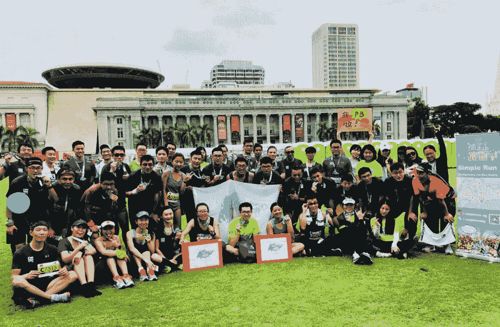

<!--yml
category: 访谈
date: 2022-06-28 10:39:21
-->

# 你好鸭 #29 | 我是晨阳牙牙， 我在新加坡的Google做HR | 电鸭

> 来源：[https://eleduck.com/posts/z1f1LJ](https://eleduck.com/posts/z1f1LJ)

**嗨，**

**你好鸭：）**

**我是晨阳牙牙**。

### ▌在国外几年了？介绍下你本人的经历及当前所做的事情吧？

* * *

2013年6月，来到新加坡南洋理工大学读研究生，还没结束毕业典礼就直接参加工作了。第一份工作在一家科技创业公司做HR，3年后，跳槽到谷歌做招聘，一直到现在。在谷歌4年多，招聘过不同国家（中国、印度、新加坡等）的不同职位（硬件、供应链、软件工程、用户体验等）。工作以外，我还创办了华人跑团，目前也是一位职场优势&个人成长教练，帮助一些朋友在职场中突破自己，解决问题。

### ▌什么样的契机，让你有了出国（或移民）的想法？

* * *

读高中时，跟家人一起到新加坡旅游，就觉得这国家不错，干净、安全、卫生。高考报志愿的时候，就顺道计划了毕业之后的去向，新加坡给我们全家留下了美好的印象，“出国读研镀金”的种子在那时埋下。

### ▌为此都做了哪些准备？最终是如何实现出国（或移民）的？

* * *

大学4年，我一直都以“去新加坡读研”为目标，目标清晰+计划可行+热情洋溢+家人支持，这么一步一个脚印地就完成了这个目标。大学4年，遇到所有事情（社团、实习、学习等），我都会先看这跟我出国留学有什么关系，从而做出“断舍离”，这让我更加聚焦我想要的东西。研究生毕业后，我找到了一份不错的工作，在科技创业公司打杂，做过财务助理，转岗到HR助理。后来，认识了我老公，我们谈恋爱、结婚，我也在新加坡安家了。

### ▌出国之后，工作和生活都发生了哪些变化？

* * *

生活变得非常简单，无比地简单。新加坡天气很温和，一年四季日日如夏，没有台风，没有气温骤降，我已经不看天气预报很多年了。新加坡基础设施很好，各项事业发达，生活很便利。因为大部分人口是华人，很多口味都跟国内的相似，也能找到很地道的家乡菜。

从整体来说，新加坡的工作压力还是很大的，跟国内的996无法比，比西方发达国家都要辛苦。朝九晚六，加班加点，尤其是在跨国公司工作，还得跟全时间不同时区的同事协作，工作时间会被拉长。好处，在于社会关系简单，同事之间大多友善，下班后各回各家，应酬很少。

### ▌能从具体聊聊你所在城市的房价/物价/收入/教育吗？

* * *

物价这个呢，真的有点难说，毕竟丰俭由人。工资这个呢，也真的是不大好说，还是得看公司看行业看职位。按照我的个人感受，作为白领，在新加坡的总体生活水平和幸福感会比国内要高。我最喜欢的是，食品安全、市场稳定、环境优美，跟国内比内卷没那么严重。

找了一些网上数据供大家参考：

国际电子汇款工具Wise整理出2021年最新的新加坡物价数据，综合伙食、住房、交通、娱乐及生活杂费和其他开支，单身人士每月需要平均约3300新元（约人民币1.6万元）的生活费，而两大一小的三人家庭则要约4800新元（约人民币2.3万元），还未包含小孩的教育费用。

在“2020年新加坡劳动力报告”指出，新加坡本地居民全职工作者（不包括外籍工作签证者）的月薪中位数4534新币。根据tradingeconomics的报告，2020年7月为止，平均月薪到5276新币。

### ▌有人说国内容不下肉身，国外留不住灵魂，你的感受如何？

* * *

新加坡华人很多，中国人也很多。2014年，我创办了狮城跑团，认识了很多来自中国的朋友。很多人跟我有类似的背景，也有人是直接来新加坡工作的。除了跟我年龄差不多的朋友，我还认识了很多比我年长10-20岁的前辈，男的女的都有。在新加坡，跟国内也没有时差，跟国内的朋友保持联系也很方便。我家在广州，往返新加坡很方便，以前我经常回国。无论是从什么维度来看，我都觉得自己过得很开心，不觉得哪里缺了些啥。唯一最难过的，就是疫情期间，无法跟父母在一起。

### ▌听说新加坡的法律很严格？ 你有这样的感受么？

* * *

网媒把新加坡说得很夸张，乱穿马路会有罚款，禁止售卖口香糖等等，这些都真的，不过我没见过有人被罚。新加坡法治严明，法律法规很多，为了有一定的社会规范，让大家都按规矩好好地生活。新加坡犯罪率比较低，总体来说，很安全。女孩子凌晨2-3点回家，这也不用担心。这一切，对于我们此等良民，这是特别幸福的事情。法律越严格，对良民来说，越是放心踏实。

### ▌对于那些也想出国的同学，你有什么建议么？

* * *

1.  近几年，国内科技大厂出海新加坡，不断地在找技术人才，大家可以关注一下。还有一些新加坡本土的公司，有着强大的中国基因，也一直从国内招聘科技人才。

2.  出国并不是逃离现实工作的方式。国外的工作确实比国内的轻松一点点，这也是要持续付出努力，每日精进自我的。有些小伙伴在国内工作不顺心，不想想如何让自己变得更好，光想着出国住大别墅养狗，这是想多了。踏踏实实，好好工作，一生悬命，优秀的人才去到哪里都会发光。

3.  国外的生活并没有想象中的轻松，离乡背井需要做好心理准备。作为海外打工人，有很多事情需要考虑的，尤其是年龄增长，有家室有孩子以后，会面临着更多现实的问题，比如买房安家、小孩读书等等。当然，解决方案远比问题多，保持一个良好的心态和期待，会让大家的生活更加惬意。

### ▌最后想说的

* * *

在电鸭海外微信群一段时间，发现很多朋友都在讨论北美的机会，牙牙实在是忍不住要跟大家推荐一下新加坡。新加坡应该是留学移民性价比很高的国家了。

1.  大多的研究生学习是1年，毕业后找到工作的概率还是很高的（工作机会有没国内好，这就不知道了）。

2.  这个国家很包容，无论是什么肤色，来自哪个国家，信奉哪个宗教，都有自由，也不存在什么歧视的问题。

3.  找对象呢，也不会特别难，对比起欧美和其他国家，有很多从中国来的小伙伴，国际联姻也很多。

4.  建立家庭生小孩后，父母过来帮忙也很方便，父母不懂英语在新加坡也能很好地活生活，不需要我们操太多的心。很多双薪家庭，都会找女佣，让父母来帮忙一下。这边找女佣，可比欧美容易多了，也是白领双薪家庭能负担得起的。

5.  小孩读书，也会有华文教学，有很多华人传统文化也能得到延续。虽然移民二代无法跟国内土生土长的我们相比，但是也比欧美的好多了，起码有这么个环境，小孩与祖辈还是能沟通的。

### ▌如何联系我？

* * *

关注我的公众号、视频号「晨阳牙牙」，上面有不少跟职场相关的内容，大家对新加坡留学、工作、移民感兴趣的话，也可以联系到我。

视频号：晨阳牙牙

公众号：晨阳牙牙

### ▌加入海外移民交流群

* * *

如你对海外移民有兴趣/有打算，

可以点此加入我们的群来交流。

[https://eleduck.com/groups](https://eleduck.com/groups)

