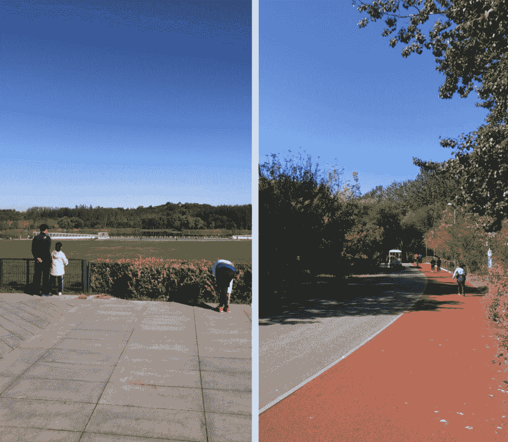

<!--yml
category: 访谈
date: 2022-06-28 10:40:01
-->

# 你好鸭 #36 | iOS开发者的远程生活：睡眠充足带来的是一天满满的元气。 | 电鸭

> 来源：[https://eleduck.com/posts/dDfJNm](https://eleduck.com/posts/dDfJNm)

**​嗨，**

**你好鸭：）**

**我是奈杰尔。**

### ▌介绍下你本人的经历及当前所做的事情吧？

我是一名iOS开发工程师。16年毕业以来因为机缘巧合从事起了iOS开发的工作。期间经历了iOS疯狂扩张到目前趋于稳定的状态，项目以OC为主少量swift为辅到如今swift 5.X成为主流开发语言的过程。因为项目需要，也涉及过一些自动化测试工具的开发，以及前端RN的一些工作。

远程工作之前待过两家公司，项目体量和工作内容都差别不大。目前的工作是服务于NY的一家房地产公司，以修复遗留的bug和做新feature为主。

### ▌什么样的契机，让你有了远程的想法？最近的一份远程工作是如何获得的？

但凡是在北京工作的码农，对这些地方都会太不陌生：中关村、西北旺、后厂村、西二旗、望京。。。这些地方的一个共性是晚上打车难，白天上车难。大家一天平均通勤时间在2.5-3小时，这放在很多地方就是从一个城市到另一个城市的时间！我曾经做过一个粗略的计算，工作两年我的通勤时间按一天24小时折算下来是96天！此外城市空气质量也有不小挑战。

### ▌远程之后，工作和生活都发生了哪些变化？

首先是通勤上的0成本，告别了挤地铁和拥堵的通勤体验。

然后睡眠质量和有效时间得到提升。睡眠充足带来的是一天满满的元气，而有效时间增加让我可以做很多事情，健身、练习英语、培养其他兴趣爱好等等。

### ▌你每天的工作的时间和效率是怎么规划和保证的？

我喜欢在早上工作，早上我的工作效率也最高。参加完9点半的standup后工作到午饭时间。

下午通常会去运动一到两小时，去附近的公园慢跑3公里，或者去金吉鸟训练一会，回来后继续处理工作。由于时差的关系，有时候在晚上会和西半球的小伙伴进行工作上的沟通。

由于我们是按一周为工作周期，所以在这五天内可以灵活地安排手上工作。

### ▌能平时都用到哪些软件/工具来提升效率或者帮助工作呢？

iOS开发主要是Xcode + Sublime Text + SourceTree + Charles；

线上沟通和任务管理主要用的slack + jira；此外为了方便我能及时收到推送和处理，手机也安装了Jira和GitHub，Gmail等客户端。

### ▌很多人说远程易孤独，你是如何排解的？

周末跟朋友小聚，撸串打球，或者去奥森走走。平时可以多参加户外运动，跟家人视频聊天。

### ▌对于那些也想开始远程工作的同学，你有什么建议么？

远程工作是一种全新的工作模式，它在挑战我们根深蒂固的朝九晚五的生活。

有的人性格外向喜欢face2face的工作方式，有的则喜欢安安静静的一个人敲敲代码研究研究项目。

如果是后者那么远程工作会非常适合你。

### ▌广告时间（征婚/征友/合作等，说任何你想说的：）

欢迎各位优秀的小伙伴们加入我们团队，目前开放的招聘岗有[前端工程师、Python工程师、JAVA工程师、Android工程师、Golang工程师。](https://eleduck.com/posts/EQfYpw)