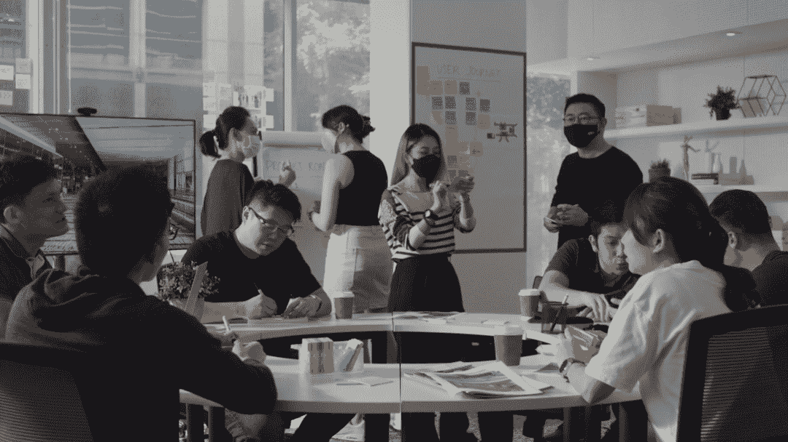
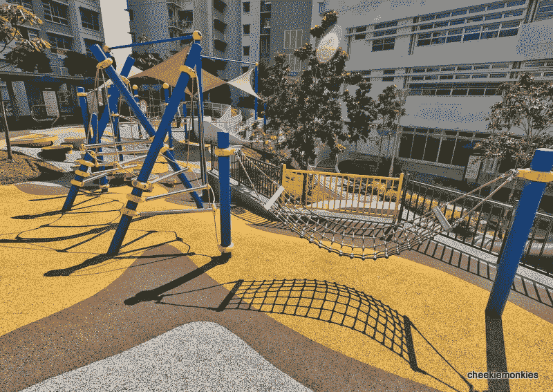
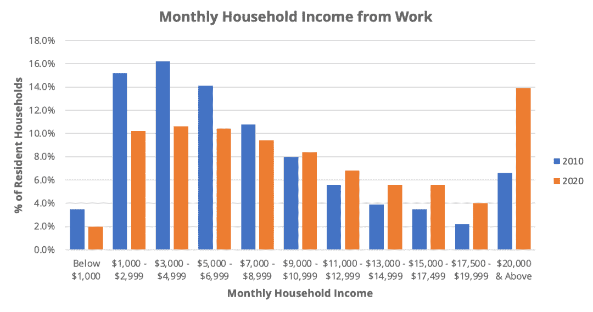
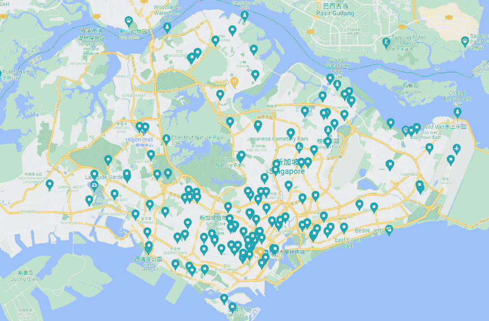
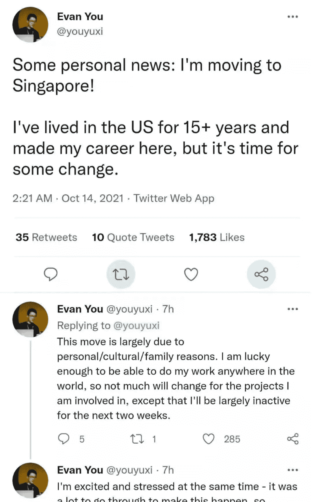

<!--yml
category: 访谈
date: 2022-06-28 10:37:31
-->

# 你好鸭 #39 | 我是尼奥，两次内部转岗，从中国到新加坡再到加拿大。 | 电鸭

> 来源：[https://eleduck.com/posts/v5fzRA](https://eleduck.com/posts/v5fzRA)

**嗨，**

**你好鸭：）**

**我是尼奥**。

### ▌在国外几年了？介绍下你本人的经历及当前所做的事情吧？

* * *

来新加坡也快1年了，之前曾在阿里做过Java Web开发，是当年淘宝某子品牌初始团队的一员（现已是顶级品牌），也在IBM带过小团队，服务多个巨型外资银行客户。几年前跳到现在这家美资公司做Lead前端工程师，主力技术栈是React及其生态系统。也正是通过现在公司的内部转岗过来新加坡的（真是意外惊喜）。

▲金沙酒店。一和负一层是casino，国民进去要花100刀

### ▌什么样的契机，让你有了出国（或移民）的想法？

* * *

大概是从2015年开始有了移民的打算，最开始是DIY澳洲和新加坡，后来根据形势转到美加日。走出去首先是为了子女教育，希望自己的孩子有丰富多彩有意义的童年和少年时期，到青年时期能自然融入基于主流价值观的社会。然后就是有可能的话，我们成人也想继续深造，在喜欢的专业上更上一层。

### ▌为此都做了哪些准备？最终是如何实现出国（或移民）的？

* * *

我最近几年一直在外企工作，最后也是通过自己公司的内部转岗过来新加坡的，所以也没有刻意做什么准备。本来疫情之前已经基本确定去US的分公司的，但2020年春节前几天告诉我说广州的大使馆没办法安排签证面试了，还不知道什么时候能恢复。

就这样我在国内一等就是大半年，期间根据各国的疫情进展，申请过英国、荷兰、德国、日本和新加坡分公司的转岗，英国的流程走到快一半，最后还是新加坡这边比较快，就马上决定来新加坡了。

之后就是公司帮忙安排签证（我EP，家人是DP）、机票和酒店等事宜，12月作为新加坡有限开门后的头几批旅客登陆了。

▲樟宜机场入境，旅客不算多，三条队伍。出了这里右拐捅鼻子

### ▌出国之后，工作和生活都发生了哪些变化？

* * *

**工作内容**

我是一名前端工程师，来新加坡入职第二天就加入了第一个项目，这是政府牵头的疫情隔离相关的项目，我司承担了该项目的品牌语言设计和绝大部分IT软件建设，包括Web和App端。而整个大团队其实是跨中国、越南和新加坡合作的，分别负责不同的模块。

▲我在新加坡的项目团队，站着的四位是设计师
上一个项目完成后，我通过几轮面试，最后作为“临时工”加入了东南亚最大银行的前端架构团队，开发和维护他们基于React的Web UI库和一整套工具链，现在新版本已经上线。有趣的是，我加入之前，猎头就曾拿着这个职位私下找过我，但直到8个月后的现在，还没请到合适的人。

**工作强度**

因为还是同一家公司，所以国内和这里的工作强度差不多，正常准点上下班。这段时间我给TypeScript和Ant Design提了些PR；在Linkedin live上做了一次React安全编程分享；完成了一个老带新项目，挺有成就感。

**薪资**

匹配了这边人力市场的同级别略高的薪资水平。值得注意的是，我从本地几个猎头和入职大厂的朋友得到的数据点显示，和其他国家一样，同一个候选人，在不同公司之间类似职位的offer总包差距能到30~40%，所以还是建议多拿一两个offer，避免被低球（这是全篇最值钱的一句话）。

**职场环境**

到这里之后绝大部分时间是在家办公，线上站会，代码都是远程提交通过CICD后看到结果，和坐班比起来区别不大，非要找区别的话就是省下了通勤时间和一大半餐饮开支。累了可以冲杯咖啡或休息一下。

因为项目大多是跨地区合作，所以同事主要是新加坡人、印度人，马来西亚人和台湾人，工作中不管是沟通技巧还是技术水平都很专业。特别是我司的设计师，做出来的交互设计稿充分平衡了视觉效果、可用性和实现可能性，而业务分析员（BA）写出来的需求极易理解，进而引导开发。而代码从一开始就架构合理，加上有高质量的测试覆盖，整个系统运行起来稳健可靠。

**家庭生活**

新加坡是个适合家庭生活的地方，本地人充满了善意和爱心，真实经历：突降大雨有人主动和你共享雨伞；超市买杂货，店员主动告诉你另一个牌子更便宜；小孩睡着鞋子掉了，有人捡起追上来，看你抱着小孩不方便，还帮穿上。

几乎每个小区都有儿童游乐场，周末假期我们常去的是东海岸沙滩骑行，植物园，淡滨尼水公园，滨海湾看演出展览等等，这些景点也都有大型的儿童游乐场，小孩会非常开心！

▲普通社区的小游乐场（网图侵删）

▲东海岸公园的极限运动场（网图侵删）

### ▌能从具体聊聊你所在城市的房价/物价/收入/教育吗？

* * *

**房价**

不好说，丰俭由人，[www.propertyguru.com.sg](https://www.propertyguru.com.sg/)上的数据会准一些。而公民90%以上都有房子，至少是组屋，虽然外观设计一般，看着像集体宿舍，但宽敞明亮，周围配套设施一应俱全，国民真的很幸福。

**收入**

这张图可以看到近年的贫富差距在缩小，个人认为是个健康的现象。而且新加坡和香港类似，个人所得税不高，大概10%+，每月能多存些钱。

**物价**

新币:人民币≈1:5，一颗白菜1刀≈5块，看起来贵上天了，但记得你的收入是提高了的，所以估算物价时建议新币*3，这样比较符合收入水平。刚到这的时候，感觉钱很不经花，一顿快餐90刀折合人民币450块有点吓人，挨到发工资就好了。

日常开销和香港差不多（除了租房），也就是比深圳高些（+25%？），小家庭每月买菜1500刀，其他杂七杂八的600刀左右。

▲日常买菜价格参考

工作餐不用担心同事带你去4、50起跳的餐厅，他们大多也是去食阁或者小贩中心15块内的套餐，或者自己带饭。

**租房**

一室一厅公寓2500刀起，带免费游泳池。水电气200，宽带40，手机10（CMLink低保套餐）。当然租组屋会更便宜，可以到propertyguru.com去看看。租房坑太多了，事先做了不少功课，有缘单开一帖吧。

**教育**

只讲我熟悉的幼儿园教育，这边双语教育大家都知道，新移民绝大部分只能去私立幼儿园，公立的便宜（0~1000刀）但排不上号。

私立幼儿园又分本土和国际，数量比例大概9:1，本土的重学习，衔接本地小学课程，也就是幼儿园就开始认字写字了，有些小孩就觉得比较枯燥。看过比较有名的是MindChamp/EtonHouse/MapleBear等等，学费大概是1800刀起步。

而国际学校就是让小孩各种玩，假期非常多，学校各种设施超一流，学费也是超一流，各种与国际接轨的亲子活动，可以一窥西方中产的生活（狗头）。看过比较有名的是Odyssey/AustralianIS/CanadiaIS/Stamford American，学校学费大概是2500~4000刀。

本土和国际幼儿园都可以到他们官网预约参观，会有老师、校长一对一详细讲解。

我标记了130+个私立+国际幼儿园的地址，大家可能用得上

[https://goo.gl/maps/TM9wpp9EA89gqXEX9](https://goo.gl/maps/TM9wpp9EA89gqXEX9)

### ▌有人说国内容不下肉身，国外留不住灵魂，你的感受如何？

* * *

文化冲击早已做好心理准备，异国他乡之所以是我心之所向，那么从那片土壤生长出来的文化、习惯，秩序和成就，就值得我去探索：“为什么这里会更好？又有什么弊端？”。尝试去理解、尊重、包容甚至接纳他国的不同，这是一个新移民应该做的吧。

远离故国亲人，不是一件容易的事，但综合考虑，早点拿到身份，一次性解决全家人的养老、医疗、教育和自己的职业发展问题，比什么都不做要强。

出来之后，时常想起国内便利的网购，餐饮，价廉物美的小吃和水果，什么时候能回国走一下这句话常挂在嘴边，但心里总担忧疫情反复，就暂时先忍着吧。

### ▌关于国内和海外在开发语言及技术选型上的的差异，能不能聊聊你的看法

* * *

根据[www.mycareersfuture.gov.sg](https://www.mycareersfuture.gov.sg/)的数据，如果单纯看职位数量，不看薪资水平行业差别的话，所用技术栈和国内差不多，后端从多到少依次是 Java > .Net > Node，看到有些初创公司用了Golang。前端是 React > Angular > Vue。至于大数据、AI和ML方面的不太熟悉就不说了。这种比例在未来5年都都不太可能会很大变化，所以往哪个技术栈努力，大家不难根据自己的情况得出结论吧。

题外话，多年前开始考虑从Java Web转栈的时候，适逢创业潮，那时 创业≈做App，间接拉升了iOS/Android需求，普遍1.5w月薪起跳，同时发生了Facebook在HTML5上实践失败，我一时间纠结于是往移动App还是往前端更有钱途，上下求索间看到一句话直击我心，大致是：Web具有天然的低成本流动性，更易于传播，一串URL就可以将服务和用户连接，而性能渐强的浏览器已遍布所有终端。最终决定专注自己更喜欢的前端领域，没多久创业潮褪去，iOS/Android就业市场在短短一年内急剧萎缩。

### ▌已经在新加坡后，是什么原因让你转战加拿大的？

* * *

新加坡是一个很不错的地方，特别是对东方家庭来说，这里注重基础教育，感觉人均雅思4个5，国际化程度和香港不相上下，中式习俗文化在这里随处可见，就连Vue的作者尤雨溪都要搬家来新加坡，你想想这里有多好吧。

而我决定离开新加坡的原因也很简单，PR难拿。听起来讽刺又矛盾。

PR难拿这事来新加坡之前就有所耳闻，原因是新加坡并非传统移民国家，更没有打分移民这回事，影响申请新加坡 PR的因素很多都只能靠前人总结、猜测的，比如收入、学历、行业、人种、有小孩等等，申请提上去之后就等审批，成功与否是非常玄学。

身边的同事朋友，马来西亚人极容易拿PR，而中国人印度人等等申请PR都不算容易，大部分都失败过，以下是一些身边的真实案例，更多申请PR的坎坷之路可以参考[sgprapp.com](http://sgprapp.com/listPage)上的数据点。

1.  东亚家庭，来新2年，欧洲某大学博士+硕士，1个孩子，第一次申请就获批。

2.  东亚家庭，来新2年，在本土公司，收入不错，感觉是时候了就第一次提上去，很快就被拒绝了。

3.  一个印度大叔全家来了10年，升职加薪了还是被拒。

4.  另一个南亚人大叔来了7年，被拒绝不知多少次了，后来心灰意冷带着全家4口去了同样难拿PR，但起码有规则可遵循的英国。

而反观加拿大PR就好拿些了，起码条件明确，流程清楚，上百种移民小项目，总有一款适合你。加上和US/EU时区很近，在这两个最强劲的经济/科技/文化引擎驱动下，给全家人的教育和职业发展提供了很大的想象空间。

### ▌对于那些也想出国的同学，你有什么建议么？

* * *

1.  接纳当地价值观和文化，被歧视是有的，但别一遇到自己看不惯听不惯的就第一时间挂到“歧视”档，不如拿出中学解应用题的逻辑方法分析一波，据理力争，毕竟【看得起/尊重】和【歧视】之间的光谱是宽广而多彩的。

2.  【人必自侮，然后人侮之】这句话多次帮我理解了很多不是冲突的冲突，很多“歧视”并非因你而起，但很可能是前（和你相似的族群）人挖坑你背锅。要改变这种冲突恐怕只能从你做起，用礼貌专业的态度待人做事，重新赢得其他族群人群的认可和尊重。真实例子：我小孩的幼儿园老师是位孟加拉女士，因为语言肤色体型等和以前国内的老师很不一样（你可以想象到），小孩非常抵触，我们心里也拿不准她能不能教好，但大半年下来，这位老师的专业、耐心、对职业的热爱和上进心（同时修国立大学的幼儿心理学课程）彻底让我们折服了，甚至为自己当初对人种的偏见感到羞愧。

3.  英语，在新加坡生活，不会英语问题不大，但如果自己想在职业上更上一层楼，那提高英语是逃不掉的。学英语在YTB上有大量的免费优质（看view count）教程，听说读写面面俱到，找对适合自己的方法，比一开始埋头苦干更重要。

### ▌如何联系我？

* * *

我现在的主力技术栈是：

React/NextJS/TestingLib/Tailwind/XState/Prisma/PostgreSQL/Github Actions/MDX，承接各时区（欧美最佳，方便沟通）的 全职/兼职 前端/全栈开发项目和技术咨询服务。

TDD和Refactoring这本书是我的最爱，所以您交给我的项目，交付可能没那么快，但能保证高测试覆盖率，可扩展性、可维护性和质量都有保证，良好的测试覆盖是你的应用升级、重构、迁移、上云等等的关键，如果能懂我的意思的话，欢迎带着你的需求来，我们单刀直入节省时间。

大家可以通过我的电鸭主页：[https://eleduck.com/users/2yhDXj](https://eleduck.com/users/2yhDXj) 联系我，欢迎找我内推，但可能不太会闲聊，谢谢。

### ▌加入海外移民交流群

* * *

如你对海外移民有兴趣/有打算，

可以点此加入我们的群来交流。

[https://eleduck.com/groups](https://eleduck.com/groups)

