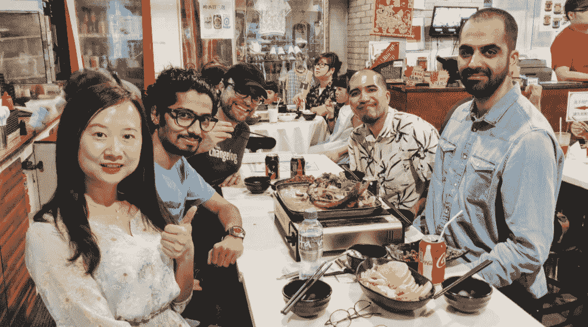
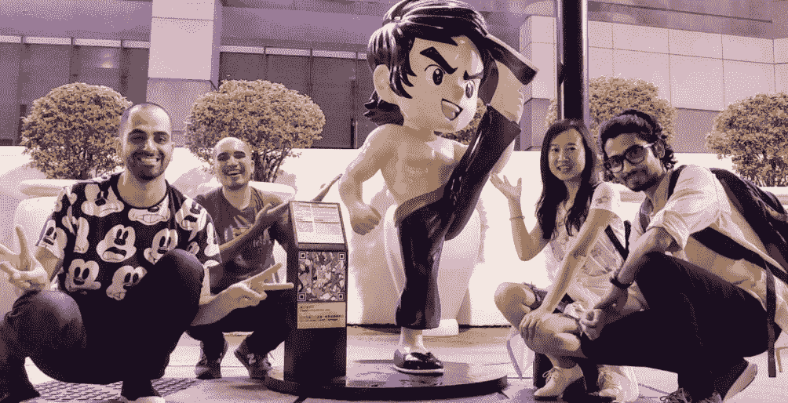
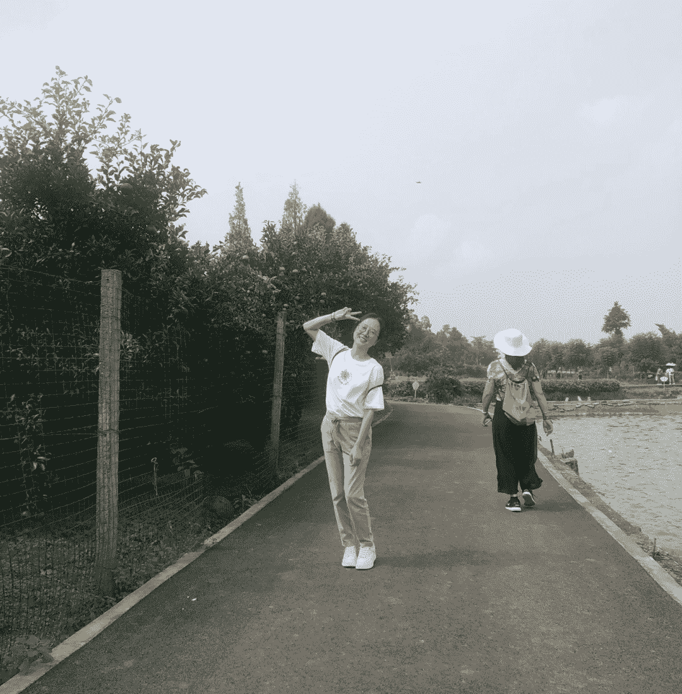
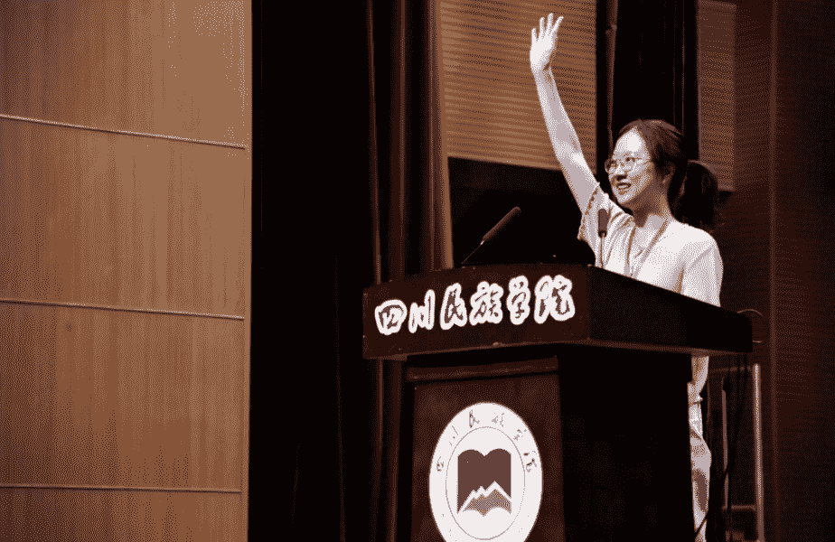
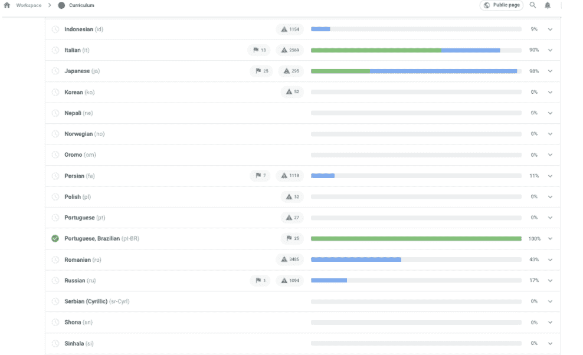
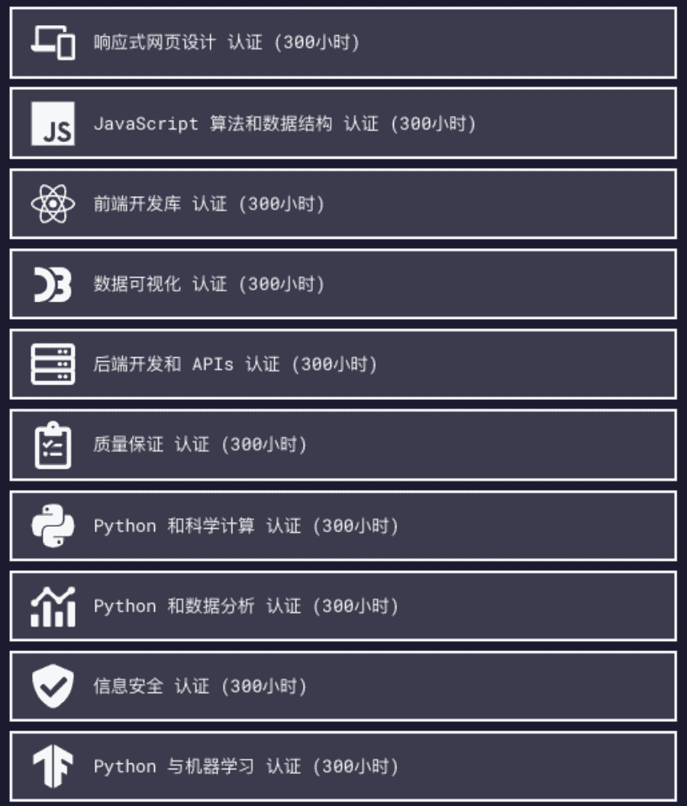
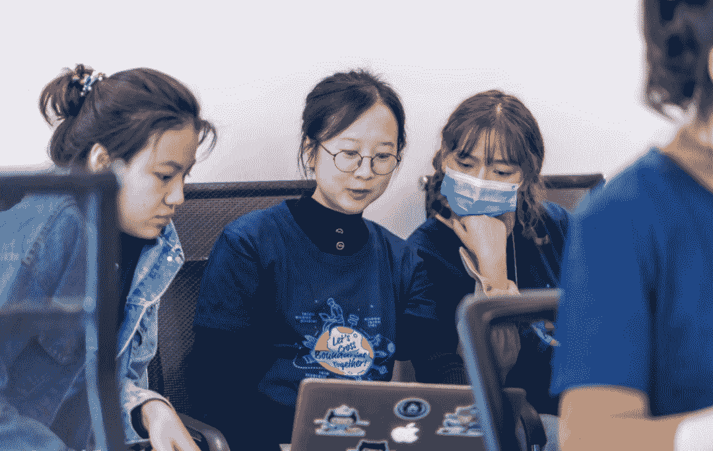

<!--yml
category: 访谈
date: 2022-06-28 10:37:53
-->

# 你好鸭 #42 | 在开源社区远程三年，我把工作变成了一种生活方式 | 电鸭

> 来源：[https://eleduck.com/posts/GzfrWr](https://eleduck.com/posts/GzfrWr)

**嗨，**

**你好鸭：）**

**我是Miya。**

### ▌介绍下你本人的经历及当前所做的事情吧？

我是Miya 刘于瑜，生活观察家、生命体验家。喜欢和通过大大小小的行动给世界带来美好改变的人们协作，目前关注教育公益、社会创新、青年发展，全球最大的开源公益编程教育社区 [freeCodeCamp](http://freecodecamp.org/) 中文社区大使、终身贡献者。

这是一个很有名且很酷的开源项目。我们团队的成员分布在十多个不同国家，大家都在家里远程办公。团队分工有基础设施开发和维护、课程开发和拓展、国际化。大家分工协作，互相培训，互为备份。

我相信发自内心的快乐是推动自己和他人持续向善的动力，所以总是保持积极的状态，也确实从所做的事情中获得快乐。

前段时间写了我的第一篇万字长文，通过很多有温度的故事，分享自己作为一个普通人一步步探索和发现生命意义的经历，欢迎大家阅读：[《在开放社区中的六年，我做着喜欢且擅长的事情，利他而自利》](https://chinese.freecodecamp.org/news/my-six-years-in-open-community/)。

### ▌什么样的契机，让你有了远程的想法？最近的一份远程工作是如何获得的？

2015 年，我在传统行业工作。因为被一些偶然的相遇所触动，我想为普通人打造一个展示自己的舞台，于是和朋友尝试围绕“阅读、演讲和交友”营造一个社区。经过三个月左右，它在苏州有了一些知名度。这是我的社区初尝试。

2016 年，在当时的创业合伙人的介绍下，我知道了 freeCodeCamp（简称 fCC），惊讶于草根发起的社区竟然那么有活力，于是成为它的其中一名贡献者。

###### ▲ 世界各地的 freeCodeCamp 学员在当地组织技术交流活动

2019 年，fCC 创始人 Quincy 邀请我作为第五名员工加入全职团队，我开始了远程工作，后来回到了家乡，定居成都。

### ▌远程之后，工作和生活都发生了哪些变化？

2019 年，我刚开始远程的时候，比较兴奋，想着可以实现“边旅行边工作”的梦想了，甚至有认真规划旅行路线、邀约同伴。考虑安全问题，不敢一个人跑太远，所以基本上就是在苏州、上海、浙江、成都跑跑。后来因为疫情，彻底打消了这个想法。

那一年我折腾的事情比较多：野外徒步、学吉他（未果）、看展、参加 fCC 各城市社区组织的线下活动......5 月，我有幸入选参加了  ChangemakerXchange 峰会，在杭州一个山间民宿待了六天五夜，和来自亚洲各地区的十多位社会企业家、公益组织创办者朋友们交流，很开心。那是我参加过的最棒的活动，没有之一。在活动上我完全放松下来，意识到自己不必完美不必很优秀，完全接纳了自己，这是我最大的收获。

###### ▲ 2019 年 ChangemakerXchange 亚洲峰会部分参与者和深受大家喜爱的小熊

慢慢的又有两位新同事加入 fCC。6 月，Quincy 说我们大家在线上认识几年了，有的人还没有线下见过，组织一次线下会面吧，团队一起工作一周，以便深入讨论一些工作计划。于是，我和来自美国、韩国、土耳其、印度的 4 位同事在香港度过了充实而愉快的一周。Quincy 后来回到美国又和当地的另外两位同事一起线下工作一周。

在香港的那几天，我作为唯一一个女同事，自然担起了安排食宿的重任。要知道，我平时出门都是靠朋友啊，我都不记路啊！好在因为 Quincy 是中国女婿，喜欢吃广式面点、喝奶茶，其他同事爱吃素食，所以我们每天早上、晚上都在同样的两家餐厅就餐，因为价格实惠，而且有免费奶茶供应。这样一来，也简化了我的工作量hhh。

###### ▲ 从左至右：Miya、Mrugesh，Quincy、Kris、Ahmad，这是我们在香港吃的最好吃的一餐哈哈，Mrugesh 还特地买了一瓶四川辣椒酱给他妈妈带回去。

那几天我也是团队气氛担当。他们说：“平时开视频会议的时候，Miya 总是一本正经地汇报工作和讨论，我们以为你很严肃，没想到你这么搞笑！”我说我也不想严肃啊，你们开着开着会，突然说到一些电影的英文名，我还得去搜一下中文名是什么，想接话的时候你们已经聊下一个话题了。

###### ▲每天晚上我们都会去维多利亚港暴走，在拍完这张欢乐的照片之后，我们吭哧吭哧走了一两个小时回酒店，香港打车太贵了！

2020 年，我慢慢冷静下来。加上疫情的影响，线下活动少了，和其他人的沟通绝大部分都是在线上，我开始感觉到孤独，甚至怀疑自己不适合远程工作。

到了今年，我调整好了心态，完全适应了远程的节奏，工作和学习方面一如既往地投入，乐趣太多，甚至舍不得花时间睡懒觉，同时也更加重视健身。加上线下活动逐渐恢复，我积极参加开源社区朋友们的各种聚会、吃货群聚会、乡村探访、街头音乐演出等等，认识很多新朋友，探索新的协作可能性，现在的状态挺好的。

###### ▲ 走在乡间的小路上。

生活方面，我在 2020 年夏天完全搬到了成都，可以有很多时间陪伴家人。以前很多年，因为求学、工作，我和家人在一起的时间挺少的。几乎每次分别的时候，我都会悄悄哭好久。所以现在的生活对我来说是非常宝贵的。每天在家吃饭，很幸福。

### ▌你每天的工作的时间和效率是怎么规划和保证的？

我不是一个时间规划特别好的人。我列过一份严谨的时间表，把什么时候起床/睡觉、每个小时做什么、工作多久要停下来运动一下、散步的时候要听什么播客......都写得很清楚，可是几乎从来没有照着执行过。

###### ▲我没有升降桌和人体工学椅，不知道那些设施感受如何？有时也会在餐桌上办公。

###### ▲给我的电脑一个特写，永远少女心^_^

于是我现在采用非常简单的时间表，执行起来也没啥压力：

一般我会在八点半左右起床，九点半左右开始工作。听着轻音乐写写字，写唐诗宋词，是让自己静下来、进入工作状态的好方法。如果天气好，我会在早饭后去家附近的小公园逛逛，感受大自然、感受烟火气，是让自己保持身心舒畅的非常好的方式。

十二点到下午两点是吃午饭和午休的时间。有时候会在中午去上瑜伽课，这也是非常好的调节身心的方式。下午工作到六点左右，吃完晚饭会去散步、买菜。晚上九点半左右进入安静的时间，会工作一会儿，或者看书、看电影、玩手机，然后尽量在十一点左右睡觉。我不玩游戏不刷抖音，看电影或者刷 B 站也没有瘾，所以很少有因为什么事情熬夜这种情况。

###### ▲每天晚上在小区外面的蔬菜店买打折菜，是日常生活中的“小确幸”，增加生活幸福感。

我的工作内容比较多，用互联网行业大家熟悉的名词来说，就是内容、市场、运营都要做，另外还有和志愿者沟通——这是最重要的。每天打开电脑，首先查看团队聊天室、论坛、邮箱、GitHub、微信公众号、B 站、知乎等等各个平台是否有人留言，然后就开始制作内容，或者和志愿者朋友们聊天，或者和来自高校、企业等等社区的朋友们讨论协作事项的进展。

我出差比较少，大部分时候是在线上参与一些讨论会。今年 5 月，我们受邀参加第一届“中国开源教育研讨会”，很荣幸能作为唯一来自草根社区的代表与来自全国十多所大学、科研院所以及国内外大企业的老师们交流，我们受益匪浅。这好像是我今年唯一一次出差。

###### ▲我在会议上介绍fCC。

###### ▲水歌从 2018 年起带领 fCC 成都社区，在会议上分享开放社群如何帮助青年成长。

我每天的节奏差不多都是这样，没有什么工作日和周末节假日之分。假期如果不需要出去和亲朋好友聚会的话，大概率也是在使用这个时间表。

### ▌能平时都用到哪些软件/工具来提升效率或者帮助工作呢？

我们在社区中协作会用到 GitHub、Google Hangouts/Skype/腾讯会议、Google docs/石墨文档/飞书、Dropbox，以及团队开发者基于 [https://rocket.chat/](https://rocket.chat/) 搭建的聊天室，当然广大社区成员会自由选择使用微信、QQ、Discord 进行即时通讯。我们用 Lastpass 共享各种账号和密码，用 Signal 发送重要信息。微信公众号排版我会用 mdnice，如果大家有更好的排版工具，欢迎推荐。另外，特别想说用 Crowdin 进行翻译协作体验太好了！

###### ▲社区贡献者们在 Crowdin 协作将 [freeCodeCamp.org](http://freeCodeCamp.org) 官网的课程翻译为 49 种语言。

Quincy 推荐我们使用 Trello 来记录团队的工作安排。我个人也试过用 Trello 记录自己的待办事项，列出近期、长期很多事项，但是管理那些卡片我觉得有点麻烦，所以不常去上面写。其实我用的最多的是 Mac/iPhone 自带的备忘录，有什么工作计划，与大家聊天时有什么要点，或者走在路上突然有什么创意，都会随时记录，很方便。

### ▌很多人说远程易孤独，你是如何排解的？

可以说人生而孤独吗？

我虽然在上文说自己在 2020 年即远程的第二年明显感觉到孤独，其实还好啦。在传统行业工作的那几年——思考和探索自己以后应该做什么、适合做什么、做什么事情会真的开心，寻找人生意义——那才是真的孤独，因为完全是自己一个人在混沌中摸索。

关于如何排解孤独，我的方法是保持开放的心态，主动去链接，比如去参加本领域或其他领域的各种活动，认识有趣的新朋友，甚至和他们产生各种协作。跟家人或者好朋友倾诉也是一个方法，但是大家都有自己的事情，我们去分享太多负面情绪，对方真的会烦，所以还是自我排解为主吧。

在这三年远程工作的经历中，2019 年我的状态是想多往外面跑，有些浮躁，而 2020 年我有一段时间太过依赖线上的沟通，有时候两三天不出门在家处理工作，感觉整个人都没有生机了——这两种状态其实都不好。所幸，今年我找到了最好的节奏，work hard by playing harder，即一边玩一边工作，把工作变成一种生活方式，在参加各种领域的活动玩耍的同时会去学习大家的思考和行动方式，同时尝试找到彼此契合的协作点。

特别是最近几个月，我遇到的和参与的好玩的事情挺多的，花很多时间去见面、去面对面聊天、去用心感受和倾听，这样我反而会更珍惜独处时间，独处的时候工作和学习的效率都变高了哈哈~

###### ▲最近认识了一些音乐人朋友，这是和殁的摆拍;) 谢谢他们让音乐离我们的生活更近一点，大家可以在 QQ 音乐和网易云音乐搜索“南街乐团”听他们的作品。

### ▌对于那些也想开始远程工作的同学，你有什么建议么？

我自己选择工作的时候是很需要使命感驱动的。只要我感觉一份工作能够同时实现我的个人价值和社会价值，那么我就会特别投入，特别有耐心，这样也有助于提升团队成员之间的信任感，工作的结果也往往是令相关者都满意和开心的。在这样的状态下，我们早起、加班都不是因为要自律，而是真的想要去做好那些有意义的事情，然后和伙伴们一起庆祝。

此外，和老板进行深入的沟通，了解彼此对使命、对组织文化的见解是否契合，也非常重要。在 fCC 团队里，Quincy 给了我们非常大的自由度。这一点我会在之后的问题中详细分享。

在实际工作中，注意和大家交流时彼此尊重，比如尊重彼此的文化背景、时间和工作成果。fCC 团队的全职和兼职员工目前将近三十人，来自十多个不同国家，大家平时面对面交流的时间基本上就是全体周会的那一个小时，其余交流主要是发生在聊天室里，以及在社交媒体上互相关注。我会在任何适当的情境下表达友善、赞同、理解等等积极反馈。比如最近我们的一位贡献者翻译了 fCC 英文专栏的一篇两万多字的[《Linux 命令完全手册》](https://chinese.freecodecamp.org/news/the-linux-commands-handbook/)，收到很多中文开发者的感谢，我马上把这个好消息分享给英文专栏的编辑同事 Abbey，向她表示感谢。

### ▌在 freeCodeCamp 社区协作是怎样的体验？

最近，《开源面对面》发起人 Rick 和小马哥邀请我录制了一期播客[《Miya 的故事｜从工地打印小妹，到全球知名教育公益开源社区大使》](https://www.ximalaya.com/sound/484328758)。在节目里我说了一句话，“我们关注社区里的每一个人”，他们说很认同这句话，并且说之前很少在别的地方听到。其实这句话是我在进入这个行业的 pre day 1 时的初心，也是 fCC 社区中很多核心贡献者在践行的。贡献者里不乏来自国内外名校、名企的优秀开发者，在社区里，他们对待新人都非常友善而且耐心。这几天我在想，是因为 fCC 本身就非常友善，所以吸引了这些人，还是恰好这些非常友善的人都聚到 fCC 了呢？

哈，这个问题的答案或许不重要，重要的是我们正在一起营造一个有温度的社区，让自己快乐的同时也能帮助他人吧。

在 fCC 社区，我们有一份 200 个单词的[行为规范](https://chinese.freecodecamp.org/news/code-of-conduct/)，简而言之：fCC 是友好且包容的，在这里，你应该保持友善，不能骚扰、挑衅他人，不能发送垃圾信息。那么，只要是在不违反行为规范的前提下，任何不同意见都是可以被拿出来讨论的。

其次，我们希望每一位贡献者，包括团队成员，在帮助别人学习编程的同时，自己也是真正开心的。比如，如果你觉得自己领取了某个任务，暂时没有能力或者精力完成它，不必有压力，你可以直接说出来，会有其他人来帮忙。

在这两个前提下，我可以尝试很多可能性，也鼓励和我协作的志愿者伙伴们尝试很多可能性——在让自己变得更好的同时，顺便给社区、给世界带来美好改变。

###### ▲2018 年，在首届 2050 大会上，贡献者们从十多个不同城市汇聚到杭州，在现场给很多朋友介绍 fCC。

我有时候会说：开源是一种生活方式。大概就是说当我们把在开源社区中和每一个熟悉的人、陌生的人的沟通和协作方式引用到生活中——不管是喜爱、赞同还是反对，都真诚自然地表达出来——我们的生活也会变得更简单而有趣了。

在 fCC 团队里，创始人 Quincy 给了我们非常大的自由度。每一位团队成员，全职的或兼职的，都曾是社区中长期的志愿贡献者，所以我们相互之间有足够的信任。

Quincy 基本上就是给我们一个大的方向，然后在我们需要的时候给予支持，其他时候都由我们自己发挥。比如，我可以按照自己认为正确的方式去推进整个中文社区的协作和发展，并且几乎每件事情都没有 deadline。

众所周知，fCC 是一个效率非常非常高的组织。我是 fCC 的第五名员工，不管是当初五个人开周会，还是现在最多的时候三十个人开周会，我们都是在一个半小时之内开完。甚至最近 Quincy 又把周会缩短为一个小时，每个人就说两件事：我上周做的最有趣的事情是什么、我在哪件事情上需要支持。除了周会，平时我们需要和哪位同事互相培训，就自己去约一个会议。我突然想起今年我似乎只跟 Quincy 单独开了两三次会，哈哈他真的是对我们很放心。

在这样的自由状态下，我们需要去探索如何聪明地工作，而不只是努力地工作——这个探索的过程本身也挺有趣的。

fCC 社区里还有很多动人的故事，关于我们的贡献者和学员的，希望未来有机会和电鸭的小伙伴们分享更多。

### ▌广告时间（征婚/征友/合作等，说任何你想说的：）

欢迎大家来 fCC 学习，或者将它推荐给想要学习编程的家人和朋友。国内已经有很多高校、企业、公益组织或者个人在使用 fCC 的课程。

当然，也欢迎大家来参与开源社区贡献，不管你有没有技术背景，都可以在社区中帮助他人，也提升自己。贡献方式有很多，比如翻译课程和文章、制作原创内容、提交代码、组织活动、当导师，你可以选择自己喜欢的方式。

###### ▲2020 年中国开源年会，我和两位志愿者小妹妹交流社区的概念。

此外，最近我也借着筹备明年四月 [2050 大会](https://2050.org.cn/) 的契机，和几十位不同领域的朋友讨论、共创，目前拟定的活动内容包括开放式教育、音乐表演和互动、艺术交互展、自由职业者团聚、学生科创项目展、科技赋能公益论坛等等。2050 是阿里云王坚博士发起的，旨在“年青人因科技而团聚”，简单来说就是，每年四月底，杭州云栖小镇开放给大家发挥创意和团聚，每个参与者都是平等的自愿者，不限地域职业年龄背景......

可以关注微信公众号 freeCodeCamp，在后台留言；或者加小助手微信 fcczhongguo 联系我，了解具体信息。