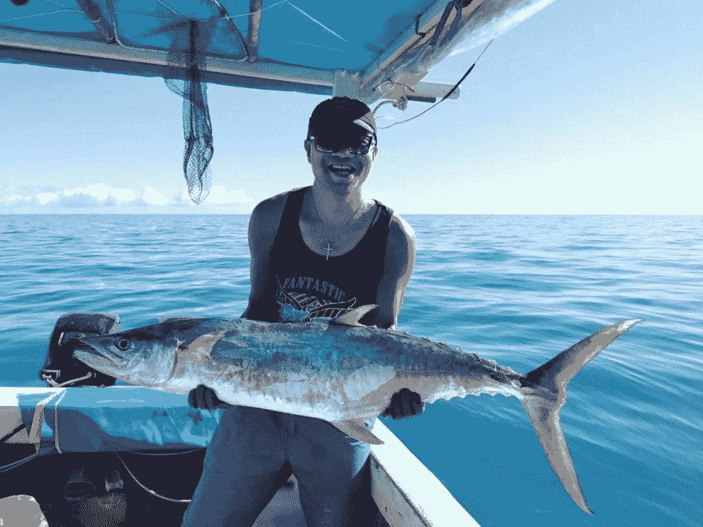
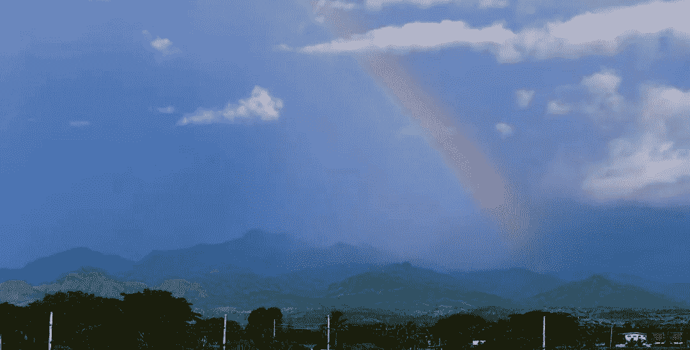

<!--yml
category: 访谈
date: 2022-06-28 10:37:21
-->

# 你好鸭 #44 | 我是Daniel，70后的我带着全家人来到斐济 | 电鸭

> 来源：[https://eleduck.com/posts/W9f8L8](https://eleduck.com/posts/W9f8L8)

**嗨，**

**你好鸭：）**

**我是Daniel**。

### ▌在国外几年了？介绍下你本人的经历及当前所做的事情吧？

* * *

我是在2020年初出国的，也就是新冠疫情爆发前夕离开中国的。距今刚好两年。目前处于每天晒太阳，钓鱼，海滩散步的躺平生活。

### ▌什么样的契机，让你有了出国（或移民）的想法？

* * *

我是一个70后，出生在农村，初中毕业就开始进入社会，我经历过轰轰烈烈的中国的改革开放，经历过80十年代的严打，经历过巷子里偷偷购买成人影碟，也经历过那个人人讲义气的江湖时代，也经历了汶川大地震，被埋在废墟的那种痛苦。当这一切都毫无准备的发生又结束后，我以为我的狗血人生基本画上句号了！

可是上帝并不是这样安排我的人生的，我无意间认识了一个人，给了我一个软件，我第一次使用了谷歌浏览器，开始看YOUTUBE视频，那一段时间简直在颠覆我几十年的认知，我像突然发现新大陆一样兴奋，我每天下班就躲在家里像做贼一样观看着各种视频。

我开始了解这个世界，我知道了原来这个世界还有蓝天白云，还有星空万里的地方，原来电视里的世界被颠覆了，我突然想出国看看，我开始去验证那些视频里的真假。

我开始把买内裤的钱都节约下来出国旅行，我开始认定我的人生还没有结束，我需要重新出发。

### ▌为此都做了哪些准备？最终是如何实现出国（或移民）的？

* * *

由于我的学历低，语言这块是我的硬伤，还记得我读初中那三年，我的英语应该每次都是班上倒数三名，35分应该是我的最高分了。因为这个原因，我一开始选择东南亚国家，马来西亚，泰国，菲律宾，后来发现都不是我想去的国家。

有一天我在跟朋友分享我想出国的念头的时候，其中一个朋友告诉我，他有一个朋友在斐济。斐济？我回家在谷歌地图上找了很久，才找到了这个芝麻小国，看着维基百科对斐济的介绍，我来了兴趣，搜索关于斐济的所有图片，哇！这就是我要的地方。

过来几天我就联系上了斐济的这个华人，（此处需要备注：他是一个骗子，接下来我会在下一个问答上详细说明），通过这个人我了解了斐济的移民政策，各种评比后，我感觉我这样的穷人，没文化的人，斐济太适合我了，于是我卖掉房子，带上老婆孩子来到了斐济。

### ▌出国之后，工作和生活都发生了哪些变化？

* * *

我刚到斐济，斐济疫情就爆发，我在酒店自我隔离14天后，找了一套出租房居住下来，给我当头一棒的事情发生了，当初口口声声要帮助我的人，其实是一个骗子，从我手里骗取了十万元人民币，其中详情我就不在此详诉，有兴趣了可以看看我的记录的[视频](https://www.youtube.com/watch?v=zaeaN_48wfo&t=22s)。

接下来，最大的问题来了，斐济是一个英语、印度语、斐济语的国家，没人能听懂中文，我出门买菜不会说，换煤气罐都差点急出眼泪。更恐怖的是跑到海滩去看风景还被抢。

所有美好的生活向往都被击打的粉碎。就这么浑浑噩噩的过了半年，上帝还是很爱我的，我参加了一个本地基督教会活动，开始认识本地人，也学会一些简单的英语，开始顺利的买菜，换煤气罐。去海滩也知道了不要带现金，要带也不能超过20元。

我开始慢慢适应这里的天气，享受这里的阳光和沙滩，开始去潜水，海钓，带家人去沙滩烧烤。

### ▌能从具体聊聊你所在城市的房价/物价/收入/教育吗？

* * *

我所居住的城市，其实不应该叫城市，是一个小镇，地处斐济国际机场旁的一个小镇，由于国际机场的缘故，这里主要是以旅游为主，非常多的酒店民宿。在疫情爆发前这里世界各地的游客特别多。

但是我来以后一直处于疫情状态，虽然斐济政府努力开放，但是游客依然非常少，90平米的两居室租房价格从1500斐济币降到了现在的800斐济币相当于2400人民币。

这里油价和中国差不多，汽车大部分是日本进口的二手车。蔬菜比国内贵一半以上，且品种还很少，肉类是以牛肉，鸡肉，海鲜为主，且很便宜。

关于教育，我们家的孩子读的是教会学校，每年一个孩子费用大约是6000斐济币，相当于18000人民币，教育质量实在不敢恭维。但是老师简直太好了，没有责骂只有鼓励，孩子们喜欢的不得了，估计还有一个原因就是没家庭作业，哈哈哈。

### ▌有人说国内容不下肉身，国外留不住灵魂，你的感受如何？

* * *

“国内容不下肉身，国外留不住灵魂”这句话确实有些道理，尤其是像我这样的年纪的人，确实很怀念家乡的饮食。还有就是文化差异，我们很难融入当地人的生活，也无法理解他们的做事风格，他们总是慢半拍。为此我现在也越来越懒，越来越不喜欢思考，每天就想着去海滩散步，躺平。

### ▌斐济的华人移民多吗？ 主要从事的工作有哪些？

* * *

斐济全国大约100万人口，大约有1万华人，最早的要追溯到清朝以前就有华人来到这个岛屿，结婚生子。

第二波应该大约在30年前，中国政府过来开采金矿还有制衣厂，有一部分就在这里扎根，留下的大部分从事饭店，小超市，以及食品加工。

第三波就是6年前一带一路，来了一波，主要是从事旅游，这其中一半都被严酷的经济逼成了骗子。我当然就是最后一波，几乎都处于躺平状态。

### ▌对于那些也想出国的同学，你有什么建议么？

* * *

每个人出国的理由不同，我想告诉那些想出国的年轻人，世界真的很大，有太多的美好的生活等着你去体验，不要呆在一个地方成为井底之蛙。

我也想告诉像我这个年纪的人，如果你为了孩子，也为自己，那你一定要做好与世界重新对接的心理准备，杀死几十年前的自己，先准备脱一层皮，迎接你的新生活，但这一切都是值得的。

### ▌如何联系我？

* * *

如果你想了解斐济，可以随时联系我，我的微信号是xz534107448

欢迎你关注我的[Youtube频道](https://www.youtube.com/channel/UCIGxEg6UZjWImvKSewrrB2Q)，或搜索“记录斐济FIJI xz”

### ▌加入海外移民交流群

* * *

如你对海外移民有兴趣/有打算，

可以点此加入我们的群来交流。

[https://eleduck.com/groups](https://eleduck.com/groups)

