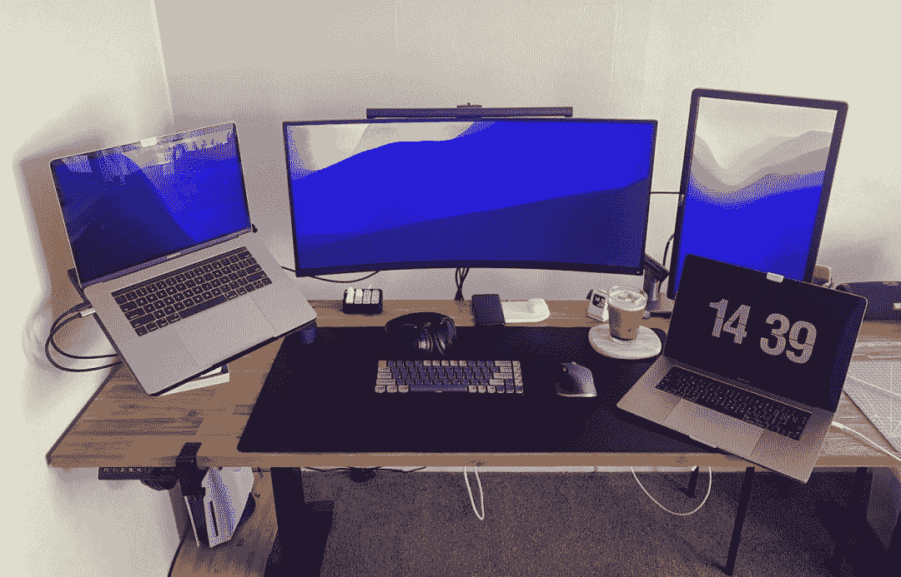

<!--yml
category: 访谈
date: 2022-06-28 10:37:37
-->

# 你好鸭 #45 | 我是Andy，从国企到外企，再到新西兰远程ing，这是我的故事。 | 电鸭

> 来源：[https://eleduck.com/posts/ZXfzRo](https://eleduck.com/posts/ZXfzRo)

嗨

你好鸭

我是Andy

### ▌在国外几年了？介绍下你本人的经历及当前所做的事情吧？

我大学时代开始接触互联网和编程，毕业后因为一个课余开发的Flash小游戏，被老师推荐且入职到了北京一家大型上市国企。

后来和人合作创过业，做过独立游戏和 App，又去过外企，再辗转到了央视网，一待就是十年。在这里遇到了很不错的领导，也结识了很多一辈子的朋友，参与了不少好玩的项目，度过了既丰富又舒服的十年。

当前我在新西兰一个 100 多人的IT公司做网站和 App 开发，在这里已经工作了一年多。主要以 React, React Native 相关技术为主，项目大部分是本地的银行和通讯行业。

前几天公司刚被一个美国上市公司收购，也算是人生第一次经历所在公司被收购这样的情况。

### ▌什么样的契机，让你有了出国（或移民）的想法？

这些年的工作过程中，不断接触了一些朋友，他们去了爱尔兰，美国，新西兰，通过这种方式，改变了人生轨迹，进入了一种我所不了解的生活环境和模式，这让我非常羡慕和向往。

再有在大环境的影响下，似乎感觉过了三十五也有了一定的生存危机，即便是我在一个相对很安稳的工作环境。另外当时北京雾霾是一个让我无法回避的烦恼，我本身对这东西也敏感，每次雾霾天我都头疼。

孩子出生以后，对我的想法也影响很大的，什么都希望可以给她更好的，其中就包括环境问题。还有更好或者说更舒适的教育环境。我一次和老婆聊了这个话题，她非常赞同，尤其是对孩子这块。

再后接触到《流浪到纽村》这个公众号，作者的经历给了我不少启发（当时可惜还没了解到电鸭社区）。

然后就规划时间表，申请研究生和准备考雅思。复习三个月，第一次总分 5.5，口语 6.5 给了我很大信心。几个月后再考，第二次的时候状态特别差，考到了总分 6.0 分，口语还是 6.5。我知道我再努力一点点，6.5 总分应该就可以拿下了。但是当时和一些朋友了解到语言班也不是一无是处，可以学到很多学术写作的东西，我对写作又是最没信心，就决定去先读三个月的语言班。

我在出国找工作这个事情上一路蛮顺的。赶上了疫情之前的最后一波入境，然后新西兰就开始了为期两年多的边境关闭。再有就是面试的第一家公司就特别喜欢，投缘。但是面试时自己还在读语言，又赶上公司项目暂停，我也就开始了我的研究生主课。但是等我毕业时他们项目又重启了，再次联系到我并顺利入职，时间刚好，同时又是心仪的公司，可谓是无缝连接，还完成了个人学历的提升 。

### ▌是因为疫情开始远程的？新西兰公司对于远程工作的态度和管理是怎样的呢？

新西兰对远程工作非常友好。我所在的公司，在疫情之前就有一些同事因个人原因在远程工作，住在不同的城市，只是偶尔来公司开会或者聚餐。公司非常的理解和支持。理论上只要任务可以按时完成，家里有不算特差的网络连接，远程办公从来都不是什么问题。

公司也针对疫情做了一定的调整，理论上都不强制回去上班，如果疫情情况好转，你也是可以选择自愿回去的。

不过还是有很多同事怀念在公司上班的日子，毕竟时不时的聚餐 BBQ、主题 Party、公司的游戏角、咖啡机和无节制供应的饮品、周五下午的 Social 喝酒活动都蛮吸引人的，尤其是年轻人。

### ▌出国之后，工作和生活都发生了哪些变化？

前面提到，出国前我已经在一家单位工作了 10 年，太熟悉里面的人和节奏。那是我第二个家的感觉。我每天两顿饭都在单位吃，面对同一批人，聊大概差不多的话题，一切都按部就班，井然有序。

出国后的生活我觉得分阶段。我自己像是经历了：焦虑，迷茫，不确定和现在的稳定阶段。

我2019 年来新西兰的时候是人生第一次来南半球。其实当时还觉得挺神奇的，不知道哪儿来的勇气，离开了生活十几年的北京，一家三口人，四个箱子就是全部家当。飞机落地，第一感觉是空气真好，天真蓝。转念就是一震：我这是在哪儿？我在干吗？

刚来的时候，两眼一抹黑。对什么都不了解，英语也不是特别好。去超市有时候都听不懂对方在问什么，真正的社交恐惧就来了。很多生活细节都是自己没有预计到的。如何办理银行卡，公交卡，买车，给女儿找幼儿园，找房……很幸运当时有朋友帮忙，帮我们解决了很多生活琐事。但是这种琐碎又是无法避开的小事，也会给你带来很多挫败感。

后来去了学校读书，日子开始变得有规律了。人如果对第二天的生活有所预估，就不会那么焦虑了。但是内心也是迷茫的，毕竟后面还要找工作，听了再多也不知道自己会走怎样的路，对未来的不确定还是会有点不安的。

再后来顺利毕业，工作也稳定了，也适应了这边的节奏，毕竟还是比国内要慢。同事来自世界各地，多元化也非常的友好。娃也从幼儿园毕业上了小学，日子慢慢步入正轨。人一旦对未来的事情有充分的预期和准备，心又重新踏实起来，就再次进入了新的舒适圈。

### ▌有人说国内容不下肉身，国外留不住灵魂，你的感受如何？

不能完全赞同，我觉得可能还是因人而异吧。我也只能是根据自己的见闻，看到的身边的朋友，和自己的感受来描述，肯定都有局限性。

我感觉每个人都有不同的状态；有的人在海外如鱼得水，有的人如坐针毡。这和在国内遇到的不同外地人在北京的感觉也没什么太大的区别。我觉得大环境确实有很多差异。但是人自身的差异性更大。

就新西兰来说，这是一个慢节奏的国家，某个角度来说也是个美丽的大农村  如果你喜欢超大城市的感觉，广泛的社交，那我可能觉得这里并不太适合你。

我还记得刚落地新西兰的时候，遇到这边一个华裔的银行职员，他对我说，你们刚来吧，还很新鲜吧？慢慢你就知道这边好山好水好无聊了。

但是如果你不那么钟情社交，有自己的爱好或喜欢安静，同时又偏好运动或者自然风光  这里大量的美景，海滩，公园就很对你的胃口 。所以前面那个银行职员说的话，现在我暂时还没体会到。

我认为没有绝对完美的地方，人们在这个世界里游荡，也就是在找更加适合自己的地方而已。适合不适合只有体会了才知道，而体会之后做出的选择就更加的理性和切实。

我本人来说，可能是从小就离开家乡在不同的城市生活，没有那种所谓的故土的感觉。家人在什么地方什么地方就是温暖和踏实。

不过偶尔我还是很怀念还在国内的父母，和之前一起朝夕相处的朋友，以及美食。每段日子都很难忘记，每段经历都值得怀念，当然也包括当下。

### ▌可以给我们拍照并说说你的工作环境吗

我一直喜欢大桌子，之前在国内的时候我就买了个宜家的一米八的桌板，但是似乎也不太够。每次我要从码代码的状态切换到 DIY 的状态需要收拾很多东西，无形中浪费了不少的时间。

所以这次我就想直接一步到位，选了这边 Bunnings 可以买到的最大的2.1 米的桌板。然后结合了一个可以升降的桌腿。再加上桌子下面一堆 3D 打印的小配件。我的这张大桌子就完成了。目前看来还是非常好用。

我的主显示器是一台小米的 34 寸宽屏显示器，我看有人说它的色彩不够好，但是我个人使用来说还是满足我日常的码代码的需求的。显示器上面是一个小米的显示器挂灯，我最喜欢的并不是它的造型和光线。而是它的遥控器，设计精巧，手感非常舒服，重量和放在桌子上的摩擦力拿捏的也都恰到好处。

副显示器是一个朋友送的二手 22 寸 Dell 显示器，我本来想着用来竖屏显示代码用，后来发现竖屏并没有想象的好用，目前我只是用来放参考文档和 Spotify。

我是个显示器支架的重度爱好者，我用了两个支架，一个用来放笔记本，另外一个支撑主显示器。之所以要把笔记本放到支架上是因为我喜欢把笔记本的屏幕抬到和视线相一致的地方。而主显示器的支架主要是为了可调整性和显示器下面的这一小块空间。

另外我还用 Arduino DIY 了一个小块的宏键盘。结合一些软件设置，可以轻松的实现一些快捷键操作。比如说快捷打开音乐软件，一键番茄时钟，或者是（一键）阅读并查询你选中的单词等等。

### ▌平时都用到哪些工具（软/硬件）来开展工作呢

我日常工作使用的最多的硬件应该就是 MacBook Pro，机械键盘和降噪耳机。

另外我也是个 DIY 爱好者，所以家里还有很多电子设备的工具，或者各种电钻、螺丝刀、万用表和烙铁等等。

不过这里还是主要是说一下日常工作的工具。MacBook Pro 不用说了，久经考验的生产力工具，在使用了好多年的 Windows 之后，到 macOS 阵营后是各种开心。

机械键盘我也是最近 3 年多才入坑的，之前并没有对键盘有什么特殊需求，知道后用上了。就回不去了。目前我买了 3 把键盘。两把都是 Keychron 的，目前对 Keychron K7 大爱中。矮轴，68 键，可换键帽也可换轴。除了电池略弱以外，其他各方面我都喜欢。

降噪耳机也是让我专心工作的得力工具，每次开启降噪我仿佛就可以和当前这个纷扰的世界隔离开来，更容易进入"flow" 模式。我手头有一个 Sony 的 1000xm3 和公司发的 QC35。都是蛮经典的耳机。各有各的好。个人偏爱的是 Sony 的工业设计。

鼠标我用 Logitech 的 Master 3, 对这系列的手感和丰富的快捷键所吸引。我觉得未来几年我可能不会换其他牌子的鼠标了。

软件方面，这边公司使用的基本就是这边的主流工具链。敏捷开发模式；JIRA 用来管理 Sprint；偶尔用 Trello来协调小任务；Confluence 用来文档的管理和协同编辑。

我目前因为主要做前端和 App 开发。用的编辑器就是 VScode，喜欢里面丰富的插件可以选择，有种可以构建自己个性 IDE 的感觉。

Alfred 是我购买的最超值的软件，它不仅仅可以在 macOS 平台代替系统自带的 Spotlight，还集成了非常强大的 Workflow 功能，我自己也写了一些 Workflow 来优化我的工作流。我强烈推荐程序员都来试试 Alfred，虽然前期阶段需要一定的学习成本，但是长期看，合理使用之后对效率的提升，这个投资绝对值得。

另外用的最多的一个是 Notion，蛮强大的笔记软件。我也在用 Obsidian 构建自己的 Second Brain 系统，目前还在摸索中。

Rectangle 一个免费开源的窗口管理器，目前对我来说最稳定好用。

其实还有很多软件，但是这里就不一一列举了。最后提一个最近对我感受到便捷的小软件是 MonitorControl， 一个帮助你用快捷键来调节外接显示器亮度的软件，兼容性蛮好的，再也不用去扣显示器上的亮度调节菜单了。

### ▌关于国内和海外在开发语言及技术选型上的的差异，能不能聊聊你的看法？

首先必须先声明一下，我在国内和国外待过的公司有限。只能片面的聊聊。毕竟不管是国内国外，公司之间的差异本身也是很大的。

从我个人的经历来看。在国内的一些企业是有自己熟悉的技术体系，可能你进入公司之后要适应学习。

我目前所在的新西兰公司技术选型很注重行业口碑，一般从开发效率，框架稳定性和最佳实践方面入手。我每次参与一个项目也都是要阅读大量的文档和已经存在的代码，保持一致性。我们一般项目开始之前会有大量的讨论和会议来让大家达成一致。

另外也很注重自动化测试。有些项目需要编写大量的 UnitTest 和 E2E 测试。总的来说，这边对快的追求没那么高，稳定而扎实的完成任务更加重要。

我个人觉得国内国外的模式我其实都可以接受吧。我也从不同的模式中看到它们存在的理由。既然是在公司或者团队工作，先了解，适应后创新还是很重要的。否则在你没有深入了解业务模式和背后原因的情况下。任何创新都是极具风险的。

### ▌对于那些也想出国的同学，你有什么建议么？

首先我相信国内的程序员朋友编程的技术水平应该都没有什么大问题，尤其是很多有大厂工作经验的朋友们。这里的几点建议也是我自己觉得如果当年我早点知道就更好了的。

*   **”出来要尽早“**

    我以前并不理解这句话。但是现在回想起来，我赞同。我必须承认，自己对于国外生活的很多想象都是不准确的。来了之后，看到，体会到了才知道自己之前有些是想当然。

    所以也许你的很多担心和想象，都没必要。你没想到很多事情你要面对。这些不确定性也是出来冒险最重要的环节之一。与其停留在想象和揣测，还不如在语言或者能力稍微够的上就出来看看。人是很难有充分准备好这种状态的。

*   **找到适合自己的方式，学好英语**

    对于出国来说，其他事情可能可以慢慢来，唯独语言是一个无法回避的难题。之前就听人谈及过，想出国的人很多90%多都卡在了语言上。而出来以后，发现语言更加的重要，无论是日常与人沟通，还是学习办事儿找工作，样样都离不开，也逃不掉。

    我大概是实际行动之前 3 年多，就开始尝试巩固英语，毕竟大学那点东西早就忘差不多了。然后是先把手机电脑的系统都调成英文，然后看大量的视频，每天听 Podcast。

*   **寻找同路人**

    相信在互联网时代，这个一点都不难。找到一批想出来的人，多交流。不管是公众号还是微信群、论坛微博都可以。一旦你找到组织，就会有人给你灵感、分享信息，也会在同行的路上互相鼓励。

### ▌最后，广告时间（招聘/征友/宣传/合作等，说任何你想说的:)

找工作的时候我做了个人网站 [https://andycao.me/](https://andycao.me/) 求职还是有一定帮助。最近一直想重构一下，用来记录生活和自己业余搞的 DIY 小项目等内容。欢迎来交流。

我偶尔会发一些小视频在我的 [YouTube 频道](https://www.youtube.com/channel/UCja8b7EiKdWoSKeUicboVhg)上。我的 [微博](https://weibo.com/enjoywound) 和 [Twitter](https://twitter.com/iandycao) 不常更新，但是如果有留言或私信我会定期回复。

希望大家虎年都开开心心！无论你是出国还是找工作都可以心想事成！！