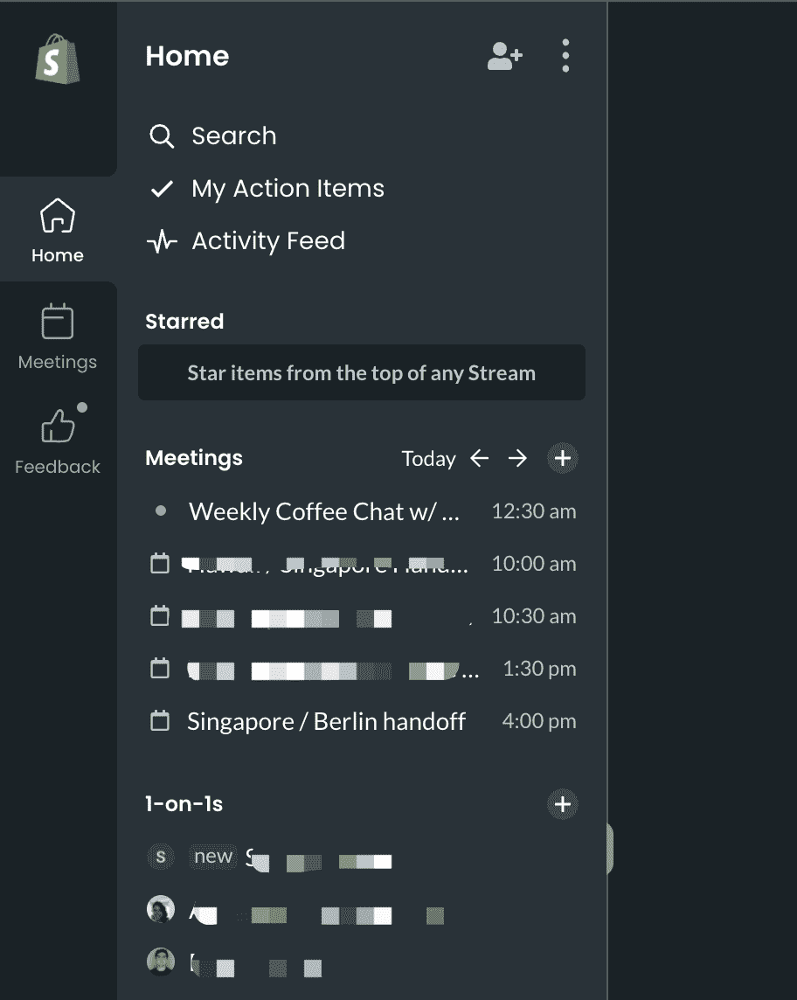
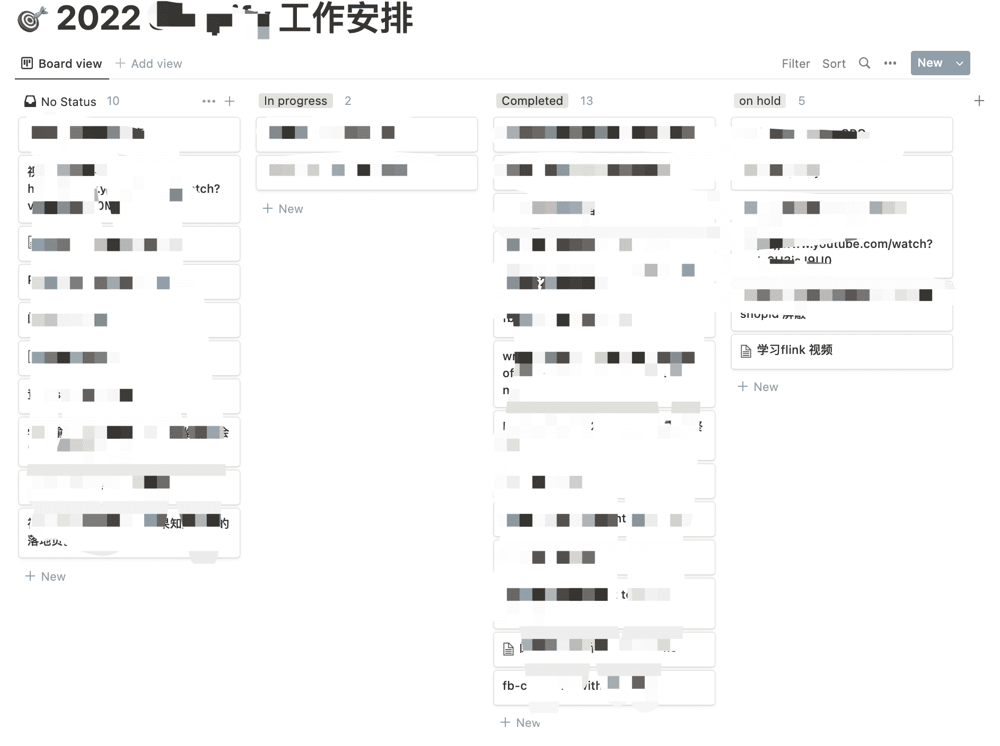
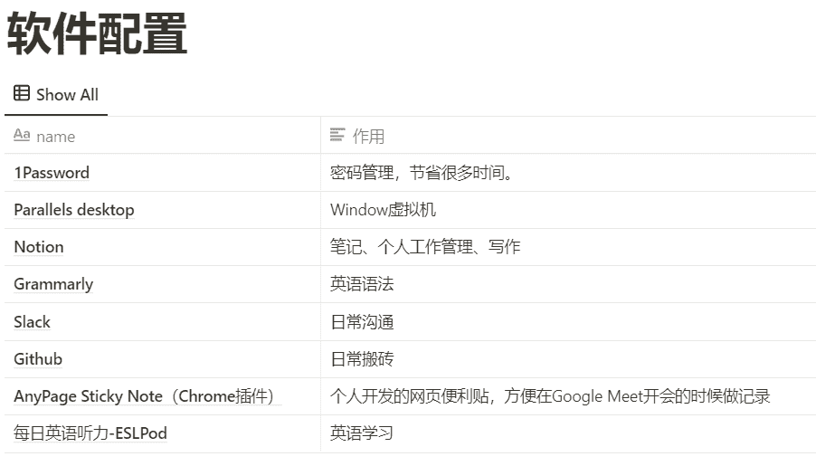
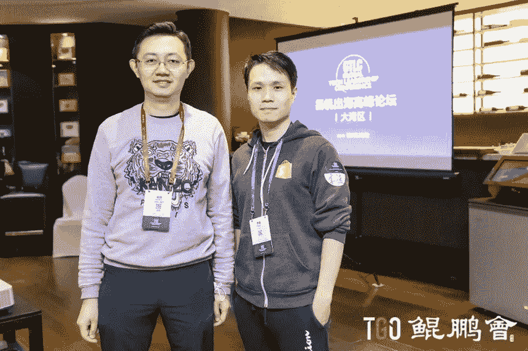

<!--yml
category: 访谈
date: 2022-06-28 10:37:15
-->

# 你好鸭 #50 | 聊聊我在 Shopify 的远程工作体验 | 电鸭

> 来源：[https://eleduck.com/posts/rdfgyK](https://eleduck.com/posts/rdfgyK)

### ▌介绍下你本人的经历及当前所做的事情吧

**我是叫李凌**，英文名 Lien，是一名工程师，也是一名独立产品的开发者，目前就职于一家总部位于加拿大的 SaaS 公司- Shopify，也是从事研发的工作。

在 WFH 之前，我在一家做 HelloTalk 产品的公司负责服务端相关的工作（主要在 IM，Infra，DevOps 等方向）之后在腾讯 CSIG 工作了几个月也是从事类似后台服务的技术工作。

相对来说是一个技术背景比较重的独立开发者，过去几年也会参与很多开源社区的活动，目前也是 Apache 基金会项目 APISIX 的 PMC 成员，做一些技术布道的事情，也曾被腾讯的腾源会采访关于 SaaS 和开源的话题。**[李凌：6 年，我如何从开源小白成为 Apache 顶级项目 PMC](https://mp.weixin.qq.com/s/-IjC66J4TPw0H14RvNBT5w)**

我是从 2020 年下旬开始了远程工作，因为一些家庭原因，也是打算投入更多业余精力到生活和个人产品上面，到目前为止，也差不多居家办公有 20 个月之久了，和大家分享一下在 Shopify 的居家云打工人体验。

**Work Life Balance：**

基本上工作都是不定时，不打卡，上下班时间也很自由，工作地点随意。

大部分情况下每天醒来，会先去运动一会儿，然后吃完早餐回家开始工作。

而且原则上不限制请假天数，但是如果是连续 2 周的话，需要和 Leader 申请一下，但是因为是远程，我基本上没有请过什么额外的假期 ，每年的 30 年假都用不完。

**使用主流的 SaaS 办公工具：**

因为海外相对成熟的 SaaS 环境，而且公司作为一家 SaaS 公司，我们日常工作中也都是会用到许多知名的 SaaS 软件服务：Github、Slack、Google Meet、Miro、Degree、Fellow.app、Bridgeapp、Workday、Datadog、1Password、Miro、Figma、[Mode.com](http://Mode.com)、Bugsnag、PagerDuty、zendesk、Tuple、Amplitude 等等。

**全英语工作环境：**

工作中都是全英文的工作环境，即便和新加坡的会华语的同事，也都是英语沟通，刚开始对我来说，听力和口语都是一个不小的挑战，但是也让我在这英语方面有了很大的进步，勉强基本能和老外无障碍沟通了。

**工作日常**：

### ▌什么样的契机，让你有了远程的想法？最近的一份远程工作是如何获得的

能有这份远程的工作，完全是一次偶然，技术群里一位广州的网友（郑诚），当时知道我在看机会，就推荐我去试试 Shopify 这家外企，恰好当时 Shopify 开始走出北美，做全球化的布局，而我自己恰好以前帮做外贸生意的学弟做过一个独立站，当时就是用的 Shopify 的平台，对 Shopify 平台也算比较了解，一些基础的技术面试和 life story 面试之后，就顺利的拿到了 Offer。

现在回想起来，能拿到这个份 Offer ，也和我在开源社区以及我以前在跨境电商独立站尝试的经历很有大关系，因为 Shopify 的企业文化里面也是有非常浓厚的工程师开源文化，目前主流的如 RoR、Ruby、samara 、toxiproxy、go-lua 等等都是出自 Shopify 或者由公司同事在活跃贡献。

其实最开始的时候我对外企在中国的稳定性，以及纯远程这种工作方式还有不少顾虑，但是还是觉得是一个非常不错的学习和开拓眼界的机会，所以就加入了 Shopify。

### ▌远程之后，工作和生活都发生了哪些变化

生活最大的变化，就是留给生活的时间更多了：运动、看书、带孩子，还有一些个人内容或产品上的开发创作。

由于没有了通勤的时间，我每天几乎就是把这部分时间用来运动、看书、和与孩子玩耍了。 相对来说，大部分时间的精力都是处于一个比较充沛的状态。

平时下班后和周末节假日的时间自己会写代码做一些个人产品。

### ▌你每天的工作的时间和效率是怎么计划和安排的

对于每天会议安排，我们都是使用一个 [fellow.app](http://fellow.app) 的 web 应用，它会和 slack 以及 Google Meet 打通了，每次会议的 Discussion Points 都会写到里面。

另外对于日常的工作安排，我都是用 Notion 的任务看板做任务的区分。

### ▌可以给我们拍照看看你的工作台/桌吗

### ▌平时都用到哪些工具（软/硬件）来开展工作呢

最近刚好在更新自己了 home office setup，就把自己所有的硬件和软件做了一个表格记录下来了

座椅都是国际一线品牌，相对价格会比较不那么喜人， HM 的椅子 1 万 2 千多，Haworth 的升降桌 6000 多，我个人觉得多少有些智商税在里面，但是不得不说质感真的非常好。

这里不得不说一下 罗技的这套键盘鼠标，可以支持在 Mac 应用里面对不同的功能键实现不同的快捷效果。而且支持多个设备间的切换。

比如一键多个桌面切换，一键打开 Chrome Tab， 还有一键 VScode 里面的快速搜索。虽然是同一个键，但是在不同的 App 上面效果不一样，这样能最大程度的提高工作效率。

罗技的 MX Keys 键盘也是一样的，支持自定义很多快捷操作，而且做工非常有苹果的风格，质感体验很好。

因为可以支持在多个设备间切换，可以用鼠标控制 iPhone iPad 做一些 App 演示教程，因为用手去点击去录制教程，是看不到手指点击的地方的，同时整个质感也非常好。

另外就是 小米的显示器台灯，会感觉整个少了屏幕反光，眼睛也舒服一些，特别是晚上工作，光线我觉得还是很柔和，对比 1000 多的 BenQ halo 灯，小米的显示器等价格性价比强太多，而且还是支持蓝牙开关。

### ▌很多人说远程易孤独，你是如何排解的

和微信群里的老板、开发者、开源产品作者在群里聊天 交流、学（cui）习（shui）。

而且公司也会定期举行一些线下活动，虽然因为疫情，里斯本、加州、夏威夷，都没有去成。等待疫情缓解的那天吧。

### ▌对于那些也想开始远程工作的同学，你有什么建议么

这几年随着越来越多的人对生活的追求，很多身边的独立开发者都开始探索远程开发的工作机会，我个人觉得对于技术工作，就两点。

1、把英语练到能用的地步
2、参与 Github 的开源项目

这两点我个人觉得都是性价比非常高的学习投入，

我自己也是因为开源认识了很多非常优秀的朋友，这是我和 Apache 首位华人董事吴晟的合影。

而且在很多公司里面，大家也非常认同有过参与开源经历的工程师。另外学习英语，会让工程师会更多的技术视野和更好的就业机会。

**另外：**

我在国内做过一些 Shopify App Developer Advocate 的工作，大家有兴趣可以了解一下，

[https://www.bilibili.com/video/BV1NQ4y1C74R](https://www.bilibili.com/video/BV1NQ4y1C74R)

开发 Shopify App 对于独立开发者来说也算一个新的值得尝试的平台，我自己也在做一些 SaaS 产品（国内和出海都有），目前数据增长还不错，欢迎大家和我一起交流。

### ▌如何联系我？

如有需要，你可以关注 [我的GitHub](https://github.com/lilien1010) 并找到我。