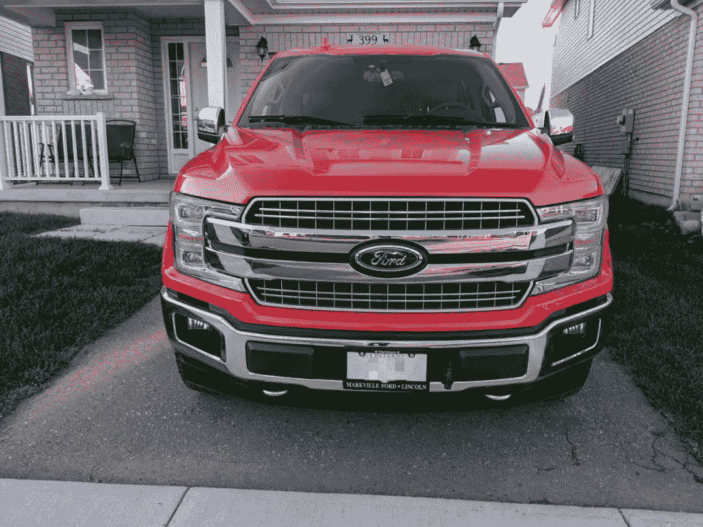

<!--yml
category: 访谈
date: 2022-06-28 10:39:24
-->

# 我是巢鹏，住在加拿大，我在GCP写consent。 | No.25 你好鸭#海外工作者 | 电鸭

> 来源：[https://eleduck.com/posts/5Bfm9A](https://eleduck.com/posts/5Bfm9A)

**嗨，**

**你好鸭：）**

**我是巢鹏**。

### ▌在国外几年了？介绍下你本人的经历及当前所做的事情吧？

* * *

我是一个码农，来加拿大之前在国内码了4年，一直在游戏行业。

我在加拿大6年了，都是住在滑铁卢，当年我出来之前我老板跟我说，你去滑铁卢吧，那里好找工作，然后我来了后发了很多简历，后来拿到一个在温哥华，一个在滑铁卢的offer，最后听了前东家的话，来了滑铁卢，在一家做企业舆情和智能客服的小公司做后端，干了2年。然后去了Google，在google做了2年多的Chromium，主要做滚动，如果你记得某个版本Chrome的Windows高精度触摸板优化了，那就是我做的，后来去了Google Cloud Healthcare给医疗行业做API干到现在。

▲ 红色F150

### ▌什么样的契机，让你有了出国（或移民）的想法？

* * *

我是登陆以后就回国继续上学工作，后来真的想来住，就是国内工作环境开始变差了，我之前工作那个公司一开始加班不算严重的，项目不赶就975，赶就9106，一年赶的时候可能就2个月，然后少数时候要通宵。但是又一次通宵完回家的路上感觉自己不是很好了。

▲ 奇奇和小白

### ▌为此都做了哪些准备？最终是如何实现出国（或移民）的？

* * *

我们是家里很早申请的移民，应该是我初中吧，中间项目又停了几年最后我大学读了一大半才完成的，那时候其实已经不是很想出国了😂。

### ▌出国之后，工作和生活都发生了哪些变化？

* * *

主要是Work life balance吧，加拿大很多公司的氛围都是3点半就回家。说法是：

*   春天，好不容易不下雪了，得早点下班

*   夏天，好不容易能出去玩，得早点下班

*   秋天，马上要下雪了，得早点下班

*   冬天，天一下黑了，得早点下班

码农这种工作的话，其实国内国外都差不多。

生活上，我多了时间呆在家里，做好吃的，研究自己喜欢的技术，跟狗狗玩。买房上的压力也没国内大。周末就干干后院农活，出去找个湖边树林游玩。

▲ 湖边游玩

### ▌有人说国内容不下肉身，国外留不住灵魂，你的感受如何？

* * *

国内国外的生活都有各自的优点和缺点，还是跟个人经历很有关系。我算是运气比较好吧，在加拿大暂时发展还算顺利，生活也挺适应的，所以我没啥留不住的感觉。

▲ 门前的樱花

### ▌对于那些也想出国的同学，你有什么建议么？

* * *

1.  首先要想清楚你移民想要的是什么，最好能先来短住一下体验一下，不要用旅游的心态。

2.  要先考虑你的职业背景是否适合移民，比如职业是否需要证书，如果需要，一般都不通用，需要一段不短的时间来重新考证。

3.  可能要考虑你能否接受部分职业经历不被认可的情况。

4.  如果能在国内就找到加拿大的工作最好，如果不能尽量早一点找朋友帮忙改简历，介绍投简历的渠道，这些东西中国和北美的习惯还是很不一样的。

5.  😂 来了记得把搜索引擎换成Google，DNS换成8.8.8.8，浏览器换成Chrome，手机换Pixel，视频看Youtube

### ▌如何联系我？

* * *

我的Github：[https://github.com/chaopeng](https://github.com/chaopeng)

我的微博：[https://weibo.com/u/1954038987](https://weibo.com/u/1954038987)

### ▌加入海外移民交流群

* * *

如你对海外移民有兴趣/有打算，

可以点此加入我们的群来交流。

[https://eleduck.com/groups](https://eleduck.com/groups)

