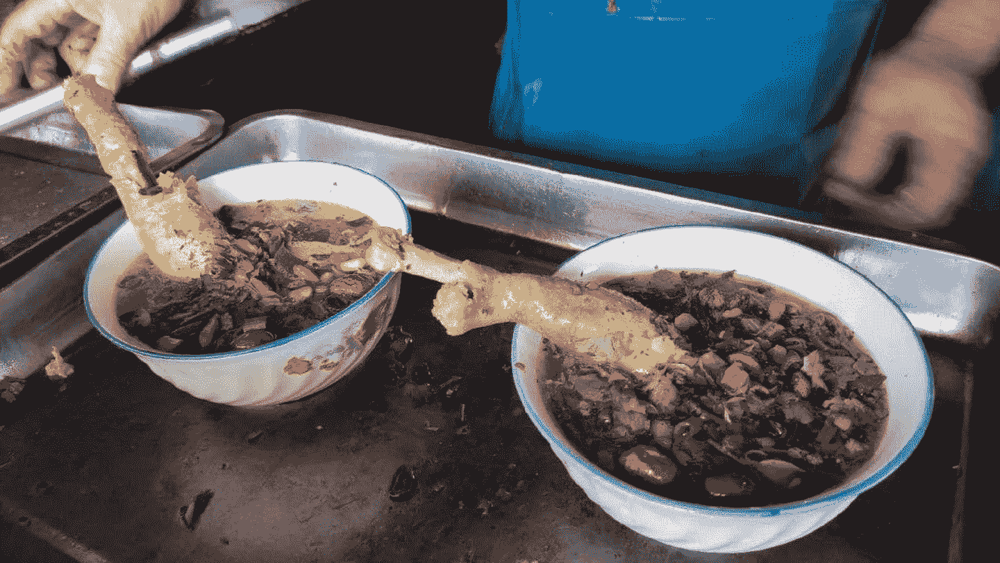
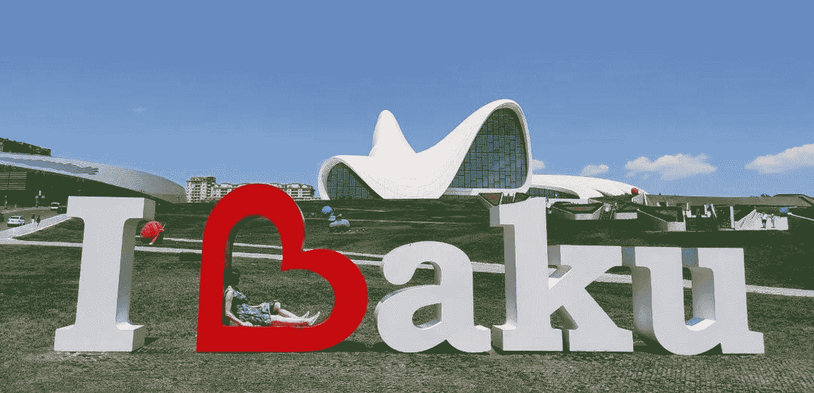
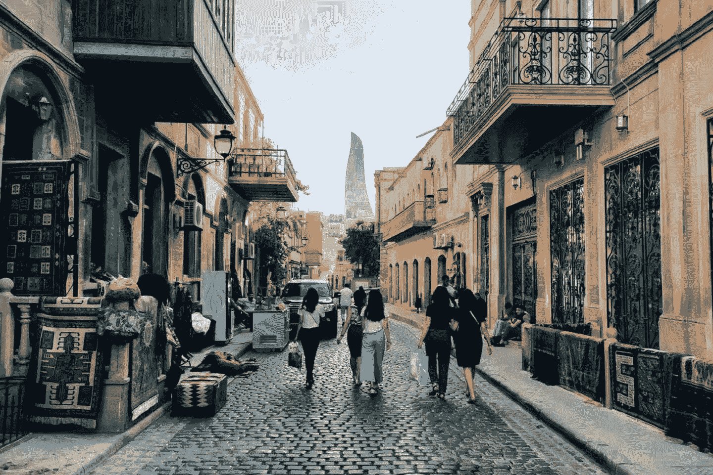
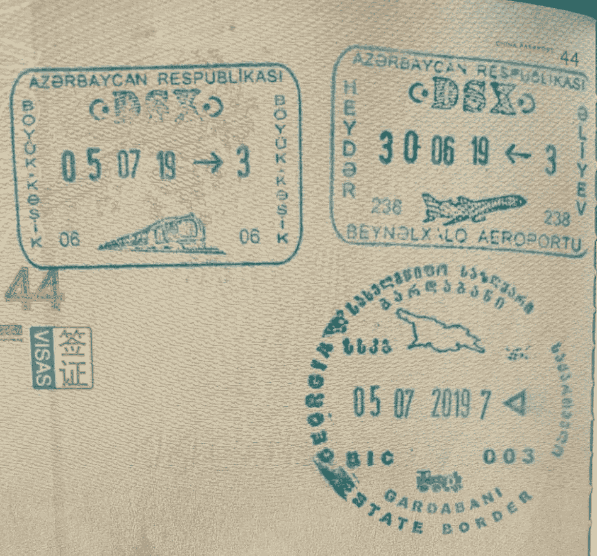
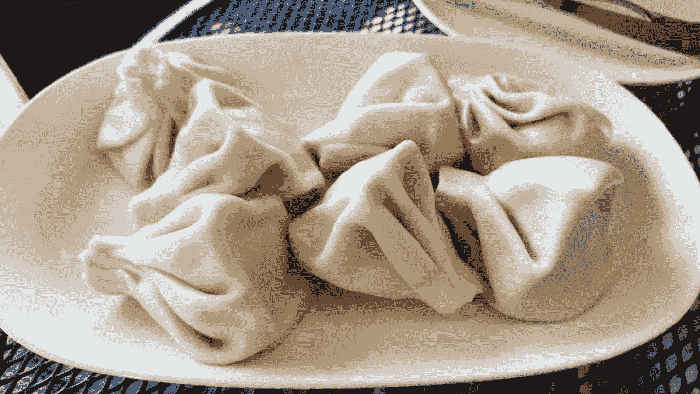
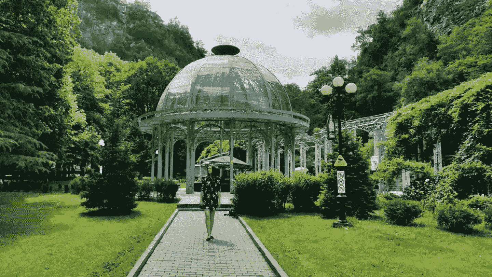
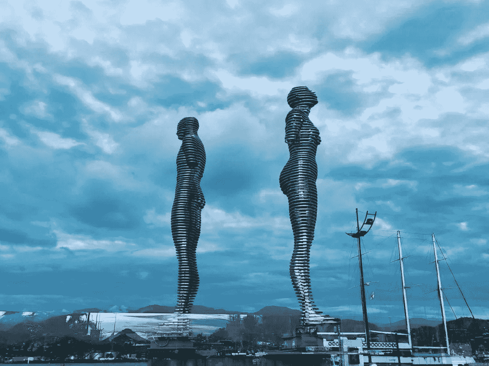
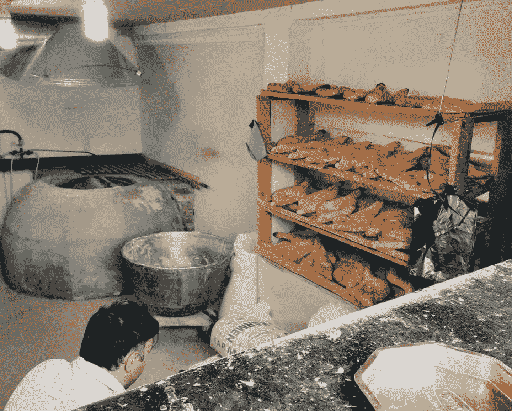
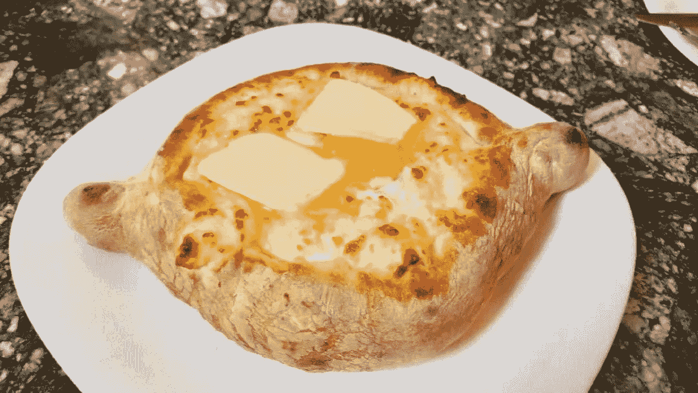
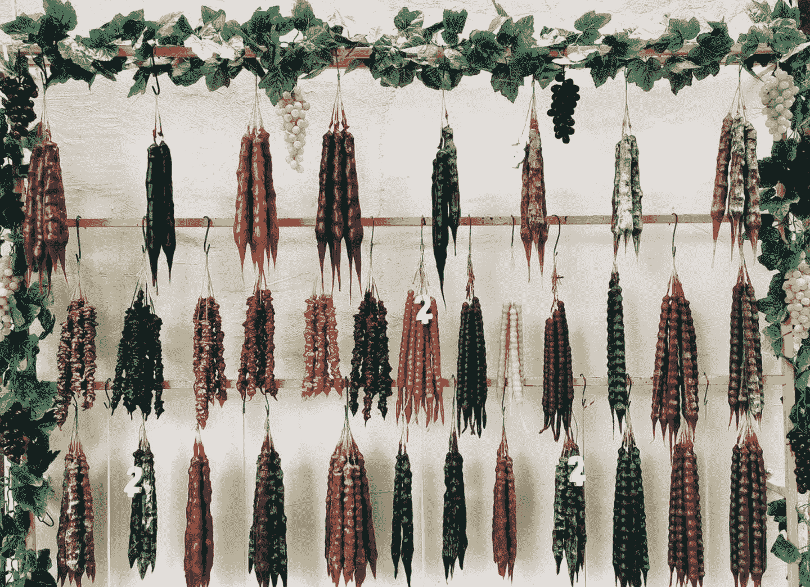

<!--yml
category: 未分类
date: 2022-06-26 00:00:00
-->

# 数字游民西行漫记 - 从内蒙古呼和浩特到波兰罗兹

> 原文：[https://jarodise.com/from-china-hohhot-to-poland-lodz-through-azerbaijan-baku-georgia-tbilisi-borjomi-batumi](https://jarodise.com/from-china-hohhot-to-poland-lodz-through-azerbaijan-baku-georgia-tbilisi-borjomi-batumi)

自从2014年认识我太太开始，我们就保持了每两年回一次她波兰娘家的习惯，一方面是为了探望亲属，另一方面也因为我们都很喜欢波兰的夏天，天气不热，各种节庆活动比较丰富，而且各种时令水果也好吃便宜。

从内蒙古到波兰通常性价比最高的方式是坐火车到北京，然后从北京搭乘俄航或者乌克兰航空飞华沙。然而，从2018年开始，原本从呼和浩特经张家口的直达北京的火车客运线路全部改成运煤的货运线路，这样一来去北京的火车就要绕行大同，时间也从原来的六个多小时增加到接近10个小时。于是，我们决定寻找另外一条路线和方案回波兰。

经过一番考虑和研究，我们终于找到了一条不用走回头路，且价格还不是很贵的亚欧穿越线路：首先从呼和浩特到乌鲁木齐，南航直飞特价650元每人，在新疆玩儿两周，然后从乌鲁木齐飞阿塞拜疆巴库，南航直飞特价1350元每人，在巴库游玩儿几天中转，然后从巴库陆路乘火车到格鲁吉亚第比利斯，头等舱卧铺每人约200元。在格鲁吉亚游玩两周左右，然后从Kutaisi乘Wizz Air的廉航飞波兰华沙，含行李每个人价格约800元。

一路下来，我们不但验证了这条线路的可行性，还在路上打卡了新疆，外高加索这两个我们从来没有去过的区域。而且一路没有长途飞行，也不需要倒时差，一举多得。

下面，我想通过看图说话的方式，跟大家分享下我们这一路上的所见所闻：

我们在新疆的第一站是伊犁自治州的霍城县清水河镇，这里号称是全世界三大薰衣草种植基地之一（另外两个是法国的普罗旺斯和日本的北海道）。时值6月下旬，正是霍城薰衣草盛开的季节。清水河县周边有很多的薰衣草种植园，这其中最出名的一家叫做解忧公主。如果你在地图APP上搜索，结果会显示清水河镇往南三公里处的解忧公主薰衣草园，而真正适合拍照的并不是这家，而是在地图上面没有标注的另外一家，要到这一家“真正”的解忧公主，你需要从清水河县乘车延国道312走十二公里到芦草沟村附近，这里的薰衣草园不但面积更大，而且造型模仿了法国普罗旺斯的丘陵起伏状，再配上后面连绵的天山，随手一拍都是一张明信片。

 辞别清水河后我们来到了新疆伊犁著名的风景区赛里木湖。塞湖被称作大西洋的最后一滴眼泪。去之前我一直都没有搞明白，一个地处亚欧大陆中心地带的高原湖泊怎么会跟大西洋扯上关系，后来谷歌了一下才知道，这赛里木湖其实是大西洋暖湿气流遇到天山山脉后降雨汇聚而成的，也是这股气流旅程的终点，因此才有了这个说法。塞湖景区很美，高山草原，野花怒放，即便是在盛夏的旺季人也不是很多，还是很值得推荐的。当地最受欢迎的一项旅游项目是骑马上山，我骑过之后觉得自己也不舒服，马也怪累的，真心不推荐，有能力的话还是自己爬山观景吧。

  在新疆的第三站我们来到了伊犁自治州的首府伊宁市，在这里的主题基本上就是吃吃吃。酸奶刨冰，烧烤，椒麻鸡，面肺子，烤包子，马奶子，然而最让我难忘的是汉人街的一家玫瑰花鸡汤，一大碗金灿灿的鸡汤里面一个硕大的鸡腿，里面还有红枣枸杞和玫瑰花瓣，清香扑鼻，回味无穷，真的是让人上瘾的味道。

 在新疆的最后一站我们来到了吐鲁番，本以为会在这里体会到更加传统的维吾尔民族风情，结果却十分令人失望，而且吐鲁番几乎所有的景点都是大写的坑爹，葡萄沟，火焰山，坎儿井都是一路货色，妥妥的tourist trap，真心不推荐。如果真要让我说点什么好的话，这里的大盘鸡还不错。

 离开新疆后我们来到了阿塞拜疆的首都巴库，4天下来对这个城市印象出奇地好。因为几十年石油工业的发展，让这个城市拥有非常现代化的基建，地标性建筑物火焰塔和由国际著名设计师Zaha Hadid设计的Heydar Aliyev艺术中心都是拍照的好地方。

 巴库的老城拥有四个UNESCO世界遗产，我们报名参加了Original Baku Free Walking Tour, 在导游Gani的带领下了解了更多有关这个国家的历史，文化和趣闻。整个Free Walking Tour只有我们两个游客，可见这里的旅游业还没有被玩儿坏，如果想要来玩儿，建议趁早。

 格鲁吉亚对于拥有发达国家签证的中国护照持有者是有90天免签的政策的，所以我这次来之前没太多想这件事儿，直到出发前的一天，我才意识到一个问题：**我这次是要坐火车通过陆路口岸进入格鲁吉亚，免签政策会不会只适用于飞机入境呢？**于是上网查询了一番，不查还好，一查吓出我一身冷汗：根据穷游和马蜂窝上的一些帖子，很多中国背包客早在2017年和2018年就做过类似的尝试，而他们其中的一些中途被悲剧地赶下了火车，原因居然不是因为格鲁吉亚边检不让入境，而是因为阿塞拜疆边检不熟悉这个免签政策，不予放行！也就是说，发达国家签证免签入境这个政策无论陆路还是空路都是可行的，问题出在阿塞拜疆的边检。好在格鲁吉亚和阿塞拜疆铁路口岸离第比利斯也只有五六十公里的距离，而且跨境时间已经是早晨八点，所以即便被赶下火车，也可以尝试下车后打车或者乘坐汽车再次尝试公路口岸通过。上车之前我下载了格鲁吉亚关于免签政策的公文，翻译成了阿塞拜疆语存在手机上，做好了被赶下火车的准备。后面发现这是虚惊一场，边检人员进入车厢收我护照时候只问了一句，你有签证么？我说我有美签，他点点头把护照收走了，最后什么问题也没问，顺利通关。**由此可见，2019年阿塞拜疆的边检人员已经对格鲁吉亚发达国家签证免签政策比较熟悉了，美签/申根签陆路通关由阿塞拜疆进入格鲁吉亚完全没有问题。**

 到了第比利斯，我终于吃到了传说中的格鲁吉亚国菜 – Khinkali。造型酷似我天朝的传统美食灌汤小笼包，只是个头要大不少，而且它不是蒸熟的，而是用盐水煮熟的。Khinkali通常是格鲁吉亚餐厅最便宜的一道菜，价格在0.8lari（合人民币两元)一个左右，最少点5个，一个成年人有五六个就能吃饱了。馅料有传统的猪肉/牛肉馅儿，也有奶酪，蘑菇，土豆等。如果你想吃那种汤汁浓郁的，最好还是要肉馅儿的。Khinkali的吃法也是小有讲究的，要用手抓起来（顶部大大的面疙瘩是专用手持部位），然后在下面薄皮处咬开一个小口，吸吮里面的肉汁（要小心被烫到），肉汁喝光后，可以吃皮和馅儿，最后手持部分的面疙瘩是不吃的，留在盘内。**格鲁吉亚人有一种开玩笑的说法，如果你吃一盘Khinkali能一滴汤都不撒，那你肯定是一个接吻高手。**

 我们在格鲁吉亚的第二站是一个对大多数国人来说不有名的小镇Borjomi，这里因盛产一种在整个高加索地区都很有名的硫磺矿泉水而著名。小镇建在河谷里，相比已经被大量游客玩儿坏的第比利斯，这里真的很清静惬意，发呆办公两相宜。一个小贴士：在Borjomi的中央公园里面可以免费接养生硫磺矿泉水，但是瓶子容量不能大于2L，所以去之前最好准备一个小于2L的空瓶子用来接水。因为矿泉水里富含硫磺，所以喝起来感觉臭臭的，其实并不好喝, 当然为了健康又有何妨？

 辞别Borjomi后我们来到了黑海之滨的赌城，有外高加索小拉斯维加斯之称的巴统，这也是格鲁吉亚第二大城市。作为外高加索地区一个接待游客数十年的传统旅游城市，这里的旅游业态显然比暴发户第比利斯显得更为规范，也更容易让人接受。肉眼可见，这里的游客有一大半是俄罗斯人，其次也不乏一些穿着黑袍的中东游客，中国游客来这里玩儿的还是比较少的。如果有机会来这旅游的话，除了海滨浴场周边的一些著名景点外，推荐大家参观下位于巴统市郊的植物园（市区打车二十多块就能到），这里是一个可以登高远眺黑海海岸线和巴统天际线的绝佳位置，另外植物园旁边的海滩也相比市区的人也少很多。

 跟大多数西方国家一样，格鲁吉亚是一个热爱面包的国度，但是这里却有一种我在其它西方国家从来没见过的面包。它的形状两头尖尖，好似一条小船的，制作的方式很像新疆的烤馕。大街上每走几十米都能看到卖这种面包的小作坊，说它是格鲁吉亚人的国民口粮绝不为过。而且它的价格也超级便宜，通常一个很大个的也只要两元人民币左右。在好多餐厅吃饭都会餐前免费送你一篮。

 格鲁吉亚餐厅菜单里最常见的选项除了上面提到的大包子Khinkali之外，就是Khachapuri了。Khachapuri格鲁吉亚语直译过来的就是奶酪面包意思，在格鲁吉亚不同地区其种类和形态有很多种，其中最有名的一种是来自黑海岸Adjara自治区的（也就是巴统所在地）Adjarian Khachapuri， 它是把上面提到那种小船形状的面包里放入大量的奶酪烤制而成的，出炉后再在上面加生鸡蛋和黄油，然后上桌。吃之前要用叉子把奶酪，生鸡蛋和黄油搅拌均匀，因为刚刚出炉时候温度还很热，黄油很快就融化了，生鸡蛋也会被烫熟，在搅拌的过程中面包内壁也有一部分被泡软，融合到这厚重的混合流体之中，这时候来一叉子放入口中，满足感立刻爆棚。

 离开格鲁吉亚之前你一定会想到买一些礼品带回去与家人朋友分享，除了这里著名的葡萄酒之外，还有一样葡萄制品值得推荐，它就是外表长得很像风干腊肠的格鲁吉亚糖葫芦Churchkhela。首先把葡萄汁和面粉进行混合，做成浓稠的流体，然后用棉线把核桃（或者其它果仁）穿成串儿，最后把这串果仁放入流体中浸透提出，晾干后的成品就是五颜六色，形态各异的Churchkhela了。用星爷的话来说，不但好吃，好看，还很好玩呢。

 总得来说，本次旅行不但让我们找到一条新的回欧洲娘家路线，还让我们得以打卡之前已经种草了好久的几个目的地，其中巴库和巴统这两个海滨城市更是脱颖而出，上榜我心中最合适数字游民的城市之列，期待下次再来的时候，不是走马观花，能够花更长的时间更为深度地体验这两座城市。

最后值得一提的是，本次旅程除了新疆部分外全程使用AirBnb，以前在东南亚主要用Booking，但是经过对比发现外高加索地区使用AirBnb不但价格更便宜，而且还能找到一些非常有特色的房源（例如我们在第比利斯住的四合院），得到更为深度的旅行体验。如果你接下来的旅行也计划使用AirBnb，而且之前从来没有注册过的话，使用下方我的邀请链接注册，可以得到价值超过237元的订房抵用券：

[**Airbnd邀请注册链接**](https://www.airbnb.com/c/jzhang1942?currency=CNY)

**本文系Jarod Zhang原创，如需转载请联系作者授权。坚持原创不易，你的打赏和转发是我继续创作的最大动力。**

数字游民部落致力于推广目前在全世界日益流行的数字游民（Digital Nomad）生活方式，和Lifestyle Design的方法和理念。

数字游民知识星球是目前华文圈最权威的数字游民（Digital Nomad）生活方式设计主题社群，最大的数字游民/远程办公/环球旅行中文资源库，云集环球旅行，远程办公，自由职业等各路达人大V。长按下方二维码加入数字游民知识星球，开启你的生活方式设计之旅。

数字游民部落官网：[JARODISE.COM](http://JARODISE.COM)

微信公众号：数字游民部落