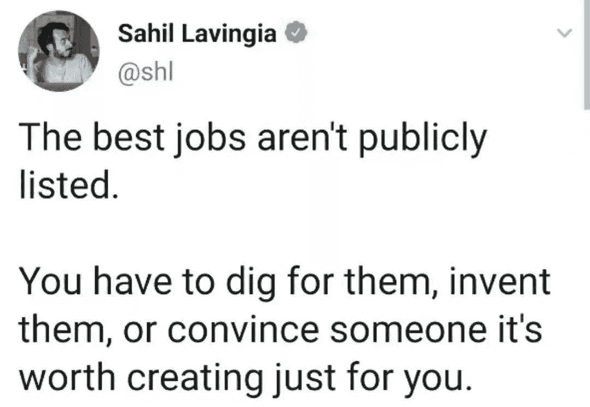

<!--yml
category: 未分类
date: 2022-06-26 00:00:00
-->

# 聊聊我的头两份工作

> 原文：[https://jarodise.com/thoughts-about-lifestyle-design-on-my-33rd-birthday](https://jarodise.com/thoughts-about-lifestyle-design-on-my-33rd-birthday)

我的第一份工作比较特别，工作地点在非洲乍得和喀麦隆接壤的一片广袤的热带草原上。

我所从事的行业叫做电缆测井（Wireline Logging），它背后的科学原理比较复杂，简单地比喻下，就是拿一根电缆，吊着一个特别的“照相机”，下放到油井的最深处，然后再慢慢地拉上来，并在拉上来的过程中给油井井壁拍照的过程。这项工作的主要目的是为了准确测量油井的深度和油层与水层在油井中的位置。

油田上钻井工作通常都是24小时不间断运行的，而我们的工作通常开始于每口油井完钻（钻井结束）的时候，这时候钻井队会把钻杆从油井中提出来，把井口交接给我们进行测量。

每口油井的深度都不一样，因此完钻的时间也是不确定的，可能发生在一天24小时的任何一个时段。通常甲方大佬会在预计完钻前的48小时打电话通知我做好上井准备。这时候，我就会在基地把所有的测量仪器进行通电连接测试，然后装车待命。我们一般会在完钻前的24小时携带所有设备来到钻井现场，随时等待井口交接，并开始测井工作。

我的印象中，自己干过的所有测井工作中有一大半都是在深更半夜，有时候遇到极端情况，例如设备出状况，井口垮塌卡住我们的仪器，或者两三口井同时完钻，我们就需要24小时连轴转，我最长的记录是40个小时没有合眼。

况且，我们平时操作的各种仪器里面装有放射源，炸药等危险品，因此容不得有半点闪失，再困也要集中精力，否则后果不堪设想。

当然，也不是每天都会测井。在无井可测的时候，我们的日常生活还是很规律的，早上6点起床，7点开早会，12点吃午饭午休两小时，下午工作到6点左右下班。好处是，我们住的地方和工作的地方都在一起，所以基本不需要通勤。

我在乍得的几年中，测井和不测井的时间差不多55开。实话实说，在井场干起活来，工作强度还是蛮大的。这时候就体现出了外企的人性化管理，深知到在这种环境下进行如此高强度的工作，一般人都坚持不了太久，因此我们的工作实行四周轮休制，即连续工作28天，然后休假28天。这么看来，我的第一份工作其实并没有大部分人想象中没有那么不堪。而且每到休假，都可以跟公司申请买到全世界任意一个地方机票，我也正是靠着在非洲工作的这几年，积累了不少旅行经验。

## 跳槽的分割线

我的第二份工作就职于国内一家上市民营企业，到山东烟台总部报道的第一天我就感觉到了些许不对劲，为期两周的入职培训，我们被安排住在公司附近的一家快捷酒店，这倒没什么，但是我居然需要跟另外一个同事合住一个标间。也许是之前被外企的出行住宿标准宠坏了吧，这件事让我对这家公司的第一印象打了很大的折扣。

后面的培训过程就更有意思了，公司业务讲得比较少，企业安全规范也是蜻蜓点水，几乎超过一半的时间都是在讲所谓的“奉献”，“真诚”，“奋斗“，”狼性”。

这令我感到非常不安。

培训过后就开始了朝8：30晚5：30的上班生活，这也是我人生中第一次需要进行上下班打卡。后来我惊奇地发现，这公司还有所谓的大小周末，意思就是隔周的周六正常上班，我当时找了个一个老同事问：”这样做难道不违反劳动法？”，他笑着对我说：“公司是省里的纳税大户，你觉得上面会管么？况且山东这面民营企业普遍都是这样。”

还好，我当时应聘的是海外市场，所以在烟台摸了两周鱼后，我就来到了迪拜。本以为逃离了压抑的环境，可以大展拳脚。结果却掉进了更大的坑。这公司在阿联酋的业务已经开展了几年，却一直起色不大。在迪拜只租了一套三室一厅的公寓，连办公室都没有，平时我们就在客厅的餐桌上支起电脑办公。最要命的是，我们的顶头上司跟我们住在一起，每天24小时抬头不见低头见。有时候，晚上吃完饭了，你觉得已经下班儿了，打开电脑看个电影，这时候他会突然从房间出来说：“某某公司发了刚刚发了一份标书你赶紧看看，或者明天我们要去见某某客户，你准备一下。”每到这种时候，我心中都是万“马”奔腾。分分钟都想辞职走人。

在一次的设备调度的过程中，本来就由于上面的安排混乱导致诸事不顺，公司的某位自以为是的小领导还不停地在我耳边给我讲大道理，教我做人，我终于没忍住，心中的怒气喷薄而出，也在那个时刻，我知道，我在这个民营企业的日子走到头了。回到山东烟台后，我毅然决然地拿着刚发到手的转正通知书到人事部门办理了离职手续。

掐指一算，我已经离开所谓的职场超过5年的时间了。虽然我现在做的事情跟我之前的从事的行业毫无关联，但是我依然要感谢这两份工作为我的人生转变带来的量变积累。我的第一份外企工作让我人生中头一次尝到了做一名世界公民的滋味，同时赋予了我“work hard，play harder”的人生价值观，虽然它并不是一份我热爱的工作，但是它给予我的经济上的回报，和丰富多彩的人生经历都为我后面转型做内容创业打下了很好的基础。而我的第二份工作则让我清晰的看到了国内某些民营企业资本家的伪善和对劳动力毫无节制地剥削与洗脑现象，它也让我意识到顺着所谓的“corporate ladder”往上爬并不是我想要追求的人生目标。

正如我很尊敬一位硅谷投资人Naval Ravikant所说："**A taste of freedom can make you unemployable**. "正是这一前一后两份形态与性质完全不同的工作经历，让我变成了一名"highly employable"的“游民”。第二份工作辞职之后，我甚至没有一丝一毫想要再去找一份工作的欲望。而这也正标志着我放弃之前所有一切学历光环和工作经验，从0开始进行内容创业的新起点。

前不久我在推特上看到一段话，颇有感触：

换句话说，如果一个工作机会以招聘启示的形式出现在了公众的视野里，那么即便它是很多人眼中所谓的金领dream job，也八成存在很多隐性的trade-off。 真正好的工作，要么是你通过非常规渠道深挖后找到的，要么是你说服别人为你量身定制的，要么是你通过创业的形式为自己创造的。我人生中的头两份工作，都是我通过招聘启事找到的，特别是拿到第一份工作的offer我一度认为自己中了头彩，身边的同学也将我视为温拿，但是后来才发现，这不过是一个幻觉。

我很庆幸，自己在而立之年，如梦初醒，用将近5年的时间为自己重新打造了一份能养活自己而且能支持自己旅行的工作。我也希望借此文章与众多职场遇到挫折，还在苦苦寻找心目中dream job的朋友们共勉，希望我的经历能对你们有所启示。

**本文系Jarod Zhang原创，如需转载请联系作者授权。坚持原创不易，你的打赏和转发是我继续创作的最大动力。**

数字游民部落致力于推广目前在全世界日益流行的数字游民（Digital Nomad）生活方式，和Lifestyle Design的方法和理念。

数字游民知识星球是目前华文圈最权威的数字游民（Digital Nomad）生活方式设计主题社群，最大的数字游民/远程办公/环球旅行中文资源库，云集环球旅行，远程办公，自由职业等各路达人大V。长按下方二维码加入数字游民知识星球，开启你的生活方式设计之旅。

 数字游民部落官网：[JARODISE.COM](http://JARODISE.COM)

微信公众号：数字游民部落

> 原文始发于微信公众号（数字游民部落）：[聊聊我的头两份工作](http://mp.weixin.qq.com/s?__biz=MzIyMjAwNzAzNg==&mid=2650207806&idx=1&sn=6db9e9e57fdc91c2171245d47baf8514&chksm=f0364dadc741c4bb60c5dc7f9127f62dad7c303fb1269cfc7147876efa5adf3b8376abc8a283&token=454952603&lang=zh_CN#rd)