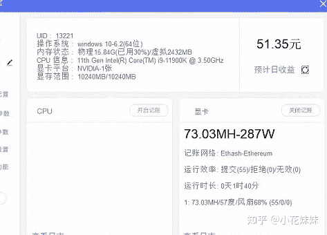
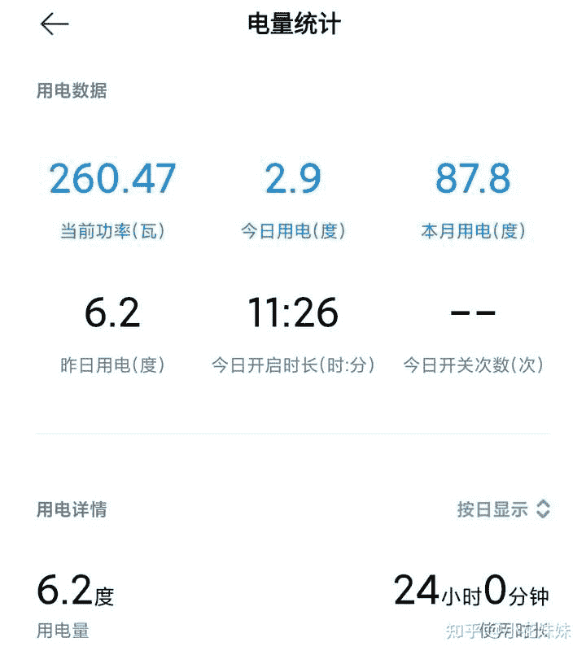

<!--yml
category: 挖矿
date: 2022-06-26 00:00:00
-->

# filecion是挖矿，有哪些风险！？

> 原文：[https://www.zhihu.com/question/451338207/answer/1817292949](https://www.zhihu.com/question/451338207/answer/1817292949)

 第一，你要明白挖矿是稳赚不赔的。一个小时结算一次，晚参与一小时就少赚一小时的钱。所以我只让大家考虑挖矿，而从不建议炒币。

截图里的软件是[哈希宝](https://link.zhihu.com/?target=http%3A//app.behash.com/reg/invite/O14BJF6q)

教程参考：

第二，挖矿**不会损坏显卡**，因为挖矿都是超频显存，限制核心功率。不满载，温度一般会维持在40-60度之间。而且现在挖矿不会“黄屁股”

挖矿回血只能说是维护自己出二手时候的利益。因为不管你挖不挖都会被**按照矿卡处理**

第三，还存在“**不够电费”**想法的人，请不要信口开河。更新一下自己知识库不丢人。

图片感受一下大佬的威力。

2070的用电量用事实说话

用的是小米的智能插座统计的电量

最近更新了一下，发现溢价相对比较少的笔记本挖矿成为了最好的选择

我只能提醒大家：保留好箱说，其他的就不多说了

白嫖和解决散热的方法在这里

**挖矿专场**丨[锁算力卡挖矿](https://zhuanlan.zhihu.com/p/399409039)丨[未锁卡挖矿教程](https://zhuanlan.zhihu.com/p/355955385)丨[笔记本挖矿](https://zhuanlan.zhihu.com/p/360451565)丨[锁算显卡怎么挑](https://zhuanlan.zhihu.com/p/374342633)丨[挖矿毁显卡吗](https://zhuanlan.zhihu.com/p/358944242)丨

**猴山专场**丨[猴山解密3080TI](https://zhuanlan.zhihu.com/p/379179943)丨[猴山解密3070TI](https://zhuanlan.zhihu.com/p/379428935)丨[买70TI还是80TI](https://zhuanlan.zhihu.com/p/379846007)丨[猴山冲4K](https://zhuanlan.zhihu.com/p/380129626)丨

**笔记本专场**丨[满血版笔记本怎么挑](https://zhuanlan.zhihu.com/p/374748213)丨[买3060还是70本](https://www.zhihu.com/question/447817962/answer/1909204347)丨[3050本评价](https://www.zhihu.com/question/462045112/answer/1913547325)丨[蛟龙7测评](https://zhuanlan.zhihu.com/p/369226521)丨