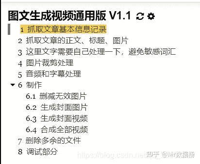
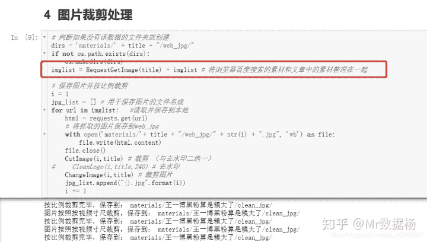
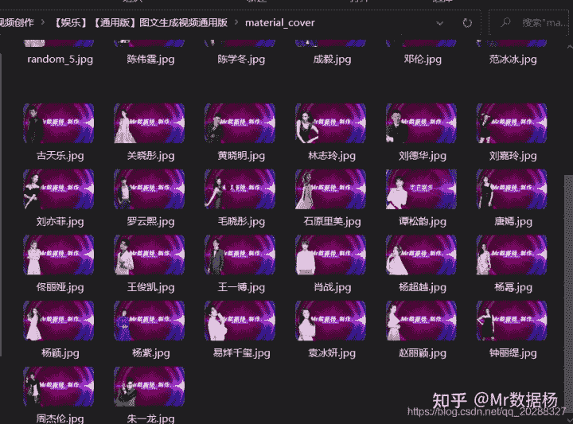
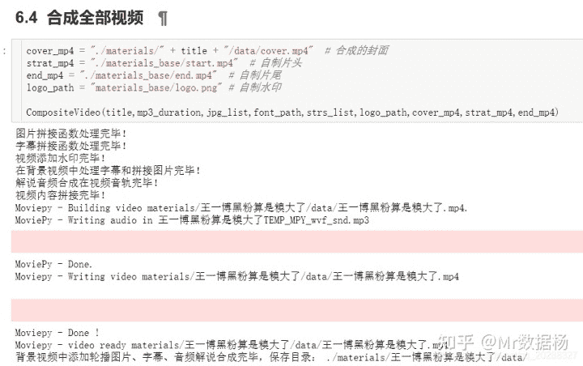
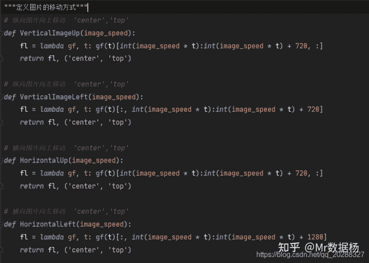
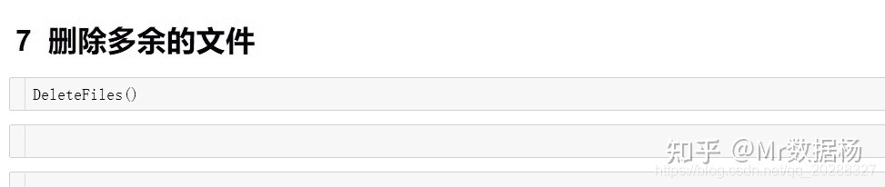

<!--yml
category: 视频
date: 2022-04-26 11:46:11
-->

# 「MoviePy 图文一键生成视频 V1.1」自制图文转视频工具增加图片显示特效功能 - 知乎

> 来源：[https://zhuanlan.zhihu.com/p/351087442](https://zhuanlan.zhihu.com/p/351087442)

继续钻研的原则，效仿百度AI 图文一键生成模式继续改进业务。

继上一篇

「Mr数据杨的图文一键转视频 V1.1」

对代码进行了一些修正和改进，主要修改功能如下：

1.  增加互联网相关图片抓取模块
2.  增加视频封面自动选取模块
3.  视频封面和开头视频模块合并，提升制作效率
4.  视频整体合成不在分步执行，提升效率
5.  增加图片随机移动效果
6.  简化生成文件的目录、文件
7.  增加删除无用文件功能

V1.1 版本成品预览

更多内容

## 工程目录

## 更新内容展示

## 1.增加互联网相关图片抓取模块

## 2.增加视频封面自动选取模块

根据算法自动根据文章匹配视频封面

## 3.视频封面和开头视频模块合并，提升制作效率

## 4.视频整体合成不在分步执行，提升效率

## 5.增加图片随机移动效果

## 6.简化生成文件的目录、文件

## 7.增加删除无用文件功能

清理MoviePy生成的临时文件

