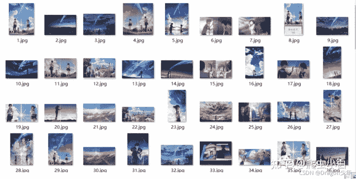
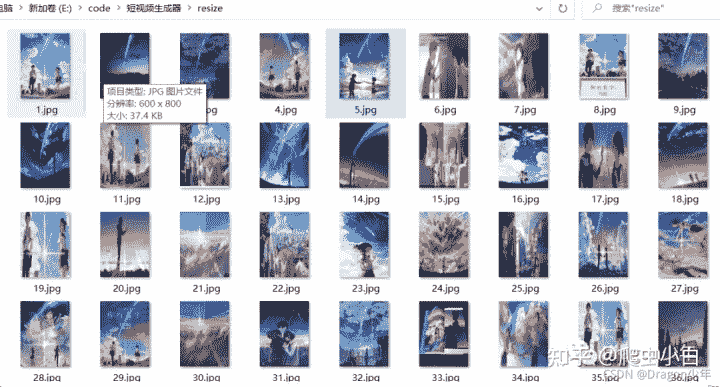
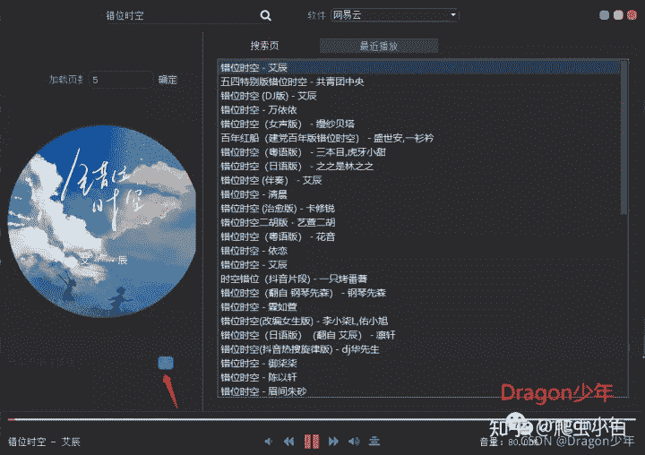
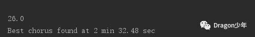
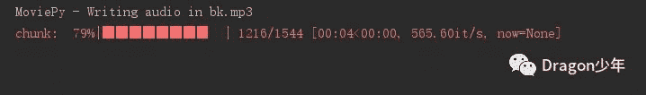

<!--yml
category: 视频
date: 2022-04-26 11:45:14
-->

# 一起用Python做个自动化短视频生成脚本，实现热门视频流水线生产！ - 知乎

> 来源：[https://zhuanlan.zhihu.com/p/411257396](https://zhuanlan.zhihu.com/p/411257396)

### **前言**

前几天有粉丝和我说，最近在网上看到一些视频营销号一天能发布几百条短视频， 感觉都是批量生成的，能不能用Python做个自动化短视频生成脚本呢？

今天就带大家一起用Python做个自动化视频生成脚本，实现热门视频批量流水线生产，一起来看看吧~

[](https://link.zhihu.com/?target=http%3A//console.v4.dailiyun.com/user/%3Fchannel%3Djyy-wtnew)

### **一、核心功能设计**

首先我看了网上那些视频营销号的视频，大多数都是围绕一个主题通过几张图片进行视频轮播展示并添加一些热门歌曲作为背景音乐。

知道了大概的思路，接下来我们可以通过以下几步进行实现：

*   通过关键字进行图片批量爬取
*   对爬取的图片进行筛选并批量进行大小resize统一
*   将统一大小的图片进行视频合成
*   根据选取的歌曲，截取合适的背景音乐
*   将视频和截取的背景音乐合并

### **二、实现步骤**

### **1\. 图片爬取**

当然如果小伙伴已经有视频素材了，只想给视频直接添加背景可以直接跳到第四步；如果已经有图片素材不需要爬取了，可以直接跳到第二步。

第一步，我们可以根据需要的视频主题进行关键字图片搜索，对图片进行批量爬取。例如我们以日本动漫《你的名字》作为主题，通过输入关键字，爬取动漫相关的图片。核心代码如下：

```
def dowmloadimg(html, keyword, startNum):
    headers = {'user-agent': 'Mozilla/5.0'}  # 请求头
    pic_url = re.findall('"objURL":"(.*?)",', html, re.S)  # 找到符合正则规则的网址
    num = len(pic_url)
    i = startNum
    subroot = root
    txtpath = subroot + '/download_img.txt'
    print('找到关键词:' + keyword + '的图片，开始下载图片...')
    for each in pic_url:
        a = '第' + str(i + 1) + '张图片，图片地址:' + str(each) + '\n'
        b = '正在下载' + a
        print(b)
        path = subroot + '/' + str(i + 1)
        try:
            if not os.path.exists(subroot):
                os.makedirs(subroot)
            if not os.path.exists(path):
                pic = requests.get(each, headers=headers, timeout=10)
                with open(path + '.jpg', 'wb') as f:
                    f.write(pic.content)
                    f.close()
                with open(txtpath, 'a') as f:
                    f.write(a)
                    f.close()
        except:
            traceback.print_exc()
            print('ERROR！！！当前图片无法下载！！！')
            continue
        i += 1
    return i
```

```
words = input("请输入关键字: ")
root = './' + words
if not os.path.exists(root):
    os.makedirs(root)

# 参数为需爬取的页数
for i in range(2):
    url = 'http://image.baidu.com/search/flip?tn=baiduimage&ie=utf-8&word=' + words + "&pn=" + str(
        pageId) + "&gsm=?&ct=&ic=0&lm=-1&width=0&height=0"
    pageId += 20
    html = requests.get(url, headers=headers)
    lastNum = dowmloadimg(html.text, words, lastNum, )  # 执行一次获取60张图
```

至此我们就可以根据关键字将图片爬取下来，并将图片根据**数字顺序命名**，如下图所示。





### **2\. 图片统一格式大小**

第二步，我们需要将获取的图片进行**大小格式统一**，方便后面的视频合成。这里我们可以自己手动筛选部分需要resize统一大小的图片，也可以对爬取的整个文件夹下图片批量统一格式大小。对于图片大小尺寸可以通过代码进行设置，这里我们将所有图片大小统一成600*800的。核心代码如下：

```
# 将所有图像resize成600*800，并保存
def resize_image(image_name):
    # 获取输入文件夹中的所有文件
    files = os.listdir('./' + image_name)
    output_dir = './resize/'
    # 判断输出文件夹是否存在，不存在则创建
    if not os.path.exists(output_dir):
        os.makedirs(output_dir)
    for file in files:
        if file[-4:] == ".jpg":
            img = Image.open('./' + image_name + '/' + file)
            # 将所有图片均转成RGB，防止图片格式异常
            img = img.convert('RGB')
            # resize图片大小设置成600*800
            img = img.resize((600, 800), Image.ANTIALIAS)
            img.save(os.path.join(output_dir, file)) 
```





### **3\. 视频合成**

第三步，我们可以将这些格式大小统一的图片进行视频合成，这里我们可以把整个文件夹中的图片全部合成，也可以自己手动选取部分。合成的时候我们根据图片的数字命名顺序进行一次合并，核心代码如下：

```
def charts2video(img_path, video_path):
    """将给定目录下的图片转成视频
        img_path: 图片路径
        video_path: 输出视频的路径名称
    返回: 图片转成的视频
    """
    images = os.listdir(img_path)
    images.sort(key=lambda x: int(x[:-4]))  # 以名称字符串的数字从小到大排序  
    fps = 1.5  # 帧数
    fourcc = cv2.VideoWriter_fourcc('D', 'I', 'V', 'X')
    im = Image.open(img_path + images[0])
    video_writer = cv2.VideoWriter(video_path, fourcc, fps, im.size)
    for img_i in images:
        frame = cv2.imread(img_path + img_i)
        print('开始将 ' + img_i + ' 加入视频\n')
        video_writer.write(frame)  # 图片尺寸必须和视频尺寸一样，不然不会被加入视频中！！！
    video_writer.release()
```

这里如果我们要控制视频每秒钟播放的图片张数，可以根据**fps代表的每一秒播放多少张图片对帧数自行设置**，从而完成图片的视频合成。

### **4\. 截取背景音乐**

第四步，在背景音乐截取前，我们首先需要**确认视频时长**，这样我们才能截取适时的背景音乐。所以我们可以先获取视频的长度，返回的就是以s为单位的视频时长，核心代码如下：

```
def get_video_time(filename):
  cap = cv2.VideoCapture(filename)
  if cap.isOpened():
    rate = cap.get(5)
    frame_num =cap.get(7)
    duration = frame_num/rate
    return duration
  return -1
t = get_video_duration('./你的名字.mp4')
```

视频时长知道了，接下来我们就要进行背景音乐截取了，

今天我们就使用这款自制的音乐播放器来下载我们需要的音乐。例如我们就以《错位时空》作为背景音乐，我们可以先通过这款音乐播放器将这首歌下载到本地。如下图所示。





音乐下载完毕，接下来就是音乐截取，这里我们提供了两种方式。一种是截取歌曲高潮部分，另一种是自己选取歌曲截取区间。

**歌曲高潮自动截取：**

经常刷短视频的小伙伴，可以看到网上很多短视频背景音乐都是歌曲的高潮部分。那么Python能否自动获取歌曲的高潮部分呢？当然！Python已经考虑到了，可以自动截取歌曲高潮部分，这里我们需要用到**pychorus模块**，具体这个是如何实现，大家可以网上查资料研究研究。

首先我们需要安装下pychorus模块

安装完成后，导入pychorus模块，一行代码调用就可以实现，这里传入的**参数t**就是上面我们获取的视频时长，这样可以确保截取的背景音乐和视频时长一致，方便视频和音乐合成。

同时我们还需要注意下，一般一首歌曲的时长大概3-4分钟，所以我们**传入的t最好不要超过1分钟，否则可能会出现高潮截取失败**。核心代码如下：

```
from pychorus import find_and_output_chorus
chorus_start_sec = find_and_output_chorus("./错位时空 - 艾辰.mp3", "./错位时空_high.wav", t)
```

如下图，我们知道了视频的时长是26s，然后截取背景音乐，自动获取的高潮部分是从2分32秒开始，时长26s。至此我们就可以把当前歌曲的高潮部分截取出来进行最后的视频和音乐合并了。





**自定义截取歌曲区间：**

如果本身我们的视频长度较长，截取不到歌曲高潮部分怎么办呢？我们可以进行自己定义歌曲截取区间来获取背景音乐，下面就演示下，截取歌曲从20s开始到90s结束，核心代码如下：

```
# 截取背景音乐
audio_background = mpy.AudioFileClip('./错位时空 - 艾辰.mp3').subclip(20, 90)
audio_background.write_audiofile('bk.mp3')
```





### **5\. 视频和背景音乐合并**

第五步，我们需要把视频和刚刚截取好的背景音乐进行合并，合成一个新的视频，核心代码如下：

```
def add_music():
    # 读取代码视频
    my_clip = mpy.VideoFileClip('你的名字.mp4')
    # 截取背景音乐
    audio_background = mpy.AudioFileClip('错位时空_high.wav')
    # 视频中插入音频
    final_clip = my_clip.set_audio(audio_background)
    # 保存最终视频
    final_clip.write_videofile('result.mp4') 
```

至此，整个视频就可以自动生成，实现热门视频流水线生产了！