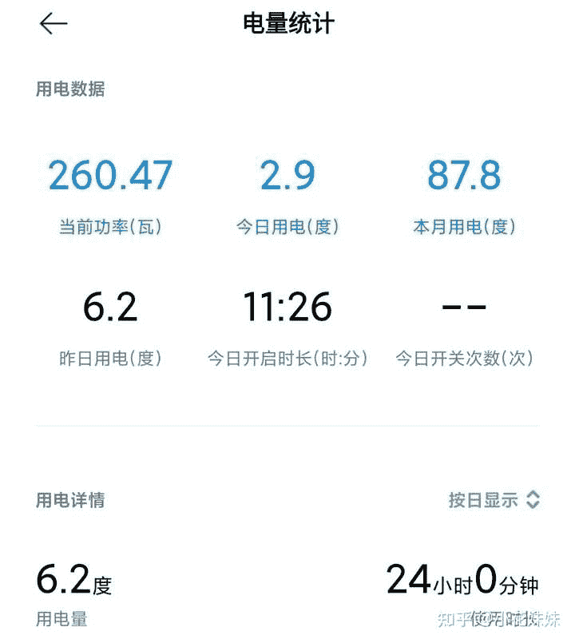

<!--yml
category: 挖矿
date: 2022-06-26 00:00:00
-->

# 个人电脑间歇挖矿有多大损害？

> 原文：[https://www.zhihu.com/question/446914639/answer/1780681463](https://www.zhihu.com/question/446914639/answer/1780681463)

 ## 先上结论:温度稳定60度以下，没有损耗。

先介绍下情况，24小时开启。

自用的2070 OC显卡，技嘉的品牌，应该是质量过硬。

超频方面使用的是官方推荐，内存频率+800，核显频率–150，入坑比较晚。一月份才开始挖的。

可以明确的告诉大家不会损伤显卡，具体解释可以看一下这里

**不要担心坏显卡，核心都是强制降频为了省电。**

如果想学习简单易操作软件，可以参考一下：

为了为了研究电费问题还特意入了一个小米的智能插座。一定要买这个版本，不然不带电量统计的功能。

最后核查下来基本上每天稳定6度电左右。成本基本可以忽略。

两个月下来，显卡没有任何问题。基本没有关机过。

画质不是吃显卡的网络游戏，开着也不会卡顿，可以同时开着。但是单机大作就不行了。

楼主如果担心显卡问题，我可以给你一个安心的理由。因为现在主流都是以太坊，吃的是显存。所以哪怕是显存坏了，重新焊接一颗显存花不了多少钱。最多也就是几天白挖了。

**挖矿专场**丨[锁算力卡挖矿](https://zhuanlan.zhihu.com/p/399409039)丨[未锁卡挖矿教程](https://zhuanlan.zhihu.com/p/355955385)丨[笔记本挖矿](https://zhuanlan.zhihu.com/p/360451565)丨[锁算显卡怎么挑](https://zhuanlan.zhihu.com/p/374342633)丨[挖矿毁显卡吗](https://zhuanlan.zhihu.com/p/358944242)丨

**猴山专场**丨[猴山解密3080TI](https://zhuanlan.zhihu.com/p/379179943)丨[猴山解密3070TI](https://zhuanlan.zhihu.com/p/379428935)丨[买70TI还是80TI](https://zhuanlan.zhihu.com/p/379846007)丨[猴山冲4K](https://zhuanlan.zhihu.com/p/380129626)丨

**笔记本专场**丨[满血版笔记本怎么挑](https://zhuanlan.zhihu.com/p/374748213)丨[买3060还是70本](https://www.zhihu.com/question/447817962/answer/1909204347)丨[3050本评价](https://www.zhihu.com/question/462045112/answer/1913547325)丨[蛟龙7测评](https://zhuanlan.zhihu.com/p/369226521)丨