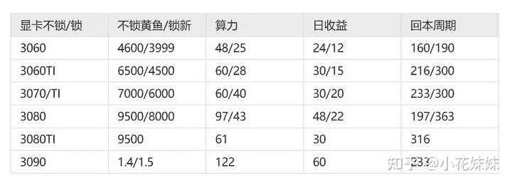
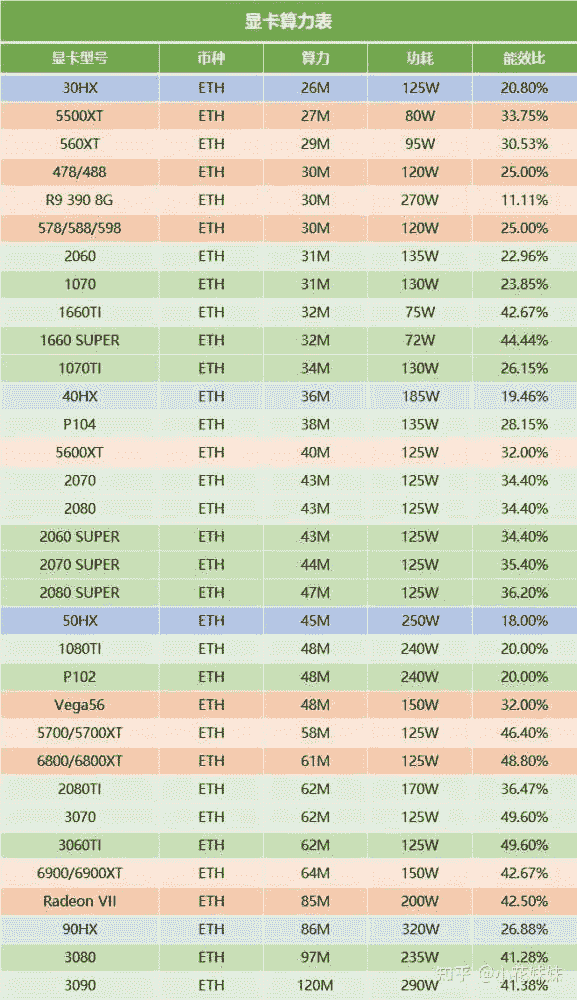
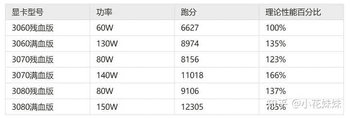

<!--yml
category: 挖矿
date: 2022-06-26 00:00:00
-->

# 为什么都八月一日了低端显卡还在涨价，京东所有1070一夜之间涨了400?

> 原文：[https://www.zhihu.com/question/476445468/answer/2036797120](https://www.zhihu.com/question/476445468/answer/2036797120)

 ### 市场决定价格，各个显卡的回本周期和收益我都替大家总结了，直接抄作业吧。

需要注意的是，回本周期是你投入一万元现金，回本一万元现金的周期。也就是说你回本的那一天，还会有显卡作为残值在你手里。那就是你的实际“收入”比如一张3090回本，那么目前的价格来说，3090的残值还有将近**1.4万元**的残值。

### 最近为了绕过锁算力显卡和5G显存才能挖ETH的限制，矿工又研究出了锁算力都能挖的RVN，收入已经超过ETH两倍了，锁算力显卡的价格又要炸了。

### 以下是ETH的算力和回本周期

**教给大家怎么算收益**，截止到今天21.8.3日，算力的价格基本上是日收益0.5元。也就是一张 3090显卡每天产出的金额是60元左右。

目前来说涨价的根本原因就是ETH涨价导致挖矿的收益又提高了，所以才导致矿工又开始加卡了。30系列显卡目前来说新卡只有锁算力版本，3090没有锁算力但是成本太高。所以矿工的魔爪只能伸向了20系列显卡和10系列显卡。

### 20和10系列显卡的算力和价格我都给大家放这里了，对半砍就是日收益。

这也是为什么这场波动并没有影响30系列显卡价格的主要原因，3060虽然被人谈及最多，作为入门级最被大众化喜爱。但是单从性能和性价比来说，个人更加推荐3060TI显卡，提升十分巨大。

而3070TI基本就站在了2K分辨率的天花板，通吃目前的所有游戏。

### 移动端方面

3060满血版的笔记本最低也要8000元左右的价格，但是性能方面却有点差强人意。如果想真正的把2K屏幕充分的理由起来，玩的爽玩的顺畅，还是推荐尽量上3070。当然价格也非常感人，需要一万多的价格。

**而且需要指出的是：**

**1、笔记本没有锁算力版本。**

**2、残血版和满血版算力一样。**

**挖 矿 专 场**丨[挖矿教程](https://zhuanlan.zhihu.com/p/355955385)丨 [笔本挖矿](https://zhuanlan.zhihu.com/p/360451565)丨[挖矿毁显卡吗](https://zhuanlan.zhihu.com/p/358944242)丨[矿卡也质保](https://zhuanlan.zhihu.com/p/386391253)丨

**锁 算 专 场**丨[锁算卡挖矿](https://zhuanlan.zhihu.com/p/398651881)丨[RVN和ERGO教程](https://zhuanlan.zhihu.com/p/402971584)丨[锁算卡挑选](https://zhuanlan.zhihu.com/p/374342633)丨[挖矿知识点合集](https://www.zhihu.com/question/461044682/answer/1994951468)

**笔记本专场**丨[满血版笔记本怎么挑](https://zhuanlan.zhihu.com/p/374748213)丨[买3060还是70本](https://www.zhihu.com/question/447817962/answer/1909204347)丨[蛟龙7测评](https://zhuanlan.zhihu.com/p/369226521)丨