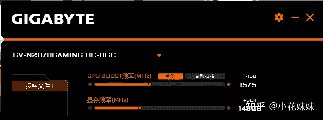
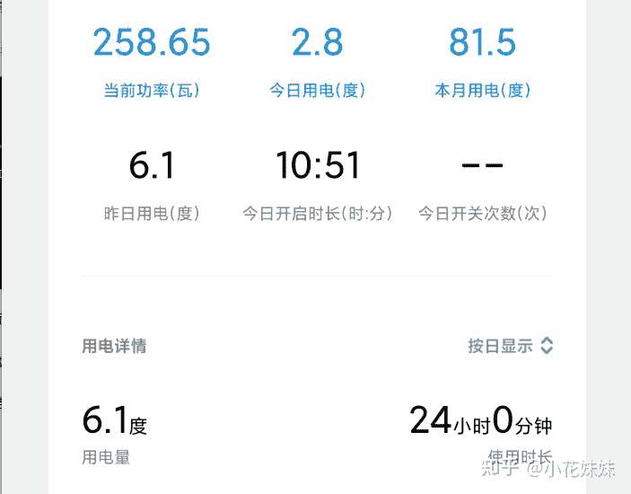

<!--yml
category: 挖矿
date: 2022-06-26 00:00:00
-->

# 五月份显卡会恢复正常价格吗？

> 原文：[https://www.zhihu.com/question/445365770/answer/1782558221](https://www.zhihu.com/question/445365770/answer/1782558221)

 还是那句话，看**币价。**

**而且比特币的币价只是参考，看的是以太坊的币价。**

显卡降价有一个很好的节点极限值。

什么时候显卡挖以太坊的的日收益不足以支撑**电费，**基本上就是显卡归为正常，大量玩家抛售的时期。这个时间节点，需要什么样的**条件**呢？我来给大家分析一下。

科普一下目前的狂潮。

以太坊就是抓住了比特币吃**核显**，而专业的矿机已经上升到大众无法接受的状态。

另辟蹊径用**显存**来进行计算算力，成为了目前排名第二的主流币，也是目前全民挖矿的主要原因。

换句话理解，目前所有的显卡，基本挖的都是以太坊，而不是比特币。

而以太坊的特点，只要是5G或以上显存的显卡，都可以参与。

我认为这才是**矿潮**的主要原因，并不是**单纯**的币价高。

日常显卡的**年收益**列表在这篇文章里，这里仅介绍我的个人情况

例如：我的2070 技嘉 OC为例，我的超频设置是显存+800，核显-150

核显不是超频，而是强行降频减少功耗和散热。所以并不会像比特币时期那样，让核显超负荷运载导致发黄等问题。而显存如果坏了只要重新焊接一颗就好了，没有什么大的技术含量，对于设备的损耗，并不会形成太大的问题，避免了略微懂电脑的人，对于设备的心疼（ETH老谋深算啊！）

而**电量**问题，我特意购买了小米的只能插座来监测耗电量。结果如下图。

也就是说，需要我们每天的日收入**不足4元**左右的情况下，会出现集中的显卡降价场面。

以目前的日收益来说，很难，需要**750%**的降幅。哪怕是目前降到每天只有5块钱，那也找不出拒绝的理由啊？

虽然作为龙头大哥的比特币随便降个十几点，整个新闻界都要抖三抖。我认为到每天收益不到4元的那一天，还比较遥远。

有显卡的，每个月多挣个房租钱，没显卡的，吃瓜看看戏。

这是我作为在非主流币亏过几辆五菱宏光的忠告。

**挖矿专场**丨[锁算力卡挖矿](https://zhuanlan.zhihu.com/p/399409039)丨[未锁卡挖矿教程](https://zhuanlan.zhihu.com/p/355955385)丨[笔记本挖矿](https://zhuanlan.zhihu.com/p/360451565)丨[锁算显卡怎么挑](https://zhuanlan.zhihu.com/p/374342633)丨[挖矿毁显卡吗](https://zhuanlan.zhihu.com/p/358944242)丨

**猴山专场**丨[猴山解密3080TI](https://zhuanlan.zhihu.com/p/379179943)丨[猴山解密3070TI](https://zhuanlan.zhihu.com/p/379428935)丨[买70TI还是80TI](https://zhuanlan.zhihu.com/p/379846007)丨[猴山冲4K](https://zhuanlan.zhihu.com/p/380129626)丨

**笔记本专场**丨[满血版笔记本怎么挑](https://zhuanlan.zhihu.com/p/374748213)丨[买3060还是70本](https://www.zhihu.com/question/447817962/answer/1909204347)丨[3050本评价](https://www.zhihu.com/question/462045112/answer/1913547325)丨[蛟龙7测评](https://zhuanlan.zhihu.com/p/369226521)丨