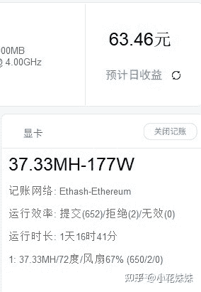

<!--yml
category: 挖矿
date: 2022-06-26 00:00:00
-->

# 以太坊挖矿用什么软件?

> 原文：[https://www.zhihu.com/question/450299612/answer/1793357825](https://www.zhihu.com/question/450299612/answer/1793357825)

 先说一下自身情况，

自用技嘉2070，24小时不间断运行了小半年了，没有任何问题。核心温度基本60度以下。每天6度电。

## 教程可以参考这里：

如果你对挖矿是否对显卡有损伤保持怀疑，可以学习一下这里

以太坊是目前矿潮的主力。而很多人还停留在挖比特币不挣钱的旧思想当中。这是需要科普的。

比特币需要的是核心频率挖矿，而以太坊需要的是显存频率挖矿，基本上是两个不同的概念。

而以太坊因为不需要核心频率的属性，造成了挖矿时候是限制核心功率的，保守的人甚至限制到了60%，所以不会出现显卡损耗和“黄屁股”的问题。而且基本上近几年的显卡都可以做到有收益，才造就了如今的矿潮。

如果想大量资金涌入投资，个人持保守意见。

**挖矿专场**丨[挖矿教程](https://zhuanlan.zhihu.com/p/355955385)丨 [笔本挖矿](https://zhuanlan.zhihu.com/p/360451565)丨[挖矿毁显卡吗](https://zhuanlan.zhihu.com/p/358944242)丨[矿卡也质保](https://zhuanlan.zhihu.com/p/386391253)丨[自造矿机教程](https://zhuanlan.zhihu.com/p/410470347)

**锁算专场**丨[锁算卡挖矿](https://zhuanlan.zhihu.com/p/398651881)丨[RVN和ERGO教程](https://zhuanlan.zhihu.com/p/402971584)丨[锁算卡挑选](https://zhuanlan.zhihu.com/p/374342633)丨[挖矿知识点合集](https://www.zhihu.com/question/461044682/answer/1994951468)

**笔记本专场**丨[满血版笔记本怎么挑](https://zhuanlan.zhihu.com/p/374748213)丨[买3060还是70本](https://www.zhihu.com/question/447817962/answer/1909204347)丨[蛟龙7测评](https://zhuanlan.zhihu.com/p/369226521)丨