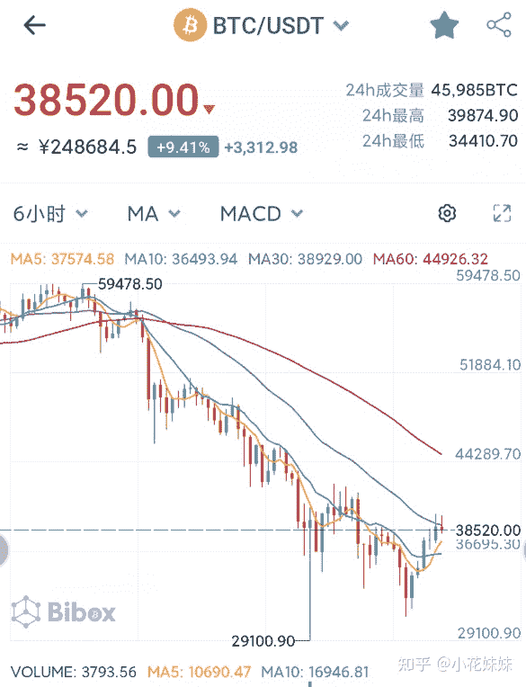
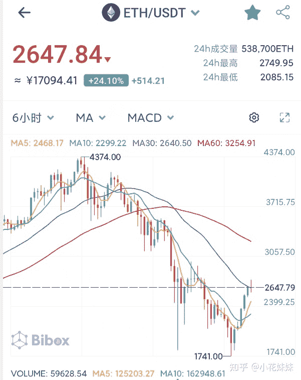
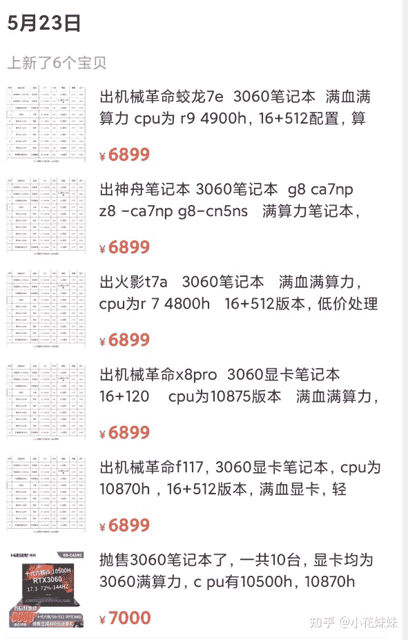
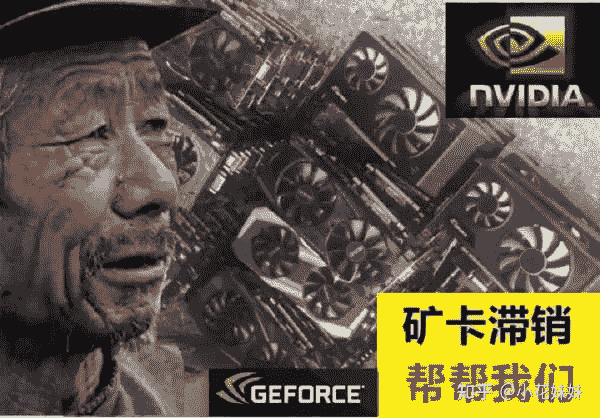
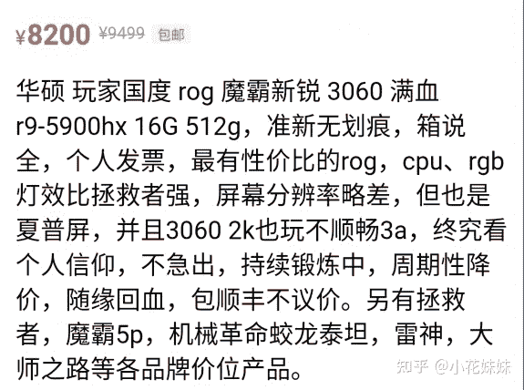
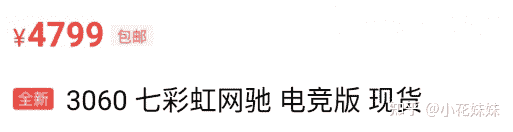
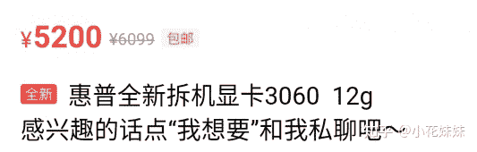
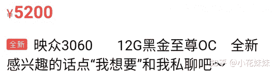
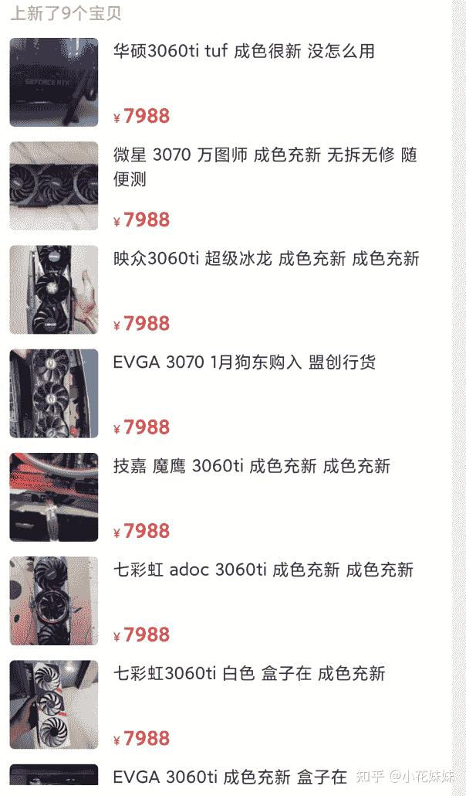

<!--yml
category: 挖矿
date: 2022-06-26 00:00:00
-->

# 你今天矿难了吗？看看你的显卡和笔记本海鲜市场还值多少

> 原文：[https://zhuanlan.zhihu.com/p/375027179](https://zhuanlan.zhihu.com/p/375027179)

## 3060显卡海鲜市场已经跌破5000大关！

## 首先说一下目前的币价

以比特币为首的虚拟货币军团在前几日跌破2.9WUSDT以后，目前正在稳步回温。目前正在接近4W左右的大关。这波重创基本上对于杠杆玩家和矿工收入都有决定性的影响。此次回声个人认为意在绞杀做空的投资者。根据我以前的文章可以明白，BTC的涨跌其实对矿工的影响并不大，主要的观察对象还是ETH。

我们再来看一下ETH的行情，在BTC跌破2.9W的时候，以太坊同期滞后的跌破2000大关。最低触底1740左右。同比最高点ETH接近2.5W人民币近乎腰斩。但是这波BTC的回温来UI比，以太坊的回稳势头非常大，这也导致了矿工的收入也基本恢复正常。

3060的算力为48左右，日收益仍旧可以维持20+元的日收益

## 笔记本行情

目前来说，显卡的价格并没有什么明显的波动，但是在海鲜市场已经有甩货的迹象出现。是否是造势低价收显卡，还是部分投资者已经开始撤机，我们仍旧需要观察。

笔记本方面，挖矿的主力就是满血版的笔记本，注意下图的神州笔记本，**满算力并不代表满血满性能。**因为ETH主要是依靠显存频率，所以满算力只是同型号的显存频率。这里需要区分。而满血笔记本主要是显卡可以达到130W的功耗性能，才可以确定为满血笔记本。

3060的笔记本和3060的台式机性能虽然有所差距，但是满血版的笔记本算力是和台式机完全一样的，算力基本可以维持在48-49左右，狠超可以达到51。主要还是看散热能不能稳得住。散热方面，笔记本有很多的方法。很多矿主是直接拆出笔记本主板进行散热，出本的时候把主板装回去就可以了。外观无使用痕迹，非常的难以区分。

3060笔记本行业的标杆：ROG魔霸新锐，以前来说抢到就是赚到。到手以后可以在海鲜市场**加价1000-1500元**出售。海鲜市场的价格基本都是破万。当然买ROG的主要玩家还是对游戏洗能和信仰之眼有所期待，所以才会选择那么高溢价的笔记本，对于矿主来说，神州才是他们的最高性价比选择。而目前的币价导致了魔霸新锐也有所影响。加价的行情已经过时，目前海鲜市场魔霸的价格，基本上明摆价格就接近8000元大关。个人认为再等等，讲讲价：7000左右就可以交易，因为已经有明确摆价7999的机器了。

满血版的3060笔记本，还有蛟龙7和联想拯救者R9000P系列。其他没有明确标注130W的笔记本仍旧是残血版60W的3060。做工方面，联想的拯救者是明显优于蛟龙7的。同样价格也有所提升。毕竟拯救者使用的是R7 5800H的处理器，比蛟龙7的R7 4800H性能高出约15%左右。外观方面，蛟龙7采用的是全塑料外壳，而联想采用金属AB面，整体质感也是胜出一筹。如果是追求极致性价比的话请无脑选择蛟龙7，拯救者的2.5K分辨率屏幕对于游戏性能提出了比较高的要求。

如果想挑选一款满血版的3060笔记本自用，那么可以参考一下这里。残血版和满血版的3060显卡都有所统计。个人认为如果是单纯的玩游戏，那么满血版的3060是值得拥有的。

### 显卡行情

先说3060显卡，目前全新价格仍旧维持在7000出头的价格。距离原价卡2499仍旧有不小的差距。海鲜市场方面基本已经破5000的大关，但是目前的币价一直是回温的趋势，是否仍旧会引起矿主扫货我们不得而知。目前的卡量来说，基本都是散户的体量，大矿主基本没有什么动作。所以后续发展我们拭目以待。

而3060TI方面，作为挖矿方面的虚空神卡。基本上全部流入了挖矿的矿老板手中，在玩家手中的卡极少。因为和3070等同算力，所以基本上可以参考3070的价格减一点。就不逐个截图了。目前的市场价格直接列表。

海鲜价格基本上是讲讲价能交易的价格，当然肯定有一分钱不讲的货主，自行参考。

| 显卡型号 | 全新价格 | 海鲜价格 | 算力 | 目前收益 |
| 3060 | 7099 | 4600 | 48 | 20 |
| 3060TI | 10000 | 7600 | 60 | 25 |
| 3070 | 10999 | 7700 | 60 | 25 |
| 3080 | 16799 | 12500 | 100 | 35 |

目前来说，币价整体都在回温，后续发展仍旧有不确定性。好处就是目前的矿工收入基本稳定住了，经历过触底矿工对于自己的收益也有了一定的预期。

### 我们的口号是：3090买3090

**挖矿专场**丨[锁算力卡挖矿](https://zhuanlan.zhihu.com/p/399409039)丨[未锁卡挖矿教程](https://zhuanlan.zhihu.com/p/355955385)丨[笔记本挖矿](https://zhuanlan.zhihu.com/p/360451565)丨[锁算显卡怎么挑](https://zhuanlan.zhihu.com/p/374342633)丨[挖矿毁显卡吗](https://zhuanlan.zhihu.com/p/358944242)丨

**猴山专场**丨[猴山解密3080TI](https://zhuanlan.zhihu.com/p/379179943)丨[猴山解密3070TI](https://zhuanlan.zhihu.com/p/379428935)丨[买70TI还是80TI](https://zhuanlan.zhihu.com/p/379846007)丨[猴山冲4K](https://zhuanlan.zhihu.com/p/380129626)丨

**笔记本专场**丨[满血版笔记本怎么挑](https://zhuanlan.zhihu.com/p/374748213)丨[买3060还是70本](https://www.zhihu.com/question/447817962/answer/1909204347)丨[3050本评价](https://www.zhihu.com/question/462045112/answer/1913547325)丨[蛟龙7测评](https://zhuanlan.zhihu.com/p/369226521)丨