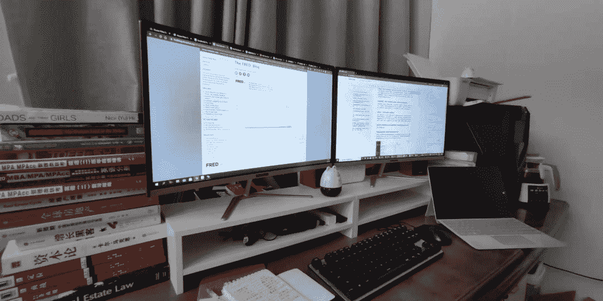
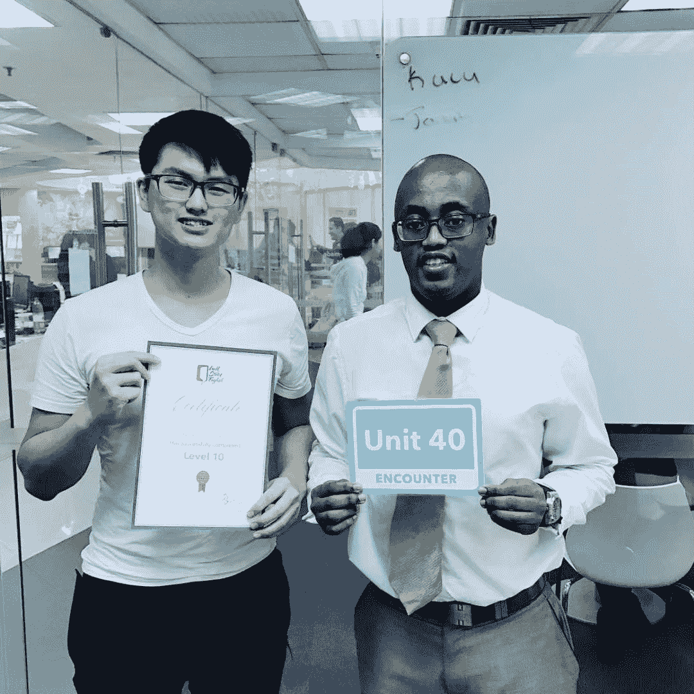

<!--yml
category: 访谈
date: 2022-06-28 10:41:57
-->

# 你好鸭 #11 | 大学开始远程工作，我没上过一天班。 | 电鸭

> 来源：[https://eleduck.com/posts/EQfBzz](https://eleduck.com/posts/EQfBzz)

## ▌介绍下你本人的经历及当前所做的事情吧？

大家好，我是Jonah，长期居住在广州，平时喜欢打羽毛球，研究经济学，房地产！从大学开始一直在西雅图一家初创房地产投资公司远程做了5年投资咨询工作，每年有1个月在美工作。

原本的计划是2020年3月到美国留学，毕业后由我的老板帮我申请H1B。原本是这么计划的。2019年12月武汉疫情爆发，2020年1月西雅图出现了美国第一起新冠案例，并且以极快的速度扩散，2月封闭了中国前往美国的航班，3月份学校关闭，最终决定不前往美国。

​
2020年疫情在美国全面蔓延，市场变差，9月裸辞创业，筹备自己的公司Homes Panda，帮国内的客户投资海外房产，附加海外银行开户，房产贷款的等业务。来到电鸭社区除了想找到同样远程工作的同志交流，也想找一份数据类的远程工作增加稳定的现金收入。

###### ▲ 左2是我：）

## ▌什么样的契机，让你有了远程的想法？是如何获得第一份远程机会的？

这份远程的工作是我大学的教授介绍的，大一的时候进入了教授的工作室做项目，突然有一天他拉了一个微信群，里面是他在美国微软总部工作的儿子，准备创业，想要找一个学生兼职写文案。当时觉得是个不错的机会就做下来了，有了这份兼职之后大学我在也没拿过家里的钱。

## ▌远程之后，工作和生活都发生了哪些变化？

因为一直是远程工作，所以没办法跟自己对比，只能跟身边的朋友对比。我负责公司的网络推广所有的网络营销部分，包括网站管理，SEO，文案撰写，客户咨询等，每周完成固定工作即可，每周跟老板汇报一次工作，平均每天大概工作4-6小时。对比大部分同龄人和同学，幸福度很高。有大量的时间做自己喜欢的事情，学哲学，经济学，英语，理财投资，旅游，打球，看动漫，玩游戏，逛展会，做咖啡，调酒等。

我真心的感谢这家公司，特别是我的老板 Nick 对我的帮助，不仅仅让我在大二的时候就有到美国工作的经历，Nick “Professional，Honest，King”的理念也将影响我未来思考和做事的方式。

###### ▲ 在美国Yellow Stone黄石公园。

## ▌你每天的工作的时间和效率是这么规划和保证的？给我们拍照看看你的工作台吧

远程工作时主要靠 Google Calendar 来规划和记录，早上花10分钟左右规划出当天的计划，然后实施，跟计划不同部分进行修改。现在更经常在旁边放个小本本记录，随时取用，缺点是不方便上传同步。

工作台：左边是最近看的经济学类书籍，工作技能书籍，以及考研的资料；一个台式机+两个显示器，不管是学习还是工作，总是需要两个显示器；一台Surface，外出工作神器，配合Google Drive和TeamViewer使用。

###### ▲ 我的工作台。

## ▌平时都用到哪些软件/工具来提升效率或者帮助工作呢？

平时的工作沟通和会议我们都用微信就直接解决，文件以前使用Onedrive和OneNote，后面全部迁移到Google Dive和 Google Doc上，会议改成用ZOOM，日程管理工具和任务管理工具我们使用的是Google Calendar，Asana以及大量的Google Sheet。对了，还有Shadowsocks+一个稳定的机场。

## ▌很多人说远程易孤独，你是如果排解的？

确实容易孤独，大学有一次舍友都睡了，大半夜在开着灯在写文案的时候突然怀疑自己一个人在做什么，有什么意义，眼泪忍不住溜了出来，想清楚之后就好了。现在的话我有女朋友和两个住隔壁的师兄帮我排解孤独。我妈的话至今认为我是失业人士，让亲戚给我找工作。

## ▌对于那些也想开始远程工作的同学，你有什么建议么？

我在毕业远程工作2年后遇到了瓶颈，市场以及公司业务转型让我的收入降低了不少，而在这家公司多年的经验，反而让成为了我离不开这里的一点。电鸭社区里大部分人是技术岗位，这是令我很羡慕的，因为不管去哪个国家都有竞争力。英语，证书和过硬的专业技术水平是远程工作的保证，这是我要反思的。

###### ▲ 在盐湖城大盐湖。

## ▌国内外远程工作的现状及发展趋势上，你有着怎样的思考/理解/判断？

是否远程工作本质上是人的工作地点与居住地点的问题。

在美国，招聘远程工作人员是很常见的，甚至于没有办公室也很常见，我们公司10人左右，就有6个远程工作。房产经纪团队没有固定办公室，客源主要来自网络和老客户介绍，Showing 的时候直接经纪人跟客户拉个群，确定好位置开车过去带客户看一整天，交易流程也全部在电脑上完成。甚至于很多其他国家的客户都是拍个视频，他们给钱就行了，客户全程跟我们没有物理上的接触。

美国能够实现这种运营方式的根本在于多年的基础建设，包括房源全部上线，房源多重上线系统（MLS）的构建，线上交易系统，线上税务系统，成熟的房产管理系统，养老金和保险系统等，可以说你的业务问题大多可以在网上实现。

中国在政务系统在这几年也取得了很大的进步，深圳目前是做的最好的，比如“最多跑一趟”系列，税务系统的更新，个人社保等等。中国对商业模式的创新能力比美国更强，如果将各种政务系统上线，远程工作的机会会越来越多。

## ▌这种跨国别、语言及文化的远程工作，在沟通方式及上有什么需要特别注意的？或者说，国内开发者如果跨境远程，会遇到哪些困难和挑战？

在文化上，每个国家会有一些禁忌，风俗以及职场浅规则，可以提前了解。最重要的是要保持开放，积极的心态，多表达自己的看法，展现自己文化的特点和让你自豪的地方，也能包容文化差异。

###### ▲ 公司万圣节的装饰。

## ▌国内不少有意向跨境的同学，很多都卡在了英文的部分，对此，可否给一些建议？

英语没有捷径，如果有强大的自我驱动力，网络上有充足的资源，线下也有头马之类的英语演讲俱乐部，再根据你的需求筹备托福/雅思或者GRE/GMAT就好了。

如果你没有足够强的自我驱动力，就花钱去华尔街，英孚，或者出国读个语言班，按部就班两年左右就能看到很大的进步。

###### ▲ 在华尔街学习时候的照片。

## ▌最后，广告时间（征婚/交友/宣传/招人/带货等随意：）

很开心能够加入到电鸭这个社区，我问我女朋友要不要在这里发个征婚帖，她说不用了。如果可以希望可以同时加电鸭的猎头团队。

## ▌如何联系我？

如果你想和我认识并聊点什么，欢迎来社区找我：）
[https://eleduck.com/users/5nh3rd](https://eleduck.com/users/BXwh1l)