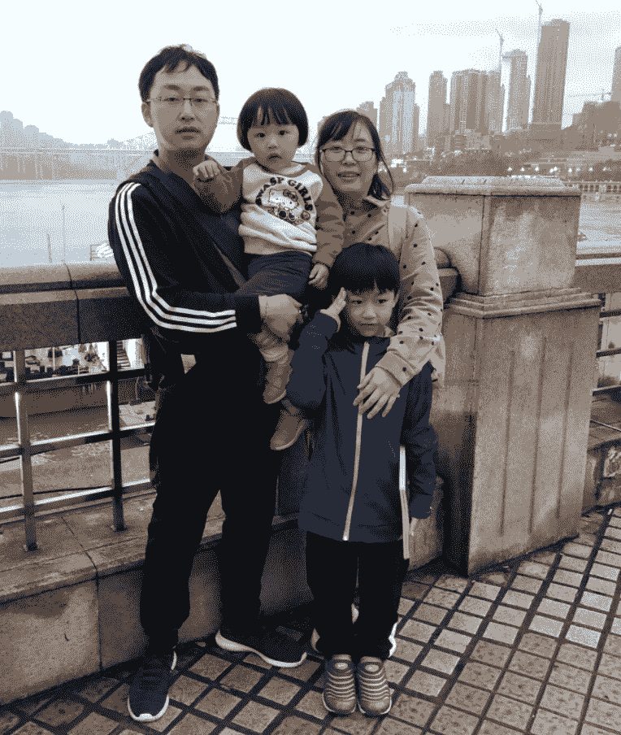
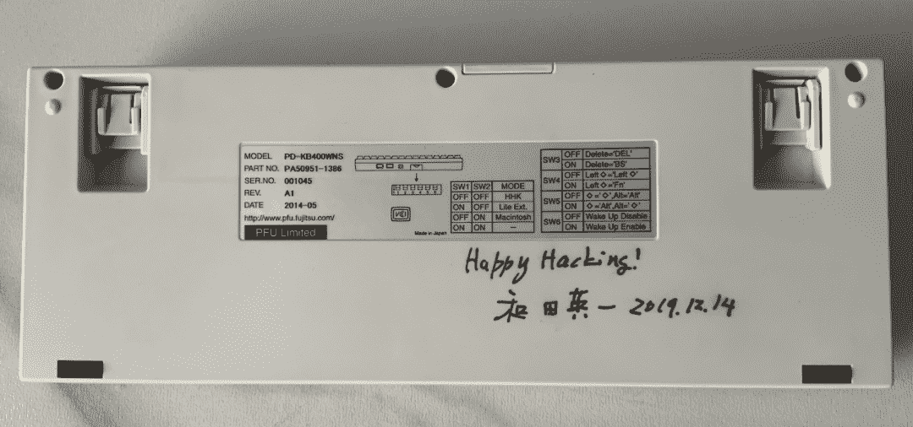

<!--yml
category: 访谈
date: 2022-06-28 10:37:41
-->

# 你好鸭 #13 | 八年远程，一儿一女，这大概是我见过最爱折腾工作区的男子。 | 电鸭

> 来源：[https://eleduck.com/posts/0XfkEq](https://eleduck.com/posts/0XfkEq)

**嗨，**

**你好鸭，**

**我是Jerry。**

## ▌介绍下你本人的经历及当前所做的事情吧？

大家好，我是Jerry，育有一儿一女，现居昆明，践行远程工作好几年了，自我评价是：爱家庭胜过一切的野生程序员。工作主要面向 Web 技术栈，偏后端，16年 Ruby/Rails 使用经验（目前想转 Elixir/Rust ），函数式编程狂热份子，Scheme是我的最爱（虽然实际工程中用不上），前端略懂（可以干活）。

2005年北京一所三流学校毕业，电子信息工程，大四的时候看到一本讲 HTML 的书，被吸引住了（名字到现在都忘不掉，很中二的《HTML亲密接触》哈哈），后来顺带了解了Java相关的开发知识，最后走上了现在的道路。

###### ▲引领我入行的HTMl书，现在还保留着。

一开始选Java是因为毕业设计一堆课题都是做硬件电路的，平时学得已经很烦了，看到唯一的软件课题就选了。做完毕设对Java入了门吧，毕业回到老家（昆明），因为媳妇（那会儿还是女朋友）还在上学，就想着找个公司待着等她毕业再一起做打算，谁知道这一待就是八年（第一家公司是电网下属的科技公司，怎么说呢，很闲不过也是因为这样才有时间通过自学提升自己），06、07年正是Rails框架火的年代，没能免俗追潮流用来写了公司内部应用，八年时间一共翻了四个版本，从1.0一直用到5.0……

## ▌什么样的契机，让你有了远程的想法？是如何获得第一份远程机会的？

2013年初突然觉得自己不能这样继续闲下去（毕竟国企性质的单位，工作氛围死气沉沉的，时间长了对个人职业发展很不利），于是辞职去了朋友的小公司做互联网应用，谁知道好景不长，可能是因为商业模式不行，不到半年老板就歇菜了，开发全遣散回家。

也就是这个时间点，有了一个远程的机会，严格来说应该算是自己第一次接外包，在家待业的两个月，做了个电商网站（后来也没了），发现原来不用去办公室坐班也能把活干好养家糊口，所以之后的择业目标也定下了必须要可以远程！虽然后面因为拗不过好友的邀请，也坐了一年的班，但心里始终觉得远程才是自己的归属，再加上两个宝宝的相继出生，在家办公已经成了唯一选择。

###### ▲ 正在给大灰写访谈，哈哈

最近一份全职远程是16年底，通过朋友推荐获得的，物联网、医疗健康行业，在里面主要负责技术框架的选型、服务器端研发。公司规模很小，严格来讲应该算是小作坊，所以入职后基本上是一个人干几个人的活儿，比较累不过也挺锻炼人的，基本上除了嵌入式软件没有参与编写，其他的都做了；除了能在家干活这一点，技术栈选型比较自主（因为压根没其他人搞）也是吸引我继续留在里面的理由，在这里我可以用 Rails 做 Web API，React 写前端，Elixir 实现并发服务，后面还打算上 Rust Wasm。

## ▌远程之后，工作和生活都发生了哪些变化？

嗯，怎么说呢，这么多年，远程工作已经完全融入了自己的生活。每天不用准点上下班，只要保证任务搞定就好。早上7点起床给小孩（哥哥）准备好早餐，7点半叫醒妹妹，打理好送进幼儿园，接下来的时间就可以完全投入到工作上了，虽然时不时会有一些紧急情况（生活中的琐事）会中断手头的任务，但可以灵活的安排其他时间来补上，根本没必要连续8小时对吧（也不现实，想想以前坐班的时候，哪能保持这么长时间的专注度）。

我在想，如果不是远程工作，我要怎么解决接娃的问题呢？哥哥上小学，周一下午3：40就放学，但是妹妹却要等到5：20……如果坐班，早退是免不了的了，或者只能依靠老人帮忙。但是现在这些事情我自己就能搞定，接小孩花费的时间，晚上适当延长一下多干点就行，没人逼着打卡真的很开心。

###### ▲ 和家人一起旅行重庆。

不过最近因为重写整个系统，任务比较重，已经连续加班两个月了，晚上一不小心就过了凌晨……很多人（特别是当老板的）觉得远程员工不好管理和掌控，我觉得完全没有必要，要真较真起来，有效工作时间肯定比坐班长多了，毕竟在自己习惯的环境，效率会高很多，单位时长的产出自然就更高。

## ▌你每天的工作的时间和效率是这么规划和保证的？给我们拍照看看你的工作台吧

项目不紧张的时候（常态），9点前能进入工作状态，中午12点午休吃饭，下午1：30左右继续，中途会根据小孩放学情况调整出门时间，回到家继续工作一个半小时到一小时收工；项目紧张的时候比如最近，晚上会加班两三个小时（撸码得劲了还不止这么长）赶进度，时间安排灵活度比较高就是了。

工作台我觉得要好好说一下，程序员毕竟整天面对电脑，通过各种外设跟计算机交流，没有一个好的办公环境是不可能做到事半功倍的。而且啊，圈子里面经常看到很多朋友都患上了职业病，什么颈椎、腰椎间盘突出、鼠标手这些都很常见，真的需要万分注意才行。

我的工作区经过很多次迭代才逐渐成型。来看看 1.0 版本的工作台吧：

###### ▲ 工作台1.0

*   显示器：BenQ PD3220U 32寸4k横屏 + ViewSonic VP2785-4k 27寸4k竖屏

*   显示器支架：爱格升高杆版，三支架（有一个用来夹iPad）

*   键盘架：Humanscale的G5还是什么信号

*   座椅：Humanscale Freedom

*   键盘：HHKB Professional 2 Types（DIY版，后面单独介绍这个）

*   鼠标：Magic Trackpad 2 深空灰、肯新通 Pro Fit Ergo Vertical 轨迹球

*   脚垫：也是 Humanscale 的，型号搞忘记了，特色是踩上去可以滚动

这是一开始的工作台，桌子是打书柜时让师傅一起安装的，当时没有装修的经验，桌面离地太高了点又不能升降，所以必须要加键盘托才行。我在键盘左右两侧分别放置了触控板和轨迹球鼠标，功能互补，兼顾人体工学的同时效率大大提升。键盘是经典的 HHKB Types，但是我个人不太喜欢原厂的调教，所以改造了下，换了胶碗、推杆、静音垫、键帽，甚至主控也换成了蓝牙版，现在舒服多了（35g的压力克数比原厂轻很多）：
​

###### ▲ 改造后的HHKB Types

这把键盘的特别之处还在于，背后有老爷子的签名（和田英一是HHKB的设计者，19年参加粉丝会时有幸见了一面：）

###### ▲ 和田英一的签名。

优门设的椅子比较傻瓜，没有太多可以调节的地方，人坐上去就靠体重来触发装置贴合身体，所以更适合体重大的胖纸们，太轻的反而使不上劲儿，所以不推荐给女孩子用；椅子座垫比较软，但是因为材质是皮的，夏天会有点热就是了。另外他这个扶手只能上下调整，不能左右和旋转，间距对我来说稍微宽了点比较遗憾。

去年因为疫情不能出去，在家待的时间明显更长了，决定试试升降桌，所以才有了现在的 2.0 版工作区：

###### ▲ 2.0版工作区。

*   升降桌：WitTable 4 Pro Max 黑胡桃桌面

*   椅子：冈村 contessa 2

*   显示器：微星 PS341WU 准5k 21:9 带鱼屏

*   显示器支架：爱格升 45-475-216

*   音箱：声擎 A2+

*   扩展坞：CalDigit TS3+

*   显示器挂灯：BenQ ScreenBar Halo

*   键盘：HHKB Professional Hybrid Type-S 修改版（35g胶碗）

*   鼠标：Trackpad一代、Elecom Hugo 轨迹球

相比之前的『坐式办公区』，现在可以坐站交替了，基本上我的节奏是坐一个小时站起来半小时，坚持了大半年感觉非常不错，推荐大家也试试。桌下黑色的是一块软胶脚垫，站立办公的时候踩上去比直接穿拖鞋舒服很多，关键是周围凸起的部分可以切换站姿，让你站着的时候花样多一些哈哈，有条件的话还是备一块比较好。

这把冈村的 Contessa 2 我要大力推荐，可调节的部分很多，包括座椅高低、倾斜角度、力度，特别是扶手可以上下、前后、左右以及水平旋转，比优门设那把更有设计感。这张桌子我没有安装键盘托，因为桌面高低、扶手都可以调整到一个舒适的位置，更适合长期撸码了。

键盘是HHKB官方双模静音板，也被我改造成低压力克数，就是为了敲起来省力点；鼠标换成了Trackpad一代，搭配宜丽客的Hugo轨迹球，这个轨迹球自带掌托，除了没蓝牙外没什么毛病好挑，推荐给想缓解鼠标手症状的朋友。

CalDigit的雷电三扩展坞在这里很重要，借助它帮我达成了桌面视觉无线的目的，MBP雷电线连上去，充电+数据传输都搞定了，如果很在意桌面整洁度的话，不妨搞一个咯。至于小米音箱，完全是为颜值买单，摆桌面当个闹钟还蛮不错的；明基挂灯就不用评测了吧，新版Halo升级了无线控制器和背光灯，灯管长度也增加了大约5厘米，价格跟之前的Plus比也没涨多少，推荐。

桌面上还有一些摆件，蜻蜓平衡扩香器、小绿植（卷叶密叶龙血树）、几个手办（赵灵儿/爬行Q版蜘蛛侠、死侍）都起到了点缀的作用，干活累了瞄一眼，也是挺舒缓身心的哈哈。

另外显示器下面还放置了见南花的小书立，摆几本最近在看的书充充电，毕竟程序员嘛，需要时刻学习，你懂的。

## ▌平时都用到哪些软件/工具来提升效率或者帮助工作呢？

*   撸代码用 vs code 和 sublime；

*   table plus 用来操作数据库；

*   Tower 是我最推荐的 Git 可视化工具；

*   Dash 离线查文档 API；

*   Paw 发请求测试后端接口；

*   Margin Node 看书记笔记；

*   PixelSnap 强烈推荐，可以测量屏幕上任何可见元素的尺寸大小（虽然xscope也可以，但是这个漂亮啊）；

*   CleanShot X 个人人为是Mac上最好用的截图工具了；

*   ominigraph 用来画各种流程图和示意图，真的好。

## ▌远程工作对沟通依赖度很高，你和你的团队是有怎样的经验来提高沟通的效率及质量的？

借助现有的语音、视频聊天工具，定期连线讨论就好，再结合文档和图示，个人基本上没有遇到不能说清楚的问题。

## ▌作为一个父亲，给我们讲讲远程之于孩子，之于教育的影响和意义吧。

远程工作之后，你会有更多的精力陪伴孩子，坐班通勤耗费的时间分一点给娃娃们不是挺好吗？对我个人而言，最大的感触就是，孩子会更依赖自己了，因为不管发生什么事情，我都会第一时间出现在他们身边，这应该能增强娃娃的安全感吧。

另外就是，对于喜欢辅导娃娃的家长来说，远程带来的时间自由度，也能更好的满足你当老师的需求。在他们看来，在家办公也是很正常的事儿，潜移默化中你也在培养娃娃们的『Free』精神吧，这是好事情。

## ▌很多人说远程易孤独，你是如何排解的？

确实很孤独！但是没有办法，选择在家工作就得接受孤独，没事就多出去走走，或者也可以带上电脑出去人多的地方干活，我个人喜欢去公园，既能见到人，还能找一个相对僻静的地方，挺好。然后就是，多加几个技术群，结交志同道合或者兴趣爱好差不多的朋友呗，合适的场景当个话唠也没什么不好。

## ▌对于那些也想开始远程工作的同学，你有什么建议？

年轻的时候还是建议去大厂待待，见见世面比较好；再说了，先把社交能力提升了，对日后完全投入远程工作帮助也大，不容易变得自闭孤独。

## ▌如何联系我？

如果你想和我认识并聊点什么，欢迎来社区找我：）

[https://eleduck.com/users/R4hlOR](https://eleduck.com/users/R4hlOR)