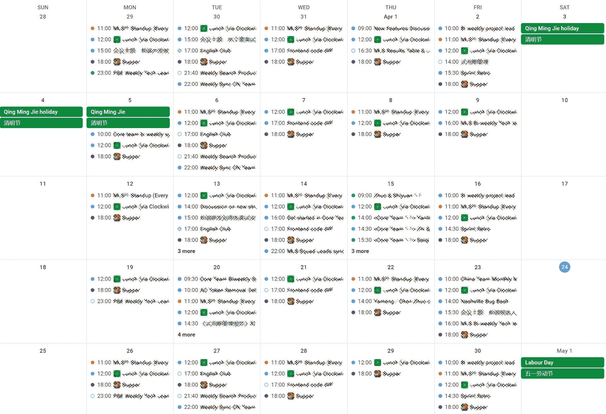

<!--yml
category: 访谈
date: 2022-06-28 10:39:31
-->

# 你好鸭 #17 | 远程工作终于带给了我梦寐以求的 Work-Life Balance。 | 电鸭

> 来源：[https://eleduck.com/posts/jAfoym](https://eleduck.com/posts/jAfoym)

**嗨**

**你好鸭**

**我是陈小一**

## ▌介绍下你本人的经历及当前所做的事情吧？

我是陈小一，目前在电鸭社区[长期位居招聘榜首的远程团队](https://eleduck.com/posts/EQfBbj)中，负责一些团队管理工作，同时用 React + TypeScript 参与公司项目的前端开发。业余时间主要是伺候猫主子和玩游戏，也会做一些自娱自乐的 Side Projects。

我在职业生涯中接触的东西比较杂。初期我是做 WinForm、MFC 和 WPF 等桌面客户端的，对后端开发和 Web 项目比较熟悉以后，开始做全栈开发。前端框架御三家喜欢 Angular 和 React，后端开发方面，我对 .NET、Node、Python 和 Go 比较熟悉。几年前，我在游戏公司做了四五年的游戏，后来国内游戏市场环境恶化，又不想进游戏大厂，于是机缘巧合下就又转行做回全栈了。我喜欢视觉和体验上的东西，所以目前的主业又回到前端开发了。

▲ 我喜欢在“卖船神教”《星际公民》里开着飞船看风景

业余时间我在做自己的独立游戏，但是进展非常缓慢。因为不指着它吃饭，纯粹是做一些自己想做的东西，所以能否成功完全佛系随缘。游戏开发方面除了 Unity 外，我还喜欢用 Godot 做一些小项目，Cocos Creator 也接触过一些。几年前，参加了四次 Ludum Dare 的 Solo 组 48 小时游戏开发比赛，以及一些小型的 Game Jam，但是近来因为没时间，已经很久没参加了。

玩游戏和做游戏，这是我会干一辈子的事。

▲ 一些在 Game Jam 上做的并不怎么好玩的小游戏

## ▌什么样的契机，让你有了远程的想法？是如何获得第一份远程机会的？

当年在苏格兰上学时，有一位教 Business Development 的老师就曾经和我们描绘过身兼多职、远程工作的生活图景，当时我就十分向往，期待着自己有朝一日也能有这种生活方式。

2019年，我所在的初创公司团队转型，解散了技术团队，而恰好当时朋友介绍了一个远程外包项目，加上自己不想再在公司里996，于是在去日本玩了一趟回来后，就接下了这个项目，自己在家一个人开发。

事实证明面对外包项目还是要谨慎……总之这个项目规模有点超出预期，前后做了一年多，披星戴月的赶工期，最后好歹是交付了。虽然在技术方面又有了一定的提升，但是作为野生 freelancer 的整个过程还是比较痛苦的。需求、商务谈判、原型设计、后端、前端、数据库、催款等环节都要自己来，而且最令我头疼的是，在“持续能接到项目”这一点上并没有很好的保障。我非常怀念团队合作的日子。

我很早之前就开始关注电鸭（曾经的一早一晚社区），但是因为手头项目没有结束，也没有余力再开始其他的工作。外包项目正式收尾后，我抱着试试看的心态向电鸭人才库提交了简历，并很幸运地在几周后加入了现在的团队。我惊喜地发现原来远程工作并不一定要单打独斗，而是可以与很多优秀的小伙伴一起成长学习，作为一个团队，一起去快乐的实现目标。

## ▌远程之后，工作和生活都发生了哪些变化？**

最直观的变化就是可以兼顾更多工作之外的生活了，能够有时间帮媳妇儿分担更多的家务和琐事，减少了很多家庭矛盾😂。但是工作效率有时会受到一定的影响，因为家里的两只猫经常来捣乱，或者趴在我面前提醒我该休息了，如果不搭理他们就会挨上一爪……

*▲ 失去梦想的姐姐*

远程工作后，我的工作和生活可以无缝切换，不用花时间在通勤或低效的加班上；我可以在自己最舒服的环境中、用最顺手的设备来工作；可以按自己的意愿来分配工作和休息的时间，并有充足的时间来研究技术、做独立游戏，或是好好照顾一下 steam 库里那 60% 买了却一直没碰过的游戏。

**▲ 永远好奇的弟弟**

想出去玩的时候，我不用再考虑目的地是否人满为患，因为完全可以选择在大部分人都在上班的时间段出行，避开汹涌的人流。

可以说，远程工作终于带给了我梦寐以求的 Work Life Balance。

## ▌你每天的工作的时间和效率是这么规划和保证的？给我们拍照看看你的工作台吧

远程工作最大的好处之一，自然就是时间安排上拥有很大的自由度，相信这也是很多远程工作的小伙伴被吸引的原因。

目前，我每天的时间安排主要是跟着会议走，并且由于需要和美区的同事开会，会议可能会在早上九点到十点，也可能在晚上十点以后。所以如果早上有会而晚上没会，我当天的“下班”时间可能就会早一些；或者反过来，早上多睡一会，把主要的工作时间留到下午和晚上；如果早晚都有会，我可能会在下午做一些自己的事情或比较轻松的工作，让自己的精力被充分地分配到需要集中注意力的任务上。

*▲ 满满的日程*

因为现在的远程工作是在一个大型团队中，需要和其他人配合协作，因此每天的日程会排的比较满。团队的工作方式是自主驱动，每天的工作时间是8小时，不会有人监督和打卡，因此从对自己和对别人负责的角度出发，反而会更督促自己高效地工作，避免因为进度延误而给其他人造成麻烦。“早做完早玩”，如果一直拖延或因为没把事情做好而返工，最后倒霉的还是自己。

▲ 工作游戏两不误。

## ▌平时都用到哪些软件/工具来提升效率或者帮助工作呢？

📚***日常协作类***

**Slack**

日常交流工具。团队对基于 Jira + GitHub 的工作流定制了强大的机器人，协作效率飞起。另外我自己的 Side Projects 也用它作为通知和后台工具。

**Google Docs**

至今为止我还没有见过比它更强大的文档协作工具。另外我是 Google 狂粉。

**Notion**

以前用印象笔记，但是 Notion 的文档组织、Markdown 语法支持、丰富的数据模版等特性，在个人笔记、会议记录、资源整理的体验上都更胜一筹。目前 Notion 的 API 系统正在内测中，等到开放了希望能带来更多的可能性。

**Trello**

自用，作为简易的目标驱动工具。虽然 Notion 也能做看板，但自己用惯了更轻量一点的 Trello。前一段时间，看着越来越长的 Todo-list 我有了一种深深的无力感，所以开始考虑如何用更高效的方式来工作和跟踪任务进展，避免有一堆 WIP 的任务但一件都没法完成。目前初有成效。

**CloudApp 和 OBS**

CloudApp 是公司标配的截图录屏工具，可以做一些简单的截图和录屏展示。对于更复杂的录屏要求，比如前一阵完成的入职培训，我会用 OBS 来录制，然后用 Adobe 全家桶做后期处理。

**Slides 和 Prezi**

以前更多用 Google Slides 来做幻灯片，因为比较方便在团队内分享；但是对于需要稍微酷炫一点的演讲，我会用 Slides 或 Prezi。前者是基于 Web 技术的，可以自定义 CSS 并实现类似 Keynote Magic Move 的效果；后者可以做出动画切换效果非常炫酷夸张的幻灯片。

**Grammarly**

因为经常要写英文文档，我会用 Grammarly 来检查拼写和语法。付费版甚至可以帮忙选择更好的语气和措辞。我最近还在尝试微软的 Editor，同样是一款写作检查工具，感觉也不错。

💻 ***编程工具类***

**Visual Studio Code**

不用多介绍了，地球人都知道。我作为多年的微软粉怎么可能不用它。借用一张图说明问题：

**Vim 插件**

因为我比较懒，伸手够鼠标对我来说是非常繁重的体力活🐶。感谢 Vim 插件救了我的命。

**Code Stream**

团队小伙伴推荐的超级好用的代码协作插件，可以整合 GitHub、GitLab、BitBucket、JIRA、Slack 等一系列工作流工具，无需在各个平台间切换。插件有 VS Code、VS 和 JetBrains 三个版本，可以说非常良心了。

❤️ ***个人私货类***

**Homey**

Chrome 的一个首页扩展，每天换一个漂亮的动态背景，界面设计非常舒服。

**[Raindrop.io](http://Raindrop.io)**

一个收藏夹工具，通过 Group 和 Collection 的双层结构来组织书签，还可以用 Tag 标记和搜索。

**USB切换器**

对于喜欢在桌面环境办公，并且拥有两台电脑的小伙伴，推荐尝试一下 USB 切换器，它可以让 USB 设备在两台电脑之间一键切换。以我为例，我平时工作是在 MBP 上，吃饭看片和玩游戏是在台式机的 Windows 上，并且桌面空间有限，不方便放两套键鼠。通过 USB 切换器，可以随时在两个环境间轻松切换，避免频繁插拔 USB。

## ▌很多人说远程易孤独，你是如何排解的？

说实话我的远程工作并不孤独，因为我所在的团队挺庞大的（快100人了），而且大家都比较活跃，会经常组织技术讨论、视频会议、线上团建游戏等活动。虽然和很多人没有在线下见过面，但从个人感受来讲，已经和在一起面对面工作没有什么太大的区别了。

另外，我们还在 Slack 上建立了很多兴趣同好的频道，涵盖美食、ACG、宠物、英语、摄影、剁手等很多领域，是一个让大家在放松之余能够有更多交流，彼此熟悉，从而更好地在工作中协作的一个平台。

公司还提供了线下团建基金，每个季度一次，前一阵我刚和杭州同城的小伙伴聚了一次，玩了一下午的桌游卡卡颂。因为没有征得其他人同意，所以就不放照片了，哈哈。

突然觉得上面的内容有点像招聘广告……不过总结一下，我对于远程工作排解寂寞的经验就是：

*   加入一个活跃的团队；

*   如果没有机会做到上一条，那么至少应该尽量多和别人交流；

*   沟通时鼓励用视频会议的方式，不但能够增强彼此认同感，混个脸熟，而且也能更好地传递情绪；

*   如果都不行，那么至少应该有个能耐得住寂寞的性子，这样就不会寂寞了🐶

## ▌对于那些也想开始远程工作的同学，你有什么建议？

对于希望远程工作的朋友，我的建议是在不影响生活的前提下勇敢走出第一步，至少可以考虑通过兼职的形式来接触远程工作，亲身体验这种工作方式是否符合你的期待，是否能做到自我驱动，是否会对你的生活有积极的影响。另外，如果有过远程工作经验，那么日后遇到更好的远程工作机会时，你也将在应聘者中更有竞争力。

另外，我会建议选择加入一个靠谱的团队；如果是 freelancer，那么请尽量选择和靠谱的人合作，一定要保证顺畅的沟通渠道，否则因为远程协作本身在沟通交流上存在劣势，在实际工作中可能会让你生不如死。

远程工作并不代表轻松，但我认为它更接近工作本身应有的样子。你可能会发现自己工作和生活的状态都会发生令人欣喜的转变，自己会变成一个更自律、更有目标、更有责任心的人。希望能早日在远程工作者的队伍中看到你的身影！

## ▌最后，广告时间（征婚/征友/合作等，说任何你想说的：）

*   欢迎对独立游戏开发和前端开发等话题感兴趣的小伙伴联系我，咱们一起探讨交流，一起进步。

*   最近想从头开始系统性的学习美术（手绘 or 板绘），如果有不错的课程或老师，也想请大家帮忙推荐推荐，先谢谢各位啦

*   对了，我所在的团队目前正在招聘，如有兴趣，也可通过社区申请加入：[https://eleduck.com/posts/EQfBbj](https://eleduck.com/posts/EQfBbj)

## ▌如何联系我？

如果你想和我认识并聊点什么，欢迎来社区找我：）

[https://eleduck.com/users/jZhzd4](https://eleduck.com/users/jZhzd4)