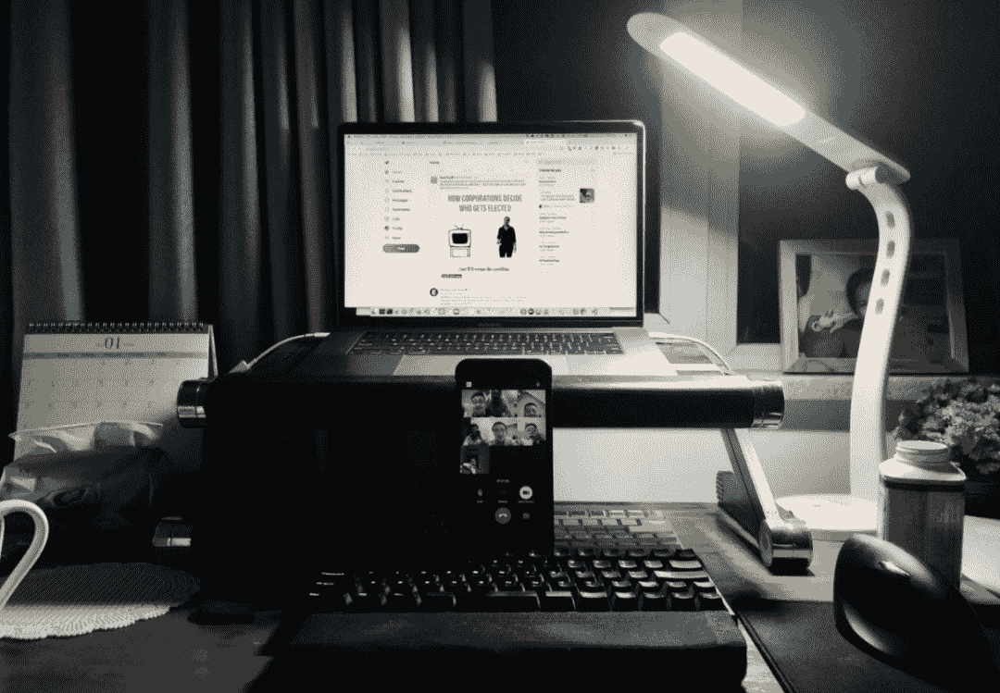

<!--yml
category: 访谈
date: 2022-06-28 10:37:56
-->

# 你好鸭 #18 | 我是Andy，今年是我远程工作的第11年。 | 电鸭

> 来源：[https://eleduck.com/posts/rdfVxO](https://eleduck.com/posts/rdfVxO)

**嗨**

**你好鸭**

**我是Andy**

## ▌介绍下你本人的经历及当前所做的事情吧？

大家好，我是Andy，82年生人，即将踏上四十岁的旅途。

今年是我工作的第17年，也是远程工作的第11年。在远程工作之前，我先后供职了两家公司，一家是偏大型的日本软件外包公司，另外一家是在线教育方面的美国创业公司。这家美国创业公司的工作经历，对我后来转型做远程开发有非常重要的支撑作用，稍后我会展开讲一讲其中的关联。

###### ▲ 远程工作十年纪念日 - 在汉中-阆中一线自驾旅行

目前我和两家美国公司有长期合作，一个主要是做外包项目开发，另外一个是做自己的产品。两家公司都base在美国加州，外包项目的老板跟我合作已经接近十年，做产品的公司老板，也有四五年的合作时间。

外包项目中，我的主要角色是Ruby/Rails工程师，日常工作几乎涵盖Web开发的全栈，我们的项目一直保持与最新版的Ruby/Rails同步，开发框架中新加入的技术，都是我们会快速应用到项目中的技术。

另外一个做产品的项目中，我的角色是前端开发，主要使用React及其相关框架，这个项目已经持续了四年多，React没有来得及升级，导致近几年没有跟上技术发展。

###### ▲ 2021年3月某一周的工作记录

### 

******▌******什么样的契机，让你有了远程的想法？是如何获得第一份远程机会的？

上面提到的美国创业公司，在经过全员几年的奋斗之后，并没有如期得到市场的认可，最后不得不终止运营。但是这份工作中，培养了几个重要的技能，这些技能是我后来能够转型为远程开发的关键。这几个技能概括说就是：英语（包括听说读写的综合能力）、Ruby/Rails开发技能、以及在美国创业公司中得以锻炼的团队协作和沟通技能。

这几个技能组合在一起，恰好迎合了当时硅谷蓬勃发展的创业大潮，当时做Ruby/Rails的圈子很小众，但在美国硅谷，创业公司都喜欢这种技术栈，很快可以开发出来产品原型，在这样的大背景下，美国也逐渐兴起一批知名的、践行远程工作的咨询和开发的软件公司，而我有幸当时加入一家处在头部的远程开发团队Intridea。

在Intridea前后待了四年左右，之后的五六年时间，大部分时间合作的公司，都是Intridea前同事创办的公司或者团队。当然，目前的两份工作，老板也都是之前Intidea的同事。

###### ▲ 远程视频会议

## ▌远程之后，工作和生活都发生了哪些变化？

开始远程工作是2011年3月，一开始是在北京的出租房里，后来回到西安农村的老家，跟父母住了大概两年，小朋友就是这段时间出生的。接着搬到小县城住了三年，小朋友在这里度过了幼儿园最初的两年。再后来，搬到西安，这一住又是四年多。

远程工作让我有居住地选择的相对自由。

除了上面说到的几次迁徙，还有几年是在乌鲁木齐过的暑假，有几回在三亚过的冬天，还有某年长达一个月的美国旅行——当然在旅途中也依然要工作，只不过地域已经不是工作的限制。

###### ▲ 一边带小朋友旅行一边Coding

在过去的十年当中，如果每天上下班通勤各需要一个小时，那么就通勤这一项来说，我省出来大概2*21*12*10=5040小时。这是前几天闪过的一个念头，这笔省出来的时间，就是这十年远程工作的一个bonus。

长期在家里上班，生活和工作最终会出现一种动态平衡。

最早时候，感觉生活被工作干扰，接着觉得工作被生活干扰，再后来是身体有点吃不消，被工作和生活同时干扰，直到最后，发现工作也是生活，生活也是工作，根本不需要分开，关系理清了，身体居然也不抗议了。

现在好了，每天都会工作，只是根据自身状态以及外部环境来决定做多做少，比方目前已经连续工作了150天，有时候一天工作一两个小时，也有几次一天超过10小时，但通常在4-6小时之间。

###### ▲ 不在家的时候 - 经常性各干各的事情

远程工作重大影响，除了上面提到的几点以外，还包括深度融入日常生活。因为每天都跟家人在一起，每天都有相对自由的时间安排，生活和工作有了动态平衡，对生活和工作的理解都会加深，工作和生活相互成全相互支撑，不能维持生活工作平衡的人可能很难体会到这一点。

## ▌你每天的工作的时间和效率是这么规划和保证的？给我们拍照看看你的工作台吧

​长期的训练让我有足够的自律性，所以工作时间不是问题，只需要做好安排，避免一阵子特别累一阵子特别闲。效率不是固定的，分阶段也分项目，也跟经验有很大的关系。远程工作的沟通和计划额外重要，沟通有效率，整个过程都会有效率，计划合理工作强度就会比较合理。对我来说，像基金定投一样，接受效率波动，也接受偶尔的辛苦，持续输出工作量就好了。

###### ▲ 我的工作台

## ▌平时都用到哪些软件/工具来提升效率或者帮助工作呢？

Slack/Gmail/Github/Toggl/VSCode/FILCO/MacBookPro

总体来说，35岁以后我就不是工具控了，越简单越好，不要复杂的功能和流程，约定大于沟通，沟通的最高境界就是不要频繁沟通，最好的沟通就是非实时沟通，假定不能进行实时沟通，然后沟通就会变得有效，实时沟通是个重大陷阱，人们总以为“说”明白就好了，其实“说”明白远不及“写”明白重要。

## ▌很多人说远程易孤独，你是如何排解的？

远程工作的最早几年，确实觉得一个人挺没有意思，除了安排一些体育和休闲活动，基本没有更多的跟人的交互。后来回到西安，我组织了几年社区活动，主要是Ruby社区活动以及GDG（谷歌开发者社区）活动，也通过社区活动结交到一些技术同仁。

然而随着时间的推荐，随着阅历增加，我现在已经很少参加各种社交活动，我特别享受所谓的“孤独状态”，有三五个旧时好友，日常吃喝玩乐，就已经是莫大的乐趣了。

###### ▲ 日常之一。

## ▌对于那些也想开始远程工作的同学，你有什么建议？

在我看来远程的核心能力包括：书面沟通能力、自律性、责任心、以及专业性。不管从事什么类型的远程工作，基本上就是围绕这几个核心能力展开，沟通能力是基础， 自律和责任心确保这个工作可以长期持续朝好的方向发展，专业性是直观的价值体现，像敲门砖一样，没有专业技能，都没有机会展现前三个能力。

所以，对那些也想开始远程工作的朋友，我的建议是：慎始，如果开始了，就要刻意练习，让自己的能力以及产出，配得上客户或者公司对你的信任。

## ▌最后，广告时间（征婚/征友/合作等，说任何你想说的：）

作为一个远程工作者，我同时也是一个写作爱好者，下面是我日常维护一个微信公众号「理性感性惯性」。这个公众号主要记录日常生活的点滴，以及各种跟生活工作、亲子教育、共创式教练相关的主题，欢迎感兴趣的读者移步公众号，那里有和我建立连接的通道。谢谢。

###### 理性感性惯性

理性思考，感兴生活，惯性思考生活。