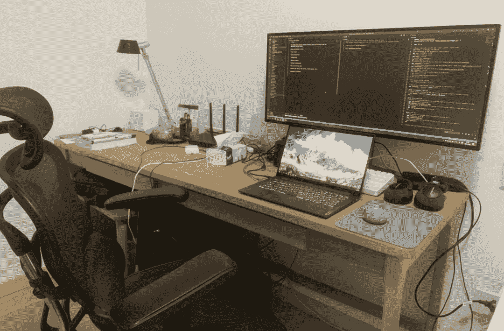
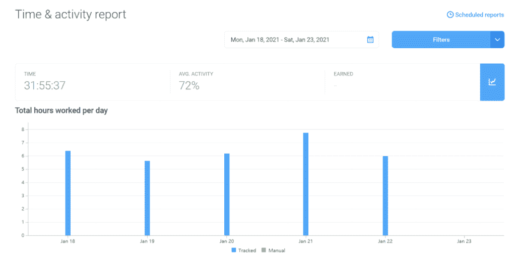

<!--yml
category: 访谈
date: 2022-06-28 10:38:17
-->

# 你好鸭 #19 | 我是刘二狗，感谢远程，感谢我世界第一可爱的仙女老婆。 | 电鸭

> 来源：[https://eleduck.com/posts/dDfoJR](https://eleduck.com/posts/dDfoJR)

**嗨，**

**你好鸭：）**

**我是刘二狗。**

## ▌介绍下你本人的经历及当前所做的事情吧？

大家好，我是 Ergo，现居厦门。2015年到厦门一家初创公司实习，第一次接触到了优雅的 Ruby 和 Rails，自从以后就一直在使用 Ruby on Rails 进行开发工作。目前在 base在厦门，为新加坡一家公司远程工作。

## ▌什么样的契机，让你有了远程的想法？是如何获得第一份远程机会的？

厦门开发的岗位本身就不多，使用 Ruby 的就更少了（就在刚刚，我通过拉勾搜厦门的 Rails 工作机会，结果是 0 个）。2018 年初因为某些原因从就职的第二家公司裸辞之后，几乎没有公司在招 Ruby 开发了，于是就去了深圳。但是我女朋友（现在已经是我老婆了）在厦门，异地恋每两周坐一次来回的动车需要耗费近 10 个小时（听说这段铁路最近要提速了），所以在深圳的时候还是一直在计划着回厦门工作。

▲ 溜了，溜了~

2018 年底找到了第一份远程工作，回到了厦门。最近的一份工作是先在 Ruby China 论坛的招聘版看到招聘信息，然后一路寻到电鸭社区的远程人才库，最后被推荐入职。

## ▌远程之后，工作和生活都发生了哪些变化？

工作方面最大的变化就是不再需要在公司和住处之间通勤啦！虽然我之前的 3 份工作都住的离公司挺近的，但是不用通勤真的很爽。其次就是工作环境的条件大幅改善，从公司的工位换成了书房里自己独享的一米八大书桌，从担心会爆菊的山寨办公椅换成了自己精心挑选的人体工学椅，工作时也不再会被办公室里的其他人打扰到，也不用担心自己打扰到别人了。

▲ 永远处于待整理状态的工位

生活方面就是有更多时间陪伴家人了（要不女朋友怎么能变成老婆呢，哈哈哈），孩子出生后这方面的感受就更强烈了。因为在家办公，可以有更多时间和老婆一起护理小宝宝，陪伴孩子的成长。

▲ 替我上班的女儿

但是第一份远程工作因为每天要开的会比较多，因为需要和身在美国的同事一起开会，跨越的时间段比较长（举个例子，早上9点要开会，晚上9点又要开一次会），有时候会感觉工作和生活分不开，这可以说是跨时区远程工作的一大痛点了。于我而言另一个痛点大概是结婚时因为远程工作的关系，没能享受到国内的婚假和陪产假。

## ▌你每天的工作的时间和效率是这么规划和保证的？给我们拍照看看你的工作台吧

我每天也没有刻意的规划工作时间（没错，Ruby on Rails 效率高就是可以为所欲为），现在每天大概从早上9点开始工作，先整理一下当天的工作内容，编码工作主要集中在下午，晚饭过后会再花一些时间在工作上。现在的公司会要求我们使用 Hubstaff 统计一下工作时间，所以每天也会关注一下统计当天出来的结果，确保自己当天的最小工作量，但是入职以来每周的统计总时长都是在 32 个小时左右。舒适的工作环境对效率也是有加成的。

▲ Hubstaff

## ▌平时都用到哪些软件/工具来提升效率或者帮助工作呢？

*   34 寸准5K带鱼屏显示器，VS Code 和 Chrome 窗口一起并排开着实在是太爽了，VS Code 窗口最大化的时候，并排开 3 个文件时几乎不需要水平滚动就可以看全代码。

*   Nespresso 胶囊咖啡机，确保每天早上的精神状态。

*   宜家 9.9 元的牛奶打泡器，搭配咖啡机使用的平民法拉利。

*   即便是在自己家里，我也会有不想被外界声音打扰的时候，主动降噪耳机就成了必需品，原来用的 Bose QC30，最近因为电池老化导致续航大幅缩水，新入手了 B&W PX7。

*   去年底把开发环境从 macOS 迁移到了 Windows + WSL2，但是 Windows 下没有像 Dash 那么好用的文档查看软件，我现在用的是 [devdocs.io](http://devdocs.io) 这个网站来查文档。

*   WSL2 的内存占用有时候比较迷，笔记本的 16GB 内存有时不太够用，最近趁着挖矿潮显卡涨价把一直在吃灰的台式机的独立显卡卖了，给台式机装上 Ubuntu 后通过 VS Code Remote 配合笔记本作为远程开发环境，笔记本的负载低了很多，外出或者偶尔回老家办公时更加方便了。

## ▌很多人说远程易孤独，你是如何排解的？

互联网把世界各地各种各样的人连在了一起（虽然我们要多跨过一道墙），我不认为远程工作会容易让人感到孤独。再者说，有老婆和孩子的陪伴，想感到孤独应该很难吧。等孩子大一点再养只狗，这样或许能让自己每天不得不出门感受一下大自然（哈哈）。

## ▌对于那些也想开始远程工作的同学，你有什么建议？

远程工作看上去很美好，但不见得适合每一个人，对管理者的管理水平也有着更高的要求，混乱的管理甚至可能会给你带来 996 福报，入职前最好多了解一下团队的状况。

## ▌广告时间（征婚/征友/合作等，说任何你想说的：）

## ▌如何联系我？

如果你想和我认识并聊点什么，欢迎来社区找我：）

[https://eleduck.com/users/kAhYkK](https://eleduck.com/users/kAhYkK)

## ▌感恩小环节：

感谢 Ruby China 和电鸭社区提供的平台让我能先后找到两份远程工作，也感谢第一任远程工作的雇主 Feedmob 让我真正踏入远程工作的大门。

最感谢的还是我世界第一可爱的仙女老婆（注意，此处不是指星野结衣）。恋爱、异地、结婚、生子、带娃，这四年来我们一起走过了人生众多的重要节点。

感谢你一路的陪伴、包容与付出。感谢你用心准备的各种惊喜，感谢你包容我偶尔的无趣，感谢你怀胎十月生下我们世界第二可爱的女儿，感谢你让我成为你的老公。

4年前的今天，是我们第一次见面的日子。在茫茫人海中能遇见你，真是太好了。

▲ 2018年7月，厦门，海边。