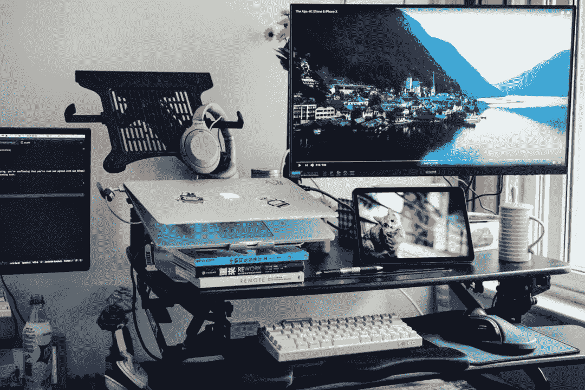

<!--yml
category: 访谈
date: 2022-06-28 10:37:25
-->

# 你好鸭 #26 | 我是半生不熟，远程工作和诗一样的生活我都想要。 | 电鸭

> 来源：[https://eleduck.com/posts/L5f4V0](https://eleduck.com/posts/L5f4V0)

**嗨，**

**你好鸭：）**

**我是半生不熟。**

### ▌介绍下你本人的经历及当前所做的事情吧？

嗨，我是半生不熟，喜欢照自己的怪念头行事，喜欢一切意外，喜欢所有美的东西，想把生活过成诗的样子，若哪天有幸相遇，请别诧异，其实我并不是个乖孩子。

自动化专业，但永远听不懂老师在讲什么，曾经一度以为毕业了就要带上面罩去焊电路板子了。但不幸的是我还挺走运的，有幸在 ThoughtWorks 和一群很优秀的人成长了 3 年，有幸可以成为一名前端开发工程师。

最开始接触前端就是从 React 火起来的那段时间，先后经历过银行，航空，AI 媒体平台，房地产等行业大大小小的项目，也能偶尔改改后端的 bug，解决一些 DevOps 的问题，热衷于 Web Accessibility 的推动和实践，最近也在学习尝试一些管理方面的技能。

目前在为一家美国公司远程工作已经快一年了，也在寻找远程工作最佳状态 ing，喜欢做一些小事能帮更多的人找到适合自己的远程工作，也期待能早日发掘自己内心深处真正喜欢做的事情并且还能义无反顾。

### ▌什么样的契机，让你有了远程的想法？最近的一份远程工作是如何获得的？

“你说我们要是能连续一个月不出门呆在家里会是什么样的感觉？”

最早有远程的想法应该是在 2019 年的夏天，那时候太阳晒的人睁不开眼睛，出门总能听到知了的叫声...在同一家公司同一个项目工作的我和他，没事的时候总喜欢会聊聊未来，憧憬憧憬向往的生活，觉得以后要是能成为一名自由工作者，不管是几个月呆在家里不出门，还是手拉手走遍世界，写代码亦或是做自己喜欢的事情，那便是最酷最幸福的事情了。

说起来也好笑，从某种角度还得感谢疫情，让我们朝这个目标靠近了一大步，让我们真的体验到了呆在家一个月不出门的感觉，也是真的幸运，在那段很多公司都在裁员，很多项目都面临叫停的百味陈杂的日子里，偶然间社区群看到了远程工作的机会，一方面朋友北京的公司也说着想招前端，可以远程，于是我们就毫不犹豫地踏上了远程的道路。

到现在，远程工作已经有一年多的时间了，这期间还是电鸭志愿者的时候，碰巧看到大灰发到群里的一家[美国公司的远程招聘贴](https://eleduck.com/posts/EQfBbj)，看了第一眼 JD 后就觉得这是我喜欢的工作氛围。于是，面试，面试通过，又一次离职，入职，一直呆到现在。

### ▌远程之后，工作和生活都发生了哪些变化？

远程之后，起床必须吃点什么几乎成了一件每天必须要做的事情，之前去公司上班的时候，经常因为到公司晚了早餐就放弃了。

远程之后，让我有了更多的时间能支配自己做喜欢的事情，每天省去的通勤时间、找衣服试衣服化妆的时间、走路打车的等等一些时间，相应地换来了很多研究喜欢的东西，摄影，写东西，做美食，和狗子玩的时间。

远程之后，能自我选择性的安排自己的工作时间了，处理那些突然发生的事情好像也安心了很多，不用担心因为小事请假不好开口，不用担心家里有急事自己却走不开，只要安排好工作上和同事的依赖，大部分情况都可以先处理一些急事，甚至可以再找机会补上同等时间的工作。就像大灰说的，自由的本质并非随心所欲，而是可以自我选择。

远程之后，让我体验到了只要有网有电脑就能工作的乐趣，在乡村，在山里，在海边，那种写代码的感觉是完全不一样的。

远程之后，让曾经一度很怕狗的我，居然也抱了只小边牧回来，从3个月已经养到了一岁零5个月了，也几乎能天天陪着它。

远程之后，认识了更多优秀的同事，因为没有了地域的限制，让我有机会和全国各地的大牛一起聊工作，分享学习各自的经历。

远程之后，让我有机会不断地思考在远程的模式下，如何能提高自己的工作效率，时间管理，日程规划... 甚至一直很头疼开会问题，会更有意识地提前做一些准备，让需要讨论的东西变得更简洁高效，让自由安排的时间和被各种会议限制之间找到平衡。

### ▌你每天的工作的时间和效率是怎么规划和保证的？

### 

说到工作时间和效率，首先自己会安排一个舒服并且固定的工作时间段，日复一日让自己养成按这个时间来执行的习惯，时间到了就坐在工作台上，该吃饭或者下班了就关掉所有的消息通知，更新自己的 Slack 状态，给同事们一定的信息，让他们知道你去吃饭了或者不在线了。

其次，会尽可能地做好时间管理，每天都和谁安排了哪些会议，每天需要完成哪些工作上的 To Do List，还有适当的一些奖励和惩罚。

再然后就是高效地利用一些能提升工作效率的软件，能用快捷键就用快捷键，该更新就更新，该付费就付费，有时候会节省你大把的时间。

一直记得刚布置好自己喜欢的工作台时欣喜的那一刻，其实图中的手动升降桌已经换成自动升降桌了，之后有机会再跟大家分享吧。

### ▌能平时都用到哪些软件/工具来提升效率或者帮助工作呢？

一些常用的办公开发软件可能被推荐太多次了，我就在这里分享几个从某种程度上曾经对我的效率有很过很大提升的软件吧，喜欢能哪一天帮到看到的你。

基础的功能就不多说了，强大的自定义 Workflow 功能绝对会惊艳到你，哦，对了，还有保存多条剪切板历史的功能我几乎隔几分钟就会用到。

曾经尝试过印象笔记，Onenote，幕布等等各种知识管理工具，notion 几乎满足了我所有需求，很强大的快捷键功能，虽然手机端 bug 还是挺多的，但依然很喜欢。

如果你有记不住密码的烦恼而且有条件且愿意投资，密码管理软件就选它吧。

不想让你的大脑记太多事情，不想为接下来要做什么，会错过什么而烦恼，就把你的 Schedule 安排记录到日历吧。

虽然视频会议软件有好几个都做的很好了，但第一次在浏览器直接输入会议号，不用安装任何客户端的体验还是让我对它很有好感。

是迄今为止用过的一款最强大的翻译工具。

最喜欢的一款截图工具，几乎所有操作都支持快捷键，还有 Pin to screen 的功能，节省了太多对比 UI 和 Design，还有一些需要切换屏幕对比操作的时间。

有些东西是不适合用大段的文字来记录的，比如你想做一场头脑风暴的时候，思维导图会让你更能理清自己的思路。

如果你也用苹果，如果你也想装 RSS 阅读器，Reeder 不会让你失望的。

### ▌很多人说远程易孤独，你是如何排解的？

对孤独的理解，我想每个人都是不一样的吧。我其实很少真正思考过这个字眼。

大概对于我来说，真正的孤独可能就当我对事物所有的认知，想法和看法都选择用白纸黑字亦或是文字来表达，而不愿意或是没有机会用语言描述给身边人听的时候，那可能是最孤独的时候。

让自己忙起来，除了工作也去认真生活，如果那一天真的到来的时候，我大概会去体验不同的行业不同的人生吧

### ▌对于那些也想开始远程工作的同学，你有什么建议么？

我个人觉得，先尽可能地了解远程吧，不只是停留在听到或者看到远程工作的“爽”，也要了解到远程工作的“不爽”，其次再认真坐下来思考一下你为什么想要一份远程工作，以及那些种种“不爽” 你都愿意接受吗，然后就可以找机会了。

当然如果你想说，我就是想快速体验一把，看看有哪些问题，再喜不喜欢。当然，完全是可以的，人生可不就是这样，不去试怎么知道是否喜欢呢。

如果建议只能挑三个，那就是：
1\. 尽量不要在刚毕业就选择远程工作；

2\. 不管你在什么年龄，喜欢就去尝试下吧；

3\. 不管怎样要记得不时地去思考一下自己的后路。

### ▌广告时间（征婚/征友/合作等，说任何你想说的：）

任何和远程相关的问题欢迎随时来简书找[我](https://www.jianshu.com/u/4c0a06c8a1f9)，一直有计划出去自驾游工作，欢迎有经历经验的大佬们评论区分享。哦，对了，如果你也养边牧，也来交流如何让他早点学会帮主人倒垃圾吧。