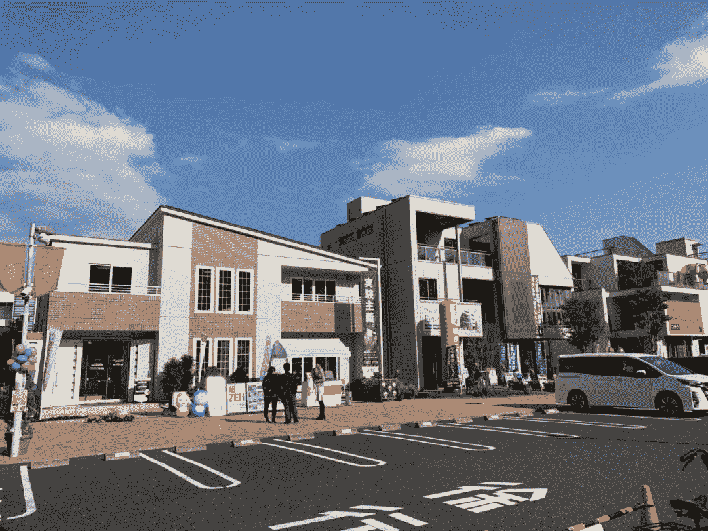

<!--yml
category: 访谈
date: 2022-06-28 10:39:27
-->

# 你好鸭 #27 | 我是Nic，我在日本写代码、玩乐队。 | 电鸭

> 来源：[https://eleduck.com/posts/BafgBo](https://eleduck.com/posts/BafgBo)

**嗨，**

**你好鸭：）**

**我是Nic**。

### ▌在国外几年了？介绍下你本人的经历及当前所做的事情吧？

* * *

从2015年来到日本东京，现在是我在日本的第六个年头。我是通过一个叫Work In Japan的项目来到日本的，之前我并没有在日本留过学。这个项目现在已经没有了，好像是在三年前取消的。拿到offer的时候，我根本就不会日语。是过来之后，公司给我报了一个为期半年的语言学校，学了半年日语，当时也是拿着工资学的，很感谢公司。虽然这六年我一直在同一个公司，但是实际上在集团公司内部已经跳槽了不少次了，现在我所在的公司，是我就职过的第三个子公司。

每个子公司的业务项目都很不一样，第一个子公司是做房地产信息的平台，第二个子公司是做生活信息的平台，现在第三个公司是做职业培训的。我们公司在日本算是非常有名的，我这三个子公司在各自的业界都做到了日本的第一。这几年在公司我都是做的类似于全栈工程师的一个角色，在现在的公司，我是负责前端TL。

▲ 夜里的富士山

### ▌什么样的契机，让你有了出国（或移民）的想法？

* * *

首先是要明确自己的目标是作为一名程序员发展，同时想要体验一下不同的文化，丰富自己的经历。一开始想去美国，结果由于经验不足，我当时的面试不顺利。在沮丧的时候，正好有日本公司组团来我们学校做校园招聘，我就去试了一试。最后成功了，我也就来到了日本。

还有一个原因就是想再多学一门语言，我认为学语言拥有好的语言环境可以事半功倍，同时日本离中国也很近来回很方便，于是我就决定来日本了。

▲ 晚霞中的东京塔

### ▌为此都做了哪些准备？最终是如何实现出国（或移民）的？

* * *

其实在读书的时候我没有想太多关于出国的事情。当年毕业求职的时候大家都会投一些国内或国外的一线公司。我毕业的时候国内公司给的工资并不是很理想，所以最后决定还是找一找国外的工作机会。虽然一开始并没有考虑日本，但是在日本公司组团来我们学校招聘的时候我进去了解了一下，没想到在招聘会上就开始了笔试。笔试内容都是一些类似于国内行测申论一样的东西，然后就过了笔试，之后来东京过了面试，然后最后就拿到了offer。

来了日本之后，日本政府在2015年左右开始签发【高度人才签证】。通常持续持有这种签证一年到三年，就可以申请永驻身份了。具体的要求大家可以搜索【日本高度人才签证】关键字，在某乎上面有很多答主回答的很详细。简单来说，日本政府提供了一个计分标准，达到了70分就可以申请这种签证，70分的状态保持三年就可以换永驻，90分的状态保持一年就可以换永驻。名字听着挺唬人，但是没有想象中那么高标准。有很多加分项，例如持有日语N2证书，或者是国内的国家软件考试的证书等等都可以加分。

▲ 热海中的柴犬

### ▌出国之后，工作和生活都发生了哪些变化？

* * *

相对于去欧美工作生活的同学来说，我反而觉得我的学习和工作生活都没有太大的变化，对于我个人而言，我平时就挺喜欢吃日料的，听听日本的乐队，看看日本的电影电视剧。所以习惯日本文化的同学，过来的话应该比较适应。跟欧美国家相比的话，还有一个好处就是，日本和中国就一个小时的时差，想回国的时候坐飞机四个小时左右就可以从东京到上海。

因为从还在学校的时候开始我就一直在玩乐队，来了东京最大的惊喜就是这边的音乐环境。从排练到演出，从录音到出专辑，整个产业都非常的发达。而且在这边遇到了一波可以一起玩音乐的朋友，是非常幸福的事情。例如排练室，这边的排练室的数量，配有的设备以及服务，还有价格等等都比当时国内很多城市的要好。

▲ 一场小型的拼盘演出，马勺罗兰什么的都是标配

### ▌有人说国内容不下肉身，国外留不住灵魂，你的感受如何？

* * *

### 

跟我同一批过来的人，大概有20人，但是过了一年之后就差不多有一半人回去了，再过了一年，又有一半人回去了，最后剩下来的不到10个人。

有的人因为觉得回国发展更好而回国，有的本来就打算待几年就回国，有的因为另一半的原因而回国，也有人因为生活不适应而回国。总之，不同的人有不同的原因。在国外生活适不适合自己，其实真的只有自己亲身经历过之后才知道。

对于我自己来说，東京的生活就比较适合我。举个例子，在日本这边的电车上，大多时候乘客都不说话的，很安静，这个现象会令有的人感到非常压抑，但也会让有的人感到安心。

还有一点，就是现在东京房价与国内一线城市的房价相比，简直就是白菜价，最近因为疫情奥运会因素，房价有涨但是还是相对便宜，现在东京的话，均价大概在5万人民币一平左右（因地段有较大查遍，这里说的是一个是大概感觉）。有永驻身份的话，0首付，0.5%利息购房政策对于很多朋友来说是非常具有吸引力的。

▲ 门前的樱花

### ▌关于国内和海外在开发语言及技术选型上的的差异，能不能聊聊你的看法？

* * *

说实话，我认为日本在软件开发方面，整体水平是落后于国内的。关于这一点，我有一篇文章推荐大家看一看（我在日本最大的房地产信息网站做重构），这篇文章只是说到我工作的很小一部分，但是通过这篇文章，大家就会知道作为程序员，在日本大概是个什么样的感觉。我们公司虽然不是传统的IT公司，但是在IT行业也是做得比较有成就的公司了，社风也比较开放。尽管如此，在国内一些稀松平常的事情，在这里会需要你更大的努力去解释和推进。

### ▌对于那些也想出国的同学，你有什么建议么？

* * *

### 

如果有抱负想赚大钱的话，我觉得相比之下，国内的机会更多，但是如果你想体验另外一种生活、另外一种文化或者是想特别注重自己的生活与工作的平衡，国外来说是相对适合的。

对于这个问题，我也经常提到咱们小时候都学过的一篇文章，那就是小马过河。小马要过河的时候，他问大象河水深不深。大象说当然不深，但是他问小松鼠，小松鼠说非常深，所以说这个河到底深不深呢？还是需要小马自己过河了才知道。

对于想来日本工作的朋友，我有几个建议：

首先，尝试学习日语。虽然很多欧美系IT企业不需要日语，但是毕竟在日本生活需要日语，日本人的英语也普遍不是很好。通过学习日语，你会接触到很多日本文化和习俗，你也可以看看自己是不是喜欢和适应这些文化和习俗；

然后，IT行业的话，尽量工作地要在东京。东京机会要多很多，大都市包容性也非常好，生活也相对便利；

其次，尽量去大公司。这一点可能听起来很理所当然。但是在独自一人在国外的话，有一个大公司可以做背景的安心感可能比在国内多更多；

最后，年收入不要少于500万日元。日本的人均收入是400万左右的样子，但是如果要东京有一个相对舒适的生活方式的话，我个人认为500万是比较合适的。如果少于500万，在东京可能生活会相对局促一点了。希望以上建议能给大家做一个参考。

▲ 现在老干妈已经随时可以轻松买到，跟国内差不多价钱

### ▌如果你是一名程序员，而且也想来日本工作、生活，我们来帮你

* * *

我和朋友在日本开了一家IT人才介绍公司，为想来日本工作的程序员提供从咨询、日语学习、面试到赴日工作的服务，请通过下面链接了解具体服务内容。

[链接:](https://drive.google.com/file/d/1pRyiTNEtwYXYu0tZbqH3hZAdsCZreks5/view?usp=sharing) [https://pan.baidu.com/s/1y0wwNKWffQFQp-uSMVatpw](https://pan.baidu.com/s/1y0wwNKWffQFQp-uSMVatpw) 提取码: hkdg

### ▌如何联系我？

* * *

### ▌加入海外移民交流群

* * *

如你对海外移民有兴趣/有打算，

可以点此加入我们的群来交流。

[https://eleduck.com/groups](https://eleduck.com/groups)

