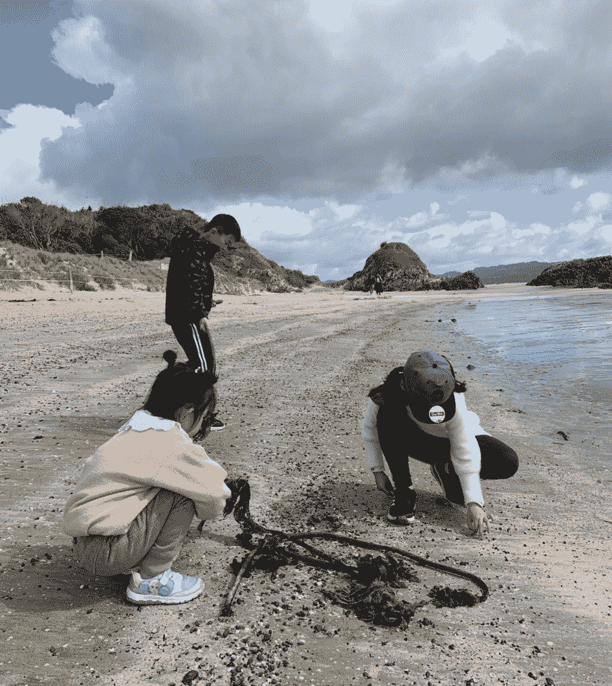

<!--yml
category: 访谈
date: 2022-06-28 10:37:47
-->

# 你好鸭 #38 | 从武汉到新西兰的远程开发者。英语和诚信，是他给跨境工作者的两点建议。 | 电鸭

> 来源：[https://eleduck.com/posts/rdfa54](https://eleduck.com/posts/rdfa54)

**嗨，**

**你好鸭：）**

**我是Walter。**

### ▌介绍下你本人的经历及当前所做的事情吧？

大家好，我叫Walter，之前在武汉的一家通信厂商做了4年的软件测试和6年的项目管力。后来到新西兰上了2年的学，毕业后就留在这里的一家物流科技公司做React Native方面的开发工作了。

### ▌什么样的契机，让你有了远程的想法？最近的一份远程工作是如何获得的？

大概6、7年以前，我通过37Sginals接触到了“远程工作”的概念，当时还专门找书研究了两遍《remote》和《rework》的书，心里是很痒的，但由于当时自己所在实验室属于保密级别，也只能是心向往之。后来，又陆续接触了数字游民、一早一晚和电鸭，渐渐感觉到国内远程工作的概念初见端倪了。但对于那时的我自己，一是不太敢离开稳定的工作，二是对自己的技术和英文能力不自信，所以就一直处于观察的状态。

后来一次去美国出差的机会，在西雅图和旧金山那边待了两个多月，接触到了一些国外IT人士的生活和工作状态，发现他们真的可以保持家庭生活和工作时间的相对平衡，同时还可以在这个行业里干到退休，这也加强了我回国后寻求改变的决心。因为我对软件行业是真的很有兴趣，不愿意过早的离开它，并且也不知道自己离开后应该去干什么。

于是回来后和老婆软磨硬泡了大半年，终于在2019年2月辞掉工作、卖掉房子，带着刚上了半年一年级的女儿踏上了来新西兰的旅途。在新西兰完成了2年学业之后，我就进入了现在这家物流科技公司。

因为新西兰本身市场比较小，这里的公司规模也不大。例如我们公司的开发人员只有3个，老板兼职负责后端开发，另一个同事负责网页开发，我就负责移动端开发。我们的主要产品也是针对新西兰范围内的物流企业。

可能是在人少的地方，大家都比较容易相信对方，我从一开始进入公司就处于“半远程”的工作状态---平时只有周二和周四的上午去公司和大伙对一些开发事宜和进度，但随着最近的疫情，我们所在城市也处于了封城的状态，索性，大家就干脆在家“完全“远程办工了。

### ▌远程之后，工作和生活都发生了哪些变化？

相较于在新西兰的工作而言，变化不大，就像前面说的，因为我们三个人平时也不太常去公司，基本就处于“半远程”的工作状态。现在疫情一来，大家就都待在家办工了。

但相较于之前在国内的工作，我就是从天枰的一端几乎到了另一端了：有时间去学习、研究感兴趣的技术了，也有时间去陪伴家人了，更幸运的是，之前的肾结石、痔疮、脂肪肝和痛风也都好了。

但有一点，可能是个个案吧，就是我从远程工作之后，就放弃周末两天的“休息时间”了，因为平时每天我都会固定时间出去锻炼，和家人一起玩游戏或者去海边走走，身体渐渐已经形成了一套工作和生活习惯，所以就不再想单独每周拿出两天来专门用来“充电”。这样每天早6点到晚9点，工作和生活交织在一起，没觉得累，压力不大，也挺好。

### ▌你每天的工作的时间和效率是怎么规划和保证的？

我差不多每天的工作时间会分为3段，上午和下午的时间段会用来编码、调试和一些软件设计的工作，晚上就会用来做一些研究。

但我没有严格的时间表，因为之前有尝试过把时间在Google Calendar里精确的规划好，但执行的结果并不如人意。后来发现规划的粒度以一周为单位比较适合自己，于是就每周一整理一下上周的工作结果，同时也会根据总体项目计划制定本周的开发任务。这样每天专注工作的时间大概在7到9个小时之间（坦率的说，应该比在公司上班要更久一些），但身心并不会觉得累。

新西兰现在处于夏天，阳光太强，所以只好在办工的时候拉上窗帘。就连午休的时候，我有时也要戴上太阳镜（右下角隐约可见太阳眼镜）。

### ▌能平时都用到哪些软件/工具来提升效率或者帮助工作呢？

### ▌很多人说远程易孤独，你是如何排解的？

新西兰虽然人很少，但家人一直就在身边，真的也没有孤独的感觉。只是有时会比较想念仍在国内的双方父母，现在还没有切实的好办法，只能每周通通微信视频，聊以解忧。

### ▌对于那些也想开始远程工作的同学，你有什么建议么？

英语和诚信。尽管国内已经开始有一定“远程工作”的氛围了，但工作机会总体还是国外比较多一点，所以基本的英语交流能力肯定是一个加分项。

另外，在沟通中还是得诚信，有一就说一，这也是最有效率的沟通方式。

### ▌广告时间（征婚/征友/合作等，说任何你想说的：）

*   播客：我日常出去锻炼或者零碎时间，都会打开播客来听，有很多“意外所得”都是来源如此。中外优秀的播客节目有很多，大家可根据自己兴趣来找。我日常听的也比较杂，有NPR旗下的政经节目，也有Relay系列和众多的技术播客，还有一些新西兰这边的投资类播客。

*   站立办工桌：强烈推荐电动调节版的站立办公桌，真的是长时间在电脑前工作人员的福音。

*   竖握式鼠标：我开始只是试试，买了一款多彩M618，结果适应了两天之后，就再也用不回传统鼠标了。然后就连着买了4个，送了2个别人。

### ▌如何联系我？

对我感兴趣的朋友，可以通过我在电鸭的个人主页 [https://eleduck.com/users/9YhOwv](https://eleduck.com/users/9YhOwv) 来联系。