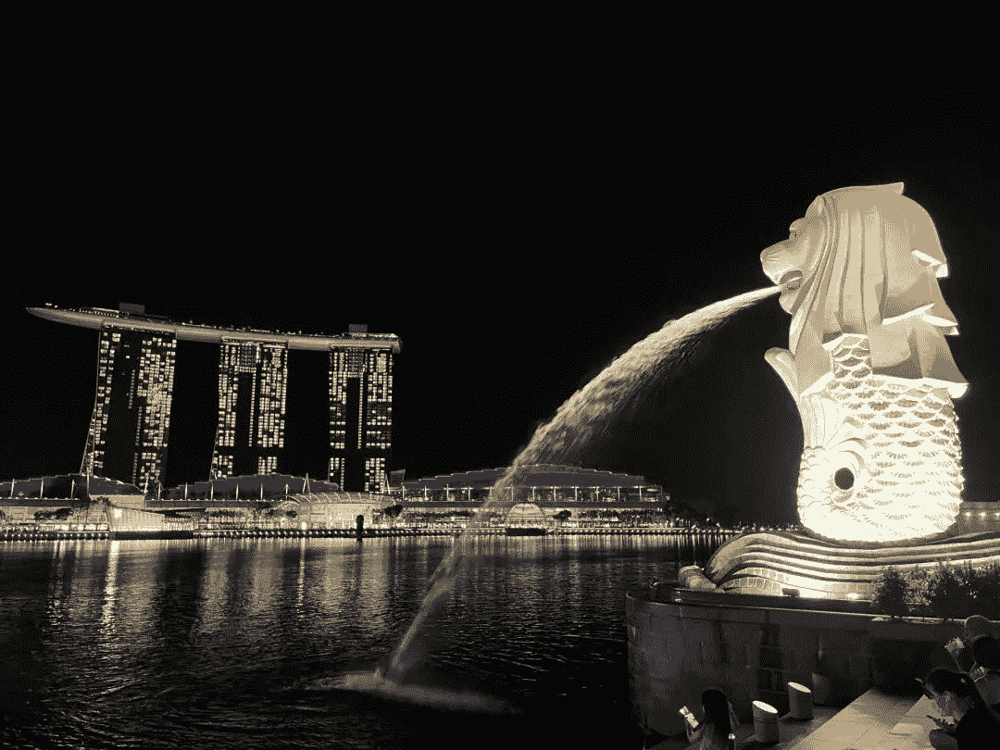
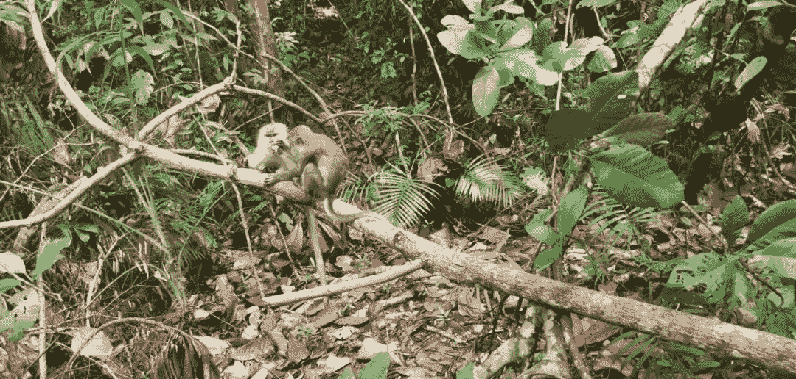

<!--yml
category: 访谈
date: 2022-06-28 10:37:11
-->

# 你好鸭 #53 | 当机会来临，我毫不犹豫就来到了新加坡 | 电鸭

> 来源：[https://eleduck.com/posts/VvfnyQ](https://eleduck.com/posts/VvfnyQ)

**嗨，**

**你好鸭：）**

**我是Kuncle**。

### ▌在国外几年了？介绍下你本人的经历及当前所做的事情吧？

* * *

我是 Kuncle，于2021年6月离开杭州来到新加坡。来新加坡之前在阿里做实时数据架构相关工作，再之前是在外资银行、保险公司以及国企工作。

因为最近对区块链比较感兴趣，所以来到了现在的公司，在行业的头部交易所做数据基础架构相关的工作

### ▌什么样的契机，让你有了出国（或移民）的想法？

* * *

这个还要从之前的工作经历说起，我在2018年加入Citi，当时组里有很多优秀的小伙伴，其中有两件事改变了我之前的观念。第一件事，发现身边有帝国理工、北京大学、复旦、交大等等的一群高材生，但他们都甘愿做一些基础简单的清闲工作。第二件事，这群高材生不乏国外工作回来的，和我讲述了很多国外生活工作的经历。

关于第一件事，我在一次下班的途中，和一位和算是知己的同事聊到了，我问他，他们这么好的背景，为何不去做更适合他们的事情呢？他回答到：有些人拼尽全力，去读好的大学，只是为了找一份这样轻松的工作，然后有更多的时间去生活。我愣住了，这和我最初的价值观完全不符，我这么努力的工作，应该是一步一步朝上走，爬到顶端。直到现在，我才逐渐明白这件事。

关于第二件事，主要是我工位旁的小姐姐给我带来的国外见闻，加上自己在油管上面的涉猎，坚定了要出去看一看，体验下不同的生活。当然，自己骨子里就一直觉得，人生苦短，何不多尝试不同的生活。

### ▌为此都做了哪些准备？最终是如何实现出国（或移民）的？

* * *

我18年年底决定出国，当时就联系了Citi多伦多的同事，让帮忙留意多伦多的机会，想内部转岗过去。19年初，有了合适的机会，和多伦多那边的部门也联系上了，无奈国内这边名额限制，没有去成。于是就换到了阿里，刷下背景，打算到时候去面试多伦多Amazon。在阿里待了一年半，突然朋友问我是否考虑新加坡，我都没犹豫，直接发了简历，立马面试，拿了offer，然后就直接来了现在的公司。这应该是我最快的一次换工作经历，都没有时间去准备，最后办签证的时候才反应过来。

这期间，我主要留意了加拿大、新西兰、新加坡、德国，这几个国家算是IT人最容易去的国家。加拿大最直接的方式是通过远程面试Amazon可以直接过去，拿到工签，PR也不远了。然后也可以通过读书的方式拿PR，可以读温哥华的一些学校的Master，毕业可以申请身份，当然，读一些草原省的学历更便宜，门槛更低，但是抵不过温哥华气温好呀。

新西兰前几年可以通过银蕨签证，工作度假签证方式过去，现在没了。目前可能读书是最快的方式了，当然，如果当地有公司愿意给你发offer最好不过了。

新加坡的话，直接找工作吧，那边Shopee一直在国内大量招人，可以去试试。当然还有其他很多公司也在国内招人过去，包括我司。

德国那边这几年也在大量招聘IT人才，只要英语能过关，拿着你的本科学位可以去大使馆申请半年的签证去德国找工作。身边也有好几个伙伴是这样过去德国的，当然也有直接国内面试成功再过去的。

### ▌出国之后，工作和生活都发生了哪些变化？

* * *

关于工作、生活，其实之前电鸭社区采访的尼奥介绍的很详细了，和他的情况类似，我们公司基本都是国人，在国内也有很多办公室，所以工作强度和BAT差不多，可能更高一点。

生活这块，因为最近一直是疫情，基本居家，主要吃楼下的食阁，一天15新币搞定所有。周末会出去转转，吃吃特色美味，徒步之类。相比在国内，因为疫情原因，加上本身我就很宅，所以减少了很多外出。国内我外出除了参加Apache社区的meetup，就是和朋友出去爬山、骑行。在新加坡还有就是看油管、奈飞等很流畅，也可以做做很多Crypto的事情。

### ▌能从具体聊聊你所在城市的房价/物价/收入/教育吗？

* * *

首先说明下：房价、教育是我在新加坡最大的期待了。

因为新加坡政府的居者有其屋计划，有身份的居民，买房真的很便宜（HDB系列）。会根据家庭收入，可选的有HDB、EC、公寓、有地住宅等。前两者政府是有补贴的，需要PR或是公民才能购买，HDB最便宜，50w新币就能在偏一点的地区买很好的HDB了，新加坡本身也不大。EC也是HDB的一种，不过是介于HDB和公寓之间，算是小康之家的选择吧。公寓的话，外国人也能买，就是税高一点，价格也不便宜。有地住宅的话，没个200w新币拿不下来，算是后面的奋斗方向吧。

教育这块，新加坡这边教育算是亚洲排名靠前的了，学校有英语、中文、马来文教学，当然不是所有学校都有。和国内比，也是有类似的学区房概念，但是这边主要还是靠校友资源（你家里是否有人在这个学校读过书，有的话那就比较容易了），租房也算学区房。还有就是这边小学会比较累，小学升中学就会存在考试择校了，这个时候考到好的学校，一般情况下好的中学意味着好的大学。在中学阶段就开始分流了，不过听说今年开始改革了。

物价和收入这块，物价肯定是比国内贵，比上海贵一点，但也看怎么消费了，我这种宅男，消费差距不大，大头在租房。这边租售比是真的高，一个HDB租出去15年左右就可以回本了。

### ▌有人说国内容不下肉身，国外留不住灵魂，你的感受如何？

* * *

说到这个，我身边有很多朋友出去，有去新西兰、有去加拿大、有去德国、也有去美国的，但也有很多朋友不愿意出去或是出去了又回来的，所以这块就是仁者见仁，智者见智了。找一个适合自己的地方就好了，无在乎属于什么地方。

### ▌关于国内和海外在开发语言及技术选型上的的差异，能不能聊聊你的看法？

* * *

我所在的公司因为大部分都是国内过来的，技术选型上和国内差距不大。具体这块我们可以看看用人市场的数据，更能反应供需情况。

但具体到公司架构这块，还得看公司了，我一直觉得我这几年还在吃老本，包括在阿里，更多的新技术都是靠自己业余时间学的，在公司都是使用比较成熟的技术方案。

推荐几个我平时学习的平台：极客时间、得到、油管、B站、Github。

主要是看技术方案和论文，最后你会发现比如存储这块，大家底层几乎都是一样的实现方式。

### ▌初到新加坡，给你最深的印象是什么？

* * *

新奇！刚到什么都觉得新鲜，特别是刚到住公司安排的酒店，两周时间把周边店吃了个遍。去711买水喝，发现牛奶比水还划算，然后每天喝1.25L明治牛奶。

后面逐渐平静下来，开始慢慢体会新加坡的美。去乌节路，你会发现肤色各异的国际友人，周边掺杂着各种语言（虽然大部分是英语，但各种语音）。去公园散步，你会发现各种神奇的动物，鳄鱼、蜥蜴、野鸡、鹤等就在你身边。去海边，你会时不时地遇到锻炼身体的人们，由衷地羡慕他们的身材。

### ▌对于那些也想出国的同学，你有什么建议么？

* * *

1.  想动，那就趁早。从我这几年收集的移民信息来看，很多方式都在收紧，门槛在逐步提高。我给身边很多朋友讲过有什么方式可以出去（我觉得我自己的这块信息储备都可以做移民中介了，哈哈），但真正出去的就那么几个，其他的说要出去说了3，4年，至今依然没有动静。

2.  多去了解你想去的地方，找到自己合适的地方。也不要觉得出去了就能解决一切问题，不同的地方有不同的问题，做好心理预期

3.  天上不会掉馅饼，不管在哪里都要学会保护自己。

4.  不管出不出去，学会理财。

### ▌如何联系我？

* * *

如果你想联系我，可以给我发邮件，我的邮箱地址是：work.yongliu@gmail.com

### ▌加入海外移民交流群

* * *

如你对海外移民有兴趣/有打算，

可以点此加入我们的群来交流。

[https://eleduck.com/groups](https://eleduck.com/groups)

