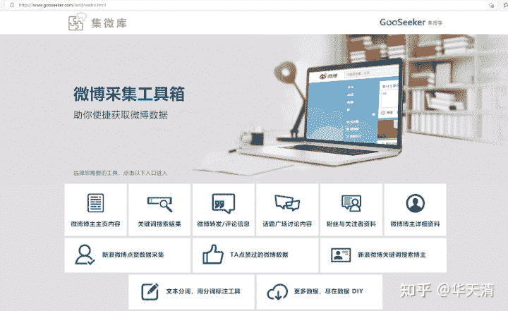
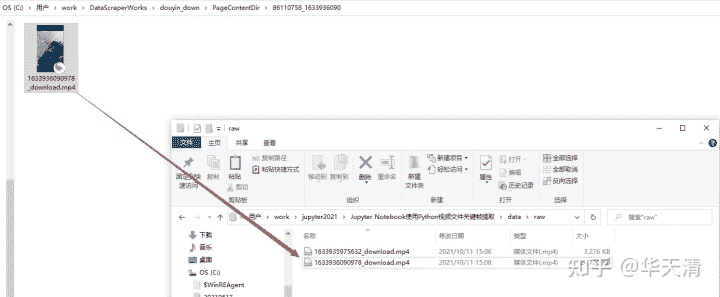
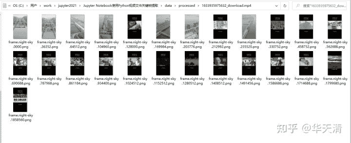
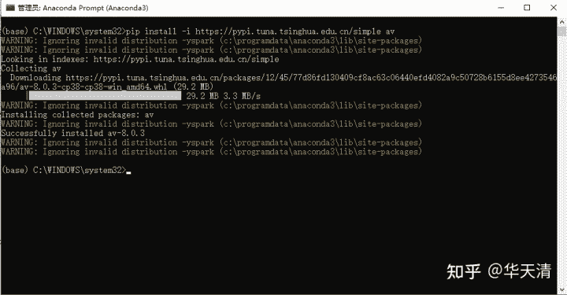

<!--yml
category: 视频
date: 2022-05-04 19:45:25
-->

# 使用Python提取视频文件的关键帧用于视频内容分析 - 知乎

> 来源：[https://zhuanlan.zhihu.com/p/420469399](https://zhuanlan.zhihu.com/p/420469399)

## 1，本Notebook背景介绍

短视频越来越火，视频的内容分析也变得跟文本的内容分析一样重要，然而，如果每个分析者都要看每个视频，太花时间了，即使利用快进功能，节省的时间依然不够，另外，会有人为的疏忽造成内容分析错漏。

如果对比一下文本的内容分析，就会发现一个重大区别：看文本内容可以一目十行，而且没有强制的从前到后的时间线，相反，看流媒体则必须耗用媒体流的时长。那么我们就会产生一个问题：看流媒体是否可以一目十行？

实际上视频流中的大量信息是冗余的，信息量很低，信息量只集中在一张张关键帧（也叫信息帧，或I帧）图片中，如果把这些图片一个个摆在眼前，就能做到一目十行，而且减少人为疏忽。

**1.1 基于视频做分析的范例**

学术界这几年基于短视频所做的相关分析研究也越来越多，GooSeeker资讯版块也收集和分享了几个基于视频做分析的例子：

1\. 《[一项基于《后浪》的内容分析研究](https://link.zhihu.com/?target=https%3A//mp.weixin.qq.com/s/xwq00L2LjXA0MOKjGvqoZA)》

该研究作者针对视频内容，使用内容分析法，对《后浪》这部3分52秒的短视频进行分析，并尝试解决以下三个问题：《后浪》中呈现的年轻人形象是什么样的？他们从事什么类型的职业，或者爱好是什么？影片中的年轻人形象能否代表社会真实？

该研究提取了视频中的信息帧（即关键帧，也叫I帧）用于内容编码，见下图：


2\. 《[快手短视频中农村女性的“自我书写](https://link.zhihu.com/?target=https%3A//www.gooseeker.com/doc/article-687-1.html)》

该范文的摘要：

*近年来,以门槛低、易操作等为特点的短视频平台迅速崛起,这为文化资源匮乏的农村女性带来了新的机遇和挑战。一方面,技术赋权使得被"遮蔽"的农村女性群体拥有了走向大众视野的机会。她们的"自我书写"不仅是个体的可贵表达,更是农村女性集体形象的展现。在这种媒介实践中,农村女性得到更自主的表达空间,自我身份定位更清晰,促进了我国性别平等事业的发展。另一方面,在快手平台中,部分农村女性发布带有低俗倾向的视频,将自己的身体置于男性凝视之下,在短视频中呈现出物化女性的倾向。这是性别平等事业理应关注和改变的地方。*

3.《[短视频对城市旅游形象的影响研究_以成都市为例](https://link.zhihu.com/?target=https%3A//www.gooseeker.com/doc/article-599-1.html)》

该范文的摘要：

*短视频会给民众留下第一印象，对城市的旅游形象起着深远的影响与塑造作用。本文基于目的地图像理论，以成都市为例，运用内容分析法对抖音短视频软件的评论文本进行数据挖掘，分析短视频对旅游城市形象的影响。*

4.《[美食类短视频的重庆城市形象传播研究_以抖音短视频为例](https://link.zhihu.com/?target=https%3A//www.gooseeker.com/doc/article-605-1.html)》

该范文选取短视频的标题为研究重点，解读不同主体的传播内容。在考察美食类短视频传播形式方面，从景别角度探讨重庆美食类短视频的传播。

5.《[视频主题对公众正向情感表达的影响研究——以武汉战“疫”纪录片为例](https://link.zhihu.com/?target=https%3A//www.gooseeker.com/doc/article-635-1.html)》

该研究论文范例选取新华社在微博平台发布的武汉战疫纪录片《英雄之城》作为研究对象,对视频片段编码,归纳出多个主题。对公众评论数据进行统计分析,采用AHP层次分析法建立模型,判断出影响权重。通过对影响公众正向情感表达主题权值由高到低排序, 发现视频表达主体对公众正面情感影响力的强弱。 分析公众正向情感表达评论中体现的视频片段包含的各个主题特征,并对各主题的影响力权值计算排序,完善新媒体平台对公众正向的舆论引导机制。

以上几篇研究范文，对应视频的分析，一般是从下面几个角度入手：

1\. 基于视频内容。对视频内容进行编码和主题提取。

2\. 对视频标题文本做分析。

3\. 对视频评论文本做分析。

对于上列第1种视频内容分析，具体的方法有2种：

第1种，是人工查看视频内容，进而做编码和提取。

第2种，是先从视频中提取帧图片信息，然后基于图片进行编码和主题划分。

第2种方法的优势我们开篇就说了，下面重点讲解怎样实现。

**1.2 什么是视频关键帧提取**

每个视频都是一个图像序列，整个序列的内容比一张图像丰富很多,表现力强，信息量大。这个序列中每个图就是一帧，序列连起来看，就像看动画片一样。

每一帧时间间隔很短，比如，一秒30帧，如果每帧图像都是完整的，就会有大量冗余信息，所以，序列中大部分帧只反应了局部的变化，而在序列中的关键位置上有一系列完整的图像，这就是关键帧。可见，我们只需要观看关键帧图片即可得到绝大多数信息。通过视频关键帧提取功能能够有效减少视频检索所需要花费的时间，并能够增强视频检索的精确度。

**1.3 能不能在python做视频关键帧的提取呢？**

我们可以使用GooSeeker网络爬虫软件下载短视频文件，比如抖音或快手短视频。如果我们需要从这些视频文件中提取关键帧图片用于进一步的内容分析那该怎么做呢？

笔者查了一下，Python的[pyav库](https://link.zhihu.com/?target=http%3A//docs.mikeboers.com/pyav/develop/index.html)提供了相关的方法，本notebook将用python实现这个功能。

**1.3.1 PyAV库简介**

目前使用最广泛的视频编解码库为FFmepg，PyAV是FFmpeg的封装，不过功能更为强大，能够灵活的编解码视频和音频，并且支持Python常用的数据格式（如numpy）。由于PyAV在ffmpeg的基础上进行开发，所以并不会提升编解码的效率。但是能够方便Python的开发者对视频或者音频数据进行处理。在模型的训练测试中能够发挥很好的作用。

PyAV提供了：

libavformat：容器， 音频/视频/字幕流，包;

libavdevice（通过指定容器的格式）：

libavcodec：编解码器 ，音频/视频帧，数据平面，字幕;

libavfilter：过滤器，图表;

libswscale：视频发布者;

libswresample：音频分析器;

以及其它的使用工具。

## 2，为什么做成Jupyter Notebook模板的形式

GooSeeker每年都要支持各个大学的毕业生采集数据完成他们的毕业设计。GooSeeker有一套[微博采集工具](https://link.zhihu.com/?target=https%3A//www.gooseeker.com/land/weibo.html)，专门面向不希望编写网络爬虫程序的研究者设计的。 例如，可以先从微博关键词搜索入口，把搜到的涉及“xx城市空气”的微博话题采集下来，然后把这些话题的微博博文采集下来。微博博文内容呈现方式很丰富，文字、图片、视频都有。这些内容都可以采集下来，分别进行分析。例如，将视频采集下来以后抽取关键帧图片，利用图片分析方法进行分析。 针对重点的微博内容，可以深入采集转发和评论，转发者和评论者，可分析和描述传播的特征和转发者和评论者的传播者特征。还可以根据博主的粉丝数计算传播的量化特征。

GooSeeker推出多个微博采集工具，匹配高校师生从不同角度、不同传播路径、不同内容呈现采集数据的需求。同样也适用于公共领域和民间舆论场分析，市场和商业环境分析等。[GooSeeker文本分词和情感分析软件](https://link.zhihu.com/?target=https%3A//www.gooseeker.com/res/softdetail_13.html)可以对采集下来的内容进行自然语言处理，生成词性、词频统计表情感分析结果表，共词矩阵表，关键词抽取结果表等等。





Jupyter Notebook这类交互式数据探索和分析工具代表了一股不容忽视的潮流，借助于Python编程的强大力量，数据加工的能力和灵活性已经有相当明显的优势，尤其是程序代码和文字描述可以混合编排，数据探索和数据描述做完了，一篇研究报告也基本上成型了。

然而Python毕竟是一个全功能的编程语言，对于非编程出身的数据分析师来说，Pandas，Numpy，Matplotlib这些词让人望而生畏。本系列Notebook将设法解决这个问题，让非编程出身的数据分析师能够忽略复杂的编程过程，专注于数据处理和统计分析部分，就像使用Excel的公式一样驾驭Python。

所以，我们将尝试发布一系列Jupyter Notebook，像文档模板，一些基本的程序环境设置、文件操作等固化下来，在设定的分析场景下不需要改动程序代码。而数据处理部分的代码可以根据需要截取选用。每一项功能用一个code cell存代码，不需要的处理功能可以删除。

## 3，notebook模板的存储结构

本notebook项目目录都预先规划好了，具体参看[Jupyter Notebook项目目录规划参考](https://link.zhihu.com/?target=https%3A//www.gooseeker.com/doc/article-541-1.html)。如果要做多个分析项目，可以把整个模板目录专门拷贝一份给每个分析项目。

## 4，本notebook实现的功能

基于爬虫软件下载的抖音短视频文件，使用Python的PyAV库进行视频关键帧的提取。

正确运行本Notebook的步骤：

1.  把通过爬虫软件下载或者手工下载的短视频文件，复制到本notebook子目录data/raw目录下





2\. 运行本Notebook

3\. Notebook运行完成后，在本notebook子目录data/processed下会看到提取的视频关键帧图片文件





## 5，第三方库

本notebook使用了PyAV库。如果未安装，请先使用下面的命令安装PyAV库，再运行实验本notebook：

```
pip install -i https://pypi.tuna.tsinghua.edu.cn/simple av #国内安装使用清华的源，速度快
```





## 6，准备程序运行环境

**6.1 引入PyAV库**

由于我们要使用PyAV库进行视频的解码和关键帧的提取，所以要先引入这个第3方库

**6.2 引入os库**

我们会使用os提供的方法来处理文件和目录

**6.3 定义程序运行需要的变量**

使用以下变量名记录运行过程中需要用到的一些值：

1\. dir_video_src：原始视频文件夹

2\. dir_video_des：提取到视频关键帧存放目录

3\. list_video：扫描到的视频文件名列表

**6.4 给目录变量赋值**

用两个变量表示文件存储位置，整个notebook的文件存放位置是按照Jupyter Notebook项目目录规划参考进行规划的，那么待处理数据放在data/raw文件夹中，处理后的数据放在data/processed文件夹中。如果读者想把文件放在其他位置，修改这两个变量即可：

1\. dir_video_src：存储原始视频的文件夹

2\. dir_video_des：存储提取到视频关键帧的文件夹

```
%xmode Verbose
import warnings
warnings.filterwarnings("ignore", category=DeprecationWarning)
​
# 存原始视频的目录
dir_video_src = os.path.join(os.getcwd(), '..\\..\\data\\raw')
​
# 存处理后提取到关键帧图片数据的目录
dir_video_des = os.path.join(os.getcwd(), '..\\..\\data\\processed')
```

**6.5 扫描视频文件，检查data/raw下是否有视频文件**

请在运行本notebook前，先把需要提取关键帧的视频文件复制到本notebook的data/raw目录下。每次运行本notebook，会把data/raw中的所有视频文件处理完，在data/processed文件夹中，为每个视频创建各自的文件夹，将他们的关键帧分别存放。

```
print(dir_video_src + '\r\n')
​
list_video = []
for item_filename in os.listdir(dir_video_src):
    list_video.append(item_filename)
    print(item_filename)
if len(list_video)==0:
    print("data\\raw\\：视频文件不存在")
```

输出结果类似这样：

C:\Users\work\workspace_219\notebook\Jupyter Notebook使用Python做视频文件关键帧提取\notebook\eda\..\..\data\raw

1633935975632_download.mp4

**6.6 定义提取视频关键帧的函数**

这里定义一个函数，功能是提取视频关键帧。

```
def extract_video(filename):
    container = av.open(filename)
    #Signal that we only want to look at keyframes.
    stream = container.streams.video[0]
    stream.codec_context.skip_frame = 'NONKEY'
    for frame in container.decode(stream):
        frame.to_image().save(
        'frame.{:04d}.png'.format(frame.pts),
        quality=80,
    )​
```

## 7，提取关键帧并保存

针对每个视频文件，调用extract_video方法进行视频关键帧的提取，提取完成后，把关键帧图片文件.png保存到data/processed目录下

```
import shutil
​
for filename in list_video:
    file_dir_desc = os.path.join(dir_video_des,filename)
    if not os.path.exists(file_dir_desc):
        os.makedirs(file_dir_desc)
        print("已自动创建：",file_dir_desc)
    else:
        print("合并后的目录已存在")
    #提取关键帧
    extract_video(os.path.join(dir_video_src, filename))
    #把关键帧图片放到data/processed下
    for filename_png in os.listdir(os.getcwd()):
        if ".png" in filename_png:
            #shutil.move(filename_png, file_dir_desc)
            shutil.copy2(filename_png, file_dir_desc)
            os.remove(filename_png)
            print(filename_png) 
```

输出结果类似这样：

已自动创建： C:\Users\work\workspace_219\notebook\Jupyter Notebook使用Python做视频文件关键帧提取\notebook\eda\..\..\data\processed\1633935975632_download.mp4

frame.0000.png

frame.104960.png

frame.169984.png

frame.203776.png

frame.235520.png

frame.36352.png

frame.64512.png

## 7，总结

除了第一次运行需要安装pyAV以外，以后的运行只需要做下面几步

1\. 把要处理的视频文件放在data/raw中，一次可以处理多个视频文件

2\. 从头到尾运行本notebook

3\. 到data/processed中看图片文件