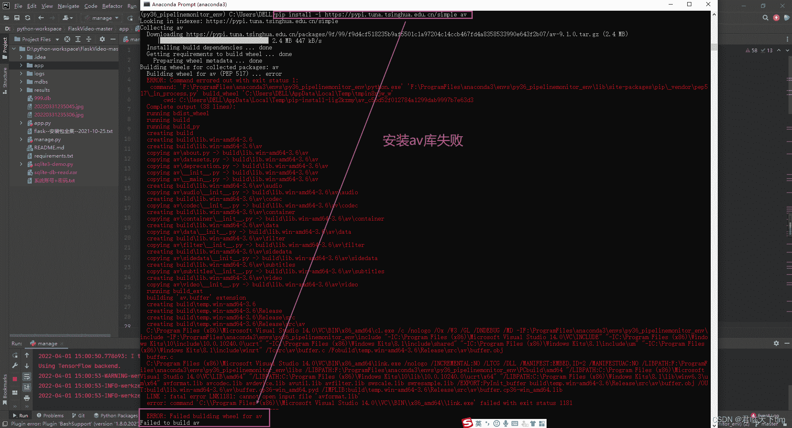
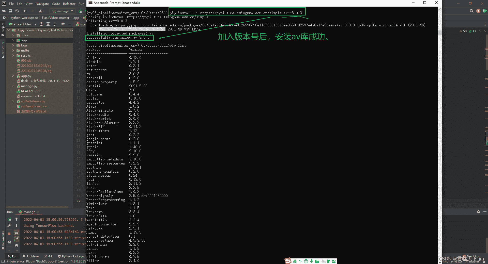
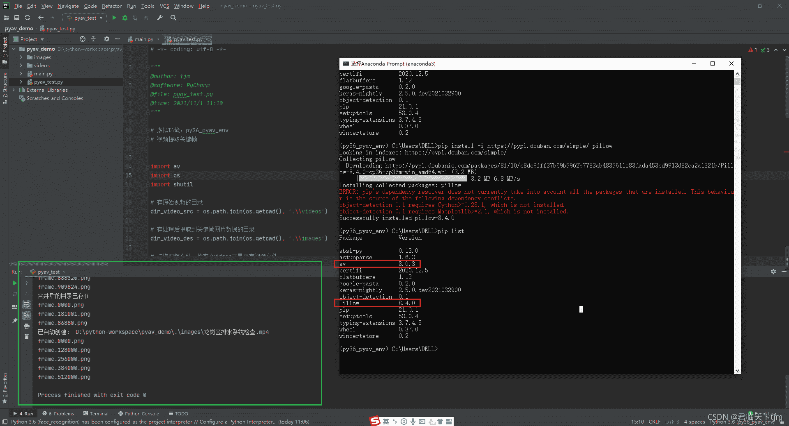
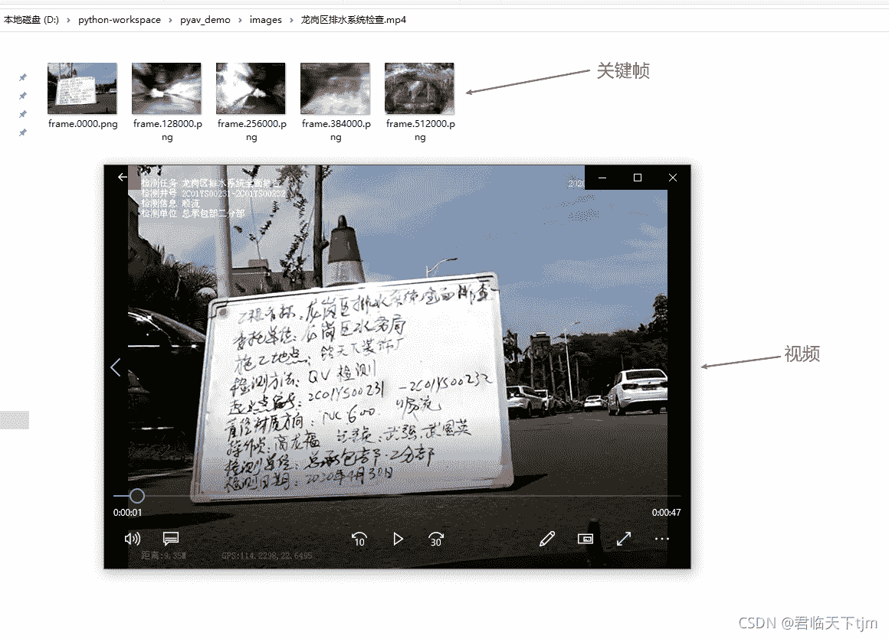
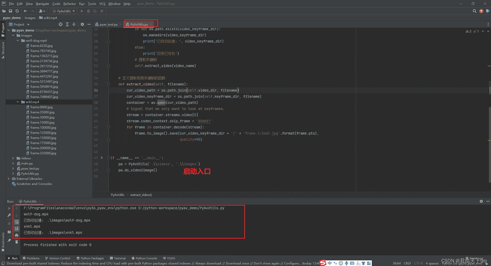

<!--yml
category: 视频
date: 2022-05-04 19:44:34
-->

# 使用python处理视频文件，提取关键帧并保存【已调通】_君临天下tjm的博客-CSDN博客_python提取视频帧并保存

> 来源：[https://blog.csdn.net/shanxiderenheni/article/details/121079396](https://blog.csdn.net/shanxiderenheni/article/details/121079396)

视频文件在进行关键内容提取的时候，人工观看，会比较费时，即使快进播放视频，一小时的视频，也需要十几分钟，或者更长时间；通常情况下，一秒钟的视频包含24帧图像，如果能够把视频中的关键帧“捕获”下来，尤其是在相似镜头拍摄时间比较久的场景，对图片去重，将有助于过滤掉绝大多数的“噪点”帧，最大程度上提取视频的核心内容。

**同步另外三种视频提取关键帧的方法：**

[视频提取关键帧的三种方式【已调通】https://blog.csdn.net/shanxiderenheni/article/details/124499862](https://blog.csdn.net/shanxiderenheni/article/details/124499862 "视频提取关键帧的三种方式【已调通】")

### 1.两个核心库PyAV和Pillow。

pip install -i https://pypi.douban.com/simple/ av

pip install -i https://pypi.douban.com/simple/ pillow



### 2.主要测试代码如下：

```
# -*- coding: utf-8 -*-

"""
@author: tjm
@software: PyCharm
@file: pyav_test.py
@time: 2021/11/1 11:10
"""

# 虚拟环境：py36_pyav_env
# 视频提取关键帧

import av
import os
import shutil

# 存原始视频的目录
dir_video_src = os.path.join(os.getcwd(), '.\\videos')

# 存处理后提取到关键帧图片数据的目录
dir_video_des = os.path.join(os.getcwd(), '.\\images')

# 扫描视频文件，检查/videos下是否有视频文件
print(dir_video_src + '\r\n')

list_video = []
for item_filename in os.listdir(dir_video_src):
    list_video.append(item_filename)
    print(item_filename)
if len(list_video) == 0:
    print(".\\videos\\：视频文件不存在")

# 定义提取视频关键帧的函数
def extract_video(filename):
    container = av.open(filename)
    # Signal that we only want to look at keyframes.
    stream = container.streams.video[0]
    stream.codec_context.skip_frame = 'NONKEY'
    for frame in container.decode(stream):
        frame.to_image().save(
            'frame.{:04d}.png'.format(frame.pts),
            quality=80,
        )

# 提取关键帧并保存
def do_video2image():
    for filename in list_video:
        file_dir_desc = os.path.join(dir_video_des, filename)
        if not os.path.exists(file_dir_desc):
            os.makedirs(file_dir_desc)
            print("已自动创建：", file_dir_desc)
        else:
            print("合并后的目录已存在")
        # 提取关键帧
        extract_video(os.path.join(dir_video_src, filename))
        # 把关键帧图片放到data/processed下
        for filename_png in os.listdir(os.getcwd()):
            if ".png" in filename_png:
                # shutil.move(filename_png, file_dir_desc)
                shutil.copy2(filename_png, file_dir_desc)
                os.remove(filename_png)
                print(filename_png)

if __name__ == '__main__':
    do_video2image()
```

### 3.运行后，效果如下图



 

 案例中一个48秒的视频，最后提取出5张关键帧，极大的提高了视频观看效率，也支持批量视频操作。

请注意：关键帧的数目与视频的拍摄质量和延时有关，如果镜头转移的很慢，拍摄清晰度很高，那么关键帧提取的效果越好。

### 4.代码封装成工具类，可直接传参使用

```
# -*- coding: utf-8 -*-

"""
@author: tjm
@software: PyCharm
@file: PyAvUtils.py
@time: 2022/4/15 14:09
"""

import av
import os
import shutil

# 视频提取关键帧工具类（支持批量视频）
class PyAvUtils:
    def __init__(self, video_dir, keyframe_dir):
        self.video_dir = video_dir
        self.keyframe_dir = keyframe_dir

    # 提取关键帧并保存
    def do_video2image(self):
        for video_name in os.listdir(self.video_dir):
            print(video_name)
            video_keyframe_dir = os.path.join(self.keyframe_dir, video_name)
            if not os.path.exists(video_keyframe_dir):
                os.makedirs(video_keyframe_dir)
                print("已自动创建：", video_keyframe_dir)
            else:
                print("目录已存在")
            # 提取关键帧
            self.extract_video(video_name)

    # 定义提取视频关键帧的函数
    def extract_video(self, filename):
        cur_video_path = os.path.join(self.video_dir, filename)
        cur_video_keyframe_dir = os.path.join(self.keyframe_dir, filename)
        container = av.open(cur_video_path)
        # Signal that we only want to look at keyframes.
        stream = container.streams.video[0]
        stream.codec_context.skip_frame = 'NONKEY'
        for frame in container.decode(stream):
            frame.to_image().save(cur_video_keyframe_dir + '/' + 'frame.{:04d}.jpg'.format(frame.pts),
                                  quality=90)

if __name__ == '__main__':
    pa = PyAvUtils('.\\videos', '.\\images')
    pa.do_video2image() 
```

