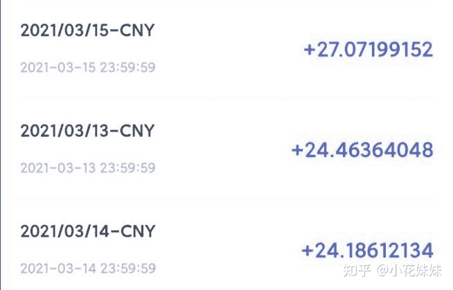

<!--yml
category: 挖矿
date: 2022-06-26 00:00:00
-->

# 做出不能挖矿的显卡难吗？为什么？

> 原文：[https://www.zhihu.com/question/440152355/answer/1793329188](https://www.zhihu.com/question/440152355/answer/1793329188)

 这个问题很简单，不难。

但是因为残值问题，没人会买。

因为没人用，所以没人去做，下面解释原因

我使用的是技嘉2070显卡，目前已经稳定运行了小半年。每个月基本可以多挣一份房租钱。

教程可以参考这里：

如果发生**币价下跌**，不足以满足矿老板欲望的时候，那么硬件的价值就成为了一个问题。

对于玩家而言，专门挖矿的显卡是没有价值的。但是游戏显卡，只要价格合适总会有人入手。

而且目前主要的挖币手段是**以太坊**，降低**核心频率**来运行，不会造成“黄屁股”和显卡损耗的问题，更是掀起了全民挖矿的矿潮。

如果老板选用了专业挖矿的显卡，那么等矿潮过后就是一堆废铁。而游戏显卡还可以走一波某鱼。像3000元首发价的卡，1500元–2000元还是回得来的。

**挖矿专场**丨[锁算力卡挖矿](https://zhuanlan.zhihu.com/p/399409039)丨[未锁卡挖矿教程](https://zhuanlan.zhihu.com/p/355955385)丨[笔记本挖矿](https://zhuanlan.zhihu.com/p/360451565)丨[锁算显卡怎么挑](https://zhuanlan.zhihu.com/p/374342633)丨[挖矿毁显卡吗](https://zhuanlan.zhihu.com/p/358944242)丨

**猴山专场**丨[猴山解密3080TI](https://zhuanlan.zhihu.com/p/379179943)丨[猴山解密3070TI](https://zhuanlan.zhihu.com/p/379428935)丨[买70TI还是80TI](https://zhuanlan.zhihu.com/p/379846007)丨[猴山冲4K](https://zhuanlan.zhihu.com/p/380129626)丨

**笔记本专场**丨[满血版笔记本怎么挑](https://zhuanlan.zhihu.com/p/374748213)丨[买3060还是70本](https://www.zhihu.com/question/447817962/answer/1909204347)丨[3050本评价](https://www.zhihu.com/question/462045112/answer/1913547325)丨[蛟龙7测评](https://zhuanlan.zhihu.com/p/369226521)丨