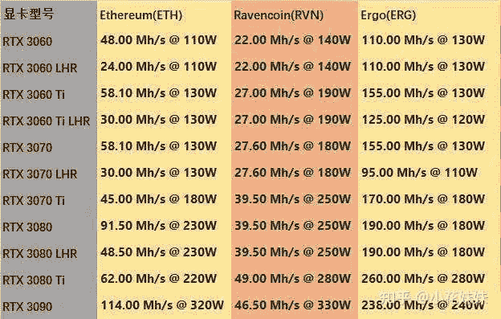
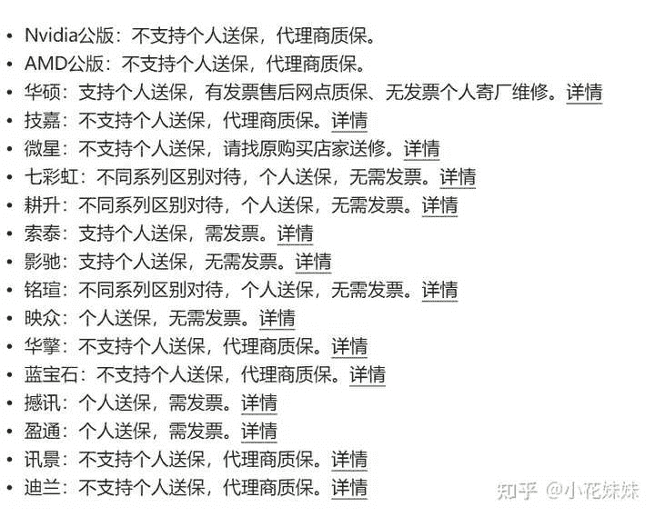
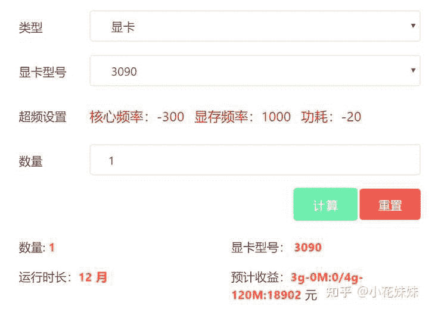

<!--yml
category: 挖矿
date: 2022-06-26 00:00:00
-->

# 刚了解到挖矿，想买几张显卡挖以太坊，目前的情况可以上车吗？

> 原文：[https://www.zhihu.com/question/477099312/answer/2068106606](https://www.zhihu.com/question/477099312/answer/2068106606)

 ### 不讲币价趋势，只讲硬件。行情没人弄的清楚。（挖矿教程点头像）

长文写太多写烦了，只讲精华，你杠你赢。

1、无论是锁算力显卡，还是未锁算力显卡，回本周期都是围绕着250天左右定价的。但是无论是锁算力显卡挖RVN还是未锁算力显卡挖ETH，最具性价比的还是3060TI

2、这250天币价的波动，就是你加卡上车需要承担的风险。

3、全新锁算力显卡价格低于二手为锁算力显卡，就是因为锁算力显卡只破解了70%算力

4、目前有一个RVN可以让锁算力显卡回本周期降低到180天左右（教程文末）

算力如下，收益约1M/元/天

5、想买卡挖ETH还是要未锁算力显卡，目前唯一的渠道就是：黄鱼

一定要购买支持个人送保的品牌，因为**矿卡质保**。

6、电费计算公式，比如一张300W的显卡：0.3*24*0.6=每日电费/元

7、笔记本挖矿温度控制在70以下，台式机温度控制在65以下。或者买一份**家庭不动产保险**往死里超。

8、单卡小白用户用X希宝，多卡大神用矿工（教程文末）

10、显卡温度高解决办法：买散热块或者更换硅脂和导热片，直接上最好的暴力熊。

11、笔记本挖矿看需求，自用玩游戏就上3060满血蛟龙7，纯挖矿就上神州3060

**挖矿专场**丨[挖矿教程](https://zhuanlan.zhihu.com/p/355955385)丨 [笔本挖矿](https://zhuanlan.zhihu.com/p/360451565)丨[挖矿毁显卡吗](https://zhuanlan.zhihu.com/p/358944242)丨[矿卡也质保](https://zhuanlan.zhihu.com/p/386391253)丨

**锁算专场**丨[锁算卡挖矿](https://zhuanlan.zhihu.com/p/398651881)丨[RVN和ERGO教程](https://zhuanlan.zhihu.com/p/402971584)丨[锁算卡挑选](https://zhuanlan.zhihu.com/p/374342633)丨[挖矿知识点合集](https://www.zhihu.com/question/461044682/answer/1994951468)

**笔记本专场**丨[满血版笔记本怎么挑](https://zhuanlan.zhihu.com/p/374748213)丨[买3060还是70本](https://www.zhihu.com/question/447817962/answer/1909204347)丨[蛟龙7测评](https://zhuanlan.zhihu.com/p/369226521)丨