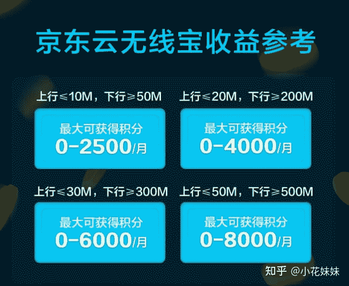

<!--yml
category: 挖矿
date: 2022-06-26 00:00:00
-->

# 创业新思路：京豆也能当矿挖了

> 原文：[https://zhuanlan.zhihu.com/p/360681988](https://zhuanlan.zhihu.com/p/360681988)

618今年大促，最高可抽18618元，先领红包再看文章，稳得一批

京东出了一个最新的**京东云**计划。

其原理就是利用平时富裕的带宽，可以换取京东的积分，并且可以进行1比1的兑换京豆。

而且，用户购买京东云无线宝 64G 加速版产品并激活后。在用户累计 365 天（以无线宝 App 日历展示为准）达到获取积分的基础条件时，京东云无线宝承诺用户累计发放积分等于或超过购买价格，若实际积分收益未达到购买价格，京东云无线宝承诺将在累计达成 365 天后（即无线宝APP日历展示时间进度条达到 100 ％当天），系统以积分形式一次性补足差额， 365 天后每日可继续获得相应积分。

也就是说，路由器在线满365天，可以稳定的白嫖一个路由器。而期间在线的积分，都可以无损兑换京豆。

那么可以兑换多少京豆呢？这里有表格：

基本上，成本可以在一年以后稳定回本。所以我们的利润就是路由器每个月产出的积分。积分换京东E卡然后自己花或者走某鱼。零成本创业新思路。

另外还有一个性能比较高的版本，适合自己家里没有路由器正好缺一个，顺手白嫖的那种。

## 相关阅读

[以太坊，让十年老电脑依旧可以回血教程](https://zhuanlan.zhihu.com/p/355955385)

[你挖或者不挖，都被沦为了“矿卡”](https://zhuanlan.zhihu.com/p/358944242)

[显卡溢价高？笔记本白嫖挖矿](https://zhuanlan.zhihu.com/p/360451565)

[你们有哪些事是买了车以后才知道的？](https://www.zhihu.com/question/31086102/answer/1776117309)